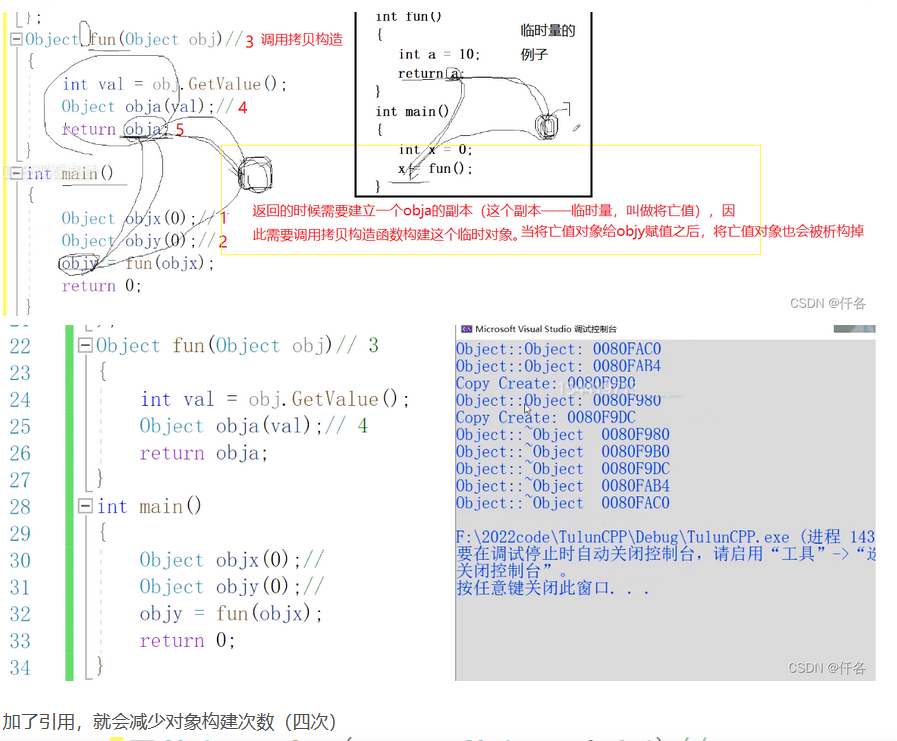

##  构造函数的细节
1：对象以值传递的方式传入函数参数。
这也说明了为什么拷贝构造函数的参数必须是&类型， 不然会陷入无限循环构造。
2：对象以值传递的方式从函数返回(一般会优化为调用移动构造)
unique_ptr<int>ptr = make_unique<int>(); 
3：对象需要通过另外一个对象进行初始化的时候
test A(100); test B(A); 前者是普通构造函数，后者是拷贝构造

~~~c
A a(A(100));//等价于 A a = A(100);  等价于 A a(100);调用普通构造

A b(200);  //等价于 A b(A(200));  等价于A b = A(200)
A c(b);				//调用拷贝构造函数。等价于A c = b, 就像传参那种情况
A* d(new A(300)); // 等价于A* e = new A(400);	
~~~

4： test A(100); test B = A; 这种也是调用拷贝构造函数

RVO原理：在主函数的栈上预留了空间，调用函数的时候把预留地址传入函数的栈中，
在构造对象的时候，将此对象构造在这个主函数的预留空间上， 这里可以延展汇编，通过偏移量的方式寻找这个地址。

~~~
对于这个第四点，拓展一下
A getA() {
	A a;
	return a;
}
如果是 test B = getA() ;
//特别要注意 不是 test B;  B = getA(); 这种是没有RVO优化的

这种写法只发生一次拷贝构造， 并且是在test B = getA()这里， 这是RVO优化的情况，如果不用RVO优化，确实应该是调用两次拷贝构造，vs debug默认是有RVO优化的


比如 
上边的语句就会被优化成下边这样  （结合我分析的RVO原理理解）
void getA(A& _result)
{
     A po;   //调用构造函数构造po
    _result.A(po);   //调用拷贝构造函数构造getA()函数参数
    po.~A();         //析构po
    return;               //没有返回值
} // 这样一来RVO就是把返回值优化了(不要返回值，因为返回值会涉及一次拷贝构造将亡值和一次析构将亡值)，但里面依然有一个临时对象po用作拷贝构造

再次进行优化，比如把上边的
A getA() {
	A a;
	return a;
}
更改为
A getA() {
	return A(); //直接用匿名对象，又会少去临时对象的构造和析构，这种方式就相当于直接给main函数里面的B变量初始化了。
}
~~~




**移动构造和移动赋值**：移动构造函数名(类名 && other)
函数返回对象时，本来会调用拷贝构造函数，但是编译器优化之后就没有调用拷贝构造而是调用的移动构造，如果不自己实现，编译器会默认生成。

~~~c++
#include <iostream>
using namespace std;

class A
{
public:
	A() : ptr(new int(10)) { std::cout << "普通构造" << std::endl; }
	A(A& tt) { this->b = tt.b; std::cout << "拷贝构造" << std::endl; }
	A(A&& cop) : ptr(cop.ptr) { this->b = cop.b;   cop.ptr = nullptr;  std::cout << "移动构造 " << std::endl; }
	A& operator=( A&& tt) noexcept{ std::cout << " 移动赋值" << std::endl; return *this; }
	A& operator=(const A& tt) { std::cout << " 拷贝赋值" << std::endl; return *this; }
	~A() { cout << "析构函数" << endl; }
	int b;
	int* ptr;
};

A getA()
{
	//第一种方式， 使用一个临时对象
	A a;
	a.b = 5;
	return a;
	//return A(); 第二种方式，直接返回。
}

int main()
{
	A a = getA(); //会存在RVO优化
	cout << "b成员: " << a.b << endl;
	cout << "ptr指针成员: " << *a.ptr << endl;
	return 0;
}

//以上代码会调用一次普通构造函数， 一次移动构造函数， 两次析构函数， 足以说明，其实函数内的局部变量a 是被析构了的， 只是没有析构a对象里面的指针域， 移动构造对象直接继承了这份指针域， 由继承着来负责释放这块区域。  如果把移动构造函数注释掉， 那么就会调用拷贝构造函数， 这时候函数内部的对象a析构的时候会把指针域也一起析构掉，继承者再去访问的时候就会出错(但在vs中不会出错， 因为编译器优化了)。


如果把上边main函数中的A a = getA(); 改成A a; a = getA(); 就会涉及到一次移动赋值， 移动赋值和移动拷贝同理， 先采用移动构造的方式继承局部变量a的指针域，  然后局部变量a会调用析构函数，但a的指针域不会释放，此时这个通过移动构造出来的临时对象会采用移动赋值的方式，赋值给main函数中的a变量， 同时这个移动构造出来的临时对象会调用析构函数，但并不会释放它继承过来的指针域，此时这个指针域就交给了main函数中的a变量来负责。

~~~


**注意：**

1.如果我们没有提供移动构造函数，只提供了拷贝构造函数，`std::move()`会失效但是不会发生错误，因为编译器找不到移动构造函数就去寻找拷贝构造函数，这也是拷贝构造函数的参数是`const T&`常量左值引用的原因！

2.c++11中的所有容器都实现了move语义，move只是转移了资源的控制权，本质上是将左值强制转化为右值使用，以用于移动拷贝或赋值，避免对含有资源的对象发生无谓的拷贝。move对于拥有如内存、文件句柄等资源的成员的对象有效，如果是一些基本类型，如int和char[10]数组等，如果使用move，仍会发生拷贝（因为没有对应的移动构造函数），所以说move对含有资源的对象说更有意义

**好处**：若是调用拷贝构造，具体操作是为新对象new一个堆空间，然后马上把原对象(函数里准备返回的那个临时对象)的堆空间delete掉。 若是调用移动构造， 则新对象不new堆空间了，而是直接占用原对象的堆空间， 原对象就不delete了， 把这个堆空间让给新对象。
**采用移动构造就是为了避免拷贝构造对于对象的深拷贝问题**

**左值右值以及完美转发问题。** 

1.左值引用， 使用 T&, 只能绑定左值

2.右值引用， 使用 T&&， 只能绑定右值

3.常量左值， 使用 const T&, 既可以绑定左值又可以绑定右值

4.**已命名的右值引用，编译器会认为是个左值**
举例Printtest(int &&i) {	
		Pt(i);
}	
调用Printtest(6); 尽管传进去的是右值6，但因为有了名字i， 所以对于Pt(i)来说， 编译器会认为i是个左值。  这也就是**不完美转发**。

完美转发：所谓转发，就是通过一个函数将参数继续转交给另一个函数进行处理，原参数可能是右值，可能是左值，并且**保持参数的原有特征**。
**拓展完美转发的应用场景， emplace**

想要实现完美转发需要使用标准库中的forward<int>(i)，把上边的Pt(i)改成Pt(forward<int>(i))即可，但是这种方式只能传右值参数，如果想要既传左值又传右值
可以使用模板＋右值

```cpp
template<typename T>
void perfectForward(T && t) { //既可以传左值， 又可以传右值
    Pt(forward<T> (t));
    //要对Pt重载，传左值、右值类型 各一个
}
```


## emplace 和 insert对比：

调用std::map<TKey, TValue>::insert函数需要传入一个std::pair<TKey,TValue>对象。在实际插入时，这个pair(临时对象)会用于拷贝构造(如果没有移动构造函数，就会调用这个)或移动构造(如果有移动构造，和emplace效率相差无几)来构造map中实际的存储对象(红黑树)，这样会产生一次复制操作(这里指的的拷贝构造或移动构造)。调用std::map<TKey,TValue>::emplace函数时，则会使用传入的参数直接在实际的存储位置原地构造(也就是说的普通构造)一个std::pair<TKey, TValue>，这样通常可以减少一次复制操作(这次复制操作指的就是拷贝构造或者移动构造)

为何emplace可以直接传参，因为用到了c++11的两个特性（可变参列表和完美转发），变参列表可以接受任意参数，完美转发保证你传入的是右值，那么转发出去也是右值

拓展：如果是map类型， 需要一个key，一个value， 那么此时需要借助tuple来实现


## 内存对齐

什么是内存对齐？

为了让内存存取更加高效的一种优化手段。

比如CPU每次获取数据的大小是4个字节， 那么对于int x而言， 如果x的地址是0x00000000 、0x00000004等4的倍数，则是内存对齐。

内存对齐的意义

1：效率原因， 经过内存对齐后，CPU 的内存访问速度大大提升，比如一个数据存储在0x00000003~0x00000007的位置，对于每次只读四个字节的CPU，就需要读两次， 第一次， 0x00000000~0x00000003， 第二次，0x00000004~0x00000007 然后做拼接。 
2：平台原因(移植原因) ：不是所有的硬件平台都能访问任意地址上的任意数据， 某写硬件平台只能在某些地址处取某些特定类型的数据， 否则抛出硬件异常。


#pragma pack(n)  //n为奇数时无效，当为1时，就相当于内存会紧凑在一起，但这样并不一定好，因为取一个元素可能访问多次内存，如果不设置它时，被称为自然对齐，自然对齐的规则就是以类型的整数倍来对齐，比如short就是2， int就是4， double就是8，

~~~c++
struct test{
	char a;
    short b; 
    double c; 
}; //不特殊设置，大小为16， 如果设置n为4，大小为12；如果设置n为1，大小为11
~~~

 当n的数量大于8时(比如)，因为short是2， 16比2大，那么short也按照自然对齐规则， 比如现在最大的字节是double，如果16比8也大，还是按照默认的自然对齐规则，所以当n大于这个类型的大小时，相当于没有用


## 宏定义min 函数 

#define min(a,b)  ((a) < (b) ? (a) : (b))

~~~c
	int a1=3;
    int a2=87;
    int a=min(a1++,a2); 则a1加了两次， 变为5
~~~

如果#define min(a, b)  a < b ? a : b

```c
int sum = 2 + MIN(3, 4);
因为宏函数只是展开。
```

define小细节

~~~c++
do {cout << "test" << endl;}while(0)
    
因为如果有是if语句的时候执行一段语句按道理是不能在最后出现; 的
~~~


## 友元的细节

比如重载<< 或  >> ，必须使用全局重载，而不能是类重载， 但由于重载过程会访问到类的私有成员函数，故使用友元函数重载。

~~~
    ostream & operator<<(ostream &out, complex &A){    out << A.m_real <<" + "<< A.m_imag <<" i ";    return out;}
    
    需要在最前边加上friend
       
~~~

2.模板类的单例模式， 通过父类来构造子类的对象，那么子类必须把父类设置为友元。

## decltype 和 auto

~~~c
auto是在编译器确定的，所以不影响运行时的效率，而decltype是运行时时的

//1.auto 推断必须存在赋值操作,意思也就是必须给a 赋值
auto a = 1;
auto p = new MM("name", 18);
p->print();
auto func = bind(print, placeholders::_3, placeholders::_1, placeholders::_2);

//2.decltype(表达式,或者函数)
decltype(a) c;  //decltype(a) 返回一个int
decltype(p) pp;
decltype(1.0*2) f; // 可以看出来里面其实可以是一个表达式

void hha() {return 1;}
decltype(hha()) a = 1;
cout << a << endl; //1
~~~

### 

## 初始化参数列表问题

如果是const 对象， 两种初始化方式，要么直接赋值，要么必须在初始化参数列表处赋值

如果是一个引用对象，比如 int& a, 必须在初始化参数列表上赋值

**综合以上两个信息，初始化参数列表的方式等效于直接赋值的方式**（比如A aa; 如果这个aa 采用初始化参数列表的方式初始化，那么相当于，直接是 A aa = 传给构造函数的参数， 这种情况就是直接调用拷贝构造函数，而不是普通构造函数。


我发现了一个问题

以下测试打印结果可以说明，初始化顺序是先初始化构造函数里面的参数， 然后初始化成员，最后才初始化构造函数里面定义的操作。

~~~c

class A {
public:
	A() {
		cout << "A的构造函数" << endl;
	}
	A(const A& tt) {
		cout << " A的拷贝构造函数" << endl;
	}
	A& operator=(const A& tt) {
		cout << "A 的拷贝赋值函数" << endl;
		return *this;
	}
};

class B {
public:
	B(A a) {	//这里是一次拷贝构造
		this->aa = a; // 这里是一次拷贝赋值
	}
	
	A aa;
	//A& kk; 必须写成A& kk = aa 或者 使用初始化参数列表的方式。
};
int main() {
	A a;
	B b(a);
	return 0;
}


//以上打印情况为
A的构造函数
A的拷贝构造函数
A的构造函数
A的拷贝赋值函数

如果把上边的
	B(A a) {	//只会有一次构造函数
		this->aa = a; // 这样就会调用两次构造函数
	}
	换成
	B(A a) : aa(a){	//只会有一次构造函数
		//this->aa = a; // 这样就会调用两次构造函数
	}
打印结果就是 
A的构造函数
A的拷贝构造函数
A的拷贝构造函数

结合A aa = a 这种方式是会调用拷贝构造函数的，可以分析出参数列表实质上是相当于直接把值赋予给了aa， 这样就可以理解为什么可以在类中定义A& kk 这样的引用类型了。
~~~

## 迭代器失效

问到vector的时候就可以扯迭代器失效问题，primer上写的**vector不会自动缩容(使用swap交换函数)**，所以删除的时候迭代器也是正常的，不会像插入那种情况(扩容地址发生变化)

迭代器失效分三种情况考虑，也是分三种数据结构考虑，分别为数组型，链表型，树型数据结构。

- **数组型数据结构**：该数据结构的元素是分配在连续的内存中
  比如vector在insert时(比如当前是两个元素，insert时，空间会扩容为4），发生扩容，那么地址可能就改变了(原地址释放掉，分配新的地址)，迭代器并不会跟着改变，所以就会发生迭代器失效，再次访问到原地址自然会报错(gcc 不会， vs会（因为它优化了）)。

  erase删除pos位置元素之后，pos位置之后的元素会往前挪，并不会导致底层空间的改变，理论上不会造成迭代器失效，但是当删除元素之后，当前迭代器就会指向下一个元素的位置，如果刚好删除的是最后一个位置的元素，那么当前位置迭代器就会指向.end()位置，vs会担心你操作空地址，所以不管你是不是删除的最后一个元素，都会报错， 但gcc没有这个优化，只有当你实际操作到空地址时才会报错。所以vs编译器为erase做了优化，删除元素时，就会认为该位置迭代器失效。用老一点版本的编译器(gcc)有可能不会优化，删除操作可能不会造成迭代器失效。 

  理解上边这段文字需要明白, 当iter==.end()时，本不应该进入for循环的，但删除最后一个元素，就会发生这种情况。

解决方法：erase(*iter)的返回值是下一个有效迭代器的值。 iter =cont.erase(iter)

​	所以其实这种解决方式也只是为了通过vs的安全检测，当然也是一种规范的写法，但尽管使用了返回值的方式，如果删除的是最后一个元素，iter返回的位置就是.end()， 如果自己编码时不注意，对iter进行操作(*iter  或者 iter ++) 还是会报错)；


- **链表型数据结构**：对于list型的数据结构，使用了不连续分配的内存，删除运算使指向删除位置的迭代器失效，但是不会失效其他迭代器。解决办法两种，erase(*iter)会返回下一个有效迭代器的值( iter =cont.erase(iter))，或者erase(iter++)
- **树形数据结构**： 使用红黑树来存储数据，插入不会使得任何迭代器失效；删除运算使指向删除位置的迭代器失效，但是不会失效其他迭代器。erase迭代器只是被删元素的迭代器失效，但是返回值为void，所以要采用erase(iter++)的方式删除迭代器。

注意：经过erase(iter)之后的迭代器完全失效，该迭代器iter不能参与任何运算，包括iter++,*iter

以下代码举例

**添加情况**

~~~c++
int main() {	vector<int>tmp = { 3, 1, 2, 5};
	for (auto iter = tmp.begin(); iter != tmp.end(); ) {
		if (*iter == 2) {
			iter = tmp.insert(iter, 33); //执行完后指向33
			iter++; //指向完后指向2
			iter++; //执行完后指向5
		}
		else {
			iter++;
		}
	}
	for (auto v : tmp) {
		cout << v << endl;
	}
	return 0;
}

~~~


**删除情况**

~~~c
#include <iostream>
#include <vector>
using namespace std;
int main() {
	vector<int>tmp = { 3, 1, 2, 5 };
	for (auto iter = tmp.begin(); iter != tmp.end(); ) {
		if (*iter == 1) {
			tmp.erase(iter);
		}
		else {
			cout << *iter << "  ";
			iter++;
			
		}
	}
	return 0;
}
//在vs上则会报错。 因为vs考虑了删除最后一个指针的情况，所以只要删除了，但没有接收返回值，就会报错。
//在gcc上不会报错。
~~~

###  子类指针指向父类

抓住一个核心就是：到底调用哪个函数要根据指针的原型来确定，而不是根据指针实际指向的对象类型确定

父类指针指向子类对象，看的是子类的虚表

子类指针指向父类对象，看的是父类的虚表

子**指**父不安全的原因:  比如子类有一个元素val， 当将这个子类指针去访问这个val就会越界错误，或者为0，因为父类空间并没有这个val元素， 而反过来父转子就不会。

父类指针指向子类对象，然后又把这个父类指针转为子类指针， 那么其实这样操作跟 子类指针 指向 子类对象是一个道理，所对应的函数调用情况也跟子类指针指向子类对象时一样。

~~~c++
#include <iostream>
using namespace std;
class Fa {
public:
    //注意dynamic进行下行必须要求基类有虚函数。
	virtual void hha() {
		cout << "fa_hha" << endl;
	}
	
};

class Son : public Fa {
public:
	void hha () {
		cout << "son_hha" << endl;
	}
	void test() {
		cout << "son_test" << endl;
	}
    int ss = 10; //如果子指父， 那么会出问题，因为父类没有这个对象空间
};
int main() {
//1.子指父
Fa *fa = new Fa();
Son* s = (Son*)fa;	//子转父，必须显式转换，不然报错, 如果上边换成虚继承这里会报错
//Son *s = (Son*)new Fa();
Son* s1 = static_cast<Son*>(fa);
    
//如果Fa中没有虚函数，下边这行会报错，而static_cast不会
//因为dynamic_cast为动态类型检查，需要检查运行时需要的信息(RTTI，运行时类型识别)，而它存在于虚表中
Son* s2 = dynamic_cast<Son*>(fa);
s->hha();	//fa_hha，说明子转父这种情况用的是父类的虚表
s->test();	//son_test
cout << s->ss << endl; // 0  这里可以看出来出问题了，因为父类没有ss空间
cout << s1->ss << endl; //0
cout << (long)s1 << endl; //一个地址
cout << (long)s2 << endl; //0
//cout << s2->ss << endl; //编译不会出错，运行时段错误，因为s2本来就是空指针了

static_cast<Fa*>(s)->hha();//fa_hha
//static_cast<Fa*>(s)->test(); //报错，因为Fa类中没有test

Son* s3 = new Son();
cout << s3->ss << endl; // 10；
    
//2.父指子
Fa* ff = new Son();
static_cast<Son*>(ff)->hha(); //son_hha
static_cast<Son*>(ff)->test();//son_test
Fa* f1 = static_cast<Fa*>((Son*)fa);
Fa* f2 = dynamic_cast<Fa*>((Son*)fa);
return 0;
}
~~~

### 枚举和联合体

枚举 ，有类型检查，而define没有

~~~c++
enum Color//颜色
{
	RED=10,		//注意以逗号分割，默认为0
	GREEN,	
	BLUE
};
int main()
{
	printf("%d",RED);//10
	printf("%d",GREEN);//11
	printf("%d",BLUE);//12
	return 0;
}
~~~

联合体

~~~c++
//联合类型的声明
union Un
{
char c;
int i;
};
//联合变量的定义
union Un un;
//计算连个变量的大小
printf("%d\n", sizeof(un)); //结果为4
~~~

### 智能指针

shared_ptr

~~~c++
shared_ptr 存在循环引用问题
构造对象:
shared_ptr<int>INum(new int(10));
shared_ptr<int>INum2 = make_shared<B>();

比如程序结束后，两个shared_ptr对象发生循环引用，因为shared_ptr是在栈上，会主动释放shared_ptr这个指针变量，那么这个shared_ptr所指向的对象的引用计数就会减一（这里特别注意，shared_ptr的情况下才会有这种减一的说法，如果是int* 指向的对象，你不主动delete，根本不会释放int*指向的内存）， 但因为引用计数还不为0，所以堆上这个被shared_ptr指向的对象不会释放，如果是一个类，意思就是还不会调用析构函数。
~~~

weak_ptr

~~~c++
weak_ptr 是为了解决shared_ptr的循环引用问题而诞生的，
构造对象:weak_ptr<int>INum2(new int(10)); 是错误的
必须通过shared_ptr对象或者weak_ptr对象来构造
比如weak_ptr<int>INum2(INum);
weak_ptr<int>INum3(INum2);

可以使用use_count()获取当前对象的引用计数，reset()释放自己对这个对象的管理

并且weak_ptr 不能使用* 和 -> 访问对象， 但可以使用lock()获得一个shared_ptr对象来管理自己，从而访问对象内容
举例：
shared_ptr<int>pShare(new int(100));
weak_ptr<int>pWeak(pShare);
shared_ptr<int>temp = pWeak.lock();
cout << *temp.get() << endl; //100
~~~

unique_ptr

扯右值，move失效问题

~~~c++
unique_ptr 删除了拷贝构造和拷贝赋值函数
构造对象: unique_ptr<int>INum4(new int(10));
或者 unique_ptr<int>INum5 = make_unique<int>();
make_unique<int>里面用了完美转发，相当于给了一个右值出来，也就是跟下边的move一个效果，其实这里用RVO机制也可以。

只能通过 1.move 2.release + reset 来交换对象的所有权。

~~~
### c++类型转换(涉及了explicit和volatile关键字的使用)
c语言类型转换可视性不好，什么都是直接在变量名前加上（类型），比如float b; int a = (int)b; 再比如 int *a = &x; long c = (long)a; 将指针类型转为long类型的整型。**如果出现因类型转换而导致的错误跟本不好找，而在c++中搜_cast即可大致定位**
并且c语言在转换这一块上有缺陷，因为所有情况的转换方式都一样(也有隐式转换，比如float和int之间)，1.也没有什么动态检查的说法，如果将父类对象转为子类指针是不安全的，2.将常量指针类型转化为非常量指针类型。这两种情况都是我们不希望看到的。

抓住核心就是，c语言的转换语法c++都有，但c++检查严格，有些c语言留下的转换方式c++不认可(比如上边说的const int * 转为 int *)，并且还考虑到一些安全转换的问题，以及可读性的问题， 所以c++自己又制定了几个类型转换来解决一些特定的情况

单参数类的隐式类型转换

~~~c++
如果有2个或者以上参数, explicit就没用了
但也有例外， 比如你的构造函数的其他参数都有默认值，那么explicit还是有用的。

class A {
    public :
    explicit A(int a) : a(a) {}
    explicit A(const char* s) : s(s) {}
    int a;
    const char* s;
};
int main() {
	//如果上边都不加explicit，以下两句都是正确的，就会很奇怪，所以可以给其中一个构造函数加上，避免这种情况
	A a = 1;  //错误，因为有explicit，如果不加上explicit, 这个1会被隐式转换, 即会被解析为， A t(1); 
	A s = "hhha";

    A t(1); //正确, 这是隐式构造，真正的显示构造应该是A t = A(1); 但explicit接受这种构造方式，只是拒绝了隐式转换操作
    
    //这种代码本来可读性也就不好
    A t = 1; 
}
~~~


static_cast:

~~~c++
int a = 10;  void* b = static_cast<void*>(&a); //可行
int a = 10;  float* b = static_cast<float*>(&a); //不可以

使用场景：基本数据类型之间比如float转int，int转char，不支持有类型指针到有类型指针的转换，但有例外，比如有类型指针和void*之间转换，父类指针指向子类对象，子类指针指向父类对象。
int a = 10;
float b = static_cast<float>(a); // 成功，如果把static_cast换成reinterpret_cast就不行。大家各司其职
float *b = static_cast<float*>(&a); // 失败，不支持有类型指针到有类型指针的转换，有继承关系的类(父子类)之间可以用static_cast,  把static_cast换成reinterpret_cast也行。   
cout << b;
~~~


dynamic_cast:

~~~c++
float b = dynamic_cast<float>(a);  //错误的写法，只有static_cast可以

应用场景就是将父类的指针（或引用）转换成子类的指针（或引用），如果采用c语言的方式进行强转或者使用static_cast转换或者reinterpret_cast转换(不会进行运行时检查)是不安全的， 而dynamic_cast会进行运行时检查，这也要求了父类必须有虚函数，因为运行时检查所需的RTTI信息存储在虚函数表中

下行转换有两种情况：
1.如果父类的指针（或引用）指向的是一个父类对象，那么将其转换为子类的指针（或引用）是不安全的，因为转换后可能会访问到子类的资源，而这个资源是父类对象所没有的。(返回空指针)
2.如果父类的指针（或引用）指向的是一个子类对象，那么将其转换为子类的指针（或引用）则是安全的。(返回指针地址)
    
而强转和static_cast以及reinterpret_cast则都会返回转换后的地址，如果是第一种情况去操作了不存在的对象，就是一种不安全的行为。
Fa *fa = new Fa();
Fa *fb = new Son();

Son* s = (Son*)fa;	//子转父，必须显式转换，不然报错, 如果上边换成 虚继承(不是说虚基类) 这里会报错
cout << s->ss << endl; // 0  这里可以看出来出问题了，因为父类没有ss空间

Son* s2 = dynamic_cast<Son*>(fa);//返回的s2是一个空指针，对应的上边说的第二点

Son* s3 = dynamic_cast<Son*>(fb); //这里就是安全的转换，所以会返回实际的地址，对应的是上边说的第一点

如果把上边的操作换成对引用的操作，同样上行转换不会有任何问题，对于下行转换也同样是两种情况，与指针不同的是，如果下行转换失败不会返回空指针，但又没有空引用这个说法，于是会抛出异常，可以通过捕获这个异常进一步处理

我的理解为什么上行转换不要求基类必须有虚函数：1.首先上行转换一定安全。2.编译器得到子类指针后，不管它具体指向的是一个子类对象还是父类对象(但一定是要有继承关系的类，否则不同类型的指针是没法转换的)，只需要判断知道它是我的子类或者跟我是同一类(说明这个子类指针是有一个父类对象初始化的)即可，因为所有子类都包含父类的全部成员。


下行转换必须要求父类有虚函数的原因：假设一个父类被多个子类继承，子类指针指向父类指针，那么这个父类指针所指向的对象是什么类型呢，只有通过虚函数表才能知道，如果是跟当前子类指针类型相同的虚函数表，那么说明是安全的，如果虚表不是同一个则说明大家不是同一个类型，即不安全，返回空指针。

TRRI(Run-Time Type Identification)运行时类型识别
c++通过以下几种方式来支持RTTI
1.typeid 运行时识别出一个对象的类型
2.dynamic_cast 运行时识别出一个父类指针指向的是父类对象还是子类对象
3.decltype 在运行是推演出一个表达式或函数返回值的类型。
~~~


const_cast:

~~~c++
如果是在c语言中可能出现，将一个常量指针(指针可变，值不可以变)转为非const类型的指针，那么就可能出现如下情况，本来不该被改变的，却能够被我们改变，非常的不安全。
而在c++中类型检查非常严格，下边的代码会报错，如果想实现这种效果，必须用const_cast进行转换
const int a = 10;
int *b = (int*)&a;
*b = 111;
printf("%d,%d", a, *b); //111,111


在c++应该这样写。
volatile const int a = 10; //如果不要volatile就会直接从寄存器拿值，因为程序认为a为const类型，值是不会发生改变的，就相当于直接给a的值做了一个缓存，可能放在寄存器中，避免了去内存增加时耗。
int* b = const_cast<int*>(&a);
*b = 11;
cout << *b << a; //加上volatile就是1111,不然就是1110


~~~

reinterpret_cast

指针与能容纳指针的整数类型之间的转换(size_t, long等,int 不行)

允许**所有的指针**之间转换，既不检查指针所指向的内容，也不检查指针类型本身
而对于不同类型的指针之间(static_cast和dynamic_cast都是不支持的，有继承关系的类除外)

不支持例如int与float这样的普通对象的转换

~~~c++
float b = reinterpret_cast<float>(a);  //错误的写法，只有static_cast可以


非指针转指针
int a = 10;
float *b = reinterpret_cast<float*>(&a);
cout << *b;//打印出来是  0xa

指针转非指针
int tmp = 10;
int* a = &tmp;
long b = reinterpret_cast<long>(a); 不能把long换成int，因为int是4字节无法表示完整一个64位的地址，可以用size_t,它其实就是long unsigned int 


不同指针间的转换；
int data = 10;
int *pi = &data;
float *jt = reinterpret_cast<float*>(pi);
cout << *jt;
~~~

总结归纳

~~~c++
static_cast: 
1.能处理普通类型的转换比如float<==>int, 并且只有static_cast可以，其他都不行
2.不能处理不同指针类型之间的转换，有例外如 1.有继承关系的类指针对象的上下行转换，2.void* 与 其他指针类型的转换

dynamic_cast:
1.只能处理有继承关系的类指针对象之间的转换
2.可以通过dynamic_cast的返回值来判断是否是安全的转换，如果是不安全的转换则返回空指针， 也正是这种机制所以我们把dynamic_cast成为一种安全的转换，因为它能检测是否安全
3.能用static_cast尽量用，因为dynamic_cast是动态的有额外消耗。

const_cast: 
1.就是为了去除常属性的存在 ，不能进行其他的转换

reinterpret_cast:
1.支持非指针和指针对象之间的相互转换，但要注意指针转非指针的时候记得用size_t或者long不要用int, 2.支持不同类型的指针对象之间的相互转换，并且也只有它能做到。

~~~

预处理编译汇编链接

~~~
g++ -E test.cpp -o test.i
g++ -S test.i -o test.s
g++ -c test.s -o test.o

以上步骤可直接缩写为
g++ -c test.cpp -o test.o
直接
g++ test.cpp -o test  //test就是可执行文件

先解释这四个过程分别做了什么，
预处理头文件展开，冲突问题
预处理的细节及规范，记得加上括号(比如加法和乘法的冲突情况)，表示一个函数的时候用do{}while(0);拓展inline和预处理的区别，逐步深入到汇编解释函数调用的消耗
链接的时候引出gcc和g++区别
可执行文件分区结构，mmap区延展mmap方式->malloc方式
~~~

头文件重定义

~~~
1.#ifndef
#define
#endif

2.#pragma once 

前者通用性好，后者可能老版本不兼容，但后者更快
头文件重复包含的本质原因就是因为有变量或者对象重复定义了。
~~~

