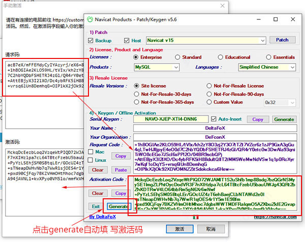

# [Navicat for MySQL 15注册激活](https://www.cnblogs.com/chyf1990/p/12987101.html)

1.下载Navicat for MySQL 15

https://www.navicat.com.cn/download/navicat-for-mysql

2.下载激活工具

https://pan.baidu.com/s/1QxxM72CC51lFuOld_GwQlA 提取码 j649

3.安装Navicat，按步骤安装即可，安装完毕后先不要打开软件，断开网络连接，将激活工具复制到Navicat安装路径下，以管理员身份运行。

在弹出界面选择Navicat 15 Products选择MySQL，Languages选择Simplefied Chinese 点击Patch，如下：

4.打开Navicat，点击注册

5.返回到激活工具界面，点击Generate会自动填写注册码到软件输入框

6.在点击激活按钮，点击手动激活

7.将请求码复制到激活工具的文本框中，点击Generate激活码会自动填写到Navicat激活码文本框中，点击激活即可。

