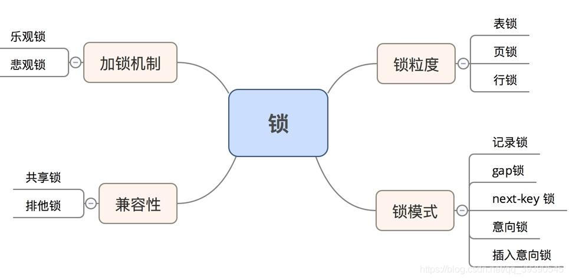

### explain查看执行计划

~~~shell
重要字段
1.type: 性能调优的关键指标,以下为可能出现的值
system: 表只有一行。这是最好的类型。const: 表有一个匹配行，常用于通过主键或唯一索引查找。eq_ref: 通过唯一索引查找。ref: 通过非唯一索引查找。range: 用于范围查找。index: 全索引扫描，但比 ALL 快，因为索引的大小通常小于数据行的大小。
ALL: 全表扫描，最差的情况。
2.key: 实际被使用的索引
3.Extra: 额外信息，比如Using where 表示存储引擎将使用hwere子句来过滤结果集， Using index 表示mysql将使用覆盖索引来检索信息，无需回表， Using filesort 表示包含group by操作并且无法利用索引完成排序，不得不采用相应排序算法(比如文件排序)
了解下的字段
1.key: 实际使用的索引
2.key_len: 使用索引的长度, 比如bigint为8，如果该字段允许为NULL，则需要+1为9
3.ref: 哪些列或常量被用作索引查找的参考
4.rows: 表示扫描的数据行数
~~~

### mysql数据存储量(2000w条数据限制)

~~~shell
查看表大小:SELECT TABLE_SCHEMA, TABLE_NAME, ROUND((DATA_LENGTH + INDEX_LENGTH) / 1024 / 1024, 2) AS 'Size in MB' FROM information_schema.TABLES WHERE TABLE_SCHEMA = 'project328' AND TABLE_NAME = 'user_game_history_record_data';

如果一条记录是1k，那确实是2000多w就已经是三层B+树的高度了， 如果数据再增加，就变成了4层，那么io时间也会变长，328这个项目的users的一条记录是0.5k,一条战绩就是3k

一条记录如果是1k大小，1页为16k，除去页的特殊结构还剩15k，那么一个数据页就可以存储15条数据，其中索引页内容为id(假设bigint类型8byte)和页号(4byte)，那么一个索引页可以存储1280个索引项(15*1024/12), 所以一棵二叉树存储数据公式为: x^(z-1) *y,其中x代表索引项的个数(1280)，z为树高，y为一个数据页存储的数据条数，以树高为3层举例就是Total = （1280 ^2） *15 = 24576000 （约 2.45kw）
~~~

### count(*)不同引擎的区别

实操下来不管count的那列是否值为null都会计算进去

对于MyISAM,它会在磁盘上记录一张表的总行数，所以可以直接获取到总行数，但是如果加上where限定就不是这样了，而对于InoDB它需要将数据一行一行的读，然后进行统计，那么它为什么不想MyISAM那样记录总行数就行呢？因为InoDB中有MVCC机制，不同事务看到的总行数记录是不一样的。

count(字段)会忽略字段值为null的行，对非null行累计， 但这个列名最好是有索引的，否则就会全表扫描速度慢。count(1)和count(*)不会忽略null，会累加每一行

count(`* `)和count(1)区别：不管这里是1，还是2，还是'x', 'y'，得到的结果都是一样的，可以吧count()里面的值理解为一个字段，从而进行累加，意思是累加每一行，不针对某一个字段。 而count(` * `) 会把这个* 翻译成某一个具体的字段， 多了一步操作。

对于COUNT(1)和COUNT(` * `)执行优化器的优化是完全一样的，并没有COUNT(1)会比COUNT(*)快这个说法。

总结：忽略null选择count(字段),反之选择count(1)或者count(` * `)都行

### 红黑树、B树、B+树、hash区别

比如普通搜索树，如果是有序的一串数字(并且插入顺序是有序的)，那么就退化成了链表的形式，后来出现了平衡树，但平衡时调整代价太大，因为平衡要求太高。

为什么数据库存储不用红黑树和数组而用B树，B+树？

~~~shell
数据库索引都在磁盘中，如果数据量过大， **一整个数组或者说一整棵红黑树无法全部放入内存**(如果都无法方进内存那该怎么找呢？)，这时候B树的优势就来了，因为是多路，一次可以放入一个节点进内存(比如B+树的一个节点是16K)，然后一步一步往下找

有同学可能有疑问，B+树可以一次放一个节点到内存去，那红黑树为什么不能每次放一部分数据到内存呢？
且不说红黑树只放一部分数据的编程实现难度，并且根本不知道放哪部分(左或者右)节点到内存去，会有很多无效的内存操作。
最重要的一点就是B树的树高比红黑树低，查找次数少，对磁盘的IO操作少.
b+树还有一个范围查询的优点（因为最下边是一个双向链表链接起来的）
~~~

b+树b树对比

~~~shell
b+树只在叶子节点记录数据，那么就能用非叶子节点记录更多的索引，对于大量数据的情况下，当然是索引信息约充足，就能更快的找到我们需要的数据，但B树也有自己的优点，可能在非叶子节点就拿到需要的数据，所以在数据量不是特别多的时候采用B树可能效果更好，比如etcd中在内存就维护的是B树(key作key，revision作value)而不是B+树(现在已是B+树）。但对于范围查找的情况确实B+树更好，可以避免跨层查找(因为叶子节点都用双向链表连起来了)
~~~

b+数和hash对比

~~~
等值查询hash更快(O(1)的时间复杂度)， 但hash不支持范围查询
~~~

## 锁相关

普通的select语句若不主动加锁，默认是什么锁都没有的

全局锁：FTWRL
表级锁：表锁，元数据锁(MDL), 意向锁(分为意向共享锁和意向独占锁，插入意向锁不是意向锁，是特殊的间隙锁(行级锁))， AUTO-INC锁
行级锁：Record Lock(记录锁)，Gap Lock(间隙锁)，Next-Key Lock(记录锁+间隙锁)

加上全局锁，意味着整个数据库都是只读状态，如果是备份期间(mysqldump)加上全局锁，那么就不能更新数据，这样会造成**业务停滞**

**既然备份数据库是加全局锁会影响业务，那么用什么方式？**
若支持可重复读的隔离级别，有MVCC的支持，备份期间仍然可以更新数据。

**表级锁中的表锁：**

~~~c
//表级别的共享锁，也就是读锁
lock tables t_student read;
//表级别的独占锁，也就是写锁
lock tables t_student write;

//若要释放表锁，使用这条命令，会释放当前会话的所有表锁
unlock tables
~~~

innoDB中避免使用表锁，粒度太大，因为有粒度更小的行级锁

**表级锁中的MDL：**
元数据锁(MDL), 我们不需要显式使用，因为对表操作时会自动加
对一张表执行CRUD时 加的是MDL读锁
对一张表的结构进行修改时加的是MDL写锁
在事务提交时才会释放，事务执行期间一直持有
所以再对表结构进行修改的时候，要注意是否已经对表加上了MDL读锁，因为一旦出现MDL**写锁等待**，会阻塞后续该表的所有CRUD操作

**表锁中的意向锁：**
意向锁是 InnoDB **自动**加的，不需要用户干预，用于维护**表**中加锁信息，意向共享锁和意向独占锁是表级锁，不会和行级的共享锁和独占锁发生冲突，只会和共享**表**锁和独占**表**锁发生冲突，如果没有意向锁，那么加独占表锁时就需要遍历表中的所有记录，看是否存在行级锁，这样的效率会很慢，所以**意向锁的目的是为了快速判断表里是否有数据被加锁**

**表级锁中的AUTO-INC锁:**
它是特殊的表锁机制，不再是一个事务提交后才释放，而是执行完插入语句后就会立即释放，但当插入量比较大的时候，由于加的是表锁，会影响性能，innodb提供了一种轻量级的锁来实现自增，在插入数据的时候，会为被AUTO_INCREMENT修饰的字段加上轻量级锁，然后给该字段赋值一个自增的值，就把这个轻量级锁给释放了，而不需要等到整个插入语句执行完才释放锁。

innoDB提供了innodb_autoinc_lock_mode 系统变量，用它决定用AUTO-INC锁还是轻量级锁，当为0时， 就是 AUTO-INC锁，当为2时就是轻量级锁。
若innodb_autoinc_lock_mode  = 1，普通的insert语句，自增锁在申请后就立马释放；类似insert ... select 这样的批量插入的语句，自增锁还是要等语句结束后才被释放。

若innodb_autoinc_lock_mode  = 2,并且binlog中的格式为STATEMENT可能出现数据不一致现象:

| sessionA                          | sessionB                              |
| --------------------------------- | ------------------------------------- |
| insert into t values(null,1,1);   |                                       |
| insert into t values(null,2,2);   |                                       |
| insert into t values(null,3,3);   |                                       |
| insert into t values(null,4,4);   |                                       |
|                                   | create table t2 like t                |
| insert into t2 values(null, 5, 5) | insert into t2(c,d) select c,d from t |

在从库中两个事务同时开启，可能出现insert into t2 values(null, 5, 5)在insert into t2(c,d) select c,d from t进行到id为2时执行，那么本应该主键id为5的数据申请了自增id3，就变到了主键为3， 本该是主键id 为 3 和 4 的数据推后去申请自增id，就变成了 4， 5，但binlog并不会知道这些，最终如下图

**在主库中：**

| id   | b    | c    |
| ---- | ---- | ---- |
| 1    | 1    | 1    |
| 2    | 2    | 2    |
| 3    | 3    | 3    |
| 4    | 4    | 4    |
| 5    | 5    | 5    |

**在从库中：**

| id   | b    | c    |
| ---- | ---- | ---- |
| 1    | 1    | 1    |
| 2    | 2    | 2    |
| 3    | 5    | 5    |
| 4    | 3    | 3    |
| 5    | 4    | 4    |

所以当innodb_autoinc_lock_mode  = 2 并且 binlog 格式为ROW即能提升并发性，又不会出现数据一致性问题。

**行级锁中的Record Lock(记录锁)：**

有S(共享)锁和X(独占)锁之分的

**行级锁中的Gap Lock(间隙锁)：**

间隙锁之间是兼容的，即两个事务可以同时持有包含共同间隙范围的间隙锁，并不存在互斥关系，因为间隙锁的目的是为了防止插入幻影记录而提出的，加锁者并不会对数据进行读写操作，所以不存在互斥关系。

**行级锁中的Next-Key Lock：**

是以上两种锁的合体，也是有S锁和X锁之分的，虽然间隙锁没有互斥的说法，但记录锁有。

**行级锁中的插入意向锁：**

它虽然带有“意向”二字，但并不是意向锁，是一种特殊的间隙锁，一个事务在插入一条记录的时候，需要判断插入位置是否已被其他事务加了间隙锁(next-key lock也包含间隙锁)，如果是的话，则插入操作就会阻塞，直到间隙锁释放，在此期间会生成一个插入意向锁，然后将锁的状态设置为**等待状态**(mysql加锁是先生成锁结构，然后设置锁的状态，**只有当锁的状态为正常状态时才代表事务成功获取到了锁**)，如果说间隙锁是锁一个区间，那么插入意向锁就是锁住一个点。

**重要区别**：上边说过间隙锁之间是兼容的，尽管插入意向锁也属于间隙锁，但两个事务却不能在同一个时间内，一个拥有间隙锁，一个拥有插入意向锁(上边说的生成意向锁，并设置成等待状态，并没有真正的获取到锁)。

## 日志相关

**对于redolog 和 binlog，设置相应参数实现不同的刷盘效果：**
**redolog:** 
innodb_flush_log_at_trx_commit = 0时，每次事务提交时，还是将redo log留在redo log buffer(和buffer pool 不是一个位置)中，该模式下不会主动触发写磁盘的操作，但是mysql有一个后台进程(注意一下，这个后台线程，只是处理对于redo log的刷盘操作，对于binlog没有谈到它)，每秒会进行一次写磁盘操作。
innodb_flush_log_at_trx_commit = 1时，每次事务提交时，都将redo log  buf里的redo log直接持久化到磁盘
innodb_flush_log_at_trx_commit = 2时，每次事务提交时，将redo log buf里的redo log写到redo log文件(这种说法意思是写到内核中的cache page，并不是真正的刷盘操作)，操作系统来决定何时刷到磁盘中。(为2时比0时安全，因为是写到cache page中，即时mysql崩溃也不会丢失数据，除非操作系统出故障或者断电关机了

数据安全性： 参数1 > 参数2 > 参数0
写入性能“：参数0 > 参数2 >  参数1

**binlog：**
mysql提供了以恶sync_binlog参数来控制binlog刷到磁盘上的频率
sync_binlog = 0时，表示每次提交事务时只是write(即写到内核中的cache page上并不是真正的刷盘)，不fsync(真正的刷盘函数)，后续交由操作系统决定何时将数据持久化到磁盘
sync_binlog = 1时，和redolog的刷盘一样的情况，每次提交事务都会write，然后马上fsync
sync_binlog = N(N > 1)表示每次提交事务都write，当累计了N个事务后才fsync。

MySQL中默认的sync_ binlog = 0

**redolog和binlog比较**

- 使用对象不同，binlog是mysql中的server层次的，所有存储引擎都可以使用，redolog是mysql中的存储引擎层次的。

- 文件格式不同，binlog有三种格式类型，分别是STATEMENT(默认格式)，ROW，MIXED。
  STATEMENT格式：则binlog**可以称为逻辑日志**，但这种格式下可能出现主从复制时的**数据不一致现象**，因为这种模式下只记录了操作的语句，若主库中用到了NOW，uuid等动态函数，当从库中再次执行时得到的结果不一致。

   ROW格式：这种格式记录行数据最终被修改称的样子，这种格式的日志就**不能称为逻辑日志**了，比如执行update语句，更新多少行就会产生多少条记录，这样会使binlog文件过大，**而在STATEMENT格式下只会记录一个update语句而已**，

- MIXED格式：根据不同的情况自动使用以上两种模式的其中一种

- 写入方式不同：binlog是**追加写**，写满一个文件，就创建一个新的文件继续写，不会覆盖以前的日志，  保存的是全量日志。
  redo log是**循环写**，日志空间大小是固定的，全部写满就从头开始，保存未被刷入磁盘的脏页日志(这也就是为什么redo log无法恢复数据,比如执行了drop table操作后，因为它是循环写，保存的不是全量日志)

- 用途不同：redolog用于故障恢复，binlog用于备份恢复(数据恢复)，主从复制。

redolog和undolog的关系：
关于日志的刷盘操作都只讨论关于redolog和binlog的刷盘操作，mysql中有一个叫做buffer pool的地方，用于缓存一些数据提高访问速度，里面包含了一个Undo页，比如需要执行一条update操作， 需要先看看这条数据是否在buffer pool中，如果不在，则从磁盘中读取到buffer pool中，这里注意不是只读取这一条数据，而是包含这条数据的一整页(16k)，在更新之前会生成一条undo log日志记录update之前的值，这条undo log会写入buffer pool中的Undo 页面，在内存修改了该Undo页面的同时需要记录对应的redolog， 这里补充一点，比如一个事务还未提交的过程，出现了崩溃，那么redolog就可以恢复buffer pool中的原有数据(这里特别强调Undo页)，那么就可以根据Undo页对刚才未提交的事务进行回滚，若这个事务提交了后发生了崩溃(但数据并未刷到磁盘)，则根据redo log对记录进行恢复。

**二段式提交：**

为何需要二段式提交？需要持久化到磁盘的有binlog和redolog，其中redolog负责崩溃恢复，而binlog负责数据恢复或者主从复制，如果崩溃的时候二者的数据不一致，那么主库和从库就会出现数据不一致的现象。

二段式提交分为prepare(准备阶段) 和 commit(提交阶段)，prepare阶段主要是刷redolog到磁盘，commit阶段负责把binlog刷到磁盘，成功就返回ok

二段式提交问题：1.锁竞争激烈，如果是多个事务需要保证顺序，所以要加锁，2.磁盘操作过多影响性能，因为prepare和commit刷盘都需要把redolog和binlog对应的参数设置为1(即每次都要刷盘)

## 索引相关

索引结构:记录的是页 (数据页，索引页) 的最小主键 id 和页号

!?](../../pic/image-20240405203740228.png)

**只有三种方式会形成聚簇索引）**
1.主键id， 2.非空的唯一值，3.默认生成一个隐式的自增id
一张表最多只有一个主键索引(聚簇索引)其余所有类型的索引都是二级索引(辅助索引)也叫非聚簇索引.

~~~
按「数据结构」分类：B+tree索引、Hash索引、Full-text索引。
按「物理存储」分类：聚簇索引（主键索引）、二级索引（辅助索引）。
按「字段特性」分类：主键索引、唯一索引、普通索引、前缀索引。
按「字段个数」分类：单列索引、联合索引。
~~~

在《数据库原理》一书中是这么解释聚簇索引和非聚簇索引的区别的：**聚簇索引的叶子节点就是数据节点，而非聚簇索引的叶子节点仍然是索引节点，只不过有指向对应数据块的指针**

介绍聚簇和非聚簇时要分引擎讨论：
对于数据库原理最后一句话“只不过有指向对应数据块的指针”， 这里特指myisam中的非聚簇索引实现，而对于innodb中的非聚簇索引(也就是平时说的二级索引，辅助索引)， 它们的记录中包含了主键key，通过这个key在去聚簇索引中找数据，这个过程被称为回表。
而对于myisam引擎，只有非聚簇索引。它的索引文件和数据文件是单独分开的，table.myd记录数据，table.myi记录索引信息。

**索引区分度**

~~~shell
比如性别区分度很小，不适合建索引或者说不适合排在联合索引列的靠前位置，因为每次查询都会返回一半的结果还不如不要索引，而UUID这类字段就比较适合做索引或排在联合索引列靠前位置
~~~

**索引失效？**
范围查询如%x, 或者 %x%即失效， 若是x%则可以
对索引使用函数如:select * from table where LENGTH(主键id) = 1;
对索引使用运算如:select * from table where (主键id) + 1 = 10；
使用了select * from table where A or B， 若A是索引列，但B不是，则失效
违背最左匹配原则

~~~shell
核心:除了第一个字段，其他的联合索引字段都是局部有序，全局无序的
满足最左匹配的有
where a=1；
where a=1 and b=2 and c=3；# a,b,c都有时可以不按顺序，sql有优化器
where a=1 and b=2；
特殊的是:
where a = 1 and c = val; # 1. 不同版本处理不一样，mysql5.5前边a会走索引，在联合索引找到主键值后直接开始回表 2. mysql5.6之后有一个索引下推的功能，在索引遍历过程中先对索引包含的字段做判断，直接过滤掉不满足条件的记录，再开始回表，相比之前减少了回表次数，这就是索引下推

# 索引下推case:
select * from  `user_shop_item_data` where user_id = 10059 and slot > 3;
其中user_id和slot为联合索引

# 联合索引case:
328中设计user_id, minion_id, season_id用到了联合索引，索引区分度从左到右递减
~~~

**索引优化**

~~~shell
1. 前缀索引优化: 比如有abcd,abdd, 只查询ab%%，那么匹配到相同的前缀即可,但order by无法使用
2. 索引覆盖优化 （比如在非聚簇索引中包含查询字段和主键值，如果要查询的数据就在二者中，就避免了回表, 这就是索引覆盖）
3. 主键索引最好是自增的 （避免页面分割和数据移动，提高输入数据性能，主键字段的长度不要太大，因为二级索引的叶子结点存储的数据就是主键值，主键值越小，二级索引占用空间越小）
4. 防止索引失效
5. 索引最好设置为非NULL， 因为有NULL的存在，会使索引、索引统计和值比较都更复杂，比如索引统计时，count会省略值为NULL的行，并且NULL值是没有意义的还会占用物理空间, 如果表中存在允许为NULL的字段，那么行格式中 至少 会用1字节空间存储NULL值列表
~~~

**需要/不需要索引**
不需要：1.大量重复值(比如性别),2.经常修改的数据，3.表数据很少的时候没必要，4.where，group by， order by里用不到的字段
需要：1.商品编码。2.经常用where查询的字段，3.经常用group by， order by查询的字段)

**联合索引好处**

~~~shell
1. 减少开销，建立联合索引(a,b,c)相当于(a)，(a,b)，(a,b,c)三个索引
2. 覆盖索引，如果select的值都在里面就避免了回表
3. 效率高，索引列多，通过联合索引筛选出的数据越少

4. 拓展:可以减少一次排序, 如下
select * from order where status = 1 order by create_time asc
将status和create_time建立联合索引，那么查出来的status = 1的create_time字段自然是有序的。
~~~

**如何在一页中查找具体数据？如何在B+树中找到一条数据**

以B+树存储，**每个节点为一页**，每页大小为16k，每页都有一个**页目录**，每页中的数据会进行**分组**，每组的数量不会太多，因为每页的数据的索引id都是排好序的，可以使用二分法快速找到大致范围(即找到某一个组)，在这个组里面再进行查找，页目录记录了每一组中的最后一条数据的物理位置，就相当于提供了一种快速查找的方式
以上是在一页中找到某条数据，若是从根结点开始，也是采用二分的方式，获取下一次需要访问的页，直到找到数据所在的页，就变成了如何在一页中查找具体数据

B树对于B+树的优点：
结合应用场景，比如select查询多条语句，对于B树而言，需要跨层查找，而由于B+的数据全部存储在叶子节点上，并且叶子节点以链表的方式连接在一起，如果要查看7和19中间的数据，只需找到7和19就能直接取出中间部分的所有数据。

为何hash速度更快不用hash要用B树？
1：hash只能等值查询，不支持范围查询
2:  对于组合索引，哈希值是用所有组合索引合并算出来的，所以不能根据部分索引健查询
3：哈希不能做排序操作
4：Hash 索引在任何时候都不能避免表扫描，如果有相同哈希值，还是不能直接得到想要的数据，需要表扫描，这个表中存储了键值相同的数据信息
5：大量hash冲突问题，可能造成表浪费，比如数据太多，用多张表报存，不一定第一次就能得到想要的数据，性能可能比B+树还低了

但是 mysql也有用到hash的地方， 比如**自适应hash**，将经常访问到的页通过自适应hash(hash的key设为主键id，val为页地址)进行存储，能够提高快速定位这个页的位置提高效率(但只用于等值查询，不能范围查询)

## binlog redolog undolog关系

这个流程图不准确， 写undo log前会先写redo log

因为最开始 MySQL 里并没有 InnoDB 引擎。MySQL 自带的引擎是 MyISAM，但是 MyISAM 没有 crash-safe(崩溃恢复) 的能力，binlog 日志只能用于归档。
而 InnoDB 是另一个公司以插件形式引入 MySQL 的，只依靠 binlog 是没有 crash-safe 能力的，所以 InnoDB 使用另外一套日志系统—— redo log 来实现 crash-safe 能力。
crash-safe: 保证即使数据库发生异常重启，之前提交的记录都不会丢失

redo log 是 InnoDB 引擎特有的；binlog 是 Server 层实现的，所有引擎都可以使用。
redo log 是**物理日志**，记录的是“在某个数据页上做了什么修改”；binlog 是**逻辑日志**，记录的是这个语句的原始逻辑(前提是statement模式，raw模式则不是)，比如“给 id=2 这一行的 c 字段加 1 ”但是是以二进制的方式保存的。
redo log 是循环写的，空间固定会用完；binlog 是可以追加写。“追加写”是指 binlog 文件写到一定大小后会切换到下一个，并不会覆盖以前的日志。

**binlog作用**：

   	**①**	**主从复制：**1：在主库中开启Binlog功能，这样主库就可以把数据更改记录到binlog，2：从库把主服务器的二进制日志(binlog)复制到自己的中级日志(relay log)中，3：从服务器重做中继日志中的日志，就可以实现数据恢复，从而达到主从数据的一致性。
   	    **②   数据恢复：**通过mysqlbinlog工具来恢复数据。

**redolog作用**：每次进行DML操作(增删改)，并不会直接修改B+树的内容，而是先刷到redolog中，因为这样更快一点，如数据库宕机，可以通过redolog**重写**。
**undolog作用**：里面包含了事物id和回滚指针，每一次新的DML操作都会指向上一次DML操作的数据，通过这种机制来**实现事务回滚**，同时也因为这种机制来**实现了MVCC**(多版本并发控制)

**补充问，事务未提交时，redolog会不会刷到磁盘？**
**答案：有可能。**

先说一点前情知识：

我们在事务进行中时，会有一个redologbuffer， 会记录我们事务执行过程中的操作，如果commit提交，就会调用write写，这里的写不是真正的刷到磁盘上，而是刷到redolog文件在内核缓冲区保留的缓存(也就是cache page 页缓存上)，再在合适的时机刷到磁盘上。

对于binlog也是一样的有binlog的缓存(每个线程对应一个binlog cache,作用跟redolog一样，但redologbuf只有一个)，当事务提交后(commit)，调用write写，这里的写不是真正的刷到磁盘上，同样是刷到binlog文件在内核缓冲区保留的缓存，合适的时机刷到磁盘上。

这里需要注意，为什么每次write是写到redolog或binlog在内核缓冲区的缓存上， 因为如果直接与磁盘上的redolog和binlog操作开销太大，并且事务不一定会提交。他们两个都是在事务提交的时候才调用write。

这里提出mysql中与redolog和binlog相关的my.ini配置

sync_binlog=1		//对应binlog
innodb_flush_log_at_trx_commit  = 1	//对应redolog
设置了1表示每commit一次就立马刷到磁盘中，对于sync_binlog如果设置成2，若数据库宕机，则有可能丢失一次数据。
业务开发的时候尽量减少磁盘io操作(磁盘io操作一次的时间大约是内存操作的10万倍时间)，所以并发量比较大的时候可以适当增加binlog的值，但同时就面临安全的风险，需要自己权衡。

**回到我们最初的问题，**
尽管redolog未提交，也会在以下两种情况刷到磁盘
1：后台线程，mysql有后台线程会每隔 1 秒轮询一次，将redologbuffer内容刷到redolog文件在内核缓冲区保留的缓存，再刷到磁盘中。
2：如果设置了上边说到的innodb_flush_log_at_trx_commit  = 1，如果有别的并发事务提交，会顺带把这次为提交的事务的内容一并刷到redolog。
3：同时需要注意一点，当rodologbuffer写到一半的量时，会刷到redolog文件在内核缓冲区保留的缓存。

**MVCC相关：**

InnoDB的MVCC,是通过在**每行记录**后面保存**隐藏的列**来实现的,这几个列，分别保存了这个行的创建时间（也就是这次进行DML操作的事务ID），删除时间，隐式主键(如果你没有设置主键，那么聚集索引B+树就会根据这个隐式主键来建立)和回滚指针。这里存储的并不是实际的时间值,而是系统版本号(可以理解为事务的ID)，每开始一个新的事务，系统版本号就会自动递增，事务开始时刻的系统版本号会作为事务的ID(就是下边提到的的trx_id)

| id   | name | ROW_ID(隐式主键) | 创建时间(trx_id事务ID) | ROLL_PTR(回滚指针) | 删除时间（事务ID） |
| :--- | ---- | :--------------: | :--------------------: | ------------------ | ------------------ |
| 可见 | 可见 |       隐藏       |          隐藏          | 隐藏               | 隐藏               |

undolog多版本链+ReadView机制实现mvcc多版本并发控制

原文链接：https://blog.csdn.net/LT11hka/article/details/122260034

ReadView是什么？

简单来讲，ReadView就是执行一个事务时，会生成一个ReadView，这里面会有比较关键的4个字段：
1.m_ids：记录有哪些事务在mysql里还没有提交。
2.min_trx_id：m_ids里的最小值。
3.max_trx_id：下一个mysql要生成的事务id。
4.creator_trx_id：就是你这个事务本身的事务id。

重点来了，**只有READ COMMITED(简称RC) 和 REPEATE RAED(简称RR) 这两种隔离级别才使用了MVCC机制**，虽然RC能通过MVCC解决脏读但并不能避免不可重复读问题，而RR却能避免。
实现这种差异的关键在于
对于RC,在事务进行过程中，每次涉及到select语句，他都会更新ReadView中的m_ids, 通过判断该事务id是否在m_ids中，如果在，则不读取它的值，因为这说明这个事务还未提交，如果不在，说明已经提交了，则可以读到它的值。
对于RR， 只在事务的第一个 SELECT生成一个ReadView，m_ids一开始是多少，以后就一直都不会变了，所以即使有新事务B提交了，也不会影响m_ids包含的值(即不会读到B事务提交后的值），但RR需要注意一点，若一个事务id(比如事务C的id)不在m_ids中，也需要与max_trx_id对比，如果C事务id比max_trx_id大, 说明该事务是当前事务开始产生ReadView快照之后产生的事务，并不包含在当前事务的m_idx（）同时我们已经知道，对于RR，ReadView只会产生一次，永远不会知道后边并发的事务情况，所以如果C事务id比max_trx_id大，同样不会采纳该行数据。
**小总结** ：当判断该行数据的事务ID不满足要求的时候，就通过该行数据的回滚指针去undolog里面往回遍历，直到找到满足条件的那一条打印出来即可。相信大家也明白了undolog是怎么存储的了，**每行数据都有属于自己的一个回滚链条**。**这也就是实现MVCC的真谛**。

RC、RR 两种隔离级别的事务在执行普通的读操作时，通过访问版本链的方法，使得事务间的读写操作得以并发执行，从而提升系统性能。RC、RR 这两个隔离级别的一个很大不同就是生成 ReadView 的时间点不同，RC 在每一次 SELECT 语句前都会生成一个新的 ReadView，事务期间会更新，因此在其他事务提交前后所得到的 m_ids 列表以及max_trx_id可能发生变化，使得先前不可见的版本后续又突然可见了。而 RR 只在事务的第一个 SELECT 语句时生成一个 ReadView，事务操作期间不更新。

**为何读取快照数据(ReadView)的时候不需要上锁?**
答：因为没有事务会对历史数据(存放在undolog中的)进行**修改**，只需要通过判断**这些历史数据**的事务ID就可以知道了。简单的说就是：**只需要读，不涉及写**

**当前读，快照读和MVCC的关系**

当前读
像 select lock in share mode (共享锁s), select for update; update; insert; delete (排他锁x)这些操作都是一种当前读，为什么叫当前读？就是它读取的是**记录的最新**版本，读取时还要保证其他并发事务不能修改当前记录，会对读取的记录进行加锁

快照读
像不加锁的 select 操作就是快照读，即不加锁的非阻塞读；快照读的前提是隔离级别不是串行级别，串行级别下的快照读会退化成当前读；之所以出现快照读的情况，是基于提高并发性能的考虑，快照读的实现是基于多版本并发控制，即 MVCC ,可以认为 MVCC 是行锁的一个变种，但它在很多情况下，避免了加锁操作，降低了开销；既然是基于多版本，即快照读可能读到的并不一定是数据的最新版本，而有可能是之前的历史版本
 **MVCC 就是为了实现读-写冲突不加锁，而这个读指的就是快照读, 而非当前读，当前读实际上是一种加锁的操作，是悲观锁的实现**

## 聚集索引和辅助索引

也被叫做聚簇索引和非聚簇索引

聚集索引B+树涉及到的数据不直接刷到B+树中，而是先刷到**redolog或者binlog**，对于辅助索引B+树也是不直接插入，而是先刷到**chang buffer**(一般的DML操作， 包含insert buffer(增)，delete buffer(删)，purge buffer(改) )中，再在合适时机刷入磁盘。

**如果redolog写过程失败怎么解决的？**
通过doublewrite，写之前复制一份，如果失败了重写

**锁机制**

由于每种隔离级别的写(增删改)操作都加上X锁， 所以不管是哪种隔离级别都能避免脏写问题

在查询语句后加上LOCK IN SHARE MODE	//意为加写锁

在查询语句后加上FOR UPDATE					//意味加读锁

**间隙锁介绍：**
间隙锁分为两种，一种是不包含记录间隙锁(GAP)，一种是包含记录间隙锁（Next-Key Lock: Gap Lock+Record Lock），比如对于默认隔离级别的innoDB下, 比如表A 上的id字段有索引, 并且id有 3,8,12,20这几个值,那么该索引可能被上的包含记录间隙锁区间为:(负无穷,3)、[3,8)、[8,12)、[12,20)、[20,正无穷)  ，**间隙锁只支持REPEAT READ 及更高的隔离级别** (即不支持RC和RU)

对于REPEAT READ 隔离级别，本身是不能解决幻读问题的，但可以通过给读操作加锁(在查询语句后加上LOCK IN SHARE MODE    ，next-key锁)， next-key锁 = gap锁(间隙锁) + Record Lock(记录锁)。
对于READ COMMITED ，想着也给它加锁不就能解决幻读问题了吗，但实际不是这样的，READ COMMITED **只能加行锁(record)**， 而上边的REPEAT READ 加的是next-key锁(范围锁 + 记录锁)。**这里如果是想在RC利用gap锁解决不可重复读是可行的，但是区别在于会阻塞其他事务对记录的修改，而RR是不会阻塞其他事务提交的**

举例说明为何无法避免幻读：
如果执行下列语句:
 select * from A where id>16 for update.
 REPEAT READ 会对(16,正无穷) 加锁
 但READ COMMITED采用的是行级锁，只会锁住20这个值
此时若另一个事务插入了22这个值，READ COMMITED就可能幻读

**不可重复读针对的是某条数据的概念， 而幻读是对于数据条数变化的概念。**
**读+写发生的幻读：第一次读明明不存在，接着第二次写操作(对刚才不存在的键值进行插入操作)却发生错误；**
**读+读发生的幻读：如第一次读只有一条数据，再次读出现了五条数据。这种读 + 读 也属于幻读。**

**读 + 读的不可重复读，不可重复读也只有读 + 读了，第一次读是这条数据，第二次读数据内容变了(同一条数据但内容出现了变化)。**

锁并不是事务一开始就加，而是执行到对应的语句(DML)才加相应的锁， 当事务执行commit或rollback才释放锁(**AUTO-INC有点特殊**)

 **意向共享锁，意向排他锁**

意向锁属于表级锁，其设计目的主要是为了在一个事务中揭示下一行将要被请求锁的类型。InnoDB 中的两个表锁：

    意向共享锁（IS）：表示事务准备给数据行加入共享锁，也就是说一个数据行加共享锁前必须先取得该表的IS锁；
    
    意向排他锁（IX）：类似上面，表示事务准备给数据行加入排他锁，说明事务在一个数据行加排他锁前必须先取得该表的IX锁。

  意向锁是 InnoDB 自动加的，不需要用户干预，用于维护**表**中加锁信息，意向共享锁和意向独占锁是表级锁，不会和行级的共享锁和独占锁发生冲突，只会和共享**表**锁和独占**表**锁发生冲突，如果没有意向锁，那么加独占表锁时就需要遍历表中的所有记录，看是否存在表级锁，这样的效率会很慢，所以**意向锁的目的是为了快速判断表里是否有数据被加锁**

**乐观锁和悲观锁**

其实悲观锁和乐观锁，也并不是 MySQL 或者数据库中独有的概念，而是并发编程的基本概念。主要区别在于，操作共享数据时，“悲观锁”即认为数据出现冲突的可能性更大，而“乐观锁”则是认为大部分情况不会出现冲突，进而决定是否采取排他性措施。

MySQL的多版本并发控制 （MVCC），其本质就可以看作是种乐观锁机制，cas无锁队列的机制也是乐观锁，Git，SVN，这些版本控制也是乐观锁。而排他性的读写锁、行锁表锁等则是悲观锁的实现。

mysql 存储过程 不具备事务性，除非显式调用begin commit， 但存储过程中的每一条语句前后是存在事务性的，和在外边的语句一样，每执行一条语句就会自动commit

mysql中的一致性包括
1.符合数据库对数据的完整约束
2.**逻辑上**的一致性(比如不应该看到中间状态，比如事务间)

数据库经常通过破坏**逻辑上**的一致性来达到更高的并发性能。