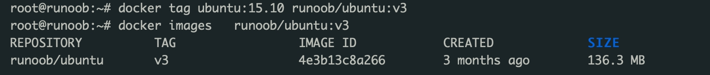

docker教程： https://pengfeixc.com/tutorial/docker/docker-guide
		https://docker.easydoc.net/doc/81170005/cCewZWoN/AWOEX9XM

docker官网镜像：https://hub.docker.com/

下载好docker后去设置中配置引擎加上一行
 "registry-mirrors":["https://mirror.ccs.tencentyun.com"],

docker pull mongo //拉取mongo的最新版本

docker run -p 27017:27017 --name mongodb -d mongo    //启动容器， 第一个端口号是host的，第二个是container中的

docker run -d --name=mysql-server -p 3306:3306 -v mysql-data:/var/lib/mysql -e MYSQL_ROOT_PASSWORD=your_password mysql  //运行mysql

docker exec -it mymysql mysql  -u root -p  //连接mysql

docker exec -it mongodb	mongosh  admin   //mongodb是容器名，mongosh是sh， admin是用户表(不加也可以)，默认还有config和local

docker exec mongodb bash  	//表示执行一次mongodb容器中的bash命令， 加上 -it 表示绑定， 相当于就能进入mongodb容器的bash终端

docker start mongodb	启动mongo容器

持久化数据
docker run -it -v mongo_volume:/data/db/mongo -p 27017:27017 --name mongodb -d mongo   mongo_volume是挂载在本机的位置， /data/db/mongo是容器内部存储信息的位置。

查看日志

docker logs 容器名

docker tag : 标记本地镜像，将其归入某一仓库。
举例：将镜像ubuntu:15.10标记为 runoob/ubuntu:v3 镜像。

docker上的容器如果不指定网络，默认和本机上一个网络中。如果给docker容器指定了network，那么本地就跟docker容器不在同一个网段内了，docker和本机就不能进行通讯了，但是docker中放到同一个network的容器可以相互通信。