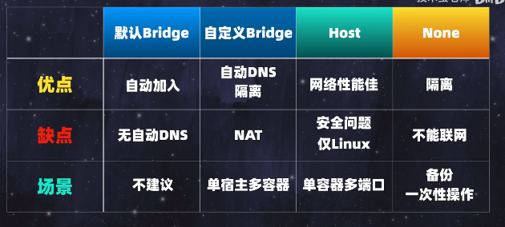

镜像tag相同推送

~~~shell
docker build --no-cache -t 8.130.49.219:5000/conn_image:latest . # 关键是build的时候加上 --no-cache 则能覆盖上一次的latest镜像。（使用docker push 8.130.49.219:5000/conn_image:latest推送）
~~~

docker run时进入终端

~~~shell
docker run --name 容器名 -it 镜像名 /bin/bash 
# 核心是-it 和 /bin/bash ，有些可能不支持bash就用sh
~~~

网络相关(bridge, host, none)

- 默认bridge网络docker0

~~~shell
下载好docker之后默认会创建一个docker0的网络接口(通过docker network ls可以看到名为bridge的那个就是这个docker0)，之后创建的所有容器(不单独指定网络的情况下)都是通过docker0作为桥与宿主机进行通信再进一步与外网通信，容器信息到达宿主机的过程涉及到NAT转换，默认的docker0网络有个缺点是在docker0网络下的所有容器间不能通过名字进行通信，只能用对方ip，使用ping命令可以测试，而自定义的bridge类型网关则可以直接用容器名字通信。
# 测试命令 docker run -d --name test --hostname test praqma/network-multitool
~~~


- 自定义bridge类型的docker网络

~~~shell
docker network create jt -d bridge # -d表示驱动类型， 创建好之后使用ip address可以看到多了一个网口，网口的名字和使用docker network ls是有一部分相同的，
~~~

- 使用docker网络，分析ip address命令下的主要信息

~~~shell
# 举例：创建docker网络，并且在该网络下创建两个容器，在宿主机中使用ip address查看网卡信息
8: br-0d9ad017cc2c: <BROADCAST,MULTICAST,UP,LOWER_UP> mtu 
10: vethe9c443c@if9: <BROADCAST,MULTICAST,UP,LOWER_UP> mtu 
12: veth4cb8861@if11: <BROADCAST,MULTICAST,UP,LOWER_UP> mtu 

# 序号8这里代表新创建的bridge类型的docker网络, 可以使用docker network ls看到名为0d9ad017cc2c的网络。10和12这里的veth是虚拟以太网的缩写，它们后边分别写着@if9和@if11表示它们与创建的两个容器网卡的关联，可以分别进入容器使用ip address看到两个容器分别对应的序号是9和11
~~~

- bridge网络类型特点

~~~shell
可直接通信情况: 容器<-->容器、 容器<-->宿主、 容器-->互联网、 互联网到容器的话需要配合暴露端口。 # 特别注意，使用ip的情况下是没问题的，但默认的bridge(docker0网络)是不支持直接用容器名的，自定义的bridge含有自动DNS解析功能，所以可以直接用容器名，宿主到容器的时候也不能用容器名，需要用容器的ip。

# 不同bridge网络中的容器是不互通的，用ip也不行, 可以理解为不同的两个局域网，不互通是很正常的，比如学校和家里都能访问百度，但学校的局域网不能直接ping家里的局域网。
~~~

- host网络类型特点(目前只有linux下是这样，mac和windows有区别)

~~~shell
# 已验证，MAC不支持这种，容器中的eth0的ip和外边的不一样
# 创建容器并指定host网络，docker自动生成了一个名叫host的host类型网络，并且不允许用户创建第二个host类型的网络，创建容器命令如下
docker run -d --name egg5 --hostname egg5 --network host praqma/network-multitool 
这个容器自带nginx服务， 直接在宿主机上使用命令curl localhost就可以访问到容器内的nginx服务了，不再需要端口暴露，在bridge模式下创建的容器如果外网需要访问容器则需要端口暴露，可以通过修改容器中的/usr/share/nginx/html/index.html文件进行验证。
# 在容器中使用ip address和在宿主机上使用ip address内容是一样的，host网络下创建的容器不会生成多余的网口。
~~~

- none网络类型

~~~
使用ip address查看，除了有本地回环地址其他都没有，是一个隔离的环境，不与任何容器进行通讯。
~~~



挂载目录

~~~shell
# 两种方式都能持久化
1.宿主机目录挂载(Bind Mounts)
提供了更高的灵活性和直观性，但可能需要注意数据同步和安全性问题。
2.Docker挂载卷(Volumes)
容器间共享的场景。它提供了更好的安全性、易用性和管理性，是Docker推荐的数据存储方式。
# 以下说明挂载卷(第二种)数据的备份和迁移
1. docker run -p 27017:27017 --name mongo -v mongo-data:/data -d mongo:4.4 # 运行起来后使用mongo造点数据
2. docker run --rm --volumes-from mongo -v d:/backup:/backup ubuntu tar cvf /backup/backup.tar /data/ # --rm表示如果存在相同容器则先删除， --volumes-from 表示挂载mongo容器的所有volume，现在可以拿这个backup.tar文件去其他地方导入了
3. 删除mongo容器，删除名为mongo-data的挂载卷(前两步表示数据的备份，这一步表示失去这个容器的数据，后两步表示利用备份数据进行恢复)
4. 重新跑一个mongo容器，执行第一步的命令(这次没有任何数据)
5. docker run --rm --volumes-from mongo -v d:/backup:/backup ubuntu bash -c "cd /data/ && tar xvf /backup/backup.tar --strip 1" # volumes-from指定的是容器名字, strip 1表示解压时去掉前面1层目录，因为压缩时包含了绝对路径

case（Nginx需要依赖nginx.conf）：
如果挂载本地，但本地不存在配置文件，可以先搞个临时的copy过来
# 先保证本地目录存在并且有足够权限
mkdir -p /etc/nginx
mkdir -p /var/log/nginx
chmod 777 /etc/nginx
chmod 777 /var/log/nginx
docker run --name temp-container praqma/network-multitool
docker cp temp-container:/etc/nginx /path/to/local/nginx
docker rm temp-container
 docker run -d --name egg7 --hostname egg7 -p 80:80 -v /etc/nginx:/etc/nginx -v /var/log/nginx/:/var/log/nginx/ praqma/network-multitool (linux下不需要端口映射用host模式，但mac只能这样)
~~~

用docker运行一个go程序

~~~shell
# sh脚本内容如下
#!/bin/bash

set -xe

cd "$(dirname "$(readlink -f "$0")")" || exit 1

docker run -d --restart always --name aliyun-security-group-server -p 59999:3000 -w /app -v "$(pwd)":/app -v "$(readlink -f ~/go)":/go -e 'GOPROXY=https://goproxy.cn,direct' golang:1.21 go run .
# 把需要运行的go代码和脚本放在同一目录下，运行脚本即可。
~~~


清理docker空间

~~~
docker system prune
~~~

Docker build常用参数

~~~
-t: 指定构建镜像的名称和标签
-f: 指定要使用的Dockerfile的文件名或路径
--network: 设置构建时的网络
--build-arg: 传递构建时的参数, 
~~~

查看docker镜像

~~~
docker image ls
~~~

上传docker镜像

~~~
Docker镜像标签包含两部分：镜像名称和标签。常见的标签格式为repository:tag。在repository部分，您可以包含镜像仓库的地址。如果没有显式指定地址，Docker将会默认将镜像推送到Docker Hub。
可以对镜像进行标记：docker tag image_name docker.hoxigames.com/image_name:tag。然后使用docker push docker.hoxigames.com/image_name:tag来将镜像上传到私有仓库
~~~

安装私有docker镜像仓库

~~~shell
# 安装Docker Registry
docker run -d -p 5000:5000 --restart=always --name registry registry:2 # 因为本地5000端口冲突了才用的5001

# case: 把uds的镜像上传到这个私有镜像仓库
# 1. 先改下镜像的名字
docker tag docker.hoxigames.com/project328/user-data-service-image:c3bae30086f9-84eb3eab16ea  localhost:5001/image_name:tag
# 2. 上传镜像到私有仓库 localhost:5001
docker push localhost:5001/image_name:tag
~~~

查看某容器是否在运行中

~~~shell
docker ps -q -af name=mysql-remote
# 参数解释
-a：显示所有容器，包括运行中和停止的
-q：仅返回容器的ID
-f name=mysql-remote：过滤条件，只返回容器名称包含mysql-remote的容器的信息
~~~

动态看容器内存变化

~~~
docker stats 容器id
~~~

常用参数

~~~
-e:环境变量
-d:后台运行
-v:挂载
-p:端口映射
-it: i表示交互式，t表示terminal终端
--detach: 后台运行
/bin/bash 表示直接进入容器中(前提是要有-it)
~~~

如果因为修改容器内配置导致容器无法启动

~~~
1.修改前先备份, 
docker cp <容器ID>:/fluentd/etc/fluent.conf .
2.把备份的再导回去
docker cp fluent.conf <容器ID>:/fluentd/etc/fluent.conf
~~~

构建镜像，并且配合一些脚本(fluentd举例)

Dockerfile

~~~~
FROM fluent/fluentd:v1.14.2-debian-1.0
USER root
RUN gem install fluent-plugin-<your-plugin-name>:<version> --no-document
USER fluent
~~~~

~~~
1.构建镜像
docker build -t my-fluentd .
2.运行镜像
docker run -d --name my-fluentd-container my-fluentd
~~~

进入容器

~~~shell
# root 身份进入
docker exec -it -u root 7c498fa1dab8 sh (sh或者/bin/bash情况不同用的不一样)
~~~

**查看容器详情**

~~~shell
docker inspect fluentd 查看某个容器的详情(比如想看文件挂载相关就搜mounts)
~~~

查看所有容器(包括异常停止的 ()

~~~shell
docker container ls -a | grep dev2

docker ps -a 也能看到停止的
~~~

### zookeeper

~~~shell
docker run -d --name zookeeper -p 2181:2181 -t docker.hoxigames.com/zookeeper:1.0
~~~

### kafka

~~~shell
# 先跑起来zookeeper
set kafkaIp 192.168.0.104
docker run -d --name kafka -p 9092:9092 -e KAFKA_BROKER_ID=0 -e KAFKA_ZOOKEEPER_CONNECT=$kafkaIp:2181 -e KAFKA_ADVERTISED_LISTENERS=PLAINTEXT://$kafkaIp:9092 -e KAFKA_LISTENERS=PLAINTEXT://0.0.0.0:9092 -t docker.hoxigames.com/kafka:1.0
~~~

### mongo

~~~shell
docker run -p 27017:27017 --name mongodb -d mongo    //启动容器， 第一个端口号是host的，第二个是container中的
~~~

**进入mongo容器方式**

~~~shell
docker exec -it mongodb	mongosh  admin   //mongodb是容器名，mongosh是sh， admin是用户表(不加也可以)，默认还有config和local

docker exec mongodb bash  	//表示执行一次mongodb容器中的bash命令， 加上 -it 表示绑定， 相当于就能进入mongodb容器的bash终端
有时候可能没有bash，就使用sh

#启动mongo容器
docker start mongodb	
~~~

### mysql

~~~shell
328项目:
docker run --name mysql -v /Users/a123/.deploy-tool/dev/mysql:/var/lib/mysql -p 3306:3306  -e MYSQL_ROOT_PASSWORD=123456     -e MYSQL_DATABASE=project328   -d docker.hoxigames.com/mysql:8.0 --default-authentication-plugin=mysql_native_password


# 自测, 这里的mysql-data可以在docker界面的侧边栏看到volumes选项
docker run --name=mysql-server -p 3306:3306 -v mysql-data:/var/lib/mysql -e MYSQL_ROOT_PASSWORD=123456 -d mysql  //运行mysql,  最后这个mysql表示镜像名(比如hoxi的时候是docker.hoxigames.com/mysql:5.7)

docker exec -it mymysql mysql  -u root -p  //连接mysql
~~~

### redis

~~~shell
#-d表示后台运行
docker run --name conn-redis -v ~/.deploy-tool/dev/conn-redis:/data -p 6381:6379 -d docker.hoxigames.com/redis:6.2.4-alpine3.13

docker run  --name data-redis -v ~/.deploy-tool/dev/data-redis:/data -p 6380:6379 -d  docker.hoxigames.com/redis:6.2.4-alpine3.13
~~~

**持久化数据**

~~~shell
docker run -it -v mongo_volume:/data/db/mongo -p 27017:27017 --name mongodb -d mongo   mongo_volume是挂载在本机的位置， /data/db/mongo是容器内部存储信息的位置。
~~~

**查看日志**

~~~shell
docker logs 容器名
持续看
docker logs 8fd5abf06c6d --tail 10 -f
docker logs xxxx --timestamps > a.log // 加上时间戳
~~~

**docker tag** 

~~~
执行了
1.docker tag  docker.hoxigames.com/project328/user-data-service-image:test docker.hoxigames.com/project328/user-data-service-image:26dbf1561434-dcfe52aa20dd
2.docker tag  docker.hoxigames.com/project328/user-data-service-image:test jt:v1

结果:
docker images
REPOSITORY                                                              TAG                         IMAGE ID       CREATED         SIZE
docker.hoxigames.com/project328/user-data-service-image                 26dbf1561434-dcfe52aa20dd   77fd8871a9af   5 hours ago     163MB
docker.hoxigames.com/project328/user-data-service-image                 test                        77fd8871a9af   5 hours ago     163MB
jt

注意点：
1.执行docker build的时候如果镜像名字不带tag，那默认是latest，问题就是每一次docker build都会覆盖上一次(因为都是latest)
2.他们的imageID是一样的，但他们是独立的，删除其中一个不会影响别的， 如果想要不同的imageID那就得使用docker build 镜像名:tag
~~~


**docker网络相关**

~~~
docker上的容器如果不指定网络，默认和本机上一个网络中。如果给docker容器指定了network，那么本地就跟docker容器不在同一个网段内了，docker和本机就不能进行通讯了，但是docker中放到同一个network的容器可以相互通信。
~~~

**拷贝docker里面的文件到本地**

~~~
docker cp <容器名称或ID>:<容器内文件路径> <本地目标路径>
然后配合scp搞到本地, 

scp deploy@47.95.6.108:~/divideLevel.json .
或者上传服务器
scp divideLevel.json  deploy@47.95.6.108:~/
~~~

**停掉所有9005开头的docker容器**

~~~
containers=$(docker ps -aq --filter "name=^/9005")
docker stop $containers
~~~

**docker基础学习**

~~~
docker教程： https://pengfeixc.com/tutorial/docker/docker-guide
		https://docker.easydoc.net/doc/81170005/cCewZWoN/AWOEX9XM

docker官网镜像：https://hub.docker.com/

下载好docker后去设置中配置引擎加上一行
 "registry-mirrors":["https://mirror.ccs.tencentyun.com"],
~~~

无法拉镜像，镜像源

~~~shell
1.sudo vi /etc/docker/daemon.json

{
  "registry-mirrors":
   [
     "https://docker.mirrors.sjtug.sjtu.edu.cn",
      "https://docker.m.daocloud.io",
      "https://docker.itelyou.cf",
      "https://noohub.ru",
      "https://docker.fxxk.dedyn.io",
      "https://huecker.io",
      "https://dockerhub.timeweb.cloud",  
      "https://registry.cn-hangzhou.aliyuncs.com"
   ]
}

2.sudo systemctl daemon-reload
3.sudo systemctl restart docker
~~~

#### **打包程序运行所需的所有动态库**

```shell
# 需要两个参数，第一个是可执行文件，第二个是提取出来的库放到的位置
deps=$(ldd $1 | awk 'BEGIN{ORS=" "}$1\
~/^\//{print $1}$3~/^\//{print $3}'\
 | sed 's/,$/\n/')
for dep in $deps
do
    echo "Copying $dep to $2"
    cp "$dep" "$2"
done
echo "Done!"
```

### 用docker起一个go的服务

~~~shell
docker run -d --restart always --name aliyun-security-group-server -p 59999:3000 -w /app -v "$(pwd)":/app -v "$(readlink -f ~/go)":/go -e 'GOPROXY=https://goproxy.cn,direct' golang:1.21 go run .
~~~

#### **服务容器化**

```dockerfile
# 前提：在/home/Connserver中放入所有./wzqconn依赖的库文件
FROM centos:8 
RUN mkdir -p /home/ConnServer
COPY ./ConnServer /home/ConnServer
RUN echo "/home/ConnServer" >> /etc/ld.so.conf && ldconfig
WORKDIR /home/ConnServer
RUN chmod +x wzqconn
CMD ["./wzqconn"]
# RUN echo "/home/ConnServer" >> /etc/ld.so.conf && ldconfig这个比较重要，目的是让运行./wzqconn的时候在/home/ConnServer目录找库文件，export LD_LIBRARY_PATH=/home/ConnServer:$LD_LIBRARY_PATH会遇到别的问题。
```
