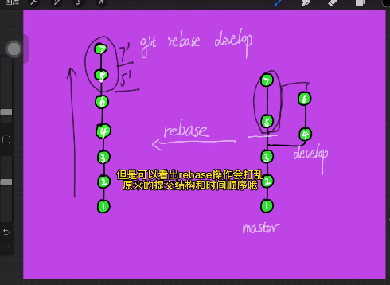
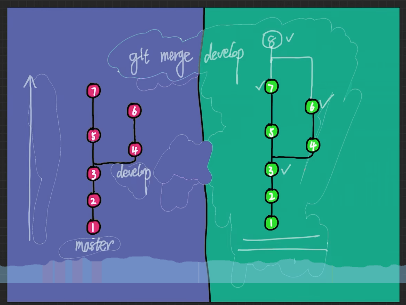
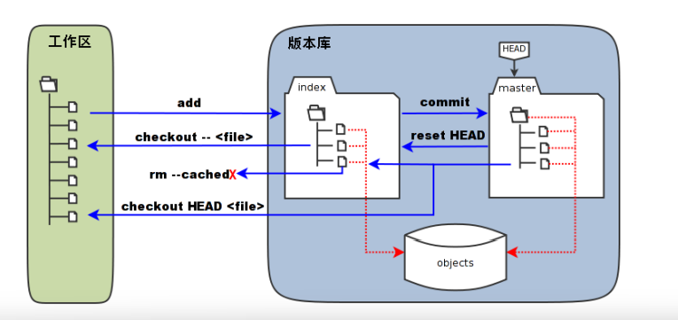

小知识点

~~~shell
8.git的头像是跟着邮箱走的，fork的头像就用github的邮箱，尽管是公司邮箱也可以在github注册一下；或者在https://gravatar.com/配置一个头像，这样登录很多网站(如github)都会用这个头像
7.git reset具体文件虽然不会造成文件的修改，但把该文件reset到某个节点后，此时暂存区的内容就是该节点commit后的文件状态，删除工作区就达到reset目的了，但这种操作有点多余，如果只是想某个文件回到特定节点的状态，直接git checkout b0b2462 hha.txt就行
6.当修改都在工作区时，git checkout .其实等价于删除工作区的所有修改(新增文件除外)
5.有时候文件名前边会看到--，其实只是为了区分命令和文件，--后表明一定是文件路径，比如有些文件名为-file.txt，这个-会被错误解析为命令。
3.观察某个分支的修改，切到master再merge到master，然后reset到远端的master
2.git rev-parse HEAD #获取最新节点的commit值
1.ssh拉下来的仓库，git操作走ssh，https拉下来的仓库，git操作走https, git remote -v 查看克隆仓库方式，可以通过git remote set-url更新仓库地址
~~~

### 遇到的问题

``` shell
1. 有个test1分支有两个功能，但只需要上线其中一个功能，merge到test2(dev衍生的)时发生冲突删除了其中不上的功能，再把test2合并到dev，后来想把test1的另一个功能合并到dev发现无法检测到test1在merge到test2过程删掉的功能了。
解决方案：1.dev强制reset到错误的merge之前，2.dev变基到错误的merge之前。
说明：尝试过revert把test2合并到dev的操作回滚，然后重新test1，其实是不行的，revert相当于逆操作，之前的merge记录还是会存在。
```

20.git stash操作

``` shell
1. 存储
git stash
2. 获取列表
git lish
3. 应用
git stash apply 
4. 应用并且删除
git stash pop
5. 指定应用(其他同理，不指定就是最新)
git stash apply stash@{0}
6. 删除某个
git stash drop 
7. 删除所有
git stash clear
8. 查看详情
git stash show -p stash@{n}
```


19.git restore

~~~shell
之前是用git checkout来恢复文件的，但git checkout还能切分支，职责不明确所有有了git restore，但有些功能用restore无法实现，比如git checkout b0b2462 hha.txt恢复某个文件到指定节点的状态，git restore主要是在暂存区和工作区间操作。 
# 移除某个未暂存的文件(比如a.txt在上一层，则得用 ../a.txt)
git restore a.txt  
# 移除所有未暂存的文件（这个.在哪层就能递归这层中的所有文件。
git restore .
# 移除暂存的文件(会放回到工作区中)
git restore --staged . 
~~~

18.git reset操作

~~~shell
# 应用场景一般是git add 或 git commit 或 git push后想回退操作
2.比如执行了git add . 可以用git reset来取消追踪，如果已经执行了git commit，使用git reset --soft HEAD~1，如果已经git push了，还是一样的命令，只是提交时需要强推一下。
1.--hard、--soft、--mixed是针对整个节点操作时的参数，对指定文件操作时是无效语法。

# 1.对指定文件操作(没有任何实质性影响，只是暂存区中该文件状态会变成该commit节点（默认HEAD，HEAD就是最新提交节点）提交时的状态，但工作区+暂存区最终等于reset操作前的内容，即没变)
格式: git reset 节点(默认HEAD) -- 文件 # -- 可不要，节点后带^表示commit前状态
git reset  a.txt # 重置a.txt的暂存区状态和HEAD一样(即从暂存区移除)
git reset . # 重置当前目录下所有文件的暂存区状态和HEAD一样，跟git reset 功能上等价，但表达的意思不一样，后者是对整个节点的操作，--hard等参数是有意义的
# 2.对整个节点(默认是--mixed)
git reset 等价于 git reset --mixed HEAD  # 默认是HEAD，表现上把所有git add到暂存区的内容全部放回工作区。
git reset --mixed fd4259a # fd4259a节点之后的所有提交内容会放到工作区，reset之前的修改内容不管是否在暂存区，会全部一起混合到工作区。
git reset --soft fd4259a # fd4259a节点之后的所有提交内容会放到暂存区(reset之前暂存区就有内容则会混在一起)，工作区新修改的内容保持在工作区不动。
git reset --hard fd4259a # fd4259a节点之后的所有提交以及当前的工作区/暂存区内容全部被删掉，如果还没有push上去，这个操作就要谨慎点
~~~

17.git checkout

~~~shell
git checkout 后可以接1.节点/分支，2.文件名，既可作为切换又可回退文件，职责不明确，所以后来出现了git restore 和 git switch
前者：表达的是切换分支/节点，所以当前有修改未stash或commit时无法切换，当只有增删时也不能放到暂存区，必须在工作区并且要切换过去的节点没有新增的文件才能切换，比如删除了某个文件，但目标节点有这个文件，则这个删除记录会丢失，所以一般操作会stash或先commit
后者：是对指定文件的修改操作，不在乎你当前是否有文件修改，跟前者不是一个概念。

# 对指定文件操作
2.git checkout HEAD 和 git checkout HEAD .
前者表示去HEAD所在的分支，而后者会用HEAD节点的文件状态覆盖工作区和暂存区，表现是删除所有暂存区和工作区内容
1.git checkout a.txt和git checkout HEAD a.txt 
是否加HEAD(或其他commit节点)是有区别的，不加就是暂存区状态覆盖工作区，加了就是指定节点覆盖暂存区和工作区(如果是HEAD可以理解为删除该文件在暂存区和工作区的修改)。

# 对整个节点操作
1.git checkout commit节点，如果有新文件，但这个commit节点没有，不会删除这个新文件，如果删除了一个文件，并且这个commit节点有，则会恢复，但不能有增删外的修改文件，否则会提示先stash或commit
~~~

16.把代码放到远端仓库中

~~~shell
git init
git remote add origin git@github.com:jtqnbz666/328.git
#接着就是正常git操作
~~~

15.大文件上传(LFS:Large File Storage)

~~~shell
sudo apt install git-lfs # linux上
git lfs install
git lfs track "*.tar.gz" # 表示所有.tar.gz文件都会用大文件上传方式
git add test.tar.gz
git commit -m "add large file"
git push

# 拉取时加上lfs
git lfs pull
~~~

14.添加.gitignore文件

~~~shell
方式1:
# 两种情况
1.远端还没有该文件，直接将该文件添加到.gitignore中
2.远端有该文件，先添加.DS_Store到.gitignore中，执行git rm --cached .DS_Store (表示从暂存区删掉，不影响工作区) ，再 git commit即可生效，但之后远端就不会再有这个文件了。

方式2:在fork中对着文件点击右键可以ignore，相当于方式1的快捷方式

文件内容
.DS_Store
*.plist  

# 查看是否在追踪某文件
git ls-files | grep example.txt
# 如果要把已经ignore的文件放出来，直接在.gitignore删除掉就行
~~~

13.添加远程仓库到本地仓库

~~~shell
git remote add origin <远程git仓库地址>
# 注意: 没有git信息之前就需要执行这个指定远程仓库，git信息可以在.git/config中看到
~~~

12.git pull

~~~shell
git pull = git fetch + git merge.   # 默认
git pull -rebase = git fetch + git rebase

首先基于本地的FETCH_HEAD记录，对比本地的FETCH_HEAD记录与远程仓库的版本号，然后git fetch 获得当前指向的远程分支的后续版本的数据，
然后再利用git merge将其与本地的当前分支合并
git pull 后不加参数的时候，和git push一样， 默认就是git pull origin 当前分支名， 如果远程仓库没有跟本地当前分支名一样的分支就肯定会报错。
比如再本地master分支执行git pull 的时候， 其实就是执行git pull origin master
~~~

11.git fetch

~~~
这将更新git remote中所有远程仓库所包含分支的最新commit -id,将其记录到.git/FETCH_HEAD文件中
~~~

10.如果仓库含有子模块，需要把子模块一起拉下来的话

~~~
git clone --recurse-submodules
git pull --recurse-submodules //把子模块一起拉下来

如果子模块中有改动，拉的时候失败了，先去子模块git stash 再 git stash drop 再重新拉
~~~

9.在服务器上创建一个git仓库

~~~
mkdir github.git
cd github.git
git init --bare  创建一个裸仓库，不加bare 就是非裸
~~~

8.强推强拉、删除文件

~~~shell
2.有时候发现git reset --hard 无法删除本地工作区新增的文件， 两种方法，采用git clean --df 或者 先git add . 添加到暂存区，再 git reset --hard 一次，因为git reset 删除的是已跟踪的文件，将已commit的回退。 git clean 删除的是未跟踪的文件
1.强推(git push origin develop --force)和强拉(git reset --hard origin/develop)
~~~

7.rebase和merge遇到冲突时的乱码理解 (以A，B分支，将B分支内容合并到A上为例)

~~~
merge: git checkout A, git merge B, 如遇冲突，HEAD表示A分支的内容，====下边表示B的内容

rebase: git checkoutA, git rebase B, 如遇冲突，HEAD表示B分支的内容
~~~

6.常用配置

~~~shell
# 设置git pull的模式
git config pull.rebase false  // 这是默认的，也就是merge方式
git config pull.rebase true  //这表明当前使用rebase方式

# 设置提交用户信息
git config --global user.name "jiangtao"
git config --global user.email "454193896@qq.com"
使用 git confil -l 查看是否设置成功

# 清除信息user.email 和 user.name
git config --global --unset user.email
git config --global --unset user.name
~~~

5.rebase技巧

~~~shell
# 进入一个交互界面
git rebase -i 分支名 
# 伪变基，目的是整理单个分支，合并提交
git rebase -i HEAD~6 # 6表示最近6个提交
~~~

4.更改用户名/邮箱地址

```sh
git config --global user.name "Your Name"
git config --global user.email "your_email@example.com"
```

3.修改文件名大小写问题

```shell
git mv --force filename FileName
```

2.切分支流程(从某个节点创建新分支)

~~~shell
1.git branch hotfix/20240103
2.git checkout hotfix/20240103  # 可以加-b参数省去上一步
3.git push origin hotfix/20240103
~~~

1. merge和rebase学习

   rebase和merge的区别是前者会先隐藏当前分支公共节点之后的commit内容，暂时只能看到对方最新的commit内容，然后去解决冲突，逐渐就能看到当前分支公共节点之后的commit内容，然后git add . 再 git rebase --continue(可以用git rebase --skip跳过冲突的解决)， 而merge是将对方最新push的commit内容和自己本地的最新commit内容合并在一起， 解决完冲突后先执行git add . 再 git merge --continue，其实我感觉merge更好用，因为rebase用时候需要解决多个阶段有点复杂。 它们都可以用git xx --abort中断。



rebase操作: 找到公共节点3，然后把5,7嫁接到4,6后边， 但这样之后5',7'虽然内容和之前一样，但是commit号会是一个新的

~~~shell
比如B要合并到A上: git checkout A --> git rebase B --> 处理冲突 --> 直接强推 如果公司不支持强推，1.那就得git pull 再处理下B分支有而A分支没有的conmmit内容，2.采用下方拓展方法


# 拓展
配合merge实现rebase的效果
比如将B合并到A上, git checkout B --> git rebase A --> 处理冲突 --> git checkout A --> git merge B
~~~



merge操作:找到公共节点3,然后配合两个分支的最新一次提交节点(一共三个节点)组成一次新的提交8， 这样的好处是能保留原有的commit号以及提交顺序，问题就是会显得提交 结构复杂。


**merge案例分析**

1.两个分支A和B， 如果现在A和B都有一个1.txt 和 2.txt文件，此时在A上增加3.txt，修改1.txt， 而在B上删除2.txt，修改1.txt， 此时在A分支执行git merge B 就会出现A上的3.txt不变，2.txt会被删除，1.txt出现冲突需要解决。（如果A上的2.txt发生改变，合并B过来的时候A就不会删除，而需要手动去处理冲突）


分四个区， 工作区， 暂存区， 本地仓库， 远程仓库

**常用命令**：

~~~
git add , git commit -m "test" , git push

git status 看到文件状态

git branch 查看当前分支，git branch -a 查看所有分支， git branch test 创建一个test分支， git branch -d test 删除test分支

比如现在我们git branch test

需要git checkout test   表示切换到test分支

但由于现在远程仓库还没有test分支，所以需要把这个test分支同步到远程上

git push original test 即可在远程建立test分支
~~~


**实用命令：**



//以下内容是以这幅图进行介绍的， 如果把下边的 "文件" 换成 "." 则表示所有文件

git checkout 文件， 会用暂存区的文件来替换工作区的这个文件的内容，比如工作区这个文件的内容是6666， 而暂存区是666，则会将工作区内容更改为666

git checkout HEAD 文件名， 会用本地仓库的这个文件来替换**工作区和暂存区**的这个文件的内容， 把文件名换为 点 表示所有文件。

有时候上边两部执行了也没有用， 无法切换分支，那么执行一下git fetch即可

git reset HEAD 文件， 表示把本地仓库的文件同步到暂存区，但**不影响工作区内容**，默认HEAD可以省去，如果用HEAD相当于把自己git add .放到暂存区的文件给取消了并且不影响工作区。
**不存在 git reset --hard HEAD 文件** ，这种方式是错误的。--hard、--soft和--mixed都是针对整个提交的而不是单个文件

git log  查看提交情况(-n 可以指定看几个）， 使用 git reset --hard " hash值" 去到某一个提交的地方，这个命令可以去到以前，也可以回到未来，只需要记住具体哪次提交的hash值。 也可以通过**git reset --hard HEAD^1** , 这个1表示往前回退一个版本， 表示把本地仓库中的那个提交情况同步到**暂存器以及工作区**

当遇到同时提交冲突时，使用git pull 拉取冲突情况，这时候需要重新git add -> git commit -m " " - > git push 重新提交

**情景分析：**

~~~
1.当前文件内容为666  -> git add .  -> 修改文件内容为6666 -> git commit -m "test" -> git push     那么提交到远端的内容是666 而不是 6666
可以看出git commit只是将缓冲区里已经add的部分同步到本地仓库中去，不包括工作区里
存放的内容


2.当前文件内容为666 -> git add. -> git commit -m "test" -> 修改文件内容为"6666" -> git add . -> git push   那么提交到远端的内容是666, 而不是6666
可以看出git push只是将本地版本库里已经commit的部分同步到服务器上去，不包括暂存区里
存放的内容

~~~


### 有时候出现bug，git pull

~~~
显示最新，却不是最新， 比如你打开typora，然后git pull， 关闭typora的时候一定要点不保存，不然出bug， 这时候
git reset --hard HEAD^ 
再git pull
~~~

