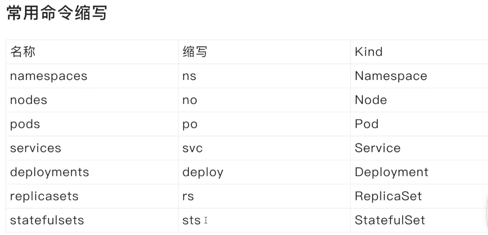

通用技巧

~~~shell
5.集群中可以通过svc暴露的地址访问服务， 如果是在pod中，可以直接用svc的名字
nginx的例子:
集群中: curl 10.106.82.96:8080 (集群中所有主机都可以用这个clusterIP访问)
pod中: curl nginx-service:8080 (用一次性pod验证，集群中所有pod都可以访问)
4.pod理解为一个虚拟机，也就是说一个pod中的两个容器不可能是同一个端口
3.-A获取所有命名空间的资源
2.--watch 动态看资源的变化
1.进入pod比如exec -it 后边必须接上--，比如 kubectl exec -it mytest -- mysql -u root -p
~~~

删除操作

~~~shell
1.把副本集删了不会影响deploy, 但把deploy删了，pod也会被删
2.删除命名空间会把该命名空间下的所有内容都删了，如果遇到错误，需要先删除错误状态的对象
3.删除具有相同标签的所有pod（配置了deploy会自动恢复，不过不是之前那个pod了）
kubectl delete pods -l app=staging-user-data-service -n staging
~~~

拷贝pod的文件到本地

~~~SHELL
 kubectl cp staging-ai-mirror-server-66d8b4f5c4-spfmv:/root/divideLevel.json ./divideLevel.json -n staging
~~~

查看pod的内存使用情况

~~~shell
# 比如有多个pod，不知道哪个pod正在执行大量任务的时候就可以用来定位
kubectl top pods -n official
~~~

查看某个pod挂之前的日志

~~~shell
kubectl logs --tail 100 --previous official-battle-royale-server-1710641478399624860-59848466l7c7v -n official
~~~

选择器

~~~yaml
标签选择器可以识别一组对象，标签不支持唯一性
标签选择器最常见的用法是为service选择一组pod作为后端
# my-service.yaml
apiVersion: v1
kind: Service
metadata:
  name: my-service
spec:
  selector:
    app.kubernetes.io/name: MyApp
  ports:
    - protocol: TCP
      port: 80
      targetPort: 9376
~~~

标签相关

~~~shell
# 标签使用户能够以松散耦合的方式将他们自己的组织结构映射到系统对象，而无需客户端存储这些映射。
# label-demo.yaml内容
apiVersion: v1
kind: Pod
metadata:
  name: label-demo
  labels:
    environment: production
    app: nginx
spec:
  containers:
  - name: nginx
    image: nginx:1.14.2
    ports:
    - containerPort: 80
#

~~~

查看pod的标签

~~~shell
kubectl get pod --show-labels
~~~

获取具有某标签的pod

~~~shell
kubectl get pod -l "app=nginx"
# 如果是多个标签，用逗号分隔
kubectl get pod -l "app=nginx,environment=production"
~~~

使用yaml文件创建和删除

~~~yaml
# nginx.yaml内容
apiVersion: v1
kind: Pod
metadata:
  name: nginx
spec:
  containers:
  - name: nginx
    image: nginx:1.22
    ports:
    - containerPort: 80

# 上边是内容， 下边是执行命令
# 创建
kubectl apply -f nginx.yaml 
# 删除 （不是根据名字，而是根据yaml文件
kubectl delete -f nginx.yaml
~~~

设置默认命名空间

~~~shell
# 如果不设置，默认查询/创建对象用的都是default命名空间
kubectl config set-context $(kubectl config current-context) --namespace=develop
~~~

创建指定命名空间pod

~~~shell
kubectl run nginx --image=nginx:1.22 -n=develop# -n=develop等效-n develop
~~~

创建命名空间

~~~shell
kubectl create namespace(可缩写为ns) develop
~~~

查看命名空间

~~~shell
kubectl get namespace 
~~~

k8s中参数用 -- 和 - 的区别

~~~
"-"作为前缀这种方式通常用于简短的、容易记忆的参数。
"--"作为前缀，通常用于更详细、更复杂的参数，需要明确指定参数的名称以及对应的值。
~~~

NodePort类型（集群外主机访问访问集群的服务

~~~shell
kubectl expose deploy/nginx-deploy --type=NodePort --name=nginx-outside --port=8081 --target-port=80
# 查看服务
kubectl get svc -n default
NAME            TYPE        CLUSTER-IP      EXTERNAL-IP   PORT(S)          AGE
nginx-service   ClusterIP   10.106.82.96    <none>        8080/TCP         16m
nginx-outside   NodePort    10.110.131.94   <none>        8081:30358/TCP   14sw
# 这个30358是随机生成的外部访问端口, 在浏览器上输入114.55.88.127:30358(8081是集群内用的端口)就可以访问到集群内的nginx服务了
~~~

验证nginx多节点负载均衡的效果（本质是k8s的负载均衡而不是nginx服务负载均衡

~~~shell
cd /usr/share/nginx/html/
echo hello > index.html
然后用 curl 10.106.82.96:8080，有概率看到hello
~~~

一次性使用pod， 用完自动删除

~~~
kubectl run test -it --image=nginx:1.22 --rm -- bash
~~~

把deployment暴露为service

~~~
kubectl expose deploy/nginx-deploy --name=nginx-service --port=8080 --target-port=80
~~~

版本回滚(比如过程更新了镜像版本又想回退回去)

~~~shell
kubectl rollout history deploy/mytest-deployment
# 会得到
deployment.apps/mytest-deployment
REVISION  CHANGE-CAUSE
1         <none>
2         <none>

kubectl rollout history deploy/mytest-deployment --revision=1 # 看详情
# 然后执行
kubectl rollout undo deploy/mytest-deployment --to-revision=1 # 回滚

# 回滚本质上是通过副本集(rs)去回滚，就继续用之前的副本集来构建deployment和pod了
~~~

滚动更新(更新镜像)

~~~shell
# 说明:修改的是deployment对象
kubectl set image deploy/nginx-deploy nginx=nginx:1.23

# 过程:
会创建一个新的副本集，然后用这个新的副本集生成之前副本集的个数，之前那个副本集不会删除只是没有使用旧的副本集生成pod了， 通过kubectl get rs 可以看到副本集信息
~~~

副本数量调整

~~~shell
kubectl scale deployment nginx-deploy --replicas=5 # 增加减少都行
# 动态调整
kubectl autoscale deployment/nginx-auto --min=3 --max=10 --cpu-percent=75
# 查看自动缩放
kubectl get hpa
# 删除自动缩放
kubectl delete hpa nginx-deployment
~~~

创建deployment（可简写为deploy)

~~~shell
kubectl create deployment nginx-deploy --image=nginx:1.22 --replicas=3
kubectl delete pod 删除任意一个，他会自愈(会重新创建一个，保证有副本集数量为3)， 跟下边这个查看副本集是关联的
~~~

查看副本集

~~~shell
kubectl get replicaSet #replicaSet可缩写为rs
比如结果是nginx-deploy-85bc6c755并且有两个副本集， 使用kubectl get pod 就看到的是nginx-deploy-85bc6c755-A和nginx-deploy-85bc6c755-B
~~~

重启pod

~~~
实际上如果配置了deploy对象，那么直接删除这个pod就会自动重启
~~~

第一个测试的mysql的pod

~~~yaml
比如简单的nginx可以直接用命令:
kubectl run myNginx --image=nginx
但因为mysql涉及到密码的设置，kubectl不支持直接-e, 所以需要写个yaml

部署
kubectl apply -f mysql-pod.yaml
进入
kubectl exec -it mytest -- mysql -u root -p # -- 不可少

yaml内容如下
apiVersion: v1
kind: Pod
metadata:
  name: mytest
spec:
  containers:
    - name: mysql
      image: mysql
      env:
        - name: MYSQL_ROOT_PASSWORD
          value: "123456"
~~~

进入pod中

~~~
kubectl exec -it pod名 -- /bin/bash
~~~

查看pod的更详细信息(比如ip地址和镜像名)

~~~shell
kubectl get pod -o wide  #类比-o yaml,-o是输出格式
#kubectl get --help 可查看更多
~~~

Service,deployment,pod的关系

~~~
Deployment 负责管理 Pod 的创建和副本数量，而 Service 则提供了稳定的网络访问方式，使得可以通过 Service 访问到由 Deployment 管理的一组 Pod。
~~~

修改cm里面的fluentd-config配置

~~~shell
# 先删除旧的
kubectl delete cm fluentd-config
# 再创建新的
./create-config-map.sh

# create-config-map.sh 脚本内容
#!/bin/sh

kubectl create configmap fluentd-config -n default --from-file=./fluent.conf
~~~

**现在对用户是一个svc，后面是10个pod**

创建一个service

~~~shell
kubectl apply -f fluentd.yaml	（-f 指定文件路径
~~~

删除一个服务

~~~shell
先kubectl get svc -n default #比如删除fluentd
kubectl delete service fluentd -n default
~~~

删除一个pod

~~~shell
# 根据pod的名字删除（相当于重启，因为pod的个数都是配置好的，如果没有了足够的数量就会启动新的节点
kubectl get pod -n default #得到fluentd-db9bfd9f9-qlfrp
kubectl delete pod fluentd-db9bfd9f9-qlfrp -n default
~~~

编辑配置文件

~~~shell
kubectl edit cm -n default xxx(比如fluentd-config)

#改之前可以先备份一下
kubectl get cm -n default fluentd-config -o yaml > fluentd-config-backup.yaml
#如果改错了就恢复回去
kubectl apply -f fluentd-config-backup.yaml
~~~

备份配置文件

~~~shell
# -o yaml 可以把配置以yaml的格式打印出来
# svc也是一样
kubectl get cm -n default fluentd-config -o yaml > fluentd-config-backup.yaml
~~~

查看配置文件内容

~~~shell
kubectl describe cm -n default fluentd-config
~~~

查看配置文件有哪些

~~~shell
kubectl get cm -n default （cm:configmap
~~~

查看某个pod的详细信息

~~~shell
kubectl describe pod -n taptap  taptap-project328-server-7ccbf6fc5b-4mxgh
~~~

查看svc的信息， 并且以命名空间区分

~~~shell
#服务列表
kubectl get svc -n taptap
~~~

获取所有pod

~~~shell
kubectl get pod -A   # 注意一定要是-A 而不是 -a, 不管是pod还是其他资源都一样
~~~

获取pod信息

~~~shell
#Pod 列表
kubectl get pod -n taptap 
~~~

服务列表和Pod 列表区别

~~~shell
概念：
Pod 是 Kubernetes 中的最小部署单元，它可以包含一个或多个容器。Pod 用于运行应用程序或服务，并提供一组共享的网络和存储资源。
服务是 Kubernetes 网络抽象的一种方式，用于公开应用程序或服务。服务为 Pod 提供了稳定的网络访问地址，并负责在多个 Pod 之间进行负载均衡。
功能：
Pod 主要负责运行应用程序或服务，并提供其所需的计算资源、存储资源和网络连接等。
服务主要负责提供稳定的网络入口和负载均衡功能，使应用程序或服务能够在集群内或集群外可访问。
关系：
服务通常关联多个 Pod。服务通过标签选择器（Selector）关联一组具有相同标签的 Pod，从而将流量分发到这些 Pod。
Pod 可以独立存在，也可以是服务的一部分。服务通常使用 Pod 的 IP 地址和端口来提供访问入口。
总结： 服务列表和 Pod 列表在 Kubernetes 中担任不同的角色和功能。Pod 是实际运行应用程序或服务的基本单位，而服务提供网络抽象和负载均衡的能力，使应用程序能够通过稳定的入口地址对外提供服务。服务通常关联多个具有相同标签的 Pod，以提供可扩展和可靠的访问机制
~~~

查看pod的内存占用

~~~shell
kubectl top pods -n taptap
~~~

列出pod包含的容器名字

~~~shell
kubectl get pod test-leader-board-service-7dd6bf4556-xv8lp -o jsonpath='{.spec.containers[*].name}'

结果：test-leader-board-service ta-logbus

# 解释
{}: 表示开始和结束一个 JSONPath 查询语句。
.spec.containers: 表示访问 Kubernetes 对象中的 .spec.containers 字段，该字段包含了 Pod 中的容器列表。
[*]: 表示匹配 .spec.containers 中的所有元素。
.name: 表示访问每个容器对象中的 name 字段。
~~~

查看具有相同label的所有pod日志

kubectl logs -l app=staging-battle-royale-server --all-containers -n staging --tail 10 -f  

~~~shell
kubectl logs -l app=staging-project328-server --all-containers -n staging --tail 10 -f  

kubectl logs -l app=official-user-data-service --all-containers -n official --tail 10 -f --max-log-requests=5
# label可以通过describe查看
~~~

查看lbs这个pod中指定容器的日志

~~~shell
kubectl logs test-leader-board-service-7dd6bf4556-xv8lp -c test-leader-board-service(这里只能用容器名字，不能是容器id，容器id用于标识容器实例)
~~~

查看lbs这个pod的所有容器的日志

~~~shell
kubectl logs test-leader-board-service-7dd6bf4556-xv8lp --all-containers
~~~

从日志的最后10行开始看，并且动态的看

~~~shell
kubectl logs test-leader-board-service-7dd6bf4556-xv8lp --all-containers --tail 10 -f
~~~

查看uds的pod的所有容器

~~~shell
kubectl describe pod -n test test-user-data-service-58858fdf8f-c6lgv | grep -E "Containers:|Container ID:"

结果：
Containers:
    Container ID:   containerd://247a4882e36253298f04bd19d737ea62f10242e6d99a4b294b69521b0c95163e
    Container ID:   containerd://76a7858511f78f618204805ae12b2be967fb15490e927b639544a25020cc1d77
~~~

命名缩写

学习地址：课件地址：https://www.yuque.com/wukong-zorrm/qdoy5p

~~~shell
安装k8s
curl -o k8s.sh https://jihulab.com/xuxiaowei-com-cn/k8s.sh/-/raw/SNAPSHOT/0.2.0/k8s.sh
# 授权
chmod +x k8s.sh
curl -o check.sh https://jihulab.com/xuxiaowei-com-cn/k8s.sh/-/raw/SNAPSHOT/0.2.0/check.sh
chmod +x check.sh
# 执行安装命令
sudo ./k8s.sh kubernetes-taint calico-mirrors=registry.jihulab.com/xuxiaowei-cloud/xuxiaowei-cloud && ./check.sh
~~~

