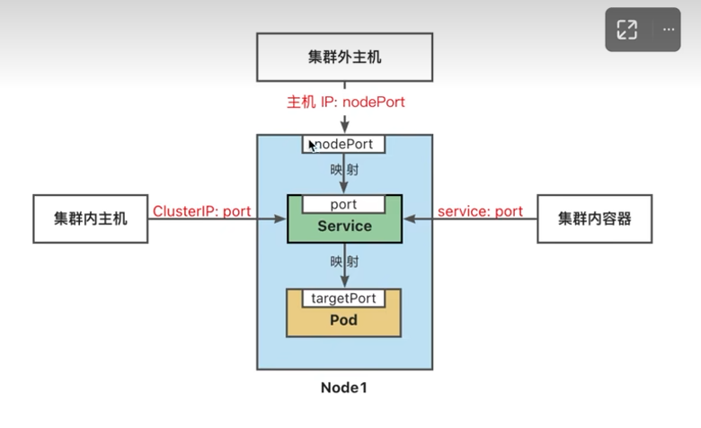

通用技巧

~~~shell

9.在~/.kube/config配置阿里云k8s的服务就可以直接访问
8.金丝雀发布(灰度发布)，就是两个deployment对象，第二个一开始只放少量pod，如果没问题就用kubectl scale调整pod数量。
7.svc和pod不在意谁先谁后创建，只要有对应label的pod，svc就能查到
6.get svc -o yaml得到的内容并不是原始的.yaml文件内容，但可以从输出的 kubectl.kubernetes.io/last-applied-configuration看到原始.yaml文件的大致信息
5.集群中可以通过svc暴露的CLUSTER_IP访问服务，如果是在集群的任意pod中，可以直接用svc的名字访问服务，EXTERNAL_IP是提供给外界访问的。
nginx的例子:
集群中: curl 10.106.82.96:8080 (集群中所有主机都可以用这个clusterIP访问,pod也可以)
pod中: curl nginx-service:8080 (用一次性pod验证，集群中所有pod都可以访问，328项目中大厅服初始化uds连接也是用的这种方式，相当于是大厅服的一个pod使用uds的svc的名字访问了uds服务。)
4.pod理解为一个虚拟机，也就是说一个pod中的两个容器不可能是同一个端口
3.-A获取所有命名空间的资源
2.--watch 动态看资源的变化
1.进入pod比如exec -it 后边必须接上--，比如 kubectl exec -it mytest -- mysql -u root -p
~~~

删除操作

~~~shell
4.如果kubectl apply -f mypod.yaml生成了一个pod, 可以用kubectl delete -f mypod.yaml删除这个pod，估计不仅是pod，其他资源也是。
3.删除具有相同标签的所有pod（配置了deploy会自动恢复，不过不是之前那个pod了）
kubectl delete pods -l app=staging-user-data-service -n staging
2.删除命名空间会把该命名空间下的所有内容都删了，如果遇到错误，需要先删除错误状态的对象
1.把副本集删了不会影响deploy, 但把deploy删了，pod也会被删
~~~

有状态应用mysql

```yaml
# 数据挂载用hostPath类型(绑定挂载)
apiVersion: v1
kind: Pod
metadata:
  name: mysql-pod
spec:
  containers:
    - name: mysql
      image: mysql:5.7
      env:
        - name: MYSQL_ROOT_PASSWORD
          value: "123456"
      volumeMounts:
        - mountPath: /var/lib/mysql
          name: data-volume
        - mountPath: /etc/mysql/conf.d
          name: conf-volume
          readOnly: true
  volumes:
    - name: conf-volume
      configMap:
        name: mysql-config
    - name: data-volume
      hostPath:
        path: /home/mysql/data
        type: DirectoryOrCreate
---
apiVersion: v1
kind: ConfigMap
metadata:
  name: mysql-config
data:
  mysql.cnf:
    [mysqld]
    character-set-server=utf8mb4
    collation-server=utf8mb4_general_ci
    init-connect='SET NAMES utf8mb4'
    
    [client]
    default-character-set=utf8mb4
    
    [mysql]
    default-character-set=utf8mb4
#注意：hostPath 仅用于在单节点集群上进行开发和测试，不适用于多节点集群；例如，当Pod被重新创建时，可能会被调度到与原先不同的节点上，导致新的Pod没有数据。在多节点集群使用本地存储，可以使用local卷。
```

ConfigMap

~~~shell
1.用来在键值对数据库(etcd)中保存非加密数据，一般用来保存配置文件
2.可以用作环境变量、命令行参数或者存储卷
3.将环境配置信息与容器镜像解耦，便于配置的修改
4.在设计上不是用来保存大量数据的，不可超过1M，如果超过需要考虑挂载存储卷或者访问文件存储服务

# 为什么需要configmap？
对于docker一般采用绑定挂载的方式将配置文件挂载到容器里，在k8s集群中，容器可能被调度到任意节点，配置文件需要能在集群任意节点上能访问、分发和更新。

# 修改configMap，配置文件会被自动更新
kubectl edit cm mysql-config
~~~

拷贝pod的文件到本地

~~~SHELL
kubectl cp staging-ai-mirror-server-66d8b4f5c4-spfmv:/root/divideLevel.json ./divideLevel.json -n staging
~~~

查看pod的内存使用情况

~~~shell
# 比如有多个pod，不知道哪个pod正在执行大量任务的时候就可以用来定位
kubectl top pods -n official
~~~

查看某个pod挂之前的日志

~~~shell
kubectl logs --tail 100 --previous official-battle-royale-server-1710641478399624860-59848466l7c7v -n official
~~~

选择器

~~~yaml
标签选择器可以识别一组对象，标签不支持唯一性
标签选择器最常见的用法是为service选择一组pod作为后端
两个主要子字段为matchLabels和matchExpressions，默认为前者
# my-service.yaml
apiVersion: v1
kind: Service
metadata:
  name: my-service
spec:
  selector:
    app.kubernetes.io/name: MyApp
  ports:
    - protocol: TCP
      port: 80
      targetPort: 9376
~~~

标签相关

~~~shell
# 标签使用户能够以松散耦合的方式将他们自己的组织结构映射到系统对象，而无需客户端存储这些映射。
# label-demo.yaml内容
apiVersion: v1
kind: Pod
metadata:
  name: label-demo
  labels:
    environment: production
    app: nginx
spec:
  containers:
  - name: nginx
    image: nginx:1.14.2
    ports:
    - containerPort: 80
~~~

查看pod的标签

~~~shell
kubectl get pod --show-labels
~~~

获取具有某标签的pod

~~~shell
kubectl get pod -l "app=nginx"
# 如果是多个标签，用逗号分隔
kubectl get pod -l "app=nginx,environment=production"
~~~

使用yaml文件创建和删除

~~~yaml
# nginx.yaml内容
apiVersion: v1
kind: Pod
metadata:
  name: nginx
spec:
  containers:
  - name: nginx
    image: nginx:1.22
    ports:
    - containerPort: 80

# 上边是内容， 下边是执行命令
# 创建
kubectl apply -f nginx.yaml 
# 删除 （不是根据名字，而是根据yaml文件
kubectl delete -f nginx.yaml
~~~


设置默认命名空间

~~~shell
# 如果不设置，默认查询/创建对象用的都是default命名空间
kubectl config set-context $(kubectl config current-context) --namespace=develop
~~~

创建指定命名空间pod

~~~shell
kubectl run nginx --image=nginx:1.22 -n=develop# -n=develop等效-n develop
~~~

创建命名空间

~~~shell
kubectl create namespace(可缩写为ns) develop
~~~

查看命名空间

~~~shell
kubectl get namespace 
~~~

k8s中参数用 -- 和 - 的区别

~~~
"-"作为前缀这种方式通常用于简短的、容易记忆的参数。
"--"作为前缀，通常用于更详细、更复杂的参数，需要明确指定参数的名称以及对应的值。
~~~

docker和k8s在访问服务时的对比
~~~shell
docker没有集群的概念 所以k8s比docker多了一个访问方式，集群内的主机使用cluster-ip:port访问服务，其他两种方式的思想是一样的，第一种是外界(k8s称为集群外)访问服务，对于docker是用的端口映射或者把网络模式设置为host，对于k8s是把svc设置为NodePort类型，使用本机ip:NodePort进行访问，LoadBalancer也是一样，第二种就是容器之间的互相访问，对于docker如果是默认bridge网络也就是docker0网卡，直接用容器的ip:port,如果是自定义bridge类型可以直接用容器的名字:port,对于k8s集群中的所有pod可以直接用svc的名字:port进行访问，可以结合328项目中大厅服初始化uds连接就是用的这种方式。

对于k8s有三个port类型需要理解，一个是targetPort也就是容器的端口，一个是port也就是svc提供给集群用的端口，还有一个是NodePort也就是集群外访问服务时需要用到的端口，简单来说就是targetPort是容器中的，port和NodePort是svc的，只是port是集群中用的，NodePort是集群外访问时用的。
~~~
访问服务(svc)的方法
~~~shell
三种方式
1.集群里面的任意pod访问服务，直接用svc的名字加端口(如果有cluster-ip，也可以用这个ip加端口)
2.集群外访问服务用NodePoet类型使用节点IP加端口（节点是指比如k8s服务部署在三台机器上，每台机器都是一个节点，节点IP就是任意一台上的主机IP）
3.集群中的任意主机(包含集群中的pod)可以通过cluster-ip加端口访问服务（如果用的是阿里云的k8s服务，那自己的云服务器不算集群中的主机，集群中的主机指的是部署了k8s服务的主机，自己的云服务器只是提供了访问集群的方法。）

# 上边是访问svc，再通过svc的负载均衡进一步访问pod，也可以直接访问pod，集群中的pod会分配一个ip，集群内可以通过这个ip直接访问pod，集群外应该就得在svc的层面上进行访问了。
~~~



NodePort类型（集群外主机访问访问集群的服务

~~~shell
kubectl expose deploy/nginx-deploy --type=NodePort --name=nginx-outside --port=8081 --target-port=80
# 查看服务
kubectl get svc -n default
NAME            TYPE        CLUSTER-IP      EXTERNAL-IP   PORT(S)          AGE
nginx-service   ClusterIP   10.106.82.96    <none>        8080/TCP         16m
nginx-outside   NodePort    10.110.131.94   <none>        8081:30358/TCP   14s
# 这个30358是随机生成的外部访问端口, 在浏览器上输入localhost:30358(8081是集群内用的端口)就可以访问到集群内的nginx服务了
~~~

svc的Service Type 取值

```shell
ClusterIP(默认类型)：将服务公开在集群内部，k8s会给服务分配一个集群内部的IP，集群内的所有主机都可以通过这个Cluster-IP访问服务，集群内部的pod可以通过svc的名字访问服务。
NodePort：通过每个节点的主机IP和静态端口（NodePort）暴露服务，集群外的主机可以使用节点IP和NodePort访问服务。# 节点可以是集群中任意主机，无论svc本身在哪个节点上，NodePort都会在每个节点上开放一个相同的端口，所以访问集群任意节点都可以。
ExternalName：将集群外部的网络引入集群内部
LoadBalancer：使用云提供商的负载均衡器向外部暴露服务，对于NodePort类型，需要指定NodeIP:NodePort, 而如果使用LoadBalancer就可以把流量打到负载均衡器的ip:port，然后进一步分发流量， 这样就无需关注机器本身的NodeIP了，并且负载均衡还能监控节点活性，更加灵活， 注意LB用的port相当于svc的port，不是NodePort。

# 以328举例，redis和mysql用的是ExternalName类型，大厅服和战斗服用的是LoadBalancer(因为外部需要能直接访问，LoadBalancer和Nodeport类型感觉很像，LoadBalancer更高级)，uds用的是ClusterIP，大厅服初始化连接uds的时候就是用的uds的svc的名字
```

验证nginx多节点负载均衡的效果（是k8s的负载均衡而不是nginx服务负载均衡

~~~shell
# 以下是svc的type为ClusterIP的情况
# 对任意一个pod进行以下修改
cd /usr/share/nginx/html/
echo hello > index.html
# 以下操作在宿主机上进行，若pod中可直接用svc名字:8080
然后用 curl 10.106.82.96:8080，有概率看到hello #这个ip是cluster-ip不是本机ip
~~~

一次性使用pod， 用完自动删除

~~~
kubectl run test -it --image=nginx:1.22 --rm -- bash
~~~

把deployment暴露为service

~~~
kubectl expose deploy/nginx-deploy --name=nginx-service --port=8080 --target-port=80
~~~

版本回滚(比如过程更新了镜像版本又想回退回去)

~~~shell
kubectl rollout history deploy/mytest-deployment
# 会得到
deployment.apps/mytest-deployment
REVISION  CHANGE-CAUSE
1         <none>
2         <none>

kubectl rollout history deploy/mytest-deployment --revision=1 # 看详情
# 然后执行
kubectl rollout undo deploy/mytest-deployment --to-revision=1 # 回滚

# 回滚本质上是通过副本集(rs)去回滚，就继续用之前的副本集来构建deployment和pod了
~~~

滚动更新(更新镜像)

~~~shell
# 说明:修改的是deployment对象
kubectl set image deploy/nginx-deploy nginx=nginx:1.23

# 过程:
会创建一个新的副本集，然后用这个新的副本集生成之前副本集的个数，之前那个副本集不会删除只是没有使用旧的副本集生成pod了， 通过kubectl get rs 可以看到副本集信息
~~~

副本数量调整

~~~shell
kubectl scale deployment nginx-deploy --replicas=5 # 增加减少都行
# 动态调整
kubectl autoscale deployment/nginx-auto --min=3 --max=10 --cpu-percent=75
# 查看自动缩放
kubectl get hpa
# 删除自动缩放
kubectl delete hpa nginx-deployment
~~~

创建deployment（可简写为deploy)

~~~shell
kubectl create deployment nginx-deploy --image=nginx:1.22 --replicas=3
kubectl delete pod 删除任意一个，他会自愈(会重新创建一个，保证有副本集数量为3)， 跟下边这个查看副本集是关联的
~~~

查看副本集

~~~shell
kubectl get replicaSet #replicaSet可缩写为rs
比如结果是nginx-deploy-85bc6c755并且有两个副本集， 使用kubectl get pod 就看到的是nginx-deploy-85bc6c755-A和nginx-deploy-85bc6c755-B
~~~

重启pod

~~~
实际上如果配置了deploy对象，那么直接删除这个pod就会自动重启
~~~

进入pod中

~~~
kubectl exec -it pod名 -- /bin/bash
~~~

查看pod的更详细信息(比如ip地址和镜像名)

~~~shell
kubectl get pod -o wide  #类比-o yaml,-o是输出格式
#kubectl get --help 可查看更多
~~~

Service,deployment,pod的关系

~~~shell
1.Deployment 负责管理 Pod 的创建和副本数量，而 Service 则提供了稳定的网络访问方式，使得可以通过 Service 访问到由 Deployment 管理的一组 Pod。

2.pod虽然可以有多个容器，但svc只需要知道一个容器的端口，并且只会把请求转到这个容器的端口， 也就是常说的targetport。
~~~

修改cm里面的fluentd-config配置

~~~shell
# 先删除旧的
kubectl delete cm fluentd-config
# 再创建新的
./create-config-map.sh

# create-config-map.sh 脚本内容
#!/bin/sh

kubectl create configmap fluentd-config -n default --from-file=./fluent.conf
~~~

**现在对用户是一个svc，后面是10个pod**

创建一个service

~~~shell
kubectl apply -f fluentd.yaml	（-f 指定文件路径
~~~

删除一个服务

~~~shell
先kubectl get svc -n default #比如删除fluentd
kubectl delete service fluentd -n default
~~~

删除一个pod

~~~shell
# 根据pod的名字删除（相当于重启，因为pod的个数都是配置好的，如果没有了足够的数量就会启动新的节点
kubectl get pod -n default #得到fluentd-db9bfd9f9-qlfrp
kubectl delete pod fluentd-db9bfd9f9-qlfrp -n default
~~~

编辑配置文件

~~~shell
kubectl edit cm -n default xxx(比如fluentd-config)

#改之前可以先备份一下
kubectl get cm -n default fluentd-config -o yaml > fluentd-config-backup.yaml
#如果改错了就恢复回去
kubectl apply -f fluentd-config-backup.yaml
~~~

备份配置文件

~~~shell
# -o yaml 可以把配置以yaml的格式打印出来
# svc也是一样
kubectl get cm -n default fluentd-config -o yaml > fluentd-config-backup.yaml
~~~

查看配置文件内容

~~~shell
kubectl describe cm -n default fluentd-config
~~~

查看配置文件有哪些

~~~shell
kubectl get cm -n default （cm:configmap
~~~

查看某个pod的详细信息

~~~shell
kubectl describe pod -n taptap  taptap-project328-server-7ccbf6fc5b-4mxgh
~~~

查看svc的信息， 并且以命名空间区分

~~~shell
#服务列表
kubectl get svc -n taptap
~~~

获取所有pod

~~~shell
kubectl get pod -A   # 注意一定要是-A 而不是 -a, 不管是pod还是其他资源都一样
~~~

获取pod信息

~~~shell
#Pod 列表
kubectl get pod -n taptap 
~~~

服务列表和Pod 列表区别

~~~shell
概念：
Pod 是 Kubernetes 中的最小部署单元，它可以包含一个或多个容器。Pod 用于运行应用程序或服务，并提供一组共享的网络和存储资源。
服务是 Kubernetes 网络抽象的一种方式，用于公开应用程序或服务。服务为 Pod 提供了稳定的网络访问地址，并负责在多个 Pod 之间进行负载均衡。
功能：
Pod 主要负责运行应用程序或服务，并提供其所需的计算资源、存储资源和网络连接等。
服务主要负责提供稳定的网络入口和负载均衡功能，使应用程序或服务能够在集群内或集群外可访问。
关系：
服务通常关联多个 Pod。服务通过标签选择器（Selector）关联一组具有相同标签的 Pod，从而将流量分发到这些 Pod。
Pod 可以独立存在，也可以是服务的一部分。服务通常使用 Pod 的 IP 地址和端口来提供访问入口。
总结： 服务列表和 Pod 列表在 Kubernetes 中担任不同的角色和功能。Pod 是实际运行应用程序或服务的基本单位，而服务提供网络抽象和负载均衡的能力，使应用程序能够通过稳定的入口地址对外提供服务。服务通常关联多个具有相同标签的 Pod，以提供可扩展和可靠的访问机制
~~~

查看pod的内存占用

~~~shell
kubectl top pods -n taptap
~~~

列出pod包含的容器名字

~~~shell
kubectl get pod test-leader-board-service-7dd6bf4556-xv8lp -o jsonpath='{.spec.containers[*].name}'

结果：test-leader-board-service ta-logbus

# 解释
{}: 表示开始和结束一个 JSONPath 查询语句。
.spec.containers: 表示访问 Kubernetes 对象中的 .spec.containers 字段，该字段包含了 Pod 中的容器列表。
[*]: 表示匹配 .spec.containers 中的所有元素。
.name: 表示访问每个容器对象中的 name 字段。
~~~

查看具有相同label的所有pod日志

~~~shell
kubectl logs -l app=official-user-data-service --all-containers -n official --tail 10 -f --max-log-requests=5
# label可以通过describe查看, --max-log-requests决定最大pod数
~~~

查看lbs这个pod中指定容器的日志

~~~shell
kubectl logs test-leader-board-service-7dd6bf4556-xv8lp -c test-leader-board-service(这里只能用容器名字，不能是容器id，容器id用于标识容器实例)
~~~

查看lbs这个pod的所有容器的日志

~~~shell
kubectl logs test-leader-board-service-7dd6bf4556-xv8lp --all-containers
~~~

从日志的最后10行开始看，并且动态的看

~~~shell
kubectl logs test-leader-board-service-7dd6bf4556-xv8lp --all-containers --tail 10 -f
~~~

查看uds的pod的所有容器

~~~shell
kubectl describe pod -n test test-user-data-service-58858fdf8f-c6lgv | grep -E "Containers:|Container ID:"

结果：
Containers:
    Container ID:   containerd://247a4882e36253298f04bd19d737ea62f10242e6d99a4b294b69521b0c95163e
    Container ID:   containerd://76a7858511f78f618204805ae12b2be967fb15490e927b639544a25020cc1d77
~~~

命名缩写


328项目k8s服务部署

~~~shell
# 注意：环境名是动态的，采用的是go的模板方式，配置环境的yaml在tools/build-server/src/config/tmpl/env.yaml
# 以下说明重要点
1. mysql、redis等环境的部署方式，采用的svcType为ExternalName
比如mysql的yaml内容为
### mysql
kind: Service
apiVersion: v1
metadata:
  name: {{.ENV_NAME}}-mysql
  namespace: {{.ENV_NAME}}
spec:
  type: ExternalName
  externalName: rm-bp1c4m1w22oq77q82.rwlb.rds.aliyuncs.co
### redis
apiVersion: v1
kind: Service
metadata:
  name: {{.ENV_NAME}}-conn-redis
  namespace: {{.ENV_NAME}}
spec:
  type: ExternalName
  externalName: r-bp1als4m3b0x1fzzbb.redis.rds.aliyuncs.com
# 大厅服和gm-tool因为外界需要访问所以用的是LoadBalance
apiVersion: v1
kind: Service
metadata:
  name: {{.ENV_NAME}}-project328-server
  namespace: {{.ENV_NAME}}
spec:
  type: LoadBalancer
  ports:
    - port: 8999
  selector:
    app: {{.ENV_NAME}}-project328-server
# 其他服务比如uds用的就是默认的ClusterIP， 直接通过svc的名字就能访问对应的服务
apiVersion: v1
kind: Service
metadata:
  name: {{.ENV_NAME}}-user-data-service
  namespace: {{.ENV_NAME}}
spec:
  ports:
    - port: 12000
  selector:
    app: {{.ENV_NAME}}-user-data-service
  clusterIP: None
~~~

常用资源快捷创建方式

```shell
1. 一次性pod
kubectl run test -it --image=nginx:1.22 --rm -- bash
2. 创建deploy从而生成pod
 kubectl create deployment my-nginx --image=nginx:1.22 --replicas=3 
3. 把deploy暴露为服务
kubectl expose deploy/my-nginx --type=NodePort --name=nginx-outside --port=8081 --target-port=80
4. 创建svc，但无法指定label
 kubectl create svc clusterip my-nginx --tcp=80:80 # 可通过kubectl edit svc 进一步编辑信息


# yaml方法
# svc
apiVersion: v1
kind: Service
metadata:
  name: my-service
spec:
  selector:
    app.kubernetes.io/name: MyApp
  ports:
    - protocol: TCP
      port: 80
      targetPort: 9376
# pod 
apiVersion: v1
kind: Pod
metadata:
  name: nginx
spec:
  containers:
  - name: nginx
    image: nginx:1.14.2
    ports:
    - containerPort: 80
```

课件地址：https://www.yuque.com/wukong-zorrm/qdoy5p

中文官网：http://kubernetes.p2hp.com/docs/concepts/workloads/pods.html

~~~shell
#安装k3s，wsl不行
git clone https://github.com/k3s-io/k3s.git #执行里面的./install.sh
curl -sfL https://get.k3s.io

# 直接下载docker desktop
~~~

