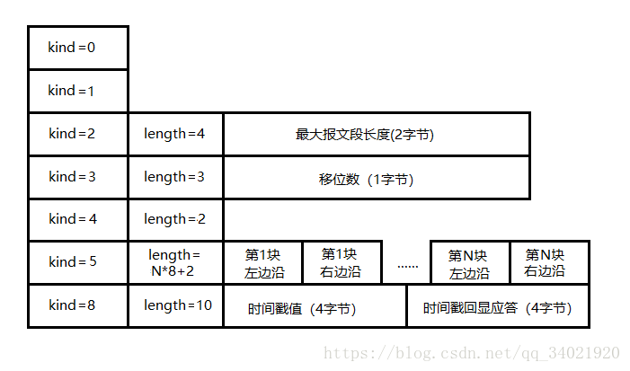
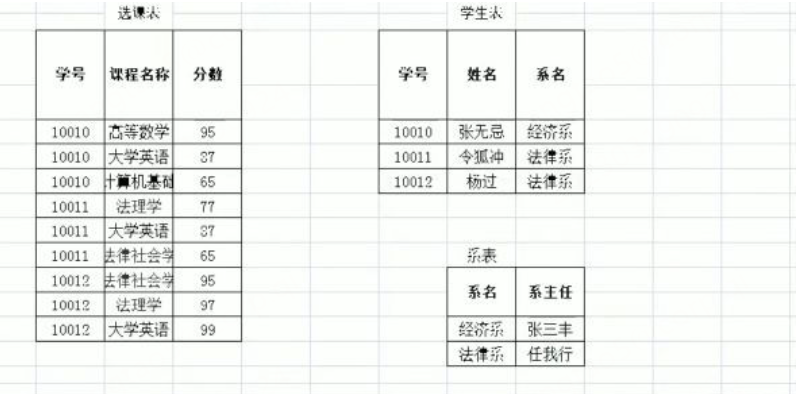
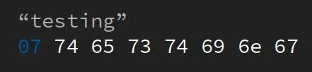

【内存内漏怎么查：先检查自己是否用了内存池，如果是自己的内存池出现了内存泄漏，添加打印信息来进一步排查，若自己没有使用内存池，则是第三方库的内存池可能出错】

定时器设计：Linux高性能服务器书上的时间轮和0v的不太一样，书上那种没有体现出定时任务的更新

Linux高性能服务器：只讲了单时间轮，使用了圈数的统计，不方便更新定时器。
0v：定时器结点中用了一个指针指向一个特殊的结点，因为是指针结点，所以不同的定时器结点内可以指向同一个特殊结点，在这个特殊结点上加了一个used变量，每收到一个keepalive，used++, 一定时间后used-- ，当used为0时，清除连接。这种方式用在判断对方是否正常的应用中， 还有一种机制就是IM上的， 每次更新最新时间

redis定时器设计是无序的单链表，任务多的时候使用跳表
map和set的红黑树键值是唯一的，不能同时处理，但可以设置辅助键值。 nginx用的也是红黑树

## accep连接队列满了如何处理：

accept返回-1， 并且errno = EFILE 

1：ulimit -n修改系统文件描述符的限制。

2：通过设置一个空文件描述符，每次来了的时候关闭这个空fd，接受一个连接，关闭这个连接，再次打开一个空fd，这样就能处理掉请求连接的信息，如果不这样的话，listenfd的可读事件就会被一直触发。

3：自己限制连接数

## udp问题：

- 滑动窗口是**接受数据端使用的窗口大小**，用来告知发送端接收端的缓存大小，以此可以控制发送端发送数据的大小，从而达到流量控制的目的。
- 拥塞窗口是数据的发送端，拥塞窗口不代表缓存，拥塞窗口指**某一源端数据流在一个RTT内可以最多发送数据包**

**当问到tcp和udp的区别的时候从二者的协议头字段开始分析**

dns，没必要用tcp那么麻烦的三次握手四次挥手，就算失败，设置一个定时器，重传就是了

对比tcp优点：重传策略灵活，对于tcp，，由内核协议栈实现，而udp重传策略比较灵活，可以在应用层把tcp的这些特性都实现，tcp升级难度大，也可以理解为，如果修改了tcp的策略，它是对所有应用都会生效，而udp的应用层封装可以根据应用的不同进行更新。

udp并发问题：同样是epoll方式， 对于每个新来的连接，把给他们手动分配一个socketfd， 然后将这个socketfd绑定当前ip和port，再connect对方，然后放到epoll_wait() 中， 那么下次对方的数据包就会触发这个新的socketfd

在udp并发这一块，虽然没有accept，但我们这里用了bind+connect 模拟tcp中的accept， 都是返回一个新的套接字出去，然后用这个套接字进行通讯。

### QUIC

分析对于TCP存在的问题：

1. 升级难，完全由内核实现，比如对于重传策略，udp就能在应用层更灵活的设置，但tcp不行，完全使用了内核实现的策略。
2. tcp建立/断开连接的消耗延迟
3. tcp存在队头阻塞的问题(包括发送端队头阻塞， 接收端队头阻塞)
4. 网络迁移需要重新建立tcp连接
5. tcp是顺序确认，但QUIC支持乱序确认，比如发送了1,2,3,4,5 对于3丢失了可以直接确认5，如果此时3超时，再将3编号为6重发(**通过 Stream ID + Offset 字段信息实现数据的有序性**),就可以辨别出这个6就是需要的数据3.。 而对于ack是顺序确认的，就算服务器收到了，4，5，对也只会回复ACK3， 所有客户端并不知道，对于客户端依然有可能重新发送4，5。  

解决方案：

2：对于QUIC而言，因为是基于UDP的，所以无需建立/断开连接的消耗；

3：对于队头阻塞问题，这里就要涉及到http/2的使用，抽象了stream的概念，实现了http**并发传输**(并发发送多个http请求)，一个stream就代表http/1.1里的请求和响应，每个帧的头部会携带stream ID以及offset偏移量信息，所以接收端可以根据这些信息有序组装，但是由于http/2多个stream请求都是在同一条TCP连接上传输，这就意味着多个stream共用一个滑动窗口，因为只有一个滑动窗口，所以会出现TCP层队头阻塞问题，而对于QUIC协议，它借鉴了http/2中stream的概念，但是QUIC给每一个stream都分配了一个独立的滑动窗口，这样使得一个连接上的多个stream没有依赖关系，各自控制各自的滑动窗口，StreamA被阻塞后，不影响streamB,streamC的读取，而对于http/2,所有stream都在一条TCP连接上，streamA阻塞后，streamB，streamC必须阻塞

4：比如从5g变到了wifi，由于QUIC具有连接ID，可以通过这个连接ID来标记通信的两个端点，即使ip地址变化，只要仍保存有上下文信息(比如连接ID，TLS密钥),就可以无缝复用原连接，没有丝毫卡断感，而对于TCP,需要重新建立建议，包括TCP三次握手，TLS四次握手的时延，以及tcp是慢启动的一种方式，给用户的感觉就是网络突然卡顿了

#### quic补充

**RTT计算的歧义：**
quic报文中的packet number是严格单调递增的，即使是重传报文，也同样递增，这样就能避免tcp中出现的**RTT计算的歧义**(TCP中的RTO是基于RTT计算的)，因为tcp中的重传报文序号不会递增，还是原来那个序号。

**QUIC支持乱序确认：**
上边这样做还有一个好处，不再像TCP那样必须有序确认(即3，4，5到了，到2没到，回复给发送端的ack就会一直是2，当2到了，直接回复5，也就是就这回复值ack表明前边的数据一定是到达了的，并且2对应2，3对应3，序号与ack号是对应的)，QUIC**支持乱序确认**(比如发送了3，4，5 ，过程中4，5顺利到达接收端，3丢失了，超时重传，但此时会把3编号为6，因为packet number严格递增，此时接收端接收6，但接收端知道这是3的数据，那么这是怎么做到的呢？因为每个包都包含了它对应的stream字段以及偏移量offset字段，通过它们就能确定这是哪一个包了)。

**quic的流量控制：**
通过window_update帧告诉对端自己可以接收的字节数，这样发送方就不会发送超过这个数量的数据。
通过BlockFrame告诉对端由于流量控制被阻塞了，无法继续发送数据。
quic实现了两种级别的流量控制，stream级别和connect级别(所有stream和起来的概念)，一般讨论stream级别即可。
因为udp没有实现流量控制，所有quic自己实现。当接收窗口成功接收到**连续**的一半接收窗口的大小的数据时，最大接收窗口向右移动，同时向对端发送窗口更新帧，当发送方收到接收方的窗口更新帧后，发送窗口的有边界也会往右扩展，以此达到窗口滑动的效果。
但如果没有达到连续的一半接收窗口的大小时，那么接收窗口还是无法滑动，但这只影响一个stream。

**quic的拥塞控制**
跟tcp差不多，可以说照搬，但是由于quic的拥塞控制的实现是在应用层，对于不同的应用可以灵活的调整拥塞控制策略

**quic可以更快的建立连接**
quic首次连接需要1RTT，服务器通过CA证书私钥加密后，返回给客服端保存起来。下一次再连接时只需要0RTT，
简单来说，通过diffie-hellman算法来进行密钥的交换，可以通过该算法在双方互不知情的情况下建立加密通信，而对于普通的http/2协议，需要进行tcp握手以及tls握手，至少需要2.5RTT,虽然http/2是多路复用技术，但如果出现队头阻塞，效率可能还没http1高

### KCP

比如kcp，它是一个纯算法实现，相对于TCP，KCP以浪费10%-20%的带宽，换取比TCP快30%-40%的传输速度，并且最大延迟降低3倍的传输效果。
特性：

- RTO翻倍与不翻倍
  对于TCP超时重传时间是RTO*2,如果连续丢3次就变成RTO * 8了，而KCP是*1.5(实践证明这个更好)，提高了传输速度
- 拥塞控制方面
  KCP的优势在于可以完全关闭拥塞控制，非常自私的进行发送，但可能造成更为拥堵的情况。TCP大公无私，经常牺牲自己来减少网络拥塞，考虑大局。
- 快在哪里
  没有使用任何系统调用接口，完全是用户层实现，无需建立/关闭连接。很多影响速度的参数都可配(RTO等)。

##  ## 设计者模式

比如c++中pthread_create()，第三个参数必须传静态函数，若要在一个静态函数中使用类的动态成员(包括成员函数和成员变量)，，
可以通过两种方式实现，1：单例模式，类的全局唯一实例来访问动态成员。2：将类的对象(第四个参数，传this)传递给该静态函数。 

## 分布式锁

当获取锁失败，如何判断是否能再次去获得锁？

1. 轮询(mysql中就是这样)
2. 广播通知所有等待的人(redis中， 通过发布订阅模型)

这两种都是非公平锁， 类比单进程多线程中的自旋锁

3. 通知具体的某个等待者，(etcd 中就是这样)，这种是公平锁 类别单进程多线程中的互斥锁

 	4. zookeeper分布式锁的实现

## UUID  与 自增ID 区别

关系型数据库中的主键

~~~
为了唯一标识表中的一行数据需要主键，为了使多个表关联起来需要使用外键，为了与业务解耦，需要采用与业务无关的值作为主键。
~~~

    对于查询：
    自增ID是有序的，而UUID是随机的。如果主键是有序的，数据库可以具有更好的查询性能（比如where id < ...），若主键乱序，这样的sql语句进行查找的时候会产生大量IO操作， 影响性能。
    
    对于插入：
    Mysql中B+树一页是16K，若键值是乱序的，会出现很多分页的操作， 产生碎片，开销更大。
    使用主键自增，每次插入一条新的记录，记录就会沿着当前索引节点的后续位置，当一页写满，就会开辟一个新的页
    减少了叶分裂和碎片的产生

​    
​    自增ID所需的存储空间比UUID要小
​    由于自增ID比UUID更加简单，因此生成自增ID的生成速度也比UUID更快
​    自增ID与数据相关，主键会暴露出去的话，自增ID会显示当前表中的数据规模；而UUID则无此风险
​    自增ID在不同的数据库中可能重复，在分布式的环境下无法保证唯一。而UUID在分布式环境下也可以保证唯一

具体而已，自增ID在性能上更有优势，而UUID则更加适应分布式场景

1.因为fd是非阻塞， connect不一定是成功，可以给listenfd绑定一个写事件(因为写事件一直会触发)，通过getsockopt(m_socket, SOL_SOCKET, SO_ERROR, (void*)&error, &len);来获取error指，若为0，则表示成功连接，反之失败。

2.内存池设计

~~~
1.由整块散成小块
伙伴算法(回收的时候麻烦，需要连续的才能合并回收，就像2048游戏)；
就由一个4k的内存块分配，比如分配一个8bit那么就拆分成
2k+1k+512+256+128+64+32+16+8若干小块，回收的时候就合并小块为大块
分配的时候由大块->小块，回收的时候由小块->大块
回收条件，两者一样大，并且相邻

2.一开始划分好若干的小块
slab算法(由小块聚集在一起)

3.在特定业务场景里面
比如在即时通讯中，当有一个连接到来时，就分配一个内存池，当连接断开，就一次性释放，这样就灵活多了

接触陌生的服务，htop虚拟内存在涨
1.内存池有没有泄露，增加打印信息判断是哪里的问题
2.第三方库的内存泄露
~~~

### 大数问题

**一、2G内存在20亿个整数出现次数最多的数**

1.map， 2，unordered_map 3，分治

2G内存也就是 2 * 2^30 = 2^31

使用unordered_map 包含一个key一个value，所以一个对象就是8个字节 = 2^3

所以2G内存一次能装下 2^31  / 2^3个对象，也就是2^28(一个文件能装的个数)

一个整数的范围是 - 2^31, 2^31, 一共包含了2^32个数字，因为s刚才说了2G内存一次只能装下2^28个数，那么这么多个数字就需要放2^32 / 2^28 也就是16个文件中。(**从这里可以看出，是以单个数据体(unordered_map8字节)的大小确定文件的大小 以及 范围的大小来计算需要的文件个数)**

这16个文件依次从小到大存储这20亿的数据(也就是说不管你是多少亿不重要，但是要考虑会不会超出范围这个问题，比如int类型只能表示20亿的数据，如果value从-20亿开始，则可以表示40亿数据)，

这20亿的数据肯定需要先放到一个大文件里面，将里面的数据处理到16个文件中，对应unordered_map就是每次 map[key] ++ , 然后再将这16个文件放到内存中去，找出每个文件中map[key]最大的值再进行比较

拓展：

1.如果这些数字大小比较集中，也可以使用hash的办法，相同的key会得到相同的值，再取16的余，同样使用unordered_map[key]++记录

2.比如是40亿个一模一样的数字， unordered_map中int类型最多只能表示到21亿左右， 如果把int改成long会增大内存开销， 所以可以把value对应的值一开始就赋值为-21亿，也可以一边遍历一边判断， 如果某个数字出现次数大于20亿次(如果一开始赋值-21亿，这里到-1就表示20亿次了)就不可能再出现比它更大的了

3.如果是80亿个数字，跟40亿同理， value初始为-21亿，当value达到正19亿，就满足超过半数了。

为什么不用红黑树，因为是logn, n个数就是 n*logn, 而现在是n * 1

**二、40亿个非负整数中算中位数和出现两次的数**

int类型表示-2^31-2^31, 一起加起来就是接近43亿的数字， 如果题目说是40亿数字，而且都是非负整数，那么类型应该是unsigned int

**假设题目是 给1G内存求出现两次的数**， 使用位图的方式，计算40亿个整数需要多大的位图空间， 2^32次等于4G约等于43亿的数字， 因为要求出现两次的数，一个位只能表示两种状态，所以为每个数分配两个位图的空间，那么就需要2*2^32 / 8 也就是1G的位图空间，

位图应该怎样记录每个数字呢？2n，2n+1表示一个数字，这样刚好每两个位表示一个数字，如果这两个位为 1 和 0， 那么刚好表示出现了两次

**假设题目是 给10M内存求中位数**，和第一个大题一样的分析思路，内存大小10M(10*2^20) / 每个数的大小(unsigned int 为4字节) / 2.5M(2.5 * 2^20)， 也就是说每个文件大小最大是2.5M， 但是这里需要做一个优化，对于每个数字我们都是用除法(num / 2.5M)的方式获得该放到哪个文件的信息， 2.5不利于计算，所以更改为2的n次方 > 2.5，或者2的n次方 < 2.5, 那么只有2M和4M符合，如果是4M， 那么4 * 4(每个数字的大小) 为16(显然大于10M)， 所以只能是2M

因为40亿需要用unsigned int表示，同样范围也是2 ^ 32， 2^32 /  2^20(每个文件能容纳得个数) = 2^12，即arr[2^12]大小的数组 ，每次计算出数字(num)该在哪个文件中，arr[num/(2^20)]++ ,  遍历完成之后，找到第20亿个数应该出现在哪个个文件中(找到中位数所在的文件夹，比如第一个文件5个数，第二个文件三个数，第三个文件5个数，那么中位数就在第二个文件中)，上边求得，我们需要单个文件的大小为2M，，再定义一个数组arrtwo[2M], 把这个文件中的数据都遍历一遍，开始累加arrtwo的下标对应的value，直到找到中位数

### 僵尸进程

wait 是阻塞的，直到某个进程结束运行为止，结束运行的子进程的PID

waitpid是非阻塞的，但它需要捕获一个已经终止的子进程，但我们并不知道一个子进程是否已经终止了。

SIGCHLD： 当一个子进程结束会发送这个命令给父进程， 在信号处理函数里面调用waitpid

### c++缓存实现方案

先介绍LRU 和 LFU的机制， 说一下redis是常用的缓存，拓展一下redis的策略，自己做的话可以用unordered_map做， key为键，value是一个结构体，里面包含具体的值以及过期时间等信息，每次先去map.find(key) != map.end() ，如果不存在，再去数据库里面找

### A和B轮流抛硬币，谁先抛到正面就获胜，A先抛硬币，问A获胜的概率

把A、B都抛硬币一次看成一局游戏。
情况1： A第一次抛正面 -> A胜 p= 1/2
情况2： A第一次抛反面、B抛正面 -> B胜 p= (1/2) * (1/2)=1/4
情况3： A第一次抛反面、B抛反面 -> 平局，进行下一局
P（A胜）/ P（B胜）= 2
P（A胜）+ P（B胜）= 1
所以可算出 P（A胜）=2/3
P（B胜）=1/3

### session 和 cookie的区别

先说为什么需要它， 因为http是无状态的，有时候会频繁传输不必要的重复数据，所以借助它们保持状态，比如我们需要知道用户的状态，登录，购物车等

**cookie：**

cookie各字段解释

~~~
name字段：名称
value字段：cookie的值

//以下都是一些控制权限相关的配置
domain字段：cookie的不可跨域名性：即百度不可以用谷歌的cookie，反之也不行，**但是**可以通过cookie的domain字段支持跨域名的访问，例如将domain属性设置为".shuaige.com"，那么"a.shauige.com" 和 "b.shuaige.com"都可以访问该cookie， 这也就是为什么不同的网页只要登录其中一个， 其他的也能自动登录

path字段：为可以访问此cookie的页面路径。 比如domain是abc.com,path是/test，那么只有/test路径下的页面可以读取此cookie。
Size字段：设置cookie的大小
http字段：cookie的httponly属性。若为true，则只有在http请求头中会带有此cookie的信息，而不能通过document.cookie来访问此cookie
expires/Max-Age字段：设置cookie的过期时间。不设置的话默认值是Session，意思是cookie会和session一起失效。当浏览器关闭(不是浏览器标签页，而是整个浏览器) 后，此cookie失效。
secure字段：设置是否只能通过https来传递此条cookie
~~~

Cookie是临时文件，作用就是存储信息，比如保存你浏览的网页的痕迹，使得再次访问同一个页面的时候**提高网速**，比如保存你的一些登录认证信息，判断你是否登录过这个网站并已经认证过信息了，利用cookie我们就可以实现**自动登录，保存浏览历史，身份验证**等功能

当一个用户通过 http访问到服务器时，服务器会将一些 Key/Value键值对返回给客户端浏览器，并给这些数据加上一些限制条件，在条件符合时这个用户下次访问这个服务器时，数据通过请求头又被**完整**地给带回服务器，服务器根据这些信息来判断不同的用户。

比如说购物车信息，为了避免每次点开购物车都从服务器拉数据，cookie会记录购物车信息，但不是说它一定会这样做

cookie的生存周期：cookie在生成时会被指定一个Expire值，分为会话型和持久型， 若是会话型，只保存在客户端内存中，浏览器关闭的时候就会清除信息， 若是持久型，会将信息持久化到磁盘上

cookie的缺陷：

~~~
1.数量受到限制，一个浏览器能创建的cookie数量有限(取决于不同浏览器)，并且每个不超过4K，sesion没有这个限制(服务器决定)
2.因为是存在客户端的，比如访问一个有毒的网站，可能泄露信息
3.浏览器可以禁用cookie，禁用后就无法享受它带来的便利
~~~

现在cookie保存在客户端了，当我们去请求一个URL时，浏览器会根据这个URL路径将符合条件的Cookie放在请求头传给服务器，但是cookie是有大小和数量限制的，越来越多的cookie会让传输量增加， 所以这时候就用到了我们的session，客户端每次传递的cookie只需包含sessionID(但并不是说cookie只存它，根据不同的服务器实现不一样)，在服务器上就可以找到这个会话的相关信息

**session：**

当用户请求应用程序的web页时，如果该用户还没有会话，则web服务器会自动创建一个session对象

服务器会把sessionID和对应的用户信息，用户操作记录在服务器上，这些记录就是session

对于session我们可以这样想，就是你打开淘宝，你的浏览信息会记录到服务器上边，当你登录的时候，你会发送sessionID给服务器，服务器根据这个ID找到对应的session信息， 给你推送相关的内容

大量的session会消耗很多内存，所以服务器会有一定的机制定时清理session

**工作流程**
当浏览器第一次访问服务器时，服务器创建Session并将SessionID通过Cookie带给浏览器保存在客户端，同时服务器根据业务逻辑保存相应的客户端信息保存在session中;客户端再访问时上传Cookie，服务器得到Cookie后获取里面的SessionID，来维持状态。

这样看起来session好像很依赖cookie，其实不是
没有cookie还有其他方式能让session正常工作

~~~
通过URL传递SessionID，通过Cookie传递SessionID，通过SSL传递SessionID，通过隐藏表单传递SessionID
~~~

**其实我个人觉得，最大的区别就是cookie在客户端，session在服务器，具体谁存什么内容可以根据不同的web服务器进行控制协调，以最大程度的提高使用效率**

### session一致性问题

在分布式场景下， 如果用户的登录信息只在一台服务器上，那么下一次路由到另外的服务器上就需要重新登录了

解决方案

~~~

1. session复制， 所有机器同步，这样无法水平拓展，占网络带宽，有时延
2.客户端存储session对应的资源信息到cookie中， 不安全，并且每次访问服务器都需要携带session信息，并且session大小受到cookie限制， 那这样说实话和没有sesison一样
3.反向代理hash一致性(Nginx)
反向代理层对用户ip做hash， 保证同一个用户的请求落到同一台服务器上
缺点：这样如果这台服务器宕机了，信息就丢失了
优点：可以水平拓展

4.后端统一集中存储
将session存储在所有服务器的存储层上，如数据库或者缓存，要明白一个核心点，我们是可以接受session丢失的，但尽力避免，所以可以用缓存(Redis)
缺点是增加了依次网络调用，需要修改应用层代码

~~~

server层无状态是大规模分布式系统设计原则之一，所以session存储在cache里比较好

**nginx：**
反向代理，  简单来说就是真实的服务器不能被外部网络访问， 所以需要一台代理服务器，通过代理服务器来进一步访问，就跟翻墙一样的原理

负载均衡：轮询的方式， 或者自己设置权重，如果有后端服务器宕机了，能自动剔除

 http服务器：我们输入url时，不加端口号，默认就是80端口， 可以在nginx上发现，nginx配置的就是80端口， 那么这个nginx就相当于一个http服务器，可以做一些静态资源或者动态资源的设计 ， php做的web应用属于一种动态资源，引申gci和fastgci， cgi(common gateway interface 通用网关接口)也是一种实现动态资源的技术(php实现的web应用就算一个cgi程序)，对每个接收到的http请求， 都需要重启一个CGI进程来进行出来，处理完成后必须关闭CGI进程，才能达到通知web服务器本次http请求处理完成的目的， 但fastcgi不一样，一旦请求就可以处理所有的http请求

为什么nginx反向代理可以降低上游服务器的负载
一般来说公网延迟高，客户端于nginx之间的请求连接走公网，nginx先把这些请求缓存住，等这些请求数据全部完成之后nginx再向内网服务器请求，降低公网网络延迟成本， 同时也降低一个连接占用服务端程序的时间，因为tcp不一定一次就能把全部的数据传输完毕， 而这样的空闲连接全部都连接到服务器上会加重服务器负担。 nginx对此进行了优化，可以承载更多的连接， 所以降低了上游服务器的负载

### 编译型语言和解释性语言的区别

c, c++,go, 汇编语言语言等， 它们都属于编译型语言， 使用的转换工具称为编译器，而python，javascript， php，shell，lua等则是解释型语言，使用的转换工具称为解释器

还有一种半编译半解释的语言如java和c#, 先将源代码转换成一种中间文件，然后再将中间文件拿到虚拟机中执行

对于编译型语言来说， 执行之前都要先编译成可执行文件(比如windows的.exe) ，解释性语言无需预先编译，而是由解释器对源码进行解释，一边解释一边执行

对于编译型语言，需要编程成可执行程序，就不再需要重新编译， 一次编译，无限执行， 但是编译型语言通常是不能跨平台的， 也就是不能在不同的操作系统随意切换， 比如.exe文件不能拿去windows运行，反之也是， 也就是可执行程序不能跨平台， 第二种就是源代码也不能跨平台， 比如相同的睡眠函数，在windows上是Sleep()，以毫秒为单位，而linux下是sleep() 以秒为单位

对于解释型语言， 每次执行程序都需要一边转换一边执行(效率与编译型语言相比较低)，哪些源代码要用到才转换，用不到则不进行处理，在运行解释型语言的时候，我们始终都需要同时拥有源代码和解释器，但它的好处就是跨平台，这里的跨平台指的是源代码跨平台，不是解释器跨平台，因为在不同平台下有不同的语言解释器

当下载一个程序时也有区别，对于编译型语言，我们下载到的是可执行文件， 源代码可以不开源，只需要编译成可执行文件即可，所以可以闭源， 而解释型语言，如果没有源代码，就无法运行， 所以解释型语言程序一般都是开源的。

以python为例， 官方针对不同平台(windows, linux, macOS)开发了不同的解释器，这些解释器都遵守同样的语法(不会像c++那样分Sleep(windows)和sleep(linux)), 正因为有了解释器这个中间件，可以在不同平台上解释出不同的机器码，帮助我们屏蔽不同平台之间的差异性

### kill -9

发送的是一个SIGKILL信号， 这个信号是不可捕捉的，SIGSTOP也不能被捕捉
SIGSTOP: 停止(stopped)进程的执行. 注意它和terminate以及interrupt的区别:该进程还未结束, 只是暂停执行. 本信号不能被阻塞, 处理或忽略.
ctrl + z 产生SIGTSTP：停止进程的运行, 但该信号可以被处理和忽略  , 通过 fg 命令回到前台
ctrl + c 产生SIGINT， 中断
ctrl + \ 产生QUIT信号，退出
kill(默认是 -15) 产生SIGTERM，先释放自己的资源(自己写逻辑)，再终止

kill命令首先要产生信号，会向操作系统内核发送一个信号(多是终止信号)和目标进程的PID，根据这个pid找到这个进程的task_struct ，然后在这个结构体的特定成员变量里记录下这个信号， 这时候这个信号还没有被特定的处理，被称为pending signal(等待信号)，等到下一次cpu调度要这个进程的时候，内核会保证先执行do_signal这个函数看有没有需要被处理的信号，若有则处理，若没有则继续执行该进程。

kill命令调用了send_signals(这里面又调用了kill), 这个kill函数就是对进程结构体进行操作的实际函数，好，到这里位置已经在task_struct设置好了这个信号标记

信号处理：当内核调度到该进程时，会调用do_signal()，进一步调用handle_signal,进一步去处理每个信号，那么信号的处理函数应该用哪个呢，在每个task_struct内部都已经设置好了。

### g++ 和 gcc 区别

它们的主要区别是，g++对于语法的规则检查上更为严格

二者都可以编译c或者cpp文件，区别在于，gcc无法自动链接cpp的库，所以我们一般直接使用g++来跑cpp文件，但在编译、汇编阶段(g++其实就是调用的gcc)，二者没有区别
如果想通过gcc test.cpp 来链接生成.out 文件，那么就需要加上 stdc++这个库， 即 gcc test.cpp -lstdc++   因为gcc不会主动去链接c++的库

无论gcc 还是 g++， 对于 extern “C” 没有区别，都是以C的命名方式来命名，因为c++的特性在取名字时会结合参数一起

`__cplusplus`是用到c++时定义的宏，如果gcc在编译cpp文件时或者g++在编译c和cpp文件时，extern c声明会有效(这种情况下定义了`__cplusplus`这个宏)， 如果是gcc在编译.c文件时， 那么extern c 声明无效(因为这种情况下没有定义`__cplusplus`这个宏)

### c++ lambda

底层就是一个仿函数，如果是一个lambda表达式，编译器会自动转成一个仿函数，在该类中重载operator()，以sort为例子进行展开， 表达打三个参数我们一般选择传入一个函数指针，但其实还可以传递一个仿函数，什么是仿函数，也就是通过构造一个类来实现函数的效果， 那么本质上就是在类中重载 （） 运算符。 再以set为例子延展我的定时器中选用set来作为存储结构，但因为set里面的红黑树是不支持相同的key的(mulset)， 用的是set<listNode*, less<>), 这个less就是一个仿函数， 它里面实际上就是重载了()，它的实现很简单，就是进行一个大小的比对， 那么这个时候我们可以重载 < 运算符，来实现相同自己的排序规则，比如listNode节点里面既有key，又有一个id， 如果key相同就比较id

捕获类型
默认情况下，lambda函数是一个const函数，即不可以修改变量，可以加上mutable 取消这个限制，使用该修饰符时，参数列表不可省略

~~~c++
[变量名]		值传递的方式捕获某变量，类型是const的
[=]		值传递的方式捕获父作用域所有变量，类型是const的
[&变量名]	引用传递的方式捕获某变量，不会有副本，不是const
[&]			引用方式捕获父作用域所有变量， 不是const
[this]值传递的方式捕获当前this指针，可以拥有所有访问权限

mutable不是加在变量上的，而是函数上，如果在一个类中的const函数中针对某个变量去掉const属性，那么就在那个类成员变量的前边加上mutable，  跟这里刚好相反。
	int a = 5;
    auto fun = [=]() mutable {
        a ++;
    };
    fun();
    cout << a;
~~~

### c++ lambda 实现 go 中的defer

~~~c++
#include <functional>

using namespace std;

typedef std::function<void()> fnDefer;
class Defer
{
public:
	Defer(fnDefer fn) : m_fn(fn)
	{
	}
	~Defer()
	{
		if (m_fn)
			m_fn();
	}
private:
	fnDefer m_fn;
};

#define defer1(a,b) a##b
#define defer2(a, b) defer1(a, b)
#define defer(expr) Defer defer2(__Defer__,__COUNTER__) ([&](){expr;})

class Test
{
public:
	void f(int i)
	{
		printf("f:%d %p\n", i, this);
	}
};

int main(int argc, char* argv[])
{
	Test t;
	printf("test:%p\n", &t);
	defer(t.f(1));
	defer(t.f(2));
	defer(t.f(3));

	return 0;
}

~~~

### c++访问其他文件对象的方式

对于变量 extern int c;

对于函数可以 不同extern，因为默认加了extern， 但需要声明一下，所以我们一般把声明放在头文件，大家都引用它就行了。

使用静态指针的方法，就像MFC中访问主窗口一样，类和函数一样，如果在其他文件需要用到，都需要声明一下，通过 类名::静态对象，  对象在初始化的时候把这个指针指向它， 然后就可以用这个静态指针访问这个对象。

### mysql三大范式

1NF：将所有列拆分到不能拆分位置，比如不能有一个字段为 系名加系主任

2NF：将部分函数依赖的字段拆出来，也就是说消除非主键对主键的部分依赖

~~~
1.函数依赖：如果通过A属性(属性组)，可以确定唯一B属性的值，那么B依赖于A。比如上图的姓名，完全依赖于学号
2.完全函数依赖：如果A是一个属性组，则B属性值的确定需要依赖于A属性组中的所有的属性值。属性组是指多个字段，那么比如我们要想知道一个分数，就必须依赖于学号和课程名称两个属性才能确定一个分数，其他的属性是不能确定某一个分数的
3.部分函数依赖：如果A是一个属性组，则B属性值的确定需要依赖A属性组的某一些字段即可，例如学号和课程名称为一个属性组，那么学生姓名(或者自己加个学生信息来举例)其实就只需要学号就可以确定
4.传递函数依赖：如果A属性(属性组),可以确定唯一个B属性的值，再通过B属性的值又可以唯一确定C属性的值，例如一个学号确定一个系名，一个系名对应一个系主任
5.码：在一张表中，一个属性或者属性组，被其他所有属性完全依赖，则称这个属性(属性组)为该表的码，比如上图的学号和课程名称组成的属性组就是该表的码
~~~

我的思路是先找到表中有没有哪个字段完全依赖一个属性组**(**属性组如何找，比如这里我们可以以学号+课程名为组，那么成绩就是完全依赖这个属性组的， 当找不到属性组的时候，看哪个字段重复的概率最高，就以这个字段之外的所有字段为属性组，进一步分析,但其实应该不会出现这种情况的，因为如果没有属性组，自然也不会出现这门多重复的值。**)**，如果有，则从这个属性组入手， 如果没有，多半就是都只依赖同一个主键，或者有的字段是依赖非主键的。如果没有属性组，那么自然不需要解决第二范式的问题，直接解决第三范式的问题

3NF：非主键类只依赖于主键，不能依赖于其他非主键

注意：每一个范式都是基于上一个范式的

问到mysql表的设计**就说**如果这个人还有一些个人信息，那么这些个人信息就要拆出来，形成一张一对一的表，这张信息表可以用自增id作为主键，用学生的id作外键。 也可以直接用学生的id作为主键，不要外键了。

**外键的好处：**
1.数据库自己通过外键保证数据的完整性和一致性
比如当你存在外键约束的时候不能贸然的删除其中一个表的字段， 要么就一起删除，当然你也可以设置相应的属性，当你要删除某一个字段的时候就把与它有关联的对应的其他表的数据也一起删了。

2.外键能够使表的关系变得清晰，如果没有外键，不了解表关系的人很难找到正确的表，可能查错表(人工的)

**为什么数据库可以没有外键：**
尽管有外键有相应的好处，但有时候我们还是得根据情况来设计表，如果没有外键我们可以 ，1.提高性能，外键会影响插入删除更新的性能，因为在执行这些之前需要先检查是否违反数据的完整性。 2. 方便旧数据的导入，同样也是如果有外键的这些机制，因为这些就数据可能对数据的质量和完整性没有那么严格，那么要么就是人工去做一些清理或者转换(但是代价太大)， 要么就是放弃外键的对完整性的限制， 当然选择后者

注意：外键不一定是另外一个表的主键， 但一定是一个唯一字段。

面试解题思路：
以上的内容都是没有自己额外的增加一个主键ID的，但对于学生、课程、学院，我们其实是可以给他们拆分出来后**都增加一个自增ID**，通过这个自增ID来建立外键关系。 

问到表的设计， 如 学生、课程、学院， 就分析课程和学院**都与**学生建立联系，以学生为中心出发。
学生对学院(多对一)， 学院对学生(一对多)，学生对课程(多对多，这个时候需要引入一个中间表，建立联合主键以及分别作为这两个表的外键）。

而如果只是问三大范式，那么就以上边的这些表为例就好了

### UDP发送的包的回应

分正常和非正常（ICMP，想想这也确实该这样，不然哪里出错了都找不到原因。）

其实得分析正常和非正常得回应，对于正常情况，回应肯定是根据你的业务代码咋写的，而如果说像linux下的traceroute, udp包的对端端口填入的是一个应该没有使用的端口， 那么自然也就会回应你**ICMP报文**，将类型设置为端口不可达，  然后继续拓展windows下的trancert，linux下 ping 它们三者的关系以及区别。

同时拓展TCP中和ICMP的作用很相似的一个字段，RST报文， 分析出现这种报文的三种情况， 端口不可达，半连接状态(断网)， 异常断开连接(close()，setsocketopt，为处理完未发送的消息直接关闭)

细节之处在于我们收到ICMP端口不可达报文后并不会在ICMP层就完结了，而是会往应用层传递，可以通过recvfrom接收到这个包，然后获取error值，可以发现为ECONNREFUSED

### SYN洪泛攻击

也就是黑客一直给服务器发送连接请求，但从来不返回第三次握手，那么服务器就有大量的半连接状态节点，因为这个半连接状态节点的消耗还是蛮大的(sendbuf, recvbuf)，并且服务器还会不断重试第二次握手， 所以可能造成服务器崩溃，SYN洪泛攻击是DDOS(分布式拒绝服务)攻击的一种，DOS(则是普通的拒绝服务)

解决办法：

1.SYN cookie ， 当服务器收到syn后，不会立即分配一个半连接队列， 服务器第二次握手的SYN序列号比较特殊，是通过源IP和port和目的IP和port以及一个只有服务器才知道的秘数经过一定算法计算出来的cookie， 那么当客户机的第三次握手的ACK序列号一定是我们再次通过那个算法计算出来的cookie + 1， 如果确实是这样的话，那么我们就直接分配一个全连接节点给它， 反之则是不管它。

2.限制单个地址的最大连接数

3.修改重试次数，也就是说，不会重传第二次握手，没有收到第三次握手超时就直接仍了

### c++编译器默认生成的几个函数

构造，析构， 拷贝构造，拷贝赋值，移动构造，移动复制，但如果你一旦自己写了拷贝构造， 那么这里的拷贝构造和移动构造都会失效，拷贝复制也是一样的道理。

### 快排复杂度分析

快排是在冒泡的基础上改进而来的，我们想一想冒泡，每次都是逐个，然后挨个的与旁边的对比，再进行相邻的交换， 而快排可以跨度很大的进行交换， 那么如果最差情况下，快排就会退化成冒泡排序这种情况，即每次只能选出一个数字，那么时间复杂度就是(n^2)

一般情况我们设想每次都是以中间为一个分界点，即每次都能排好一半，有点二分的意思，同时结合一颗二叉树来思考，每次都是选出一般，而对于二叉树而言，另外一半的树直接就不要了，而快排不会不要，依然需要又去左边看看，又去右边看看， 也就是说会遍历到每一个数字也就是N，最好的是这样理解：每次筛选数字的时候，左指针和右指针一定会遍历到每一个节点(这就是n的体现)， 但每次我们可以像二叉树一样实现log n的筛选结果(8->4->2->1)， 所以结合起来就是相乘法， 所以复杂度也就是n*log n

不管上边说的O(n^2)还是n*log n, 实际情况都是要偏小于它们的,因为你想想冒泡排序中,你每多一次排序就会少比较一个元素.

而对于空间复杂度，因为快排只是使用数组原本的空间进行排序，所以所占用的空间应该是常量级的，但是因为每次都需要递归， 一般情况下， 我们每次都能筛选一半的结果， 那么空间复杂度就是O(logn), 而如果是极端情况下，每次只能选出一个，那么空间复杂度就是O(n).

设想每次取出来的比对值都是最小的，那么快排也就退化成了O(n^2), 所以在选取比对值的时候，可以随机，或者三点取中法。

快排是一个不稳定的算法，因为在排序过后可能会对相同值元素的相对位置发生改变。

快排是相同数量级的所有排序算法中， 平均性能最好的.

### xml， json， protobuf区别

xml和json 是自描描述的， 而protobuf不是

protobuf更加安全因为是二进制的形式

protobuf更小，因为采用二进制压缩，进而消耗的网络流量就更少

但采用protobuf这种方式也有一个相对不好的地方就是无法对一个序列的数值进行随机查找，因为每个数字所占用的存储空间不是等长的，所以要获取序列中的第N个数字，无法通过计算偏移量的方式，而必须从头开始顺序查找

protobuf有一种编码方式叫varints， 最多可以编码8字节的数据，这是因为现代计算机最高支持处理64位的整型， varints能对整数(这个整数的类型不仅是int32,int64, 还有sint32， sint64， bool，enum)进行编码， 采用的是大端的编码方式(这里拓展htonl，htons 函数，本地和网络的编码区别)， 但是有一个问题， 对于一个负数，比如是sint64, 如果是-1 ，那么依然需要消耗10个字节的长度， 浪费大量空间，因为有一个符号位在那，为了解决这种问题还有一种编码方式叫zigzag(移位和异或的方式) 将负数转化为正数来进行编码

再来说说字符串的编码方式

- 蓝色，表示字符串采用 UTF-8 编码后字节流的**长度**（bytes），采用 Base 128 Varints 进行编码。
- 白色，字符串用 UTF-8 编码后的字节流。

**protobuf消息结构**

~~~
message Search {
	string query = 1;
	int32 page_number = 2;
	int32 result = 3;
}
~~~

试想这样一种情况，发送方在更新protobuf的协议字段后，加了更多的字段， 而接收方并不知道， 但接收方仍想接受自己还能接收的字段， 所以对于每个成员都有一个**类似赋值**的操作，但其实不是赋值，它相当于是给每个字段附带了一个key， 当接收方读取到未知的key时，则跳过这个key对应的value， 这样也就能兼容了， 所以其实服务器与接收端的成员命名是可以不一致的，因为它主要是靠这个key来匹配字段的，但为了规范，一般都写成一样的字段名

protobuf是支持嵌套消息的，对于嵌套消息，首先要将嵌套内的消息编码成字节流， 然后就像对待string类型一样， 再将整体编码为字节流，最后再字节流的前边加入以Varints编码的长度即可

我自己做过相关的序列化耗时对比，最终的出来的结论， protobuf > jsoncpp 略大于 cjson > xml

### linux 输入一条命令的执行过程

先检查是否包含路径-->  再判断是否是一个别名 --> 判断是内部命令(pwd, ls)还是外部命令(path) -->  若是外部命令则去path下面找

### 32位和64位的区别

64位通用寄存器的位宽增加一倍， 可以一次性处理64bit的整型数据， 也就是说一次处理两个int类型整数，何乐而不为

32位cpu地址总线限制了寻址范围， 理论上只能访问4GB的内存大小(PAE,Physical Address Extension 物理地址拓展技术将地址拓展到了36位，可以访问64G)，

如果内存条大于4G内存， 则建议安装64位操作系统，意味32位无法访问4G内存外的空间(不考虑PAE技术)

64位系统是可以向下兼容的(大部分，不是所有，比如许多杀毒软件，或者使用于32位系统的设备驱动程序)，但32位不能向上兼容

可以拉扯一点Linux下64位系统long类型占8字节，其他情况均占4字节

### c++链式调用

~~~c++
#include <iostream>
using namespace std;
class test{
    
    test(int age) : age(age) {}
	test& tt(test a) {
        age += a.age;
        return *this;
    }    
private:
    int age;
}
int main() {
    test dage(10);
    dage.test(dage).test(dage).test(dage);
    
    return 0;
}
~~~

### qps和tps区别

QPS：Queries Per Second是衡量信息检索系统（例如搜索引擎或数据库）在一秒钟内接收到的搜索流量的一种常见度量。该术语在任何请求-响应系统中都得到更广泛的使用，更正确地称为每秒请求数（RPS：Request Per Second）。

TPS：是Transactions Per Second的缩写，也就是事务数/秒。它是软件测试结果的测量单位。一个事务是指一个客户端向服务器发送请求然后服务器做出响应的过程。客户端在发送请求时开始计时，收到服务器响应后结束计时，以此来计算使用的时间和完成的事务个数。

QPS vs TPS：QPS基本类似于TPS，但是不同的是，对于一个页面的一次访问，形成一个TPS；但一次页面请求，可能产生多次对服务器的请求，服务器对这些请求，就可计入“QPS”之中。如，访问一个页面会请求服务器2次，一次访问，产生一个“T”，产生2个“Q”。

### 加减比乘除快的原因

cpu只做加法， 减法实质上是加补码， 乘法是利用的移位操作后再做加法， 而除法同样也是移位，不过最后它涉及了加减法的混合（虽然最终都是加法）， 所以除法最耗时。

加法器和移位器和基本逻辑门电路就能构成一个简单的ALU