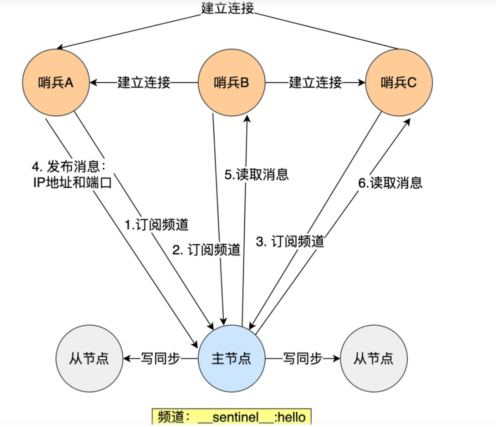

### 基础操作

~~~
6.发布:PUBLISH mychannel "hello"，订阅:SUBSCRIBE mychannel
5.密码认证： auth 密码， 登陆指定地址，port，密码， -h -p -a
4.bgsave生成rdb文件
3.修改key名: RENAMENX
2.redis-cli info memory查看内存信息
1.hash没办法针对某个filed做定时，都是针对key来定时，比如验证码可以加上相同的前缀
~~~

### 小tips

~~~shell
12.ttl返回-2表示不存在这个key，-1为永久key
11.发布订阅不会给这个key设置任何类型
10.集群中,scan和monitor只能拿到单节点信息，keys可以拿到整个集群的key
9.setnx一个key后，在它释放之前别的进程setnx就会失败，如果是set就会成功，就脱离使用初心了
8.不能对单用户使用永久key
7.memory usage key 求rediskey的大小 以字节为单位
6.redis单机能轻松破10wQPS，mysql单机很难破1wQPS
5.如果已经expire了key，不管对这个key增删改，expire的时间都正常流逝
4.redis的主要瓶颈在于网络io，所以多次查询的时候都用pipeline
3.线上一般用的unlink(异步)比用del多
2.info命令可以看到redis的一些信息，常用info keyspace看key数量
1.redis命令删除全部内容: flushdb
2. redis-cli FLUSHALL
3.删除相同前缀的key EVAL "local keys=redis.call('keys', ARGV[1]) for i=1,#keys do redis.call('del', keys[i]) end return keys" 0 "UDS_USER_*"
~~~

redis存储方式

~~~shell
redis用户视角，存储和取出的值始终是字符串形式，用object encoding看实际存储方式，用type看key的类型，
对于string类型，set jt 1和set jt '1'是等价的，如果值的长度小于等于 20 且内容可以被解析为整数，Redis 会内部优化为整数存储。
对于hash类型，hset jt field 1和hset jt field '1'是等价的，无论存储的是整数还是字符串，Redis 都会将其作为字符串来存储和处理，希类型的字段和值总是以字符串形式存储。
# 实际数据
字符串类型（string）：取出的值总是字符串形式。
哈希类型（hash）：字段和值总是以字符串形式存储和取出。
列表类型（list）：元素总是以字符串形式存储和取出。
集合类型（set）：元素总是以字符串形式存储和取出。
有序集合类型（zset）：元素总是以字符串形式存储和取出
# 计数方法会返回整数
INCR 和 DECR 命令返回的是整数。
LLEN、SCARD 等命令返回集合或列表的长度，也是整数。
~~~

**redis和memcached对比**

~~~shell
# 共同点
1. 都是基于内存的数据库，一般都用来当缓存
2. 都有过期策略
3. 两者的性能都非常高
# 区别
1. redis的数据类型更丰富， 而memcached支持最简单的key-value
2. redis支持持久化，memcache不支持
3. redis原生支持集群模式， memcache没有原生的集群模式，需要依靠客户端来实现往集群中分片写入数据
4. redis支持发布订阅、Lua脚本，事物等功能
~~~

**keys和scan**

~~~
keys是阻塞的，大规模数据不适合
scan是分批且异步的
scan 0 match "b_*" count 38 (0是开始游标，在扫描到的38个结果里筛选出b_*的结果集)

线上用scan 0 match TeamData_* 而不是 keys TeamData_*
scan基本不会返回所有结果，除非你后边加的COUNT足够大，SCAN 命令允许设置较大的 COUNT 参数，但它仍然会分批返回数据，而不是一次性返回所有匹配的键。
~~~

### 发布订阅

~~~go
发布之前先设置变化值
global.ConnRedis.Set(context.Background(), global.ServerMaintainStatus, statusStr, 0)
发布
global.ConnRedis.Publish(context.Background(), global.ServerMaintainChannel, 1)

订阅
db.SubScribe(global.ConnRedis, global.ServerMaintainChannel, OnChangeServerMaintainStatus)  这个OnChangeServerMaintainStatus是在收到消息后的回调处理
~~~

### 锁

~~~
1. 对某个函数加用户锁
~~~

set操作

~~~
# 增加
sadd myset "k1", "k2"
# 获取
smembers myset
# 检查是否存在
sismember myset "k1"
# 移除
srem myset "k1"
# 元素个数
scard myset
# 交集
sinter set1 set2
# 并集
sunion set1 set2
# 差集
sdiff set1 set2
# 将元素从一个集合移动到另一个集合
smove set1 set2 "k1"
# 随机移并返回一个元素
spop myset
# 获取一个或多个随机元素

~~~

list操作

~~~shell
1.使用rpush配合blpop实现消息消息队列， blpop如果list中没有消息就会一直阻塞
3.查看list类型数据: lrange key 0(起始下标) -1(结束下标), -1表示最后一个元素，如果起始下标是-1同样表示倒数第一个。
比如lrange key 0 0起始和结束都是0表示获取第一个元素
lrange key -2 -1 表示获取最后的两个元素
4.查看list类型的个数: llen key
5.lrem key count element
count：指定要移除的元素数量，有以下三种设置方法
正数：从列表头部开始向尾部搜索并移除指定数量的元素。
负数：从列表尾部开始向头部搜索并移除指定数量的元素。
零：移除列表中所有匹配的元素。
~~~

### hash操作

~~~shell
1. hgetall 获取所有字段
2. hlen获取长度
3. hset key field value
4. hincrby(strKey , 'version' , 1)  # 给某个字段增加值
~~~

### zset操作

~~~redis
1. 添加或更新member的score：使用ZADD命令来添加或更新一个或多个member及其对应的score。
ADD key score member [score member ...]
例如，要将member1的score设置为10，可以执行以下命令：
ZADD myzset 10 member1
如果member1已经存在于有序集合中，那么执行上述命令将更新member1的score为10。
2.增加member的score：使用ZINCRBY命令来增加一个member的score。
ZINCRBY key increment member
例如，要将member1的score增加5，可以执行以下命令：
ZINCRBY myzset 5 member1
如果member1不存在于有序集合中，那么执行上述命令将添加一个新的member1，并设置其score为5
3.获取member的score：使用ZSCORE命令来获取一个member的score。
ZSCORE key member
例如，要获取member1的score，可以执行以下命令：
ZSCORE myzset member1
如果member1不存在于有序集合中，那么该命令返回nil。
4.删除member：使用ZREM命令来删除一个或多个member。
ZREM key member [member ...]
例如，要删除member1，可以执行以下命令：
ZREM myzset member1
如果member1不存在于有序集合中，那么该命令不执行任何操作。
5.从高到低看分数
zrevrange BeastBoard 0 -1 withscores (0 -1分别表示开始和结束下标， -1表示所有，0 2 表示看123名)
6.查看指定玩家排名(下标从0开始，zrevrank是降序)
zrank BeastBoard 10000,
7.zcard 获取容量
~~~

### zset知识

~~~
ZSET 查询复杂度：在 Redis 的 ZSET 数据结构中，基础操作的时间复杂度通常为 O(log(N))，其中 N 是 ZSET 中元素的数量。例如，ZADD、ZREM、ZRANK、ZSCORE等操作的时间复杂度都是O(log(N))。如果想获取ZSET中所有的元素，比如ZRANGE key 0 -1，那么时间复杂度为O(N)。

使用通配符查询 key：在 Redis 中，可以使用 KEYS 命令配合通配符对 key 进行模糊查询，但是这个命令会遍历整个数据库的 key，时间复杂度是 O(N)，N 是数据库的 key 的数量
在你的场景中，如果你的 key 是 "uid_其他信息" 这样的格式，且 uid 是唯一的，在知道 uid 的情况下，你可以直接通过完整的 key 进行查询，这样查询的复杂度是 O(1)，而不需要使用 KEYS uid_* 这样的模糊查询。如果非要使用模糊查询，建议使用 SCAN 命令，虽然复杂度仍为 O(N)，但 SCAN 是游标型命令，会分多次返回结果，不会阻塞服务器。
~~~

宏观思维（比如redis中的set，它要求的是无序唯一， 所以底层使用了**hash**，整数数组这两种数据结构来实现， zset 要求有序唯一， 底层使用了**跳表**和压缩列表的数据结构来实现）

大项目中使用keys * 会造成其他任务阻塞，因为数据量太大了，而且redis是单线程的**串行**模式，需要不断占用CPU去读取数据。

redis中命令的处理是 **单线程** **串行**的，所以当一条连接中的一个事务开始执行时，也就不会发生中途穿插别的连接的命令了，天然的隔离性，  而**mysql中是并发**(当连接数小于核心数就是并行)

使用scan替换，就像mysql中的游标
scan 0 match * count 1

处于渐进式rehash阶段**不会**发生扩容缩容的情况

**使用游标 `SCAN` 读取数据时，可能发生扩容或者缩容的情况，数据一定不会遗漏掉，但扩容和缩容都可能会引起重复读取数据。**

redis内存分配器(jemalloc，内部是内存池)认为 <= 64字节  是小字符串， >64 是大字符串

跳表可以用来做分布式定时器。

为什么有些地方认为44是小字符串，有些认为是64， 其实是因为，64是包括了结构体(占用20字节)的部分， 而44是实际的字符串内容。

redis存储特性：
数据少的时候，为了节省空间， 采用压缩列表O(n);
数据多的时候，为了访问性能，采用其他更优结构(跳表，hash) ，做到O(1), O(logN)

维护窗口记录，比如游戏战绩(list)

~~~c
ltrim says 0 4
lrange says 0 -1
~~~

hash和 list配合实现购物车；

hash 和 string 存储字符串的区别

~~~c
hmset hash:10001 name mark age 18 sex male
# 与 string 比较
set hash:10001 '{["name"]:"mark",["sex"]:"male",["age"]:18}'
# 假设现在修改 mark的年龄为19岁
# hash：
hset hash:10001 age 19
# string:
get role:10001
# 将得到的字符串调用json解密，取出字段，修改 age 值
# 再调用json加密
set role:10001 '{["name"]:"mark",["sex"]:"male",["age"]:19}'
~~~

## 数据结构

string类型是二进制安全字符串， 如 char[20] = "hello\0", 它是以\0结束1的，而string类型是判断的长度，而不是以\0结束。类似std::string ，虽然redis是c语言写的，但是string却不是跟char一样。redis协议本身和**protobuf**中对字符串的编码都是通过在前边加上了长度。

~~~
存储结构：
字符串长度小于等于20， 且能转成整数，则使用int存储
字符串长度小于等于44，则使用embstr存储
字符串长度大于44，则使用raw存储。
set jt 666
通过 OBJECT encoding jt来看到编码方式
通过 type jt 看类型
~~~

set 是一个无序集合，用来存储唯一性字段

~~~ shell
存储结构：
元素都为整数且节点数量小于等于 512（set-max-intset-entries），则使用整数数组存储(排了序的数组)；
元素当中有一个不是整数或者节点数量大于 512，则使用字典存储；

应用场景， 求QQ好友间的交集(共同好友)。 			SINTER  
A ,B是好友， 给A 推荐B的好友(可能认识的人)		 SDIFF

# 增加元素
sadd key member
~~~

zset是一个有序集合, 	用来实现排行榜

~~~c
存储结构：
节点数量小于等于128(zset-max-ziplist-entries),且所有字符串长度小于等于64,则使用ziplist存储。
节点数量大于128或者有一个字符串长度大于64，则使用跳表(skiplist).
    
应用场景：排行榜，热榜

通过zset可以引申出很多功能：
1.延时队列：zset中包含key 和 member， 用member做消息命令， score 做到期时间，zset是有序(通过score排序)的，通过不断获取当前时间，来跟zset中的key对比，若超时了，就执行member这个消息。
2.分布式锁， 比如A,B,C,D同时去获取redis的锁，只有A获取到了，则B,C,D使用延时队列的方式，定时(随机一个时间)重新去获取锁，依靠延时队列来实现。也可也用redis中的发布订阅机制实现，
3.窗口限流：比如5分钟只让点击十次， 那么可以使用zrevrange获取最近的十次点击信息，如果第一次点击的时间与当前时间差小于5分钟则不让继续点
对于大量数据的情况，比如黑客攻击，就不能使用窗口限流，因为一个时间段内数据量可能很大， 需要使用漏斗限流
zrank，顺序查找某个 ； zrerank， 逆序
zrange，顺序排序范围 ; zrevrange 逆序 
做排行榜，先升到满级的人排第一，zset如果分数相同。默认按照字典序排序，比如先a 再 c 最后b ，顺序排序为 a,b,c 逆序为 c,b,a
那么这时可以用时间戳来辅助， 用一个很大的值 - 时间戳作为分数，排序规则就用它，需要等级的时候通过逆运算就算出等级即可。
zsocre key member得到分数， hash的实现能做到O(1), 发散LRU
~~~

压缩列表：

~~~
第一个位置存储了最后一个数据的位置， 最后一个数据(比如第四个)存储了第三个数据的位置，一次类推，
是从最后一个位置开始遍历的。

为什么数据量大了就不用压缩列表了， 因为它效率变低了， 应该采取更高效的结构来存储
~~~

list是一个双向链表

~~~
链表首尾操作(删除和增加) 时间复杂度O(1);查找中间元素时间复杂度为O(n)
列表中数据是否压缩的依据：
1.元素长度小于48， 不压缩
2.元素压缩前后长度不超过8， 不压缩
如果满足条件，可以理解为节点的具体实现是压缩列表
~~~

redis pipeline  是 客户端提供的，而不是服务端。

~~~
实现了发多个请求，再同时收多个回应在pipeline中顺序处理， 而不是发一个等一个。 
send操作并不耗时， 只是将数据写到了连接(fd)的写缓冲区上， 真正耗时的是等待对方回应的过程。
~~~

## Redis事务和MySQL事务对比

~~~sqlite
MySQL中的事务是每一条SQL语句都会立即执行的，而Redis中的事务在未提交之前是不会立即执行的。Redis的事务机制允许将多个命令放入一个队列中，当执行EXEC命令时才一起执行，确保了这些操作的原子性。

MySQL中的事务是每一条都执行了的， 可以通过rollback回滚（通过undolog做逆运算回滚。）
Redis中的事务在未提交前是没有执行的，只是将命令放到了一个队列中，通过DISCARD取消这些命令，相当于rollback，区别在于一个是执行(mysql),一个只是记录操作(redis),Redis事务是一个单独的隔离操作：事务中的所有命令都会序列化、按顺序地执行。
事务在执行的过程中，不会被其他客户端发送来的命令请求所打断。
    
Redis中， MULTI 开启事务， discard取消事务， EXEC 执行事务，watch检测key的变动(是乐观锁实现方式（cas）)，分布式锁是悲观锁实现

redis中多客户同时设置键值时，必须要借助WATCH 来监测key，WATCH不能在事务中用， 需要在事务开启之前用。 当执行EXEC时，若用WATCH检测的key变化了， 则相当于是执行的DISCARD。

可以通过事务来实现一些redis没有提供的原子操作命令(配合watch)
~~~

**事务实现ZPOP**

zpop可以用在延时队列中

第一条连接中

第二条连接中

**事务实现加倍操作**

## Lua脚本

在redis中是封装了一个lua虚拟机的， 但是是阉割版本的，如os库就被删了(不能调用sleep())， 在reids/deps/lua即可看到相应的库。

redis中lua脚本的执行是原子性的，当某个脚本正在执行的时候， 不会有其他命令或者脚本被执行。

eval 不需要生成散列值， 将script 先编译成sha1 再执行   ， 测试使用

EVALSHA 散列值 参数个数  第一个参数 第二个参数 ...		 线上使用

使用lua脚本做热更新

~~~
先script flush 清除缓存， 在应用程序中程序加载script load 生成sha1，再去重新执行新任务
~~~

**reids分布式锁**（setnx，redLock

核心是1.需要设置有效val 2.需要设置过期时间

~~~shell
1.设置的时候用uuid作为value: 因为释放锁的时候要看看value跟设置的时候是否一样，否则把别人的锁删了，删除有两个动作(1.判断是不是, 2.删除), 要用lua脚本保证原子性
2. 一定要设置过期时间: 设置时间太长太短都不好， 用续约的方式(最好是手动续约，自动续约可控性不好)，如果太短业务没执行完锁就释放了，如果太长，设置锁的实例中途挂了就没人释放锁，如果没设置过期时间就更离谱了，那永远都不会释放
3.singleflight优化: 并发非常高，并且热点集中的情况下，本地所有的goroutine自己先竞争，胜利者再去抢全局的分布式锁
4.集群中主从切换的时候， node1在主redis设置锁，此时主redis宕机， node2去从redis设置锁(此时从redis已提升至主redis)，node1业务执行完成去释放锁，此时如果不判断加锁时设置的value就会把node2加的锁删了。
5.单节点redis，setnx就够了，如果是集群redis很可能出现4的情况，就会出现锁不一致的情况，此时就有了redlock算法，redlock是在多个redis实例上设置setnx，协调多个实例来确保分布式的可靠性
~~~

## ACID特性分析

~~~shell
1.分析原子性和一致性时候要分单命令和事务来讨论。
2.数据库的隔离性通常都是针对事务来说的
~~~

**事务中**，如果有一条语句出错了， 后边的会**继续执行**。
**原子性**： 要么全部成功，要么全部失败
**一致性**： 若失败不影响数据库原始状态  ，  （对于一致性我们希望得到的是预期的一致性，而不是异常后的一致性， 比如说明明失败了，但对某个字段进行了修改，则不满足）

**从第一句话可以分析出在事务中这两种特性都不满足（单条命令是满足的）。**

**隔离性**：**事务的操作不被其他用户操作所打断**；redis的命令执行(单线程执行命令)是串行的，redis具备天然的隔离性。 

可能会有疑惑，明明影响了我刚开始看到的数据，为什么还具备隔离性呢， 仔细想想，mysql中查询语句是在一个事务**中**就能查出结果的，而redis中查数据的时候只有在事务开始前执行，如果是在事务中进行查询，它**只是被加入了待执行队列**，在提交的时候才会**真正**执行，所以这两者并不冲突，  所以自然的redis不存在mysql中的脏读幻读不可重复读问题。

面试问到**隔离性**需要分析两个问题。
若不想被别的连接影响期望结果，使用以下两种方式来实现

1.使用lua脚本实现完全隔离性(意思就是本来一般情况是先查看这个key的值，再进行事务，在这两步的过程中可能出现key被修改，如果把两个步骤合并到lua脚本来实现就不会出现被其他事务修改的可能)，  2. 通过watch来监测 key是否发生改变，若改变，则EXEC命令会被当作DISCARD命令取消事务。

特别注意： 使用watch 和 事务在运行中出错继续执行是不一样的， 若用了watch，当key变化，EXEC命令会被当作DISCARD命令取消事务，根本就没执行， 而事务中语句有错继续执行又是另外一回事。

**持久性：**redis只有在aof持久化策略的时候，并且需要在redis.conf中appendfsync=always**才**具备持久性；实际项目中几乎不会使用aof持久化策略。

 **redis事务和lua脚本的比较：**
相同点：两者都实现了隔离性，如果执行期间出现运行错误，之前的执行不会回滚。
不同点：redis事务是基于乐观锁(比如使用watch)， lua脚本是基于redis的单线程执行命令， lua脚本可以**自定义逻辑**(比如获取中间结果后，使用if判断执行什么逻辑)，
Redis 使用了事务队列来预先将执行命令存储起来，并且会对其进行格式检查的，提前就知道命令是否可执行了。
比如jt:10001是string类型的key，如果你执行hset  jt:10001 wh ，这是错误的，因为wh 后边应该还需要一个val值才是正确的语法。

但像对string类型数据执行hashmap类型的操作是检测不出来的
将上边的hset  jt:10001 wh 换为 hset  jt:10001 wh 666，则可以加入事务队列，但实际上这条语句逻辑是有问题的。可以执行exec，**这条语句无法成功执行，但并不影响事务中这条语句之后的命令继续执行。**

**所以Redis 事务真正支持原子性的前提：开发者不要傻不拉几的写有逻辑问题的代码！**

## redis发布订阅

没有做持久化 用的少。

应用场景 ： 打印内存情况分析bug
比如在客户端publish(发布信息到redis)， 服务器作为订阅者向redis订阅这个信息。

## redis中的多线程

~~~
单线程模型:
Redis 的核心数据操作（如 GET、SET 等）仍然是在单线程中执行的，避免了并发修改带来的复杂性。
多线程的引入:
在 Redis 6.0 版本中，引入了多线程机制，用于处理某些 I/O 密集型操作，如网络数据的读写、命令解析和回复发送。这些操作可以通过多线程来加速，从而提高整体吞吐量。
多线程主要用于减少网络 I/O 和命令解析的瓶颈，但实际的数据操作仍然在主线程中执行。
~~~

~~~c
int n = read(fd, buff, size);
msg = decode(buff, size); // redis io-threads
data = do_command(msg);
bin = encode(data, sz); // io-threads
send(fd, bin, sz1);
~~~

注意主线程只处理do_comman, 和 send ， 而其他线程去处理解压缩和压缩的逻辑(decode, encode), 所以还是不需要加锁， fd通过roundrobin算法分配给其他线程， 这些线程去处理对应fd  中的信息的压缩和解压逻辑。

## redis协议

一般协议的制定规则，为了 **界定数据包** 

1.长度 + 二进制流
2.二进制流 + 特殊分隔符  如http

redis中执行   set hello world

~~~c
*3\r\n$3\r\nset\r\n$5\r\n\hello\r\n$5\r\nworld\r\n
~~~

是二进制安全字符串， 即set hello wor\r\nld也不会错， 因为是以开头的长度界定的

~~~c
*3\r\n$3\r\nset\r\n$5\r\n\hello\r\n$5\r\nwor\r\nld\r\n
~~~

## redis异步连接池

其实就是设置回调函数， 跟reactor模型一样， epoll + 回调函数配合

**使用协程可以实现同步的编码方式，实现异步执行的效果。**

第四节课

## redis计数

比如想获取一个网页的访问人数(不重复)。

zset，set， hash 都有**去重**的功能 ，并且zset，set还能记录是哪个用户访问多少次，并且zset还能根据次数进行排序，但string类型只能计数，却不能去重(即同一个用户访问多次)， 如何去重呢， **配合布隆过滤器**使用，布隆过滤器(存在假阳性)可以判断一定没有的情况，但不可以保证一定有， 当判断到一定没有，则+1， 这样string类型也能实现去重的功能了.

当数据量太大，比如10亿数据，此时就算使用布隆过滤器，也需要大量内存才能够实现(10~100G)， 不够明智。**更好的办法**就是采用HyperLogLog(采用少量内存 实现去重计数，也有误差， 0.8125%)

**HyperLogLog：少量内存下统计一个集合中唯一元素数量的近似值**；
HLL 采用的是调和平均数（倒数的平均）。调和平均可以有效平滑离散值的影响；比如一个很大的数，倒数就是很小的数，减少大数的影响

**算法**：

当一个元素到来时，它会散列到任意一个桶(根据计算出的64位哈希值的后14位决定)中，以一定的概率影响这个桶的计数值，因为是概率算法，
单个桶的计数值并不准确，但是将所有的桶计数值进行调和均值累加起来，结果就会非常接近真实的计数值；

在 Redis 的HLL中 共有2的14次方(16384)个桶，而每个桶是一个 6bit 的数组；
hash 生成 64位整数，其中**后 14 位用来索引桶子**；后面 50位 共有2的50次方用来统计累计0的个数；保存对数的话最大值为 49(一共50位，第一位是1，其余全是0的数)；6位对应的是 对应整数值为 64 可以容纳存储 49；

如果你不懂为什么每个桶是6位， 因为它没有采用那种直接画64个桶的方式， 而是使用6位来表示可以有64个桶，也就是最大能表示2^64次方的数

**去重**：

相同元素通过hash函数会生成相同的 64 位整数，它会索引到相同的桶子中，累计0的个数也会相同，按照上面计算最长累计0的规则，它不会改变该桶子的最长累计0，最终计算出来的值是一样的，说明重复了。

**存储**：

redis 中的 hyperloglog 存储分为稀疏存储和紧凑存储；
当元素很少的时候，redis采用节约内存的策略，hyperloglog采用稀疏存储方案；当存储大小超过3000 的时候，hyperloglog 会从稀疏存储方案转换为紧凑存储方案；紧凑存储不会转换为稀疏存
储，因为hyperloglog数据只会增加不会减少（不存储具体元素，所以没法删除）；
配置： hll-sparse-max-bytes 3000 

哪些结构可以**做窗口**？
list：顺序插入，可以得到一段数据
zset：通过score排序， 进行数据筛选得到一段数据

## redis拓展

redismodule.h是所有接口的封装

src/modules 中  helloblock.c, hellocluster.c, hellotimer.c

hellotype.c必须看，讲的如何发送数据给server端

RedisModuleCtx 上下文
RedisModuleString 传递的参数数组

在redis.conf 中进行配置，即可调用这些文件，

比如我的redis是在/home/jt/中

需要在redis.conf中加上

loadmodule   /home/jt/redis/src/modules/hellotimer.so
若在它的后边再加参数， 会作为参数传到.so文件的主函数中

第五课

## redis持久化

redis的数据全部在内存中， 如果突然宕机， 数据就会全部丢失， 因此需要做持久化， redis宕机后能用这些持久化文件恢复数据。

在redis.conf中与持久化相关的字段

~~~shell
###### aof ######
# redis.cnf
appendonly no
appendfilename "appendonly.aof"
# appendfsync always
appendfsync everysec		#每秒一刷
# appendfsync no
# auto-aof-rewrite-percentage 为 0 则关闭 aof 复写
auto-aof-rewrite-percentage 100	#百分比的意思
这里有个细节， 比如现在redis的数据内容是4k， 若设置为100，则当redis数据到达8k时，发生aof复写，以此类推，当达到16k时再次aof复写(复写会fork进程)。

auto-aof-rewrite-min-size 64mb
这个64mb的设置就是为了防止在数据量很小时，但一翻倍(比如32bit 到 64bit)就发生aof复写，造成没必要的少量数据aof复写。

aof-load-truncated yes
# 如果yes 当 aof 数据不完整，尽量读取最多的格式正确的数据；
# 如果no  当 aof 数据不完整 报错，可以通过 redis-check-aof 来修复 aof 文件；

# 开启混合持久化
aof-use-rdb-preamble yes
###### rdb ######
# save ""
# save 3600 1
# save 300 100
# save 60 10000

~~~

### aof:

存储内容：比如set hello world
则存储的东西为`*3\r\n$3\r\nset\r\n$5\r\n\hello\r\n$5\r\nworld\r\n`

配置：

~~~shell
# 开启 aof
appendonly yes
# 关闭 aof复写
auto-aof-rewrite-percentage 0
# 关闭 混合持久化
aof-use-rdb-preamble no
# 关闭 rdb
save ""
~~~

策略

~~~shell
# 1. 每条命令刷盘 redis 事务才具备持久性
# appendfsync always
# 2. 每秒刷盘
appendfsync everysec
# 3. 交由系统刷盘
# appendfsync no

其中第一个方法性能消耗最大， 但也只有这样才能无误的做到redis持久化， 第三个方法误差可能最大。
~~~

缺点

时间越长，日志会越来越长， 若采用aof恢复数据，导致redis长时间无法对外提供服务。

### aof rewrite

aof 持久化策略会持久化所有修改命令；里面的很多命令其实可以合并或者删除；
比如lpush lists key1 , lpush lists key2 , lpush lists key3 会被合并成一条命令
比如add key 1 ，  del key 1  ，对于aof复写，这种操作直接就不记录进文件。

aof rewrite 在 aof 的基础上，满足一定策略则 fork 进程，根据当前内存状态，转换成一系列的 redis 命令，序列化成一个新的 aof 日志文件中，序列化完毕后再将操作期间发生的增量 aof 日志追加到新的 aof 日志文件中，追加完毕后替换旧的 aof 日志文件；以此达到对 aof 日志瘦身的目的；
注意：aof rewrite 开启的前提是开启 aof；

配置

~~~shell
set key val
# 开启 aof
appendonly yes
# 关闭 aof复写
auto-aof-rewrite-percentage 0
# 关闭 混合持久化
aof-use-rdb-preamble no
# 关闭 rdb
save ""
~~~

策略

~~~shell
# auto-aof-rewrite-percentage 为 0 则关闭 aof 复写

auto-aof-rewrite-percentage 100	#百分比的意思
这里有个细节， 比如现在redis的数据内容是64k， 若设置为100，则当redis数据到达128k时，发生aof复写，以此类推，当达到256k时再次aof复写。

auto-aof-rewrite-min-size 64mb
这个64mb的设置就是为了防止在数据量很小时，但一翻倍(比如32bit 到 64bit)就发生aof复写，造成没必要的少量数据aof复写(因为每一次复写都会fork进程)。
~~~

缺点

尽管在aof基础上瘦身了，但aof复写的数据量仍然很大，加载很慢。

### rdb

基于aof或aof复写文件大的缺点， 出现了rdb持久化，它是一种快照持久化；它通过fork主进程， 在子进程中将内存当中的数据键值对按照存储方式持久化到rdb文件中，rdb存储是经过**压缩的二进制**数据。

配置：

~~~shell
# 关闭 aof 同时也关闭了 aof复写
appendonly no
# 关闭 aof复写
auto-aof-rewrite-percentage 0
# 关闭 混合持久化
aof-use-rdb-preamble no
# 开启 rdb 也就是注释 save ""
# save ""
# save 3600 1
# save 300 100
# save 60 10000

如果需要关闭rdb，就把save "" 的注释打开，因为当注释掉它，默认就是打开了rdb模式，并且是最后这三行的策略
~~~

策略：

~~~shell
# redis 默认策略如下：
# 注意：写了多个 save 策略，只需要满足一个则开启rdb持久化
# 3600 秒内有以1次修改
save 3600 1
# 300 秒内有100次修改
save 300 100
# 60 秒内有10000次修改
save 60 10000
~~~

需要注意的问题是，假设现在有99数据，后边两个都不满足，所以会在一小时后才进行持久化， 如果这期间redis宕机，则数据丢失。

缺点：

若采用rdb持久化，则一旦redis宕机，redis将丢失一段时间的数据(fork进行rdb持久化的时间)。

RDB 需要经常 fork 子进程来保存数据集到硬盘上，当数据集比较大的时候，fork 的过程是非常耗时的，可能会导致 Redis 在一些毫秒级内不能响应客户端的请求。如果数据集巨大并且 CPU 性能不是很好的情况下，这种情况会持续1秒，AOF 也需要 fork，但是你可以调节重写日志文件的频率来提高数据集的耐久度。

### 混合持久化

rdb文件小且加载快但丢失多，aof文件大且加载慢但丢失少；

混合持久化是结合两者优点的一种持久化方案；aof复写的时候实际持久化的内容是rdb， 等持久化后，持久化期间修改的数据以aof的形式附加到文件的尾部。

这里可能有疑问，一个文件混了两种不同持久化方式的内容，怎么靠这个文件恢复数据呢？
其实在rdb内容前边会有标识符号，标识后边的内容是rdb，同样在aof内容的前边也会有标识符号，标识接下来是aof内容。

配置：

~~~shell
# 开启 aof
appendonly yes
# 开启 aof复写
auto-aof-rewrite-percentage 100
auto-aof-rewrite-min-size 64mb
# 开启 混合持久化
aof-use-rdb-preamble yes
# 关闭 rdb
save ""
# save 3600 1
# save 300 100
# save 60 10000
~~~

应用：

1.MySQL缓存方案中， redis不开启持久化， redis只存储热点数据，数据的依据来源于MySQL，若某些数据经常访问需要开启持久化，此时可以选择rdb持久化方案，也就是允许丢失一段时间的数据；

2.对数据可靠性要求高的， 在机器性能、内存也安全(fork写时复制 最差的情况可能内存翻倍，比如48G->96G，所以需要保证内存足够)的情况下，可以让redis同时开启aof和rdb，注意此时不是混合持久化，redis重启优先从aof加载数据， 理论上aof包含更多最新数据，如果只开启一种，那么就使用混合持久化。

3.在允许丢失的情况下， 亦可采用主redis不持久化(比如96G ，即可最大限度使用，比如能用90G内存存储数据)， 让从redis进行持久化；

4.伪装从数据库， 比如加载一个dll动态库文件，让这个程序冒充一个从数据库。但这个dll程序的实现并不需要fork子进程来持久化，就不用考虑内存翻倍的情况。

需要注意一点，因为fork最差情况会导致内存翻倍，所以在redis.conf中可以设置redis程序能占用内存的最大值。

**数据安全策略**

问：拷贝持久化文件是否安全？

是安全的， 持久化文件一旦被创建， 就不会进行任何修改，当服务器要创建一个新的持久化文件时，它先将文件的内容保存在一个临时文件里面，当临时文件写入完毕时，程序才使用rename(2)原子的用临时文件替换原来的持久化文件

数据安全要考虑两个问题：

1.节点宕机(redis是内存数据库，宕机数据会丢失)
2.磁盘故障

- 创建一个定期任务，每小时将一个RDB文件备份到一个文件夹， 并且每天将一个RDB文件备份到另一个文件夹中。
- 确保快照的备份都带有相应的日期和时间信息，每次执行定期任务脚本时，使用find命令来删除过期的快照；比如说，你可以保留最近48小时内的每小时快照，还可以保留最近一两个月的每日快照。
- 至少每天一次，将RDB备份到你的数据中心之外，或者至少是备份到你运行redis服务器的物理机器之外

持久化方案可以解决节点宕机问题， 但磁盘故障必须要在另一台物理机器上进行数据备份

## redis主从复制

~~~shell
三种模式: 全量复制、基于长连接的命令传播、增量复制(掉线重连的场景)
1. 主从第一次同步的时候就是采用全量复制，此时主服务器有两个耗时的地方，分别是生成rdb文件和传输rdb文件，为了避免过多的从服务器和主服务器进行全量复制，可以把一部分从服务器升级为[经理角色]，让它也有自己的从服务器，通过这样分摊主服务器的压力
2. 第一次同步完成后，主服务器会维护着一个长连接， 主服务器在接收到写操作命令时，就会通过这个链接将写命令传播给从服务器，来保证主从的数据一致性
3. 如果遇到从服务器掉线，增量复制就可以用来，但这个跟环形缓冲区大小有关(所以一般会设置的大一点，second * write_size_per_second，second表示从服务器掉线重新连接的平均耗时，write_size_per_second表示单秒主服务器产生的写命令数据量大小)，如果超过了，则还是得全量复制
~~~

以下主redis数据库用master表示, 从redis数据库用slave表示

因为是异步实现, 主从redis应**放在一个局域网**里,能减少网络问题带来的影响. 而且slave不一定是一个,

防止redis所在磁盘损坏,造成数据永久丢失,也有读写分离的作用

**全量数据同步**

slave第一次连接到master时,master会发送完整的rdb文件给slave(异步发送), slave**根据rdb文件**重做内存区.

**增量数据同步**

Master 采用了一个环形缓冲区来记录需要同步给slave的数据.
增量数据同步涉及两种情况, slave掉线重连,或者是正常的slave.

增量同步不依赖rdb或者aof,因此master是否开启rdb或aof都不影响

**为什么采用环形缓冲?**
1.如果从redis掉线时间**过长**就只能采用全量数据同步, 限制了可恢复数据的范围, 不能使用无限大的缓冲来进行数据同步
2.避免了数据拷贝(memcpy) 

会有两个**复制偏移量**(一个在主, 一个在从)记录这个环形缓冲 还有哪些内容是最新的,没有同步到slave的.  因为master是一直在更新这个环形缓冲区的,并且这个环形缓冲区的大小是固定的, 当slave重新连接上来发现自己的(slave)复制偏移量已经没有在这个环形缓冲区的范围内了, 则只能采用全量数据同步.

**怎样判断一个slave连接master的时候是掉线重连还是新的salve连接?**
服务器**RUN ID**, 无论是master还是salve都有自己的RUN ID, RUN ID启动时自动产生, RUN ID 由40个随机的十六进制字符组成;

当slave对master初次复制时,master将自身的RUN ID 传送给slave, slave会将RUN ID 保存, 当slave断线重连master时, slave会向master发送之前保存的RUN ID, 以此来判断是新的slave还是断线重连的slave.

- slave RUN ID  master RUN ID 一致,说明是slave掉线前复制的就是当前的master, master 会先尝试增量同步操作, 因为有可能刚掉线不久, 也行还能使用环形缓冲区进行增量同步,如果检测到slave的复制偏移量已经不在环形缓冲区的范围了,则采用全量同步
- 若不一致,则说明是新的slave, 则master对slave执行全量同步

**复制偏移量offset**

主从都会维护一个复制偏移量:

- 主库向从库发送N个字节的数据时,将自己的复制偏移量加上N
- 从库接收到主库发送的N个字节数据时,将自己的复制偏移量加上N

通过比较主从偏移量得知主从之间数据是否一致, 偏移量相同则数据一致, 偏移量不同则数据不一致.

**环形缓冲区(复制积压缓冲区)**

本质:固定长度的先进先出队列
当因某些原因(网络抖动或从库宕机) 从库与主库断开连接, 避免重新连接后开始全量同步, 在主库设置了一个环形缓冲区, 该缓冲区会在从库失联期间累计主库的写操作, 当从库重新连接,会发送自身的复制偏移量给主库,主库会比较主从的复制偏移量

- 若从库offset还在复制积压缓冲区中, 则进行增量同步
- 反之, 执行全量同步

~~~shell
#redis.conf
repl-backlog-size 1mb
#如果所有从库断开连接3600秒,则释放环形缓冲区
repl-backlog-ttl 3600
~~~

环形缓冲区的大小:disconnect_time * write_size_per_second
disconnect_time ：从库断线后重连主库所需的平均时间（以秒为单位）；
write_size_per_second ：主库平均每秒产生的写命令数据量；

像10000, 10001 这些就是复制偏移量, 是一个64位的数字,  永远用不完,能表示的范围太大了.

## redis哨兵模式

在这之前 都没有实现可用性，哨兵模式其实就是主从模式的一种升级，每个哨兵之间会建立连接，每个哨兵会和每个redis节点建立连接(**哨兵集群主要负责3件事：1.监控 2.选主 3.通知** )

什么是可用性: 看主redis宕机,多久才能恢复正常使用(看redis切换恢复正常的速度)
主从复制只是数据同步的一种方式,但不涉及宕机恢复问题(可用性)，引入哨兵就实现了可用性

哨兵配置信息: 不同哨兵节点感知对方是通过主redis节点配合发布订阅实现的，然后每个哨兵可以通过主redis来获取其他从redis的信息

~~~shell
#sentinel.cnf
#sentinel 只需指定检测主库就行了,通过主库自动发现从库,因为主库会有每个从库的信息.
#sentinel monitor <master-name> <ip> <redis-port> <quorum>
sentinel monitor mymaster 127.0.0.1 6379 2 
#这个2表示 比如配置了3个sentinel节点,当有2个(超半数)sentinel支持就可以执行相应处理,因为内部是用的raft算法
#判断主观下线时长
sentinel down-after-millise mymaster 30000
#指定在发生故障转时最多可以有多少个slave同时对新的master进行 同步, 这个数字越小同步时间越长, 而越大, 则对网络资源要求越高.
sentinel parallel-syncs mymaster 1
#指定故障切换允许的毫秒数, 超过这个时间,就任务故障切换失败, 默认为3分钟
sentinel failover-timeout mymaster 180000
~~~

每一个客户端会配置所有哨兵节点的信息, 采用取余的方式连接任意**一个**哨兵节点即可(若这个哨兵节点宕机了,要尝试去连接另外的哨兵节点，用于在主节点挂了的时候，需要通过哨兵的发布订阅得知新的主节点)。

**集群的构成（哨兵之间，哨兵与从节点之间）**

~~~
哨兵通过主节点配合发布订阅实现集群(相互之前建立连接)
1. 比如哨兵A把自己的ip:port发布到某个频道，哨兵B和哨兵C都订阅了这个频道，所以哨兵B和哨兵C就可以连接到哨兵A，与其他节点连接也是相同的方法
2. 第一步在哨兵之间构成集群，主节点知道所有从节点的信息，所以每个哨兵都可以通过主节点与每个从节点建立连接，完整的集群就构成了
~~~

**主观下线:**
sentinel会以每秒一次的频率向所有节点( 主节点, 以及从节点)发送ping消息, 然后通过接收返回判断该节点是否下线, 如果超过配置中的down-after-milliseconds则被判断为主观下线.

**客观下线(只有主节点才有这个概念)**
当一个sentinel节点将一个主节点判断为主观下线之后,为了确认这个主节点是否真的下线, 它会向其他sentinel节点进行询问, 如果收到一定数量的已下线回复, sentinel会将这个主节点判定为客观下线,并通过领头sentinel节点对主节点执行故障转移(因为是raft算法,分布式一致性算法, 所以需要领头的来决定).

**故障转移**

1. 选择新主节点

~~~shell
1.如果是网络不好的节点直接排除，比如down-after-millise超时次数超过10次的节点
2.接着是3轮筛选，1.优先级(可以理解为不同性能配置的机器上redis配置的优先级可能是不同的)、复制进度、ID号。 直到选择出新的主节点
~~~

2. 由哪个哨兵进行主从故障转移

~~~shell
1. 因为哨兵集群其实是raft一致性算法，所以由推选出来的leader来负责
2. 对比etcd的raft一致性算法是异曲同工的，都是一开始有一个过期时间，过期时间一到就成为候选者然后开始拉票(具体需要多少票取决于一开始的集群配置中的quorum字段，比如集群有三个哨兵，有两票的就可以成为leader)，票多者成为leader
~~~

**通知客户端新主节点**

~~~shell
1. 因为客户端是连接了哨兵的，可以通过哨兵的发布订阅得到新的主节点信息。
~~~

缺点:
redis采用异步复制的方式, 意味着当主节点挂掉时, 从节点可能没有收到全部的同步消息, 这部分未同步的信息将丢失, 如果主从延迟特别大, 那么丢失的可能会特别多, sentinel无法保证消息完全不丢失, 但是可以通过配置来尽量减少数据丢失.

~~~shell
#主库中必须有一个从节点在进行正常复制,否则主库就停止对外写服务, 此时丧失了可用性
min-slaves-to-write 1
#这个参数用来定义什么是正常复制, 该参数表示在10s内没有收到从库的反馈, 就意味着从库同步不正常
min-slaves-max-lag 10
~~~

**哨兵模式的致命缺点是不能进行横向拓展，它依赖于一个中心化的主节点来处理所有写操作。**
在Redis3.0以前的版本主要实现集群一般是借助哨兵sentinel工具来监控master节点的状态，如果master节点有异常，则会做主从切换，将某一台slave作为master，哨兵的配置略微复杂，并且性能和高可用方面表现一般，特别在主从切换的瞬间存在访问瞬断的问题，而且哨兵模式只有一个主节点对外提供服务，没法支持很高的并发量，且单个主节点的内存也不宜设置过大，否则会导致持久化文件过大，影响数据恢复或主从同步的效率，每个节点都是相同的数据,  并没有将数据均匀的分散出去.

**拓展:**

为什么哨兵节点至少要有3个

~~~shell
1. 如果只有两个，如果一个哨兵想要成为leader，必须获得两票而不是一票，所以如果有一个哨兵挂掉了，就无法成为leader，也就没办法进行主从节点的切换
2. 通常会配置3个哨兵能避免上边的问题， 但如果挂了两个，虽然小概率，但如果发生了，可以增加哨兵的个数
# case: redis是1主4从，5个哨兵
1. if quorum = 3, 如果有两个哨兵挂了，也还是可以判断主节点客观掉线的，因为还剩了3个哨兵，满足quorum设置的3，并且还可以拿到半数以上(5/2+1=3)的票，而且也达到了quorum的值，满足了raft选举leader的两个条件，所以哨兵集群可以完成主从切换
2. if quorum = 2, 并且有三个哨兵挂了，因为还剩两个达到了quorum的值，所以可以判断客观掉线， 但因为无法拿到半数以上的票，不满足raft选举leader的条件之一，无法切换
3. 所以quorum的值建议设置为哨兵个数的二分之一加1，例如3个就设置为2，5个就设置为3
~~~

## redis cluster 集群

零散知识点

~~~shell
4.所有写操作的必须发送到主节点，由主节点处理写请求并将数据同步到其他从节点，对于读操作默认发送主节点，但可以通过配置实现将读操作分发到从节点
3.请求重定向：客户端可以直接连接到任意节点，客户端会首先向该节点发送命令，如果该节点不是负责该键的节点，它会返回一个MOVED响应，指示客户端重新向负责该哈希槽的节点发送命令。（重定向的情况一般都是槽的映射关系变了）
2.高可用性：每个主节点都有一个或多个从节点，当主节点发送故障，从节点自动提升为主节点
1.数据分片：分片是指将数据会分布在多个节点上，每个节点只存储整个数据集的一部分数据，集群有16384个哈希槽，每个节点负责一部分哈希槽，当客户端发送一个命令时，Redis 集群根据键的哈希值确定该键所属的哈希槽，并将命令路由到负责该哈希槽的节点。
~~~

**常用命令**

~~~shell
# 查看分片信息
CLUSTER SLOTS
# 查看某个key的槽位
CLUSTER KEYSLOT mykey
# 查看集群节点信息
CLUSTER NODES
~~~

**槽数据迁移过程发生读写操作**

~~~shell
# 假设有两个节点A和D，节点A负责哈希槽0-1365，节点D是新加入的节点，正在接收哈希槽0-1365的数据。
客户端请求 get key1：
如果key1仍在节点 A，节点A会返回 6。
如果key1已经迁移到节点 D，节点A会返回 MOVED 响应，客户端重定向到节点D获取值6。
客户端请求 set key1 7：
如果key1仍在节点A，节点A会处理set请求，并在迁移过程中确保将更新同步到节点 D。
如果key1已经迁移到节点D，节点A会返回MOVED响应，客户端重定向到节点D进行写操作。
~~~

## 大 KEY

影响：

1.客户端阻塞， 比如请求大key的时候，服务器是单线程，响应回复较慢，表现为客户端阻塞。

2.网络阻塞：每次获取大key产生的网络流量比较大，比如每个key是1MB， 每秒访问量1000， 则每秒产生1000MB的流量

3：阻塞工作线程：如果使用del删除大key时，会阻塞工作线程，这样就没办法处理后续的命令

4：内存分布不均，集群模式在slot分片均匀情况下，会出现数据和查询倾斜情况，部分有大key的Redis节点占用内存多，则QPS(每秒查询量)也会比较大

### 对于AOF日志的影响：

redis有三种持久化AOF日志策略：

always，每次**写**操作命令都会先写AOF日志数据再调用fsync写回磁盘;(主线程写磁盘，影响主线程)
所以如果是对大Key进行操作，阻塞的时间比较久，因为写入的数据量很大就会很耗时

Everysec： 每秒，每次**写**操作命令执行完，先将命令写入AOF文件的内核缓冲区，然后每个一秒将缓冲区里的内容写到磁盘；(异步写磁盘，不影响主线程)

No：意味着不由Redis控制写回磁盘的时机，交由操作系统再合适的时机写入磁盘，但还是会先将命令先写到AOF文件的内核缓冲区中。(操作系统负责，不影响主线程)

### 大key 对AOF重写和RDB影响

当AOF日志写入很多大Key，那么就会很快触发AOF重写机制

AOF重写和RDB快照(bgsave命令)一样，都会通过fork()创建一个子进程来处理任务。

 尽管是写时拷贝机制，**内核会把父进程的页表复制一份给子进程**，但大key的页表较大，则会比较耗时，那么在fork函数的时候就会发生阻塞的现象。

如果在重写的过程中，父进程修改了大key，则会发生写时复制，会把物理内容复制一份，这个过程也比较耗时，可能发生阻塞.

额外提一下,如果linux开启了内存大页,也会影响redis性能,比如客户端只修改了100b数据,但redis需要拷贝2MB的大页, 如果是常规内存页机制,只用拷贝4kb, 大页的好处,**减少缺页异常处理**.(用户态到内核态的切换)

### 如何避免大Key

设计的是时候就把key拆成小key,定时检查redis是否存在大key ,如果该大key可以删除,不要使用DEL命令,因为该命令会阻塞主线程, 而是使用unlink删除大key,因为该命令的删除过程是异步的,不会阻塞主线程.

### 如何找到大key

1:加上--bigkeys

如:redis-cli --bigkeys

注意事项:
最好在从节点上执行该命令, 因为主节点上执行,会阻塞主节点
如果没有从节点, 那就在业务压力低的时候执行, 或者使用 -i 参数控制扫描间隔, 避免长时间扫描降低redis性能

不足之处:
这个方法只能返回每种类型最大的那个key(比如string 类型,返回最大的那个, 若是 list 或者set等 则返回的是这个key值包含的value个数) 个数多不一定就大,因为val可能很小.

2:使用SCAN命令查找大key

-- bigkey 原理也是SCAN命令
用SCAN对数据库扫描,用type获取返回的key类型
如果是string类型, 则直接用strlen获取长度
对于集合类型:如果能预先从业务层知道集合元素的平均大小,那么只有求出集合中的元素个数,相乘即可

求集合类型个数:
 List类型:HLEN命令, Hash类型:HLEN命令, Set类型: SCARD命令; Sorted Set类型: ZCARD

3:使用rdbTools工具查找大Key
原理就是分析RDB文件

## 缓存击穿，穿透，雪崩

穿透：**不针对同一个key**，mysql和redis都没有数据
解决方案 1.key-null, 2.布隆过滤器（拓展hbase中的使用）， 3.非法请求的现在(在API入口处，判断请求参数)

击穿：**同一个key**过期了，大量请求访问这个key
解决方案：1.加锁，2.设置热点数据永不过期

雪崩：1.相同时间key同时过期 2. redis故障宕机
解决方案：1.均匀设置key的时间，避免同时失效 2.缓存定时预先更新. 3.双key策略 4.加锁
若是因为故障宕机: 1.服务熔断， 2.限流机制 3. 构建redis缓存高可靠集群

拓展：如何在redis的前边做优化？ 在应用层建立缓冲区

## Redis过期策略

定期删除 + 惰性删除

1.定期删除

每隔一定时间，就随机抽取一些设置了过期时间的key， 检测这些key是否过期，如果过期则删除

2.惰性删除

惰性删除不是主动删除，如果上一步的定期删除没有删除到某些过期的key，那么当我们尝试获取某个key的时候，会先去检测一下这个key是否已经过期，如果过期了则删除，如果没有过期则返回结果给你。

### redis内存淘汰机制

如果定期删除和惰性删除都没有将某些key删掉，这些key就会一直在内存中，所以redis又引入了“内存淘汰机制”。

内存淘汰机制在redis内存占用过高的时候就会进行内存淘汰， 主要有两种常用的，lru和lfu

~~~
no-eviction 当内存不足，新写入操作报错，无法写入新数据，一般不采用
allkeys-lru :移除最近最久未使用的，这个是最常用的
volatile-lru: 在设置了过期时间的key中，移除最近最久未使用的
~~~

### 其他一些对过期key的处理

1.快照生成RDB文件时
过期的key不会被保存在RDB文件中

2.服务重启载入RDB文件时

master载入RDB时，文件中的未过期的键会被正常载入，过期键则会被忽略，Slave载入RDB时，文件中的所有键都会被载入，当主从同步时，再和Master保持一致

3.AOF重写时
过期的key不会被记录到AOF文件中

4.主从同步时
mater删除过期key之后，会向所有slave服务器发送一个del命令，slave收到通知后，会删除这些key；
slave在读取过期健时，**不会做判断删除操作(也就是不检查是否过期)**，而是继续返回该健对应的值，只有当master发送del通知，slave才会删除过期健， 这是统一、中心化的健删除策略，保证主从服务器的数据一致性。