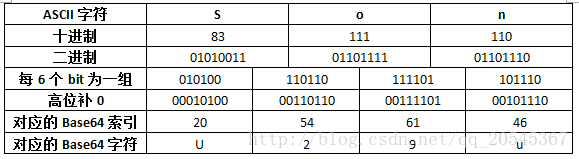
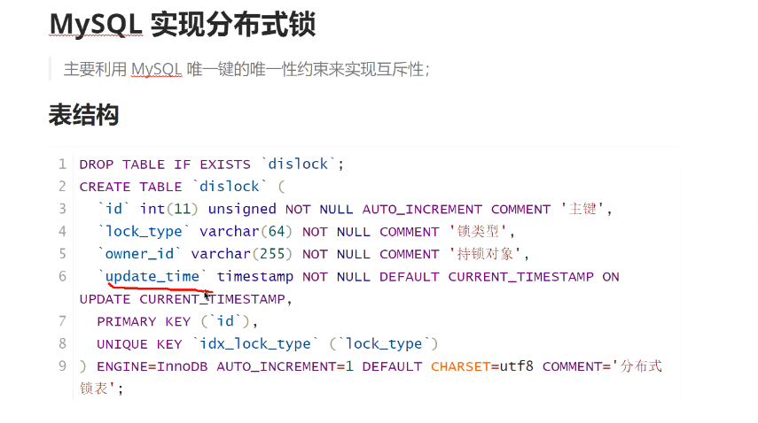
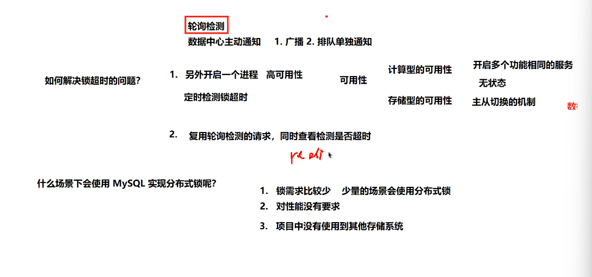
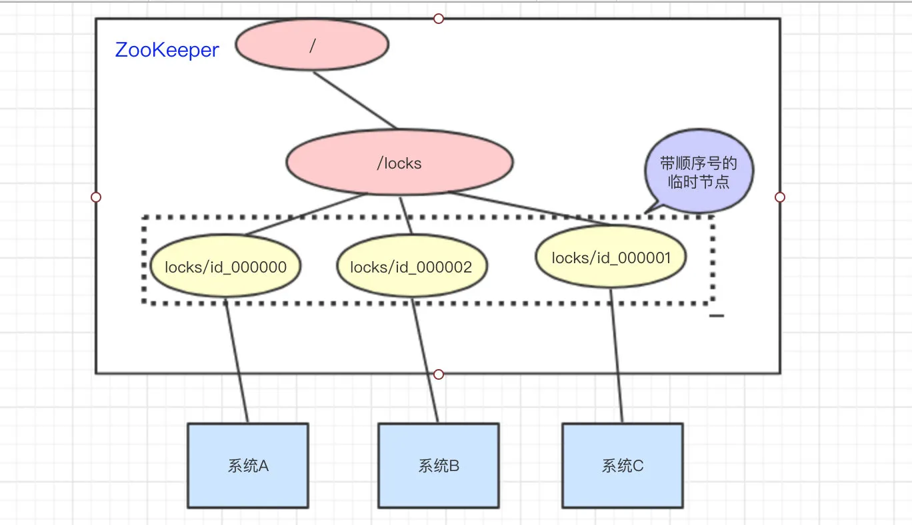
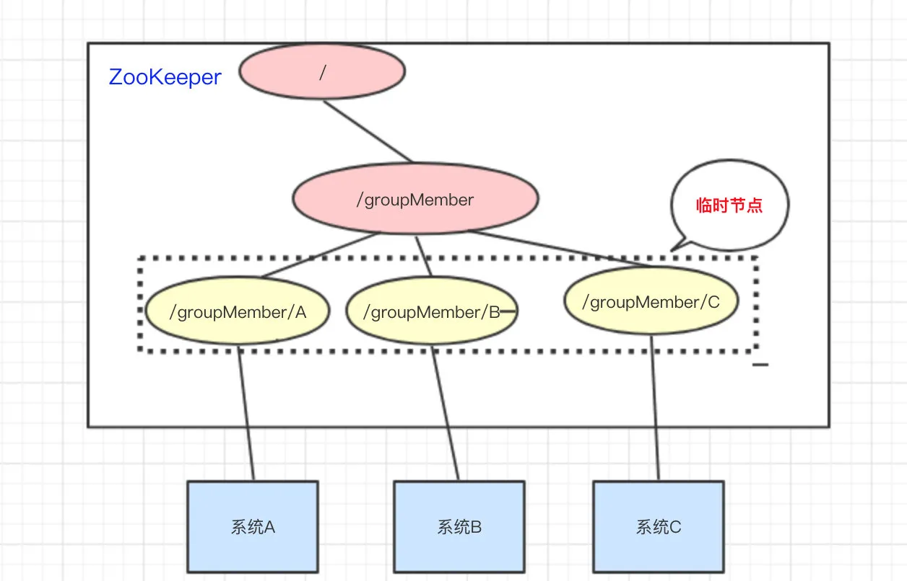

### uwsgi

~~~shell
# 重启服务
sudo systemctl restart uwsgi.service
# 后台运行
uwsgi --ini /etc/uwsgi.d/test.ini --daemonize /var/log/uwsgi/uwsgi.log
~~~

### libevent

~~~
核心函数:event_set(理解为epoll中初始化一个epoll_event对象)和event_add(理解为epoll中epoll_ctl添加一个事件)
定时器:底层用的是最小堆，核心函数evtimer_set(本质调用了event_set)，回调函数中再次调用event_add就可以实现重复触发的定时器。
统一事件源:用最近的定时器到期时间作为epoll_wait的最后一个参数
添加定时器：
~~~

### supervisorctl常用命令

~~~
# 比如新增/删除了一个ini文件，不重启已运行/停止的进程
supervisorctl update
# 查看服务状态
supervisorctl status
# 启动某个服务
supervisorctl start 
# 停止某个服务
supervisorctl stop
# 重启某个服务
supervisorctl restart process_name
# 重启某个服务组(多个进程)
supervisorctl restart process_name:（如VSJHandleTaskMonitor:，后边加:
# 重启所有服务不更新ini配置
supervisorctl restart all
# 重启所有服务并加载最新ini配置
supervisorctl reload
# 查看日志(-f表示实时)
sudo supervisorctl tail -f process_name （输出位置不能设置为/dev/null，并且print的时候必须加上flush=True，不然会受打印缓冲区影响，不会实时输出）
# reload是重启所有服务并且加载配置，而update又不会对原有的已运行/终止进程进行重启，可以用update配合reread针对某个进程进行重启并加载最新配置，如test.ini里面修改了参数，执行supervisorctl reread 再执行 supervisorctl update就可以对test.ini里面的进程进行重启并加载最新配置。
~~~

### UUID和雪花算法对比

~~~shell
一、雪花算法是一种分布式ID生成算法，可排序唯一ID，64位长度，它通过时间戳、数据中心ID、机器ID和序列号的组合来生成唯一ID，结构如下：
符号位：1位，始终为0（正数）。
时间戳：41位，表示毫秒级的时间戳。
数据中心ID：5位，标识数据中心。
机器ID：5位，用于标识同一数据中心内的机器。
序列号：12位，同一毫秒内生成的序列号，确保同一毫秒生成的ID是唯一的
极端情况下的重复可能性：
1.时间回拨：如果系统时钟出现回拨（即时间倒退），可能会导致在同一时间戳内生成相同的ID。通常的解决方案是在检测到时间回拨时，暂停ID生成或调整时间戳。
2.数据中心ID和机器ID冲突：如果两个不同的实例使用了相同的数据中心ID和机器ID，并且在同一毫秒内生成了相同的序列号，可能会导致ID冲突。解决方案是确保每个实例的数据中心ID和机器ID都是唯一的。
3.序列号溢出：在同一毫秒内，如果生成的ID数量超过序列号的最大值（通常是4096），可能会导致ID冲突。

二、UUID：适用于需要通用唯一标识符的场景，生成简单，冲突概率低，版本1可以排序，版本4无法排序，UUID的标准格式为128位（16字节），通常表示为32个十六进制数字，以8-4-4-4-12的形式分组，例如：
123e4567-e89b-12d3-a456-426614174000

版本1：基于时间和节点（通常是MAC地址，有暴露MAC地址的风险）
时间戳：60位，表示自1582年10月15日以来的100纳秒时间间隔。
时钟序列：14位，用于防止时钟倒退导致的冲突。
节点：48位，通常是设备的MAC地址。
版本4：基于随机数（c++的boost库使用的）
随机数：122位，由高质量的随机数生成器生成。
版本号：4位，固定为4，用于标识这是一个版本4的UUID。
变体：2或3位，用于标识UUID的变体（通常是Leach-Salz变体）。

发生冲突的概率:
版本1: UUID的冲突概率极低，除非多个设备使用相同的MAC地址，并且在同一时间生成UUID。
版本4: UUID的冲突概率主要依赖于随机数生成器的质量，UUID有122位随机数，理论上可以生成2^122个不同的UUID。
~~~

### nginx

~~~shell
6.禁止某个ip的访问，在http块中加上deny 103.85.175.18(多个ip就用多个deny)，也可以禁止一个CIDR块如deny 192.168.1.0/24; 被禁止的请求会在error.log中
5.配置中的路由匹配
~*表示不区分大小写，^/test表示必须/test开头的路由，/test/tt1也可以，/test$ 表示必须是/test结尾的路由，/tt1/test也可以。
location ~* ^/.+/login (/login前必须有一个或多个路径，比如/verify/login会走)
location ~* ^/(guest|)login (/login/v2会走，guestlogin/tt1会走，前缀匹配了就行)
location ~* /test (这种表示路径中只要包含了/test就行)
location ~* (/getorder|/call(back|)) (只要路径包含/getorder、/call、/callback就行，(back|)这里面的|不能去掉，如果去掉则/call就匹配不上了。)
4.停止nginx服务，sudo nginx -s stop，启动时用sudo nginx
3.添加一个server块，需要写在主配置的http块中，也可以写到/etc/nginx/conf.d/下，然后主配置的http块中引入这个副配置，这样8888的流量就会先转发给8.130.47.43
server {
    listen 8888;
    server_name 127.0.0.1; # 要不要都可以，看需求
    location / { # 默认路由一定要有，比如写个/service,那么/test会找不到路由。
        proxy_pass http://8.130.47.43:8882;
        proxy_set_header Host $host;
    }
}
2.主配置为/etc/nginx/nginx.conf，可以在/etc/nginx/conf.d/下添加.conf文件，然后在主配置的http/https块中引入，比如include /etc/nginx/conf.d/*.conf;
1.修改默认显示网页
/usr/share/nginx/html/index.html
2.调整work进程数量，在/etc/nginx/nginx.conf配置worker_processes  进程数量;
3.使用reuseport特性，在/etc/nginx/nginx.conf配置listen 80 reuseport(有多个特性用空格分开，443端口也一样);，能避免惊群(不开启的话是通过accept锁避免惊群的)，使用ss -ntl可以看到有多个监听80端口的队列
4.sudo nginx -s reload重新加载配置文件，能自动更新配置的内容
5.sudo nginx -t 可以测试配置文件是否正确
6.查看访问日志：/var/log/nginx/access.log(需要在nginx.conf中设置access_log  /var/log/nginx/access.log  main;)，错误日志：/var/log/nginx/error.log
7.nginx会根据请求的端口号匹配server块，再根据head中的Host头部信息(记录的就是请求的url中填写的域名或ip地址)匹配server_name(填localhost和127.0.0.1是不同的，请求的是啥就得填啥)，端口相同的情况下，如果没有匹配的server_name，会先在监听相同端口的server块中查找有default_server标志的server块(listen 9030 default_server, 该标志是针对端口的，不同端口可以有不同default_server)，如果没有则默认去第一个定义的server块。
如果server块中写了server_name，但跟请求的Host对应不上(不管有几个server块写了server_name，或者有的压根没写server_name，只要没有任意一个server块能对应上请求中的Host就算)，那么这次请求会先找是否有default_server的，没有则去第一个定义的server块。
拓展：可以多个不同域名，给他们绑定相同ip，访问多个不同的域名可以在同一个nginx上进行流量转发(就算用同一个端口也可以用域名来区分，但如果没有域名的话就得用不同端口)，比如升级和掼蛋，可以在同一个服务器上开发，只要流量去不同的server块就行
8.增加access.log的请求头的信息，在/etc/nginx/nginx.conf的http块中添加
 log_format custom '$remote_addr - $remote_user [$time_local] "$request" ' '$status $body_bytes_sent "$http_referer" ' '"$http_user_agent" "$http_x_custom_header" ' '"$http_accept" "$http_host" "$http_connection"';
access_log  /var/log/nginx/access.log  custom;
~~~

### protobuf

~~~c++
3.普通对象比如int32，如果不赋值即不调用set_方法是不会占用大小的，复合对象不调用add_方法也不会占用大小，但如果调用了mutable_方法，尽管不对该复合对象的成员赋值也会占用2个字节(1个表示标签，1个表示长度)，如果是repeated的复合对象，调用add_方法也是一样占用2个字节(1个表示标签，1个表示长度)，如果是repeated的int32对象，调用add_方法会有1字节标签和实际内容编码所需字节长度，但不会有单独的长度字段。
2. TVCardOption* entity = generatetv.add_cardoption();
  entity->set_seatid(100);
  generatetv.set_mainface(10086);
  cout << "size:" << generatetv.cardoption_size() << " byte: " << generatetv.ByteSize(); //size:1 byte:7
7的来源为：10086本身编码消耗2字节，还有1字节标签，此时3字节，由于entity是复合类型，不仅有一个字节标签，还有一个字节记录复合对象的长度(普通类型如int32没有这个)，此时5字节，entity中的seatid赋值为100，100本身编码消耗1字节，还有1字节标签，此时共7字节，如果不要entity->set_seatid(100);结果为//size:1 byte:5，就算entity是空的，即不给它的seatid赋值，entity同样会占用1字节标签和1字节长度记录。
    
1. 不支持双重map
2. enum类型不能作为map的key
3. pb2中字段一般写成optional，如果写成require则必须要给该字段赋值
4.比如发送一个整数10086(10011101100110)，int类型对象消耗4个字节就能表示它，proto编码方式消耗2个字节(不算标签)，json方式则被转为了字符串消耗5个字节。
~~~

**编码**

1. Protocol Buffers 在序列化字符串时不会对字符串本身进行额外的编码，而是直接存储其字节内容(utf-8形式)。
2. 标签（tag）编码是编码的一种规则，通过将字段编号左移3位并与类型进行按位或运算来生成。
    tag=(field number<<3)｜wire type
3. 类型（wire type）

  ：一个3位的值，表示字段的数据类型。常见的类型包括：

  - 0：Varint（整数）
  - 1：64-bit
  - 2：Length-delimited（字符串、字节数组、嵌套消息）
  - 5：32-bit

~~~python
字段1（id）：
字段编号：1
类型：Varint（0）
标签：1 << 3 | 0 = 8（十六进制 0x08）
值：300（Varint 编码为 0xac 0x02）

字段2（name）：
字段编号：2
类型：Length-delimited（2）
标签：2 << 3 | 2 = 18（十六进制 0x12）
长度：5（Varint 编码为 0x05）
值："Alice"（字节内容 A l i c e）

msg = pb.MyMessage()
msg.id = 300
msg.name = 'Alice' 
str = msg.SerializeToString() # b'\x08\xac\x02\x12\x05Alice'
print(' '.join(f'{b:02x}' for b in str)) # 08 ac 02 12 05 41 6c 69 63 65
~~~

## base64

~~~python
1.Base64编码是将二进制数据转换为ASCII 字符串的过程，在 Python 中，b64encode和b64decode操作的都是字节对象，返回的结果也都是字节对象。
~~~

“Base64是网络上最常见的用于传输8Bit字节码的编码方式之一，Base64就是一种基于64个可打印字符来表示二进制数据的方法”。

        什么是“可打印字符”呢？为什么要用它来传输8Bit字节码呢？在回答这两个问题之前我们有必要来思考一下什么情况下需要使用到Base64？Base64一般用于在HTTP协议下传输二进制数据，由于HTTP协议是文本协议，所以在HTTP协议下传输二进制数据需要将二进制数据转换为字符数据。然而直接转换是不行的。因为网络传输只能传输可打印字符。什么是可打印字符？在ASCII码中规定，0~31、127这33个字符属于控制字符，32~126这95个字符属于可打印字符，也就是说网络传输只能传输这95个字符，不在这个范围内的字符无法传输。那么该怎么才能传输其他字符呢？其中一种方式就是使用Base64。
也就是说，如果将索引转换为对应的二进制数据的话需要至多6个Bit。然而ASCII码需要8个Bit来表示，那么怎么使用6个Bit来表示8个Bit的数据呢？6个Bit当然不能存储8个Bit的数据，但是4个6Bit可以存储3个8Bit的数据




## log4系列日志库

~~~
这个4(four)读for，log4j(java)是最早出现的,c++相关的日志库借鉴了log4j的思想，有log4cpp、log4cxx、log4cplus.
log4cplus 在这三个库中最受欢迎，特别是在现代 C++ 项目中。log4cxx 次之，主要在需要与 Log4j 高度兼容的场景中使用，而 log4cpp 的受欢迎程度相对较低。
~~~

关键结构， append和yaml 什么的， 有一个true或false的选择， 如果选择true把基类的方式也打印出来。 

**如何提高性能；**
减小锁粒度， 双缓冲，双队列
减少系统调用，比如fileappend那里，每次通过lseek来获取文件大小， 影响性能，可以用一个变量， 每次累加获取文件大小。

**程序崩溃如何做恢复**， coredump

## json

采用一种树的方式管理数据。

数组的形式

~~~json
简单
{
"name":"网站",
"num":3,
"sites":[ "Google", "Runoob", "Taobao" ]
}

复杂
myObj = {
    "name":"网站",
    "num":3,
    "sites": [
        { "name":"Google", "info":[ "Android", "Google 搜索", "Google 翻译" ] },
        { "name":"Runoob", "info":[ "菜鸟教程", "菜鸟工具", "菜鸟微信" ] },
        { "name":"Taobao", "info":[ "淘宝", "网购" ] }
    ]
}
~~~

 

java 处理json的细节

~~~
不管.toString(), .getString() , 还是.optString() 得到的都是没有最外层双引号的串


又一次醒悟
比如有一串数据是 {"test":123}
那么 
String str;
将这串数据放到str就是
str = "{\"test\":123}"
当我们要将这串数据转化为json格式时
JSONObject obj = new JSONOject(str)
这里需要注意本质上数据就是 {"test":123}
那么obj.toString() 也就是{"test":123}
比如现在obj.put("key", obj.toString())
那么其实上就是把{"test":123}转化为字符串的形式存储到"key"里面
所以obj就变成了
{
	"test":123
	"key":"{\"test\":123}"
}
当要去除key时
JSONObject obj2 = new JSONOject(obj.getString("key"))
仔细分析这句话，obj.getString("key") 得到的是
"{\"test\":123}"
那么自然的obj2.toString就是将"{\"test\":123}"去掉最外层引号的模样， 即{"test":123}


再次总结， 问题本质出现在
1.json将一个普通的string类型值转化为json对象，并不会有什么额外的问题
比如 String str2 = "{\"val\":123}";
 JSONObject obj2 = new JSONObject(str2);
 此时json的格式为
 {
 	"val":123
 }
 json.toString() 也是
 {
 	"val":123
 }

 2.json对象put一个字符串的时候，会为这个字符串的内容二次加上转义字符
比如上边的str2，它的原内容其实是{"val":123}, 
它会变成 "{\"val\":123}" 是以为加了外层", 
当使用obj2.put("key", str2) 时， 会主动加上一层转义字符来充当字符串本身的结果，也就是说，现在的结果变成了
{
	"val":123,
	"key": "{\"val\":123}"
}

 这也就是问题的本质， 如果使用obj2.toString()，得到的结果依然是
{
	"val":123,
	"key": "{\"val\":123}"
}
3. 将json对象取出来的时候， 会减去字符串本身的一层转义字符
比如
JSONObject obj = new JSONObject(obj2.getString("key"))
此时obj.toString()的结果是
 {
 	"val":123
 }
 我们可以发现，是在字符串本身上，减去了一层转义字符
 若将上边的
 {
	"val":123,
	"key": "{\"val\":123}"
}
变化为
{
	"val":123,
	"key": {"val":123}
}

此时 JSONObject obj3 = new JSONObject(obj2.getString("key")) 就会报错，因为"key"对应的是 {"val":123} ，并不是"{\"val\":123}"，  也就是说它并不是一个字符串，所以这种情况必须使用
 JSONObject obj3 = new JSONObject(obj2.optString("key"))
使用optString的本质意义是将{"val":123} 转化为"{\"val\":123}"， 那么这个时候同样是去掉一层转义字符
此时得到的obj3.toString()同样是
{
 	"val":123
}


我发现问题的本质了， 问题就出在json对象put一个string值的时候，会自动给你加上转义字符， 并且这个转义字符被计算成了string串本身的内容，并不会在打印出来的时候消失。
并且将json对象某一个字段的val值取出来的时候，也是真正的减去了字符串本身的那份转义字符(如果不是字符串，就必须用optString方法，这种方法会把像 {"jt":666} 转化为 "{\"jt\":666}", 然后在减去这个toString产生的转义字符，最后得到 {"jt":666}， 而如果直接就是"{\"jt\":666}"， 此时可以用getString方法，或者optString都可以, 因为已经是字符串类型了，optString不会像刚才那样又再加一层， 这里就直接去掉一层转义字符，注意这层转义字符是字符串本身的，并不是系统加的， 最后得到{"jt":666})，而不是系统自己添加的那份转义字符

普通将一个字符串转化为obj对象其实不会改变啥


以下只是帮助理解的
 
一定要记住一句话
obj.toString() 的值和json当前的值一模一样，不用考虑引号的问题

意思也就是说你使用obj.toString()出来的值， 就是json格式的串

比如JSONObject obj;
当前obj的内容为
{
 "ext":"{\"jt\":666}"
} 
你直接toString()出来， 也是这种形式
如果说当前有一个obj2
{
	"key":"123"
}
情况一：
比如执行obj2.put("val", obj.toString) 因为put一个toString方法的字符串，json会自动加上转义字符
那么此时obj2就变成了
{
	"key":"123"
	"val":"{\"ext\":\"{\\\"jt\\\":666}\"}"
}

情况二：
但如过执行的是obj2.put("val", obj)，直接put一个json对象就不会
{
	"key":"123"
	"val":{"ext":"{\"jt\":666}"}
}


当你想要取出val的时候，对于情况一直接使用
JSONObject tt = new JSONObject(obj2.getString()) 即可
此时得到的tt是
{
	{"ext":"{\"jt\":666}"}   //自动为你去除了一层转义字符
}


对于情况二
不能使用obj2.getString() 因为我刚才说了，json内容和.toString()得到的内容是一样的，不用考虑转义的问题
对于情况二
{
	"key":"123"
	"val":
}
仔细看这里的{"ext":"{\"jt\":666}"} 并没有引号包裹，所以不能使用toString()， 这里必须使用
JSONObject tt = new JSONObject(obj2.optString("val"));
optString会先把{"ext":"{\"jt\":666}"} 转化成字符串的形式
"{\"ext\":\"{\\\"jt\\\":666}\"}" ， 因为取出字符串的时候json会自动去除一层转义字符，然后就变成了{"ext":"{\"jt\":666}"} ， 这就是我们需要的格式。
情况一也可以使用optString()， 对于情况一，因为已经有了双引号包着，已经是字符串的形式了，那么取出来的时候，json同样也是自动去除一层转义字符，也就是{"ext":"{\"jt\":666}"}


场景模拟， 比如当前我接收到了一份数据 {"ext":"{\"jt\":666}"} 
String str ;
用str来承载这份数据， 因为数据里面包含引号，自然会加上转义字符，那么此时str就是
str = "{\"ext\":\"{\\\"jt\\\":666}\"}"
这里使用System.out.Println(str)得到的结果是
{"ext":"{\"jt\":666}"} 

此时我们用一个JSONObject 对象来转换它
JSONObject obj = new JSONObject(str);
已经说了很多次了， 当转化为json对象的时候，会自动去掉一层转义字符
此时obj就是{"ext":"{\"jt\":666}"} 
使用obj.toString 打印出来， 得到的结果也是{"ext":"{\"jt\":666}"} 

问题来了， 如果此时我们有一个新的对象obj2
使用obj2.put("val", obj.toString)  ，上边说过它会给toString类型自动加上一层转义字符
那么此时obj2变成了
{
 	"val":"{\"ext\":\"{\\\"jt\\\":666}\"}"
}
使用obj2.toString()打印出来同样也是
{
 	"val":"{\"ext\":\"{\\\"jt\\\":666}\"}"
}


核心就是JSONObject对象put一个字符串进去会自动为你加上转义字符，若是直接put的json对象则不会加转义字符。
取出来的时候，会自动把转义字符给你去掉(前提是有转义字符，并且只会去掉一层)
有两种方式取出来
getString 如果键值对应的value是{"jt":666},而不是"{\"jt\":666}"，则会报错
optString 如果键值对应的value是{"jt":666}，它会自动把它转化为"{\"jt\":666}"的格式, 再取出来， 取出来会把转义字符去掉，也就变成了{"jt":666},这就是我们需要的


JSONObject obj;
obj.put("a", "{"test":"1"}");
这个put，它会自动把{"test":"1"}转变为{\"test\":\"1\"}

如果在外层又把obj.toString()作为value给put进去了，那么就会有问题，
比如现在这种情况obj.toString() 为 {"a":"{\"test\":\"1\"}"}, 如果把它作为value再次put到另外一个对象中去， 就会多加上一层转义字符，所以这时候需要对 {"a":"{\"test\":\"1\"}"} 进行处理, 把"{转化为{, 把\"转化为"。
所以如果再次put进另外一个对象时， 要么就以json本来的格式，要么就以obj.toString()的方式(需要特殊处理。)


当你要取出来的时候,
JSONObject obj2 = new JSONObject(obj.getString("a"));
obj2会自动把先前put进去的转义字符 \ 处理掉,也就是说，它会把
{\"test\":\"1\"} 转化为 {"test":"1"} 这就是正常的json格式

举例
{
"a":{"test":"1"}
}
这里用getString 和 optString的区别， 如果用getString, 但因为{"test":"1"}并没有转义字符，所以会被解析为"{"test":"1"}", 很明显这是错误的写法。 但如果用的是optString, 它会自动把{"test":"1"}转化为 
"{\"test\":\"1\"}" , 这样就是正确的格式

如果原串是
{
"a":"{\"test\":\"1\"}"
}
那么直接getString就行了， 如果使用optString也没有问题
~~~

raft算法细节：

~~~c
分为3个角色，  Candidate(候选人)， follow(选民)， leader(被选中的人)
    
只选举出一个leader

选举超时 计时开始情况
1.服务器启动的时候每个节点都会随机一个选举超时
2.当成为候选者时，会重新随机一个选举超时

每个人手里只有一个选票，收到其他的拉票并且自己没有投过票，就会投给第一个来拉票的候选人


什么时候，选举超时时间会重置？
刚开机时，
当收到别的candidate的拉票时，
当收到leader的心跳包时，
当选举时间超时成为candidate时，选举时间重置
(注意选举时间是随机的，一般在150ms ~ 300ms之间)
    
    
选举超时后，需要重置自身选票

如果有两个节点的的选举超时是一样的，并且出现平票的情况，
上边已经说了，当选举超时时间到了之后会重置选举超时时间，等待下一次重选就好了，注意下一次就不一定会选到谁了， 相当于此时所有的节点都在等待选举超时时间，当谁先选举时间超时，就去拉票， 可能会有疑惑已经没票了，注意看上边说的，选举超时后，重置自身选票。


选举成功后， 就是日志复制了。
当收到客户端的数据时，leader先记录到wal（Write ahead log）日志中，leader会告诉其他节点，询问是否认可，当leader收到超过一半同意时， leader会将数据写到磁盘，并且告诉所有节点这个数据，其余各节点也将该数据记录日志后，刷到磁盘， 实现同步


脑裂出现情况： 网络出现分段， 可能出现多个leader， 当有客户端发送数据来的时候， 需要发送给当前网络分段的所有其他节点， 比如一共有5个节点， 但由于网络分段， 导致当前网络段只有两个节点， 另外一个网络段有3个节点， 此时每个网络段各有一个leader， 如果此时有两个节点的leader收到客户端的数据， 它会询问另一个普通节点(这个网段只有两个节点， 一个leader 一个 普通)， 但此时就算这个普通节点同意， 加上leader自己的一票，  只有两票， 没有超过半数， 所以此次客户端的提交不会通过， 但如果是 3个节点的网络段收到数据， 一共能有3票支持，超过半数， 就会认可客户端的这个数据。
当网络恢复时，此时有两个leader， 但因为3个节点的那个网段的leader接受成功过客户端的数据， 所以它的rivision 会比两个节点中的leader的rivision大， 所以这个3个节点中的leader重新成为 这个五个节点中的leader。
~~~

**ectd 和 consul**

~~~
Consul和Etcd都是分布式的键值存储系统，用于服务发现、配置管理和分布式一致性等场景。它们有一些相似之处，但也有一些区别：

一致性算法：Etcd使用Raft一致性算法来保证数据的一致性。而Consul使用了自研的一致性算法，称为Raft的变种，也能够保证数据的一致性。
功能特性：Consul提供了服务发现、健康检查、负载均衡、分布式一致性锁、事件和分布式配置等丰富的功能。Etcd更专注于分布式键值存储和一致性，提供了简单的API，可以用作服务注册和配置存储。
整体架构：Consul使用基于Gossip协议的去中心化架构，每个节点都知道集群的整体状态。Etcd使用基于一组预选Lease的中心式架构。
支持语言：Etcd在不同编程语言中都有良好的客户端支持，如Go、Java和Python等。Consul也提供了多种语言的客户端，例如Go、Java、Python、Ruby和Node.js等。
社区支持和生态系统：Etcd由CoreOS维护，而Consul由HashiCorp维护。Consul有一个活跃的社区，提供了丰富的文档和教程，同时也有一些配套工具和库。Etcd也有一定的社区支持，但其生态系统相对较小。
选择使用Consul还是Etcd，取决于具体的需求和场景。如果需要更丰富的功能和灵活性，以及更好的服务发现和健康检查能力，Consul可能是一个更好的选择。如果只需要简单的分布式键值存储和一致性，Etcd可能更加适合。另外，也可以考虑团队熟悉度、架构偏好以及项目所在生态系统的因素。
~~~

redis和etcd的区别

~~~
Redis和etcd都是常用的分布式键值存储系统，但它们有一些区别：

数据结构：Redis是一个内存数据库，它将数据存储在内存中并通过持久化机制将数据写入磁盘。因此，Redis适用于对性能要求较高的数据存储和缓存场景。而etcd是一个分布式一致性KV存储系统，它将数据存储在磁盘上，用于在分布式系统中存储元数据、配置信息等。

CAP理论：Redis属于AP（可用性和分区容忍性）模型，强调系统的可用性和分区容忍能力。etcd则遵循CP（一致性和分区容忍性）模型，强调系统的一致性和分区容忍性。

强一致性：etcd是一个基于Raft算法实现的一致性存储系统，提供强一致性保证。在分布式系统中，etcd可以用于确保数据的一致性和正确性。Redis在主从复制模式下提供数据冗余和故障恢复，但在单节点写入时不提供强一致性。

功能特性：Redis支持更丰富的数据结构和功能，例如字符串、哈希表、列表、集合、有序集合等，还提供丰富的命令来支持数据操作。etcd主要用于分布式锁、服务注册与发现、配置管理等场景。

适用场景：Redis适用于需要高性能的数据缓存和应用，例如缓存、会话存储、消息队列等场景。etcd适用于分布式系统中的配置管理、服务注册、分布式锁等场景。

总的来说，Redis适用于需要高性能实时访问的场景，而etcd适用于需要分布式一致性存储和元数据管理的场景。不同的应用场景和需求会影响选择使用Redis还是etcd。
~~~


## ZeroMQ

c++写的，也有Java版本了

如何提高消息队列的效率： 1.批量发送(而不是一应一答)，2.增加车道(多配置几个主机)

内部已经解决了tcp粘包半包的问题

不是一个独立的服务，是一个嵌入式库 需要嵌套到应用程序中去。应用程序是通过加载库文件，调用API函数来实现高性能网络通信

不提供持久化服务， 如果宕机，数据就会丢失

 ## 加密工具

md5的全称是md5信息摘要算法（英文：MD5 Message-Digest Algorithm ），一种被广泛使用的密码散列函数，可以产生一个128位（16字节，1字节8位）的散列值（常见的是用32位的16进制表示，比如：0caa3b23b8da53f9e4e041d95dc8fa2c），用于确保信息传输的完整一致。

md5 跟对称和非对称加密算法不一样， 这两种加密算法是防止信息被窃取， 而摘要算法的目标是用于证明原文的完整性

md5的用途

    密码的加密存储，用户设置密码时，服务端只记录这个密码的MD5，而不记录密码本身，以后验证用户身份时，只需要将用户输入的密码再次做一下MD5后，与记录的MD5作一个比较即可验证其密码的合法性。
    数字签名，比如发布一个程序，为了防止别人在你的程序里插入病毒或木马，你可以在发布这个程序的同时，公开这个程序文件的MD5码，这样别人只需要在任何地方下载这个程序后做一次MD5，然后跟公开的这个MD5作一个比较就知道这个程序是否被第三方修改过。
    文件完整性验证，比如当下载一个文件时，服务器返回的信息中包括这个文件的md5，在本地下载完毕时进行md5，将两个md5值进行比较，如果一致则说明文件完整没有丢包现象。
    文件上传，比如百度云实现的秒传，就是对比你上传的文件md5在百度服务器是否已经存在了。

## 分布式锁

redis， mysql，etcd， zookeeper	

与普通锁比起来，难点就是要处理网络，因为实例在不同机器上

需要实现：

1.互斥， 2 .锁超时性 3. 锁是一种资源， 需要具备可用性（CAP）， 4.容错性

只要满足高可用和强一致就能满足上诉的3 和 4

C ： 一致性(强一致性) ，和数据库中的一致性不是一个概念
A ：可用性
P：分区容错性

可用性分为：

计算型的可用性：开启多个功能相同的服务（无状态）

存储型的可用性：主从切换的机制


mysql中的分布式锁实现：




~~~mysql

select * from lock_t where uuid = xxx
lock in share mode //S锁
for update 		  // X锁
~~~

insert into ， update， set， 自动加X锁

1.S锁和X锁互斥实现 (X,X也行)




## kafka

kafka是一个分布式，分区，多副本的提交日志服务。

kafka优势

```
1.吞吐量高， 性能好，
2.伸缩性好，支持在线水平拓展
3.容错性(比如同一份消息会存储三份，并且持久化到硬盘上)和可靠性(一主多从高可用架构)
4.与大数据生态紧密结合，可无缝对接hadoop，storm, spark, fink。 因为kafka在处理TB级别数据时不会出现明显的性能问题
```


kafka中有主题(可以理解为数据库中的表，通常将同一类型的消息存到同一个主题中，mysql中表的设计是完全结构化的，但kafka中是半结构化的，所以某些情况也可以将不同类型的消息存放到同一个主题中)，以及分区(使kafka具备了拓展性，分区是一个线性增长的不可变的日志，kafka会为每条消息分配一个偏移量offset， kafka通过这个偏移量来对消息进行提取，但没法对内容进行检索)的概念，一个主题有多个分区， 因为是分布式的， 所以这些同一个主题的分区可以分布在不同机器上。

虽然消息中可以携带 key 和 value，但并不是严格意义上的key-value存储系统， 如果具有相同key的消息， 会把这些信息放到同一个分区中，如果是空key，则轮询放入各个分区中，。

kafka保证了数据的可靠性，kafka通过replication-factor 这个参数来设置分区的副本数量

刚才说到了分区副本(副本不是放在同一台机器上的)，比如replication-factor=3(在这三个中选出一个当主本)，对数据的读写都在主本中(被成为leader)， 另外两个副本(follower)负责同步主本，kafka会在原数据中维护一个集合ISR，表示当前正常同步的副本，如果没有正常同步或者落后太多，则从ISR中移除，当追赶上来的时候再加进去，

kafka中有一个broker的概念， 被成为消息代理，比如对数据的读写请求就是由broker去处理的，一般就是一台机器上一个broker，以下图第一幅图为例，broker只负责处理p1分区的读写请求，不会直接处理p0和p2的读写请求，而只负责从p0和p2的主本(leader)中同步数据过来。 


**搭建伪分布式集群**

[环境搭建-使用docker部署kafka_哔哩哔哩_bilibili](https://www.bilibili.com/video/BV1h94y1Q7Xg?p=7&spm_id_from=pageDriver&vd_source=6575af2bb3053be3df86d366bf9da1b6)

[官网下载kafka_2.11-1.0.0.tgz](https://kafka.apache.org/downloads)
tar -zxvf kafka_2.11-1.0.0.tgz
cd 进入kafka_2.11-1.0.0里面

1.mkdir etc

2.cp config/zookeeper.properties etc  //它是zookeeper的配置文件

3.cp config/server.properties etc //它是用来配置kafka的配置文件， 由于我们需要3个broker实例，所以需要拷贝三份， 把这个命令修改为

~~~
cp config/server.properties etc/server_0.properties

cp config/server.properties etc/server_1.properties

cp config/server.properties etc/server_2.properties
~~~

4.进入这三个配置文件，分别把broker.id的值更改为0,1,2.  把listeners=PLAINTEXT://:9092中的 9092分别改为9092,9093,9094, 再把log.dirs=/tmp/kafka-logs中的logs分别改为logs-0, logs-1, logs-2

5.更改好之后去bin目录启动zookeeper， 执行
./zookeeper-server-start.sh ../etc/zookeeper.properties

~~~
启动zookeeper过程报错问题
如果java版本不支持
出现类似Kafka 无法识别的 VM 选项“PrintGCDateStamps”的报错

在bin/kafka-run-class.sh中把

JAVA_MAJOR_VERSION=$($JAVA -version 2>&1 | sed -E -n 's/.* version "([^.-]*).*"/\1/p')


换成

JAVA_MAJOR_VERSION=$($JAVA -version 2>&1 | sed -E -n 's/.* version "([^.-]*).*/\1/p')

区别就是少了一个"
~~~


6.接着启动三个kafka的实例
./kafka-server-start.sh ../etc/server-0.properties 
./kafka-server-start.sh ../etc/server-1.properties 
./kafka-server-start.sh ../etc/server-2.properties 

这三个配置文件中都有相同的配置
zookeeper.connect=localhost:2181

7.接下来是创建kafka的主题
./kafka-topics.sh --zookeeper localhost:2181 --create --topic test --partitions 3 --replication-factor 2

可以发现创建主题并不需要broker-list的地址（创建主题只需要与kafka集群中任一broker连接，该broker会在集群中的**适当broker**同步主题连接，这里说适当是因为主题不一定会在所有broker上，取决你的分区数量，至于分配在哪些节点上，kafka有自己的策略，不过也可以调整配置自定义）

~~~
解释一下以上字段，
--zookeeper是必须的，因为zookeeper是在本地，所以写的是localhost，2181表示zookeeper监听的端口号 
--create表示要创建主题了，可以把它改为--describe表示查看主题的分区情况
--topic 表示要创建的主题名
--partitions 表示分区数量
--replication-factor 表示每个分区有多少份(主本+副本)
~~~

8.创建好了之后查看一下刚才创建的主题情况

~~~
./kafka-topics.sh --zookeeper localhost:2181 --describe --topic test

介绍一下主要字段：
partition表示分区号，
leader 表示主本在哪个服务器(broker)上
replicas 表示partition表示的这个分区在哪些服务器(broker)上
Isr 表示当前正常同步的服务器(broker)有哪些
~~~

9.kafka利用控制台模拟消费者消费数据

~~~
./kafka-console-consumer.sh --bootstrap-server localhost:9092, localhost:9093, localhost:9094 --topic test

此时已经在等待消费数据了，所以需要一个生产者
// 紧接着可以加个 --group表示消费组
~~~

10.kafka利用控制台模拟生产者生产数据

~~~
./kafka-console-producer.sh --broker-list localhost:9092, localhost:9093, localhost:9094 --topic test  // 紧接着可以加个 --group表示消费组

在当前终端输入东西， 消费者那里就能接受到消息了。
~~~

**监听器 listeners 和 advertised.listeners以及内外网问题**

~~~
listeners: 指定broker启动时的本机监听端口，给服务端使用

advertised.listeners 对外发布的访问IP和端口，注册到zookeeper中，给客户端使用

流程是这样的，kafka把advertised.listeners注册到zookeeper中， 客户端从zookeeper得到这个地址， 从而能够访问到kafka，advertised.listeners配置的地址如果是同一个网段的情况下，则可以直接访问，不过不在同一个网段，则必须设置成公网地址才能访问

所以在实际的配置中需要给listeners配置一个外网的情况和一个内网的情况
所以在broker(server.properties)配置如下
listeners=INTERNAL:http://:9092,EXTERNAL:http://0.0.0.0:9093

advertised.listeners=INTERNAL:http://主机名(或者内网ip):9092,EXTERNAL:http://公网IP:9093

listeners.security.protocol.map=INTERNAL:PLAINTEXT,EXTERNAL:PLAINTEXT

//下边这行表示内部broker之间通信走的是内网，因为kafka集群一般都在同一个机房中
inter.broker.listener.name=INTERNAL

~~~

**消息模型**

~~~
分区是最小的并行单位
一个消费者可以消费多个分区
一个分区可以被多个消费组里的消费者消费
但是，一个分区不能同时被同一个消费组里的多个消费者消费
~~~


1.发布订阅模型

~~~
每个消费者都属于不同的消费组， 所以每个分区的每一个消息会被每一个消费者消费一次
~~~

2.点对点模型（一对一)

~~~
将所有消费者都放到同一个消费组里面
~~~

**数据发送和消费问题**

对于消费问题，在文档下载项目中，如果中途中断断开了与主机的连接就会停止，有些图片下载到hbase了，但偏移量还没有提交成功，所以再次运行程序的时候存在重复消费的可能，所以每次下载之前都会通过table和key(get 'table', 'key') 去hbase中拿到json串，解析查看是否已经存在数据，如果有就不下载这次数据了。

```
最多一次
对于生产者，如果发送给broker的过程失败了，但没有重传机制，则最多发送一次

对于消费者， consumer先提交消费位置，再消费数据

最少一次	能保证数据不丢失但不能保证数据不重复
对于生产者，如果broker收到了，但回复消息给生产者的过程，这个回应丢失了， 生产者会再次发送

对于消费者， consumer先消费数据，再提交消费后的偏移量

精确一次(至少一次+幂等性)
对于生产者：
enable.idempotence=true	//开启幂等性,实际上就是把消费者消费时的去重机制提前到这里了，但消费者依然存在重复消费的可能(这里至少保证了源数据没有重复的，依然可能出现消费了数据但偏移量未提交)，所以其实生产者这里就算出现重复数据也能接受，只要在消费者那里做去重就可以了
retries=Integer.MAX_VALUE
Acts=all //0表示只通知broker生产了消息，不管成功与否，1表示broker中的leader收到了，但还未将数据同步给follower, all表示leader收到并且已经同步给follower(保证ISR中即可)

对于消费者
只通过offset来防止重复消费不是一个好的办法
通常配合offset在消息中加入唯一ID（例如流水ID, 订单ID），在处理业务时，通过判断ID是否已经存在来防止重复处理(比如下载图片前查看hbase是否已存在)
```

幂等性原理：开启幂等性的producer在初始化的时候会被分配一个PID， 发往同一Partition的消息会附带Sequence Number，而broker端会对<PID, Partition, SeqNumber>做缓存，当具有相同主键的消息提交时，Broker只会持久化一条

**消息顺序问题**

~~~
比如同一个生产者，生产了两条消息，但这个两个消息一个在partation0， 一个在partation1，kafka没办法保证顺序消费

解决办法：
1.只设置一个分区，这样就可以保证所有消息的顺序， 但是失去了拓展性和性能
2.设置相同的key，相同的key会发送到同一个分区， 同一个分区能够保证消费的顺序。
~~~

**事务**

~~~
lsolation_level  隔离级别
默认为: read_uncommitted 脏读
read_committed 读取成功提交的数据， 不会脏读
~~~

ISR集合特点

~~~
不满足以下两点则被剔除
•	replica.lag.time.max.ms=10000     副本分区与主分区心跳时间延迟
•	replica.lag.max.messages=4000    副本分区与主分区消息同步最大差
~~~

小细节

~~~
1.broker数 >= 分区数量。
2.一个消费组的消费者数量 = 分区数量  (不然有消费者没有数据消费，浪费资源)
~~~


## zookeeper

总结：zookeeper主要就是通过znode的节点类型 + 监听机制 来实现很多实用的功能。

因为kafka用到了zookeper，简单介绍一下，可以用它来做统一配置管理、统一命名服务、分布式锁、集群管理。
zookeper的节点成为znode

znode有两种类型: 短暂(当客户端和服务端断开连接后，所创建的znode会自动删除)， 持久(连接断开后也不会删除。) ， 它们有一个共同特点，可以把节点的名字弄成顺序的(与做分布式锁有关)

zookeeper和redis一样都是C/S架构(分客户端和服务端)

理解了zookeeper的**结构**之后，还需要知道zookeeper需要配合**监听器**才能做这么多事，常见的监听场景有一下两种： 1.监听znode节点的数据变化 2.监听子节点的增减变化。

一、用zookeeper做统一配置管理

```
比如把我的IM做集群，每个机器上都有相同的配置文件，如果需要修改，那么就需要在每个机器上都进行修改， 所以可以把这些公共的配置文件放到zookeeper进行管理，同时会落地数据库， 同时会对应用开启配置实时监听，如果zookeeper配置文件一旦被修改，应用就可以实时监听到并获取。
```

二、用zookeeper做统一命名服务，理解上和域名一样，我们给一部分资源(多个ip地址)起一个名字，把这个名字挂到znode节点上 

三、用zookeeper做分布式锁



```
举个例子：

系统A拿到/locks节点下的所有子节点，经过比较，发现自己(id_000000)，是所有子节点最小的。所以得到锁
系统B拿到/locks节点下的所有子节点，经过比较，发现自己(id_000002)，不是所有子节点最小的。所以监听比自己小1的节点id_000001的状态
系统C拿到/locks节点下的所有子节点，经过比较，发现自己(id_000001)，不是所有子节点最小的。所以监听比自己小1的节点id_000000的状态
```

四、用zookeeper来管理集群



在zookeeper中创建一个groupMember节点，同时创建3个子节点表示三台不同机器上的服务，如果谁挂了，另外两台就可以感知到。

zookeeper可以实现动态选举master的功能，对于主从的选择， 可以把代表不同机器的znode节点弄成带顺序号的临时节点，zookeeper每次选举最小编号的znode对应的机器作为master，如果master挂了，对应的znode就会删除，然后让新的最小编号的znode对应的机器做master。

## Hbase(强一致性)

hbase也是key-value数据库，key是由RowKey(行键) + ColumnFamily(列族) + Column Qualifier(列修饰符) + TimeStamp(时间戳,判断版本) + KeyType(类型) 组成， 而Value 就是 实际上的值。

跟mysql的区别，mysql是行存储，hbase是列存储，mysql底层的文件系统就是我们一般的普通文件系统(ext2,ext3)来进行数据存储， 而hbase的底层文件系统用到是HDFS，也就是分布式文件系统，但并不是说hbase必须用HDFS，用普通文件系统也是可以的，只是HDFS适合

从列的角度看， hbase有列族的概念(每个列族由多个列组成，列就是字段，比如name, age), 有一个特殊的列Row_Key(类似于mysql中的主键)

从行的角度看， 可以把一张表水平分为多个部分， 每个部分就是一个Region， 每个Region中的每个列族都是一个store, 我们实际存储就是以store为单位存储的，这也就是为什么我们说hbase是**列式存储**的(更准确的应该是按列族存储)

每个store**以行为单位进行列式存储**，并且hbase是不存储空值的，这也就是为什么我们说hbase是列式存储的，以及为什么hbase不像mysql中那样，无法应对字段变更的场景，hbase能够轻松应对，列存储的每行信息有很多通用的字段，比如KEY(Row Key，列族，列限定符，时间戳，操作类型)以及具体的值(VALUE), 所以它是一个**key-value模型**

| Row Key  | Column Family | Column Qualifier | TimeStamp | Tpe  | value |
| -------- | ------------- | ---------------- | --------- | ---- | ----- |
| row_key1 | personal_info | name             | t1        | put  | jt    |


hbase中的Name Space类似于关系型数据库中的database概念，hbase中的table类似关系型数据库中的表概念，不同的是，hbase定义表的时候只需要声明列组即可，不需要声明具体的列(name, age), 比如 声明一个列族info, 而name，age这些字段就相当于属于这个列族。 hbase中的每个列都由列族(info)和列限定符(name，age),进行限定，例如info : name, info : age ，建表时，只需要指明列族，而列限定符无需预先定义

**hbase对数据的更改**
hbase底层是hdfs，而hdfs不支持修改，实际操作是对数据新增了一行，但是时间戳变了，读的时候就读取时间戳最新的那条数据

hmaster 是hbase集群中的主服务器， 负责监控集群中的所有regionserver， 并且是所有元数据更改的接口，集群中可以启动多个hmaster，但zk选举机制只能保证同时只有一个hmaster处于活动状态，其他hmaster处于热备份状态

hmaster主要负责表和region的管理工作

~~~
1.处理元数据的变更(这个是什么意思呢，元数据也就是meta表，会记录它的改变，不管是它的内容还是位置的变化都会记录，我认为它会保持和zk交流，向zk更新meta表的位置信息)，读写请求都不会经过它，而是直接通过在meta表中获取到具体的regionserver后直接与regionserver通信。
2.管理regionserver的负载均衡，调整region的分布
3.region的分配和移除
4.处理regionserver的故障转移，在RegionServer死亡后，负责对regionServer上的region进行迁移
~~~

当hmaster节点发生故障时，由于客户端是直接与regionserver交互,并且元数据表的位置也是通过zk得到的，所以整个集群依然会正常工作，但hmaster故障时，region的切片和regionserver的故障转义等问题就没法即使处理了，还是需要尽快恢复，zk提供了多hmaster机制，提高了hbase的可用性和稳健性

**hmaster是如何感知regionserver故障的？**
每个regionserver都会注册到zk上，regionserver会不断跟zk发送心跳，当超时后，zk会删除整个regionserver的节点，hmaster监听了这个事件，于是就可以开始进行容错工作了

**元数据表存放哪些信息？**
rowkey : 有四个字段拼接起来，分别是 表名-StratRow-TimeStamp-EncodedName。
数据分为4列
info: regioninfo:EncodedName、RegionName、Region的StartRow、Region的StopRow
info: seqnumDuringOpen: 存储Region打开时的sequenceId
info: server : 存储region落在哪个regionserver上
info: serverstartcode: 存储所在的regionserver启动时间戳

元数据表只有一个列族， 即info ，并且，hbase保证meta表始终**只有一个region**(具体存放在哪个HRegionServer只有zk才知道，所以需要先去访问zk，然后缓存一份到客户端为下次访问加快速度)，这是为了保证meta多次操作的原子性(对表操作的时候会加分布式锁的，这个分布式锁是通过zookeeper实现的)， 客户端一般会把meta表的region信息缓存到hbase客户端， hbase客户端有一个叫metacache的缓存，在调用API时，客户端会先去metacache中找到业务rowkey所在的region

**zookeeper作用：**

~~~
负责hbase多hmaster的选举
实时监控regionserver的存活
记录hbase所需的元数据信息表的所在位置(即记录它在哪个regionserver上)
~~~

**写数据流程：**

写数据就是把数据写到某一个regionserver'的某一个region里的某一个store上， 所以先需要找到这个store， 先去zk找到meta元数据表在哪个regionserver上，然后去这个regionserver上根据数据的rowkey（主键）从元数据表meta中找到这份数据需要写到哪个regionserver的store上，客户端得到该去哪个regionserver写这份数据后，先缓存一下这个meta表的位置信息以及刚才得到的该表(通过刚才meta上对比rowkey可以得到表的信息)的region信息，方便下次访问， 才会真正执行put命令给目标regionserver， 目标regionserver收到后第一时间先写wal日志，再写到MemStore上，进一步写到StoreFile上

**读数据流程：**

跟写数据流程很像，client先访问zk，根据读请求的namespace:table/rowkey(主键) 获取hbase:meta表位于哪个region server上，并且将该table的region信息以及meta表的位置信息缓存在客户端的meta cache，方便下次访问， 分别在MemStore和Store File(HFile)中查询目标数据(在这之前先去Block Cache看看有没有)，并将查到的所有数据进行合并，此处所有数据指的是同一条数据的不同版本（timestamp）或者不同的类型（put，delete)， 将查询到的新的数据块缓存到Block Cache ，然后将合并后的最终结果返回给客户端

**hbase查询快的原因**
1.meta元数据表提供索引
2.rowkey是按字典序排好可以二分的方式查找索引

**hbase数据查询方式**

1.全局扫描。 2. 根据一个rowkey进行查询， 3.根据rowkey范围查询

首先我们需要知道rowkey是安字典序排列的，我们必须要保证RowKey是唯一的，毕竟它是行键， 有了它我们才可以唯一标识一条数据

**2：根据一个rowkey进行查询**：
先通过meta找到对应的regionserver, regionserver上有多个region， 每个region都有一个start-key 和一个 end-key, 通过比对我们rowkey是否在这个范围即可，如果在，那么就是这个region了。

根据rowkey范围查询，以上那种是针对rowkey单个查询的业务


这个时候会存在一个问题，虽然我们在索引的时候可以采用二分的方式加快索引，但由于rowkey是按字典序排序的，如果没有对rowkey做任何处理， 那就有可能存在**热点数据的问题**

~~~
aaa
bbb
c++11
c++12
c++13
c++15
~~~

c++开头的rowkey很多，那么hbase是以多行切分为一个region，那么很多与C++相关的数据就会集中在一个region上，这可能导致某部分数据会集中在某台regionserver上存储以及查询，而其他的regionserver却很闲

解决方式就是让rowkey散列就好了，那么分配到region的时候就会比较均匀，少了热点的问题，可以采用加盐值或者hash的方式来生成key。

**3.根据rowkey范围查询：**

上边那一种说到我们不希望压力全部集中到一个region上，但有时候我们又希望一批相似的rowkey都在一个regionserver上，这样就可以一次拿到全部我们想要的数据了。举例：比如我们会间隔几秒就采集直播间的热度，将这份数据写到HBase中，然后业务方经常要把一段时间内的热度查询出来， 设计好了rowkey之后，将该主播的一段时间内的热点数据都写到同一个region上，拉去的时候只用访问一个regionserver就可以得到我想要的数据，这样查询速度就快了很多，而如果像上一种一样，就可能需要去多个regionserver中找，因为它们在不同的region上

### 布隆过滤器加快查询速度

通过meta元数据表得到regionserver后, 一个regionserver有很多个region, 对于region我们可以通过region的start-key 和 end-key 快速找到对应的region, 但每次memstore达到一定容量flush就会持久化为一个hfile, 那么同一条数据的不同版本（timestamp）或者不同的类型（put，delete) 可能出现在不同的hfile上，但只有时间戳最新的那一条才是我们需要的记录,最坏的情况需要查找所有的hfile才能找到,所以这时候就可以采用加索引,或者布隆过滤器的方式,排除掉一些hfile

### 为什么说hbase的写速度很快， 但读速度偏慢

因为hbase是顺序写, 即每次需要对数据增删改的时候都是直接增加一条新数据,只需要把type类型(put,delete,update)更改一下, 以及更新一下时间戳即可, 避免了去找原来的数据再进行更改, 找的过程就比较花时间了, 那为什么读偏慢?, 因为每次memstore达到一定容量flush就会持久化为一个hfile, 那么可能在不同的hfile中出现相同的rowkey, 但只有时间戳最新的那一条才是我们需要的记录,最坏的情况需要查找所有的hfile才能找到, (使用索引或者布隆过滤器进行优化,  比如使用布隆过滤器, 一个hfile有多**种**不同的rowkey,如果我们需要查找的rowkey字段不在其中,就直接不去这个hfile里面查找了) 

### 既然不管增删改一直都是增加记录, 那什么时候对这些数据进行整理

**StoreFile（HFile) 数据合并**

每个store里面都有一个memstore

由于每次刷memstore都会生成一个新的HFile， 所以一个字段的不同版本和不同类型可能分布在不同的HFile中，因此查询时需要遍历所有的HFile，为了减少HFile的个数，以及清理掉过期和删除的数据，会进行StoreFile 合并操作， 合并有两种方式，分别是Minor Compaction 和 Major Compaction ，前者会将临近的若干个较小的HFile合并成一个较大的HFile，并清理掉部分过期和删除的数据， 而后者是将一个Store下所有的HFile合并成一个大HFile，清理所有过期和删除的数据

### region分裂

上边提到当store越来越多就会进行合并， 那么自然的数据也会越来越大，当达到阈值，就把这个region一分为2

## HDFS

查看

~~~
hadoop fs -ls 
~~~

创建目录

~~~
hadoop fs -mkdir -p /user/hadoop/cmd

-p 表示递归
~~~

上传本地文件到hadoop

~~~
hadoop fs -copyFromLocal word.txt /user/hadoop/cmd

如果上传一样的文件到相同的路径需要加 -f 表示覆盖
把-copyFromLocal换成 -put 也可以上传
~~~

查看文件内容

~~~
hadoop fs -cat /user/hadoop/cmd/word.txt
~~~

不指定上传某个文件到hadoop，而是直接用输入流的方式

~~~
hadoop fs -put - /user/hadoop/cmd/put.txt

接下来自己随意输入内容，以ctrl + d 结束输入， 此时hadoop上就会有一个put.txt文件，里面就是我们刚才输入的东西。
~~~

把hadoop上的文件下载到本地

~~~
hadoop fs -get /user/hadoop/cmd/put.txt
~~~

hadoop创建文件

~~~
hadoop fs -touchz /user/hadoop/cmd/flag.txt
~~~

hadoop移动文件

~~~
hadoop fs -mv /user/hadoop/cmd/flag.txt /user/hadoop/flag.txt
~~~

hadoop修改某个文件的权限

~~~
hadoop fs -chmod 777 /user/hadoop/cmd/put.txt
~~~

hadoop修改某个文件夹的权限

~~~
hadoop fs -chmod 777 -R /user/hadoop/cmd
~~~

hadoop修改文件内容

~~~
hadoop dfs -get yourHdfsPath/test.txt
vi test.txt #or use any other tool and modify it
hdfs dfs -put -f test.txt yourHdfsPath/test.txt
~~~

hadoop查看某个文件是否存在

~~~
hadoop dfs -test -e file //如果存在返回0
~~~

hadoop递归删除

~~~
hadoop dfs -rmr 路径
~~~


https://hadoop.apache.org/docs/r1.0.4/cn/hdfs_shell.html 参考文档

补充：hdfs和Linux下文件系统一样都是树的形式，hadoop fs 和 fadoop dfs 都是一样的效果


## docker

**docker一直starting** 

```csharp
net stop com.docker.service
net start com.docker.service
cd "C:\Program Files\Docker\Docker"
./DockerCli.exe -SwitchDaemon

都不行
wsl --update
```

docker启动不了服务

```
 docker run --name xx --entrypoint /bin/bash -dit db_proxy_server:latest
 直接进入服务内部
```

## wsl

安装wsl命令

~~~
wsl --install
~~~


查看当前wsl版本

~~~
wsl -l -v
~~~

查看可下载的wsl

~~~
wsl -l -o
~~~

比如下载Ubuntu-20.04

~~~
wsl --install -d Ubuntu-20.04
~~~


升级 wsl1->wsl2

~~~
wsl --set-version Ubuntu-20.04 2
~~~


