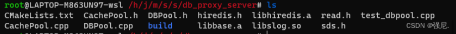

## 前言

本人在学习windows编程时，使用MFC框架编写过简易版的聊天工具，对于MFC更多的是学习客户端的制作以及美化，但我的理想是实现高性能的服务器，在有一定基础的前提下，决定与我的朋友一起实现一个即时通讯项目，小王使用duilib实现客户端，我负责服务器的编写，本项目借鉴teamtalk的实现。所以第一步，先把它的服务器端实现搞明白。

# 学习路线

1.先看懂teamtalk的基本通讯逻辑。

- teamtalk中服务器与客户端的交互

- teamtalk中对一条连接收发消息的封装

2.分析通讯逻辑，独立编写每一个服务器的消息处理逻辑

- db_proxy_server
- login_server
- route_server
- file_server
- msg_server
- http_msg_server
- msfs
- 编写shell脚本 配合 cmake 实现自动化搭建

如下：

先写基础工具类。

写base目录中的ConfigFileReader, ostype, lock, task, util, utilPdu

### 第一阶段写db_proxy_server

先拆线程池，连接池(

base目录中：thread, threadpool， db_proxy_server中：CachePool,DBPool, hiredis, read.h, sds.h,准备三个库libbase.a, libhiredis.a, libslog.so， .so文件记得放入/usr/local/lib 或者 /usr/lib, 最好.a,.so都放，不然需要在cmakelist.txt自己配置路径

 )

写网络库netlib，依赖BaseSocket, EventDispatch

准备写ProxyConn部分

先写Imconn部分， 

```
依赖ImPduBase， ImPudBase的实现是依赖utilpdu的，
并且需要IM.BaseDefine.pb.h,
这里的细节：有两个buf， 一个用于读，一个用于写，
```

观察proxyConn部分

```
1.依赖Proxytask, 学到了 fd有一个回调函数, 任务也有回调函数，定时器的回调函数参数类型和fd的回调函数一样
2.依赖Handlermap
3.因为依赖SyncCneter，所以先去写它
```

我尝试着编译im的libbase.a 但总是遇到protobuf相关的问题，经过排除，是由于我自己apt install protoc 生成了高版本的protoc 而我的项目中的protobuf提供的include，lib资源是低版本的，并且，由于/bin中已经有了高版本的protoc， 我的脚本直接把低版本的protoc放到/bin会失败，但并没有提示，就是这里卡了很久， 需要手动删除高版本的protoc(即先删除/bin/protoc，再将低版本的移过去) 

发现的第二个细节，在解决上述问题后，我尝试在本机上用build_ubuntu.sh脚本，但还是失败，原因是可能在某个文件中的cmake出了问题，根据提示找到它，把cmake生成的中间文件全删了重新执行脚本即可解决

写SyncCenter部分

```c
但它依赖了一些base目录
去写这些依赖的文件
如public_define.h，Condition.h, httpclient,
这里开始要用到json, curl 库 了
```

接着可以开始写ProxyConn部分了

写完后写db_proxy_server.cpp 

```c
又要依赖base目录的EncDec，base64，
发现db_proxy_server/business 下的login服务又依赖base目录下的TokenValidator（token验证器，做一些认证工作）
```

### 第二阶段写login_server

从依赖文件最少的LoginConn入手

再写ipparse

再写HttpConn， 但依赖base目录中的httpparser 和 httpparserwrapper， 但不依赖hhtpclient，注意区分它们的关系，这里直接拷贝httpparser和httpparserwrapper。

可以将HttpConn和ImConn对比，它们很像

```c
HttpConn中是用conn_handle(一个递增的数字，不是fd)作为hash表的key来对应httpconn连接的，可以防止因fd重用引起的一些冲突

这里引申出了一个智能指针的用法，
 netlib_option(handle, NETLIB_OPT_SET_CALLBACK_DATA, reinterpret_cast<void*>(m_conn_handle));
我个人觉得可以把reinterpret_cast<void*>(m_conn_handle));换成(void*)(&m_conn_handle);
```

写完写ipparser,最后写login_server

### 第三阶段写route_server

先写UserInfo

写routeconn

发现route_Server就是和msgser交互

写rout_eserve.cpp

### 第四阶段写file_server

先写config_util，但依赖base目录中的singleton.h

写file_server_util.h

写offline_file_util.h

写transfer_task

写transfer_task_manager，虽然依赖file_client_conn，不管(file_client_conn也依赖transfer_task_manager）。

写file_client_conn，file_client_conn.cpp又依赖base目录中的im_conn_util.h

写file_msg_server_conn

写file_server.cpp

###  第五阶段写msg_server

写AttachData,

写ImUser

把所有conn相关文件写了

写FileHandle

写msg_server.cpp

写CMakeLists.txt时发现需要base目录中的security目录

依赖base目录中的ServInfo.hs

写GroupChat 和 jsonxx

写msg_server.cpp

### 第六阶段写http_msg_server

AttachData和msg_server中的一样，

HttpConn和Login_server中的大同小异，需要做一些修改

HttpConn需要用到HttpQuery，去写，发现依赖HttpPdu

可以从HttpPdu中学习jsoncpp的使用方法‘，还依赖RouteServConn和DBServConn,所以先写这两个Conn，

写完就可以继续写HttpConn了， 

写http_msg_server.cpp

### 第七阶段写msfs

写Portable.h

写CriticalSection.h

写StringUtils

写FileLin

写FileManager

写HttpConn(主要是其中的OnUpload，OnDownload)

写main.cpp

### 第八阶段写shell脚本完成自动化建立项目

3.运用所学知识对基本功能优化，提高性能

- 使用线程安全的单例模式

- 特殊场景下的内存池设计

- 使用go-mysql-transfer进行业务优化，减少单点故障

- 使用ZeroMQ增大消息吞吐量

- 使用etcd对msg_server进行负载均衡

- 将项目部署到docker上

  .... 还有很多可拓展地方


## 必备基础

项目中大量使用单例模式，对于static的理解尤其重要，这里对const和static进行总结

### 1.const介绍

1.const修饰类的成员变量，表示成员常量， 不能被修改，并且只有两种初始化方式，要么直接 const int a = 5; 要么不赋初值，但必须使用初始化参数列表的方式初始化。

2.类中可以重载const类型的同名函数，但无法重载两个同名但不同类型的函数，比如 int test(); 和 void test() 不能同时存在，但 int test(); int test() const可以同时存在。

3.const对象只能调用const函数

4.非const对象调用优先调用非const函数

5.const函数里面只能调用const函数。非const函数可以调用const函数

6.const函数如果在类外定义，必须加上const修饰，而static变量或者函数就可以不用加static。

7.const*  和  *const 区别。

8.参数列表加const的好处，不加之前只能传入左值，加了const就可以传右值，还可以使用const_cast转换去掉const属性

### 2.static介绍

1.静态对象的位置:初始化的在.data段，未初始化或者初始化为0的在.bss段;

2.生命周期: 跟程序的命一样长，只是如果是局部的话，它的作用域有限

3.不同文件没有命名冲突，extern无法访问

4.pthread_create,  必须使用静态函数原因，因为非静态函数有this指针，参数不一致，如果是全局函数，则破坏了类的封装性(谈到封装性可以扯c++中的友元)。 既然必须是静态函数，那么怎么访问类中的非静态成员呢，也就是pthread_create的第四个参数如何设置，有两种方式，**第一种**是传入一个pthis指针(这个pthis是一个静态指针，在对象构造函数初始化的时候设置pthis = this)，或者直接传nullptr(使用单例方式的方式得到全局访问点)，有点像MFC中获取主窗口的方法，但如果是多个实例对象，这种方式就不可行了， **第二种**方式就是建立一个静态hash表，类中有一个静态成员m_sid  和一个普通成员 m_id 以及这个静态hash表，每个对象维护自己的m_id(构造函数初始化的时候，**值为当前静态hash表元素的个数+1**，所以我们是可以知道m_id的值的，可以给它记录一下), 第四个参数每次传入一个需要的对象的m_id 赋值给m_sid,就能通过这个静态hash表找到对应的this指针对象。

5.static(因为没有this指针)和const(构造函数需要修改成员值，但const表示不能修改，并且const成员必须用初始化参数列表的方式来初始化，不能在构造函数中赋值)都不可以用来修饰构造函数或者析构函数

6.空指针对象可以调用函数，通过虚表访问虚函数, vs打印c++类的分布查看虚表结构，多继承的虚表不止一个(前提是基类有虚函数)

### 3.hashmap介绍

重要属性：1.size已经存储的节点个数， 2.threshold 扩容阈值， 当hashmap的个数达到该值时，触发扩容， 3.loadfactor：负载因子，扩容阈值=容量 * 负载因子

考虑时间和空间的权衡，链表转红黑树的阈值是8(如果达到9，并且此时数组长度>=64会发生转化)， 红黑树转链表的阈值是6，如果都是8，很容易转来转去

扩容机制：比如数组大小是4，一个数据通过hash得到的值是6 (110)，那么取余后为2，此时若对数组扩容变为8， 则用刚才的6 & n-1 即 (110 & 111) 只用判断第一位相&后是否为1， 若是，则6在新的扩容数组的下标为原来的下标(2) + 原来的数组大小(4)  = 6；

缩容机制同理： 比如现在数组大小为8，当前索引位置为6(110), 需要缩容到4(100), 则将6 & 2^n-1 (即是4) ，看第一位是否为1， 若是则新位置为原来的位置(6) - 缩容后的数组大小(4) = 2;

rehash方法，需要一个**指针**， 每次获取值的时候，先hash得到索引，判断这个索引大小是否比这个**指针**的位置大， 若是则在原来的hash数组中找， 反之去新数组找， 同时将原来的数组的**当前指针**位置数据更新到新数组中去，将**指针**往后移动一位，直至完全rehash


## 一、★探索teamtalk★

### 1.teamtalk中服务器与客户端的交互(登录流程)

提示：要学习客户端和服务器如何交互， 就是去找它们通信协议中对应命令发送过程。 对于登录过程，对应登录命令就是去分析**CID_LOGIN_REQ_USERLOGIN**
#### 1.1客户端登录模块

客户端工程一共包含十个项目
在**Moudles项目下**的 Login文件夹中找到**LoginDialog.cpp**(有一个_DoLogin()函数) ；在TcpClient文件夹中找到 TcpClientModule.cpp(有一个doLogin()函数)，
 这两个是最关键的步骤，在_DoLogin()，可以看到

 ~~~c
 还记得客户端的配置吗？
 http://127.0.0.1:8080/msg_server
 
 下边这个函数的调用就是发起http请求的意思
 在LoginDlg.cpp 200行处
 module::getHttpPoolModule()->pushHttpOperation(pOper);
 ~~~
当Login_server服务器处理了这条http请求(若成功，会将分配给你的msg_server服务器的ip,port, name等信息以json串的格式返回给你)
~~~c
在LoginDlg.cpp 207行处
module::TTConfig* pCfg = module::getSysConfigModule()->getSystemConfig();
TTConfig对象就保存了服务器返回的msg_server信息(ip, port等)
~~~


在上边我们已经得到http请求的回应，此时我们已经有了
在**LoginDlalog.cpp**中213行可以看到创建了一个LoginOperation(继承自ICallbackOpertaion)对象，通过startOperation()将这个对象当作一个任务放入了一个list待执行队列中， 并为它注册了一个回调函数(不只是登录模块是这样，其他的任务也是以继承ICallbackOpertaion类的方式， 将其子类实例化对象放入这个list链表中，只是这里是LoginOperation这种子类。)
 如下：
~~~c
LoginOperation* pOperation = new LoginOperation(		//去看它的实现， 调用了_DoLogin
			BIND_CALLBACK_1(LoginDialog::OnOperationCallback), loginparam);
		imcore::IMLibCoreStartOperation(pOperation);
~~~

在上边我们只是将登录任务放进了待执行队列，那么在哪里调用呢？

在**LoginOperation.cpp**中48行可以看到doLogin在这里被调用（doLogin里面可以找到发送CID_LOGIN_REQ_USERLOGIN命令的语句)。
~~~c
先获取msg_server的ip,port信息，在TTConfig结构体内可以查看
module::TTConfig* pCfg = module::getSysConfigModule()->getSystemConfig();
IM::Login::IMLoginRes* pImLoginResp = (IM::Login::IMLoginRes*)module::getTcpClientModule()
		->doLogin(server, pCfg->msgServPort,m_loginParam.csUserName,m_loginParam.password);
~~~


doLogin是在processOpertion中调用的，processOpertion是一个重写的函数， 不同的Operation类(这里是LoginOperation)对应着不同功能的processOpertion，可以把它理解为去执行任务(这里指登录任务)

**这里要明白，发送消息的前提是建立了连接，doLogin函数中的第一行就是建立连接过程**，这个连接和最开始的http连接获取msg_server不一样，  http请求是客户端去连接的Login_server，为了获取msg_server信息， 而这次是客户端与msg_server建立连接。
~~~c
TcpClientModule_Impl.cpp 148行
IMLibCoreConnect(util::cStringToString(linkaddr), port);
~~~


简单的理解当你点击登录按钮，会触发_DoLoing()需要做两件事， 先发送http消息请求，Login_server服务器返回给你msg_server服务器信息(ip,port,name)，后在doLogin()中去连接msg_server进行一系列的信息验证过程。
#### 1.2服务器接收模块

主要分析， 在哪接收客户端的请求，以及如何为这条连接做负载均衡(将这条连接放到负载最小的msg_server上)。

客户端的请求包含了**两部分**，**第一部分**是http请求(用Login_server来接收处理,  目的是给客户端找一个msg_server)， **第二部分**是具体的命令发送如：CID_LOGIN_REQ_USERLOGIN(用第一步找到的msg_server来接收处理)

**抓住主线： 
一：在Login_server中接受客户端的http连接**
~~~c
 http://127.0.0.1:8080/msg_server
~~~
**Login_server服务器将负载最小的msg_server服务器信息(ip,port等)以json格式返回给客户端。
二：然后客户端再去连接这个msg_server, 说白了，Login_server只是一个中转站，msg_server才是与客户端一直交流的主要服务器。**

首先在longin_server.cpp找， 在118行，我们可以看到longin_server.cpp通过netlib_listen监听了3个端口， 其中的HttpPort(也就是8080端口，就是负责处理登录连接的第一步，处理http请求消息， 登录连接的第二步是与msg_server交互)

netlib_listen就是封装了listen过程，将这个监听套接字(fd)注册到了epoll_wait()中，并且设置了回调函数(http_callback第49行)，对比我们以往的C语言编程思维，因为Teamtalk是C++写的，它将所有的套接字(fd)都封装成了一个CBaseSocket对象，**并且将这个对象通过map映射在hash表中保存，fd作为key，CBaseSocket对象作为value** 当客户端点击登录的时候， 就会触发消息，所以我们需要去找epoll_wait() 在哪，在EventDispatch.cpp中的354行可以找到，当fd有消息的时候，通过我们刚刚说的那个hash映射表，因为key是fd， 我们就可以找到对应的CBaseSocket对象进行一系列处理(Read, Write等)。

##### 1.2.1登录第一步处理http连接(在login_server上)

当客户端点击登录后(DoLogin), 服务器的HttpPort(也就是8080端口）对应的监听fd 被触发，**这里一定要明白，客户端点了登录按钮后，涉及了两个步骤，先是发送http请求来向Login_server服务器获取负载最小的msg_server服务器的信息(ip,port), 所以首先讨论的是Login_server处理http请求**。 通过监听fd找到对应的CBaseSocket对象，进一步调用pSocket->OnRead(); 在OnRead中可以看到  `_AcceptNewSocket`，它的功能就是将这个客户端点击登录的连接接收，分配一个CBaseSocket对象与之(客户端点击登录的连接)绑定，放到全局hash映射表中，并注册到epoll_wait的队列中，在这个函数(AcceptNewSocket)的最后一行可以看到m_callback(m_callback_data, NETLIB_MSG_CONNECT, (net_handle_t)fd, NULL)， 这个m_callback就是一开始为监听fd注册的http_callback函数(在longin_server.cpp中的49行)
**这里一定不要搞混了**，这个http_callback和上边提到的pSocket->OnRead()完全不是一个东西， 可以把pSocket->OnRead()理解为宏观的所有套接字的统一接口，而http_callback才是对应的套接字(这里指这个监听fd)的具体回调函数。 **接着**进入http_callback 中可以知道，我们为这条新的登录连接(http连接)注册了回调函数httpconn_callback。 (**这里也一定要明白，到这里我们只是接受了http的连接， 还并没有处理http消息，一定要有清晰的逻辑，所有的处理前提都是先建立tcp连接**)
至此我们已经成功的接受了这条连接，并且设置了这条连接的回调函数，并将新连接的fd(http请求的连接)加入到了epoll_wait的队列中，重点：此时我们还没有处理客户端发送过来的 **http://127.0.0.1:8080/msg_server**， 当收到这条信息时， epoll_wait触发fd(客户端点击登录的连接)，通过全局hash找到这条连接的CBaseSocket对象，调用pSocket->OnRead()， 在OnRead中可以看到，这次并不是进入的_AcceptNewSocket， 而是直接走的下边的回调函数m_callback， 此时这条连接(客户端点击登录的连接)的回调函数是httpconn_callback(在HttpConn.cpp中36行)，通过fd找到对应的连接，注意这里不是CBaseSocket连接，**仔细的朋友可以发现每个fd都绑定了两个对象，一个是CBaseSocket对象， 另一个是Conn对象 ， 进一步调用pConn->OnRead(); ，这个OnRead和前边说的pSocket->OnRead()不是同一个**， 在这个OnRead中我们可以找到 _HandleMsgServRequest(url, content); 这个函数中寻找负载最小的msg_server并将信息(ip,port)以json格式返回给客户端
**至此 登录过程的第一步已经完成，我们已经成功将负载最小的msg_server信息返回给客户端了**

##### 1.2.2登录第二步处理客户端登录请求(在msg_server上)

本文主要学习整体流程， 在msg_server上涉及了数据库服务器对客户端的登录信息进行验证，暂不深究。 msg_server上和Login_server一样，当有客户来连接的时候(tcp连接过程)，会给这个客户fd绑定一个CBaseSocket对象，和一个Conn对象(Login_server上是CLoginConn对象，msg_server是MsgConn对象)。

当客户端发送CID_LOGIN_REQ_USERLOGIN命令，epoll_wait触发，pSocket->OnRead();
~~~c
pSocket->OnRead();
m_callback(); //Login_server和msg_server都是一样的接口imconn_callback函数
//在imconn_callback中
pConn->OnRead();	//
//进入OnRead，可以看到
HandlePdu(pPdu);
//Login_server和msg_server不是同一个pConn,并且它们都重写了HandlePdu(pPdu)函数，所以有不同的实现
//在MsgConn.cpp中282行，即可看到对于CID_LOGIN_REQ_USERLOGIN命令的处理。
case CID_LOGIN_REQ_USERLOGIN:
      _HandleLoginRequest(pPdu );
~~~
以上就是客户端点击登录按钮， 一直到服务器处理好对应连接的全过程。

### 2.teamtalk中对一条连接收发消息的封装

在看之前需要知道，本篇文章以Login_server为主体分析
 对于监听fd(也就是listenfd)的回调函数的接口是不同的
(有http_callback，msg_serv_callback，client_callback三种接口），而普通的fd的回调函数的统一接口是imconn_callback(除了客户端请求登录的http连接的接口是httpconn_callback)，**记住imconn_callback，非常重要**。
在看了上一篇文章后[TeamTalk登录流程分析](https://blog.csdn.net/qq_51721904/article/details/128162954?spm=1001.2014.3001.5502)就会知道httpconn_callback是干什么用的了，这里主要对imconn_callback进行分析。


**每**一个client连接时，**都**会给它分配一个CBaseSocket对象和一个CLoginConn对象，BashSocket对象用于保存处理一些基本信息，比如对方和自己的ip和port，和读写函数(也就是下边说到的pSocket->OnRead())，这里面可以看到调用了	m_callback ， 这个回调函数绑定的就是我们最开始说的imconn_callback，在imconn_callback里面可以通过fd找到CLoginConn对象再调用CLoginConn对象处理具体消息)，具体的对数据的处理，比如读写缓冲区，解析PDU数据等，都在CLoginConn对象中。
**当epoll_wait触发了可读事件的整个流程任意选：**

```c
先只看函数， 理清逻辑，再看注释
pSocket->OnRead();//EventDispatch.cpp中386行
m_callback(m_callback_data, NETLIB_MSG_READ, (net_handle_t)m_socket, NULL);
 //这个m_callback函数是fd最初设置的回调函数，一般是imconn_callback（除了客户端登录连接）
/*参数解析：对于listenfd，
m_callback(m_callback_data(回调额外参数), 消息类型，对方给的fd， NULL),
但如果是其他普通fd,这里的第三个参数就是自己的fd,第一个参数m_callback_data一般是一个hash映射表*/
//再进入imconn_callback中可以看到
CImConn* pConn = FindImConn(conn_map, handle);//通过fd取出Conn对象，CImConn是所有Conn对象的基类， 这里我们是CLoginConn对象，
pConn->OnRead();//里面会调用HandlePdu，
HandlePdu();//这是一个子类重写的方法，
////所以会去到CLoginConn对象的HandlePdu处理方法，这里面就是具体对PDU的处理

```
**总结分析**
一定不要把OnRead，OnWrite等 跟 fd对应的**回调函数**(在BaseSocket.h中可以找到**回调函数对象m_callback**，一般给它绑定的是imconn.cpp中的imconn_callback函数) 搞混了，**fd对应的回调函数只有一个**，而OnRead，OnWrite等只是CBaseSocket对象或者CLoginConn对象具有的功能。

可以这么理解，每一个fd都绑定了两个处理对象(一个CBaseSocket对象，一个CLoginConn对象)， 对于CBaseSocket对象主要用于epoll_wait中当检测到消息后，统一调用CBaseSocket对象的读或者写函数(比如上边的pSocket->OnRead()，**可以理解用CBaseSocket对象检测消息的发生，以及保存一些基本信息，如ip，port，m_callback对象等**)，m_callback对象虽然是在CBaseSocket对象中，但其实它在哪个对象中一点不重要，重要的是我们要知道CLoginConn对象只是一个fd的服务对象，(**可以理解为CLoginConn对象就是用来处理fd接收和发送具体消息的**)，并且一般m_callback对象绑定的接口统一都是imconn_callback(除了客户端请求登录的http连接的接口是httpconn_callback)。

至此应该能够明白一个fd 是如何做封装的了

**知识补充**
对于imconn.cpp, 每个客户来连接Login_server时，绑定的回调函数就是这里面的imconn_callback, 同时给客户设置的callback_data就是在LoginConn.cpp中的g_client_conn_map哈希表，所以在客户的回调函数中，可以通过g_client_conn_map找到对应的那条连接。我们可以把CLoginConn的一个对象当作一个真正的连接

在BaseSocket.cpp中， g_socket_map哈希表保存了每一个fd和CBaseSocket对象的映射(fd->CBaseSocket*);
在LoginConn.cpp中, 有g_client_conn_map保存了每一个fd的个CLoginConn对象的映射(fd->CLoginSocket*);


netlib_option(客户fd，需要进行的操作(如绑定回调函数，设置回调函数附加的参数等)，具体的回调函数和回调函数附加的参数(一般是一个hash表), 并且在netlib.cpp中包含了BaseSocket头文件,等同于拥有了g_socket_map哈希表, 所以通过这个哈希表获得对应的socket才能对回调函数即额外参数进行设置


对于login_server.cpp， 只有一个epoll_wait， 但涉及到**多个服务**，比如普通的client连接，以及http登录连接，这些服务对应的listenfd绑定了EPOLLIN事件，当事件发生时，先通过FindBaseSocket(ev_fd), 找到对应的listenfd的pSocket对象，然后调用pSocket->OnRead();

对于pSocket->OnRead()里面有哪些消息类型，存储在ostype.h里面
对于fd的回调函数m_callback中第二个参数涉及的类型在netlib.h中

int netlib_option(net_handle_t handle, int opt, void* optval) 中， 如果opt是NETLIB_OPT_SET_CALLBACK，则optval是一个函数， 如果opt是NETLIB_OPT_SET_CALLBACK_DATA，则optval是一个全局hash表.

## 二、★架构分析★

### 一、层次分析

以分层的角度去分析即时通讯的项目架构


#### 1.接入层

接入层作用：

- 连接分流


会把每一条连接根据负载均衡的方式分配给负载最小的逻辑层服务器。

- 初步防攻

避免恶意登录攻击。

#### 2.逻辑层

1. 用户逻辑：用户登录、用户退出、用户信息查询、用户更新签
   名、用户分组创建等

2. 好友逻辑：添加好友、删除好友、拉取好友列表、好友添加备
注等
3. 群组逻辑：创建群、加入群、删除群、删除成员等
4. 消息逻辑：单聊文字消息、单聊语音消息、群聊文字消息、群
聊语音消息、拉取离线消息等
5. 其他，比如文件传输、图片传输等


#### 3.数据层

首先只考虑MySQL或者MongoDB, 不考虑缓存设计，看一下有无数据层的区别


加上缓冲层Cache， 如redis，有无数据层的区别


以上看不出来任何好处，其实它最大的好处就是提供有好的接口

比如以下业务情况，可以通过统一接口访问到不同的数据库


#### 4.路由层

1.路由消息 

2.存储用户在线状态信息，**可将用户状态信息存入redis缓存中**

比如如下场景客户1发送消息给客户2，若二者不在逻辑层中的同一个服务器上，则需要路由层进行转发。


### 二、基础设计

一款即时通讯的项目，在设计每一个服务器之前，应该为每一个服务器都制定相同的通信标准，所以我们首先应该设计好通信协议。

#### 1、协议设计

先分析一下，为何需要自定义协议，为什么不能直接使用tcp协议，这就需要探讨到tcp的粘包问题了，因为tcp是字节流的数据，所以可能会出现粘包的问题，通俗的说就是，如果客户端发送了一次100字节数据和一次30字节数据，但服务器由于网络等原因第一次只接受了80字节，第二次又接受50字节数据，这样最后边的50字节就粘在一起了。

解决方案：

~~~
1.应用层包头加一个长度， 2.加上特殊分隔符比如http协议，redis协议。3.关闭nagle算法， 4.开启tcp PUSH标志 ， 5.每次客户端发送固定大小，服务器接收固定大小
~~~

很显然，在项目中我们一般会选择在应用层自定义协议，不仅能够解决粘包问题，还可以拓展我们自己的功能。

思维导图：


包头设计：


通过最开始的4字节length， 就可以解决数据包的边界问题(即粘包问题)

#### 2、工具类设计

一把好的工具往往能给项目开发带来极大的便利，在这个项目中，每个服务器难免有一些重复的工作，比如 解析服务器地址， 解析配置文件，封装服务器的结构信息，加锁设计，字符串转换操作等，

需要实现这些通用工具类，减少代码复用。

#### 3、PDU设计


将最开始的包头结构体封装到一个pdu的类中，并且在整个类中自己添加功能实现对包头的读写功能，其中的m_buf字段为一个动态扩容的字符串，用于缓存收发的数据。

一起来看一下CSimpleBufeer类的实现


#### 4、各服务器功能设计

在前边两点我们已经设计好了各个服务器数据交流的实例对象(PDU), 接下来只需分析各个服务器的功能，利用好工具类，逐个实现业务需求。

1. PC客户端。

2. LoginServer: 主要负责负载均衡的作用，当收到客户端的请求时，分配一个负载最小的MsgServer给客户端。
3. MsgServer: 主要服务端，负责维护各个客户端的链接，消息转发等功能。
4. RouteServer: 负责消息路由的功能，当msg_server发现某个用户不在本服务器内，而又有消息需要发给他，就会将消息转发给route_server，route_server会将消息发给相应的msg_server，由此可知，route_server也维护了一定的用户状态。
5. DBProxy: 在TT中负责了主要的业务逻辑，主要与存储层打交道，提供mysql以及redis的访问服务，屏蔽其他服务器与mysql与redis的直接交互。
6. FileServer: 文件服务器，提供客户端之间得文件传输服务，支持在线以及离线文件传输
7. MsfsServer: 图片存储服务器，提供头像，图片传输中的图片存储服务。
9. http_msg_server:配合网站接口管理用户。

#### 5、数据库表的设计

##### 1.IMAdmin: 后台管理人员信息表

```mysql
CREATE TABLE `IMAdmin` (
`id` mediumint(6) unsigned NOT NULL AUTO_INCREMENT,
`uname` varchar(40) NOT NULL COMMENT '⽤户名',
`pwd` char(32) NOT NULL COMMENT '密码',
`status` tinyint(2) unsigned NOT NULL DEFAULT '0' COMMENT '⽤户状态 0 :正常，1:删除 可扩展',
`created` int(11) unsigned NOT NULL DEFAULT '0' COMMENT '创建时间´',
`updated` int(11) unsigned NOT NULL DEFAULT '0' COMMENT '更新时间´',
PRIMARY KEY (`id`)
) ENGINE=InnoDB DEFAULT CHARSET=utf8
```

字段说明:

```
id 管理员id，⾃增，唯⼀。
uname ⽤户名。
pwd 密码，经过md5加密的密码。
status 状态，0正常，1删除。
created 创建时间。
updated 更新时间。
```

##### 2.IMDepart:存储部门信息

```mysql
CREATE TABLE `IMDepart` (
`id` int(11) unsigned NOT NULL AUTO_INCREMENT COMMENT '部⻔id',
`departName` varchar(64) COLLATE utf8mb4_bin NOT NULL DEFAULT '' COMMENT '部⻔名称',
`priority` int(11) unsigned NOT NULL DEFAULT '0' COMMENT '显示优先级',
`parentId` int(11) unsigned NOT NULL COMMENT '上级部⻔id',
`status` int(11) unsigned NOT NULL DEFAULT '0' COMMENT '状态',
`created` int(11) unsigned NOT NULL COMMENT '创建时间',
`updated` int(11) unsigned NOT NULL COMMENT '更新时间',
PRIMARY KEY (`id`),
KEY `idx_departName` (`departName`),
KEY `idx_priority_status` (`priority`,`status`)
) ENGINE=InnoDB DEFAULT CHARSET=utf8mb4 COLLATE=utf8mb4_bin
```

字段说明：

```
id 部⻔id，⾃增，唯⼀。
departName 部⻔名称
priority 部⻔显示优先级，相同的优先级按照拼⾳先后显示
parentId ⽗部⻔id
status 状态，0表示正常
created 创建时间
updated 更新时间
```

##### 3.IMGroup:群组表

```mysql
CREATE TABLE `IMGroup` (
`id` int(11) NOT NULL AUTO_INCREMENT,
`name` varchar(256) COLLATE utf8mb4_bin NOT NULL DEFAULT '' COMMENT '群名称',
`avatar` varchar(256) COLLATE utf8mb4_bin NOT NULL DEFAULT '' COMMENT '群头像',
`creator` int(11) unsigned NOT NULL DEFAULT '0' COMMENT '创建者⽤户id',
`type` tinyint(3) unsigned NOT NULL DEFAULT '1' COMMENT '群组类型，1-固定;2-临时群',
`userCnt` int(11) unsigned NOT NULL DEFAULT '0' COMMENT '成员⼈数',
`status` tinyint(3) unsigned NOT NULL DEFAULT '1' COMMENT '是否删除,0-正常，1-删除',
`version` int(11) unsigned NOT NULL DEFAULT '1' COMMENT '群版本号',
`lastChated` int(11) unsigned NOT NULL DEFAULT '0' COMMENT '最后聊天时间',
`created` int(11) unsigned NOT NULL DEFAULT '0' COMMENT '创建时间',
`updated` int(11) unsigned NOT NULL DEFAULT '0' COMMENT '更新时间',
PRIMARY KEY (`id`),
KEY `idx_name` (`name`(191)),
KEY `idx_creator` (`creator`)
) ENGINE=InnoDB DEFAULT CHARSET=utf8mb4 COLLATE=utf8mb4_bin COMMENT='IM群信息'
```

字段说明

```
id 群组id，⾃增，唯⼀。
name 群组名称。
avatar 群组头像，⽬前没⽤，群组头像是客户端⾃⼰合成的。
creator 群主。
type 群类型，是临时群，还是固定群。
userCnt 群成员数⽬。
status 状态。
version 群信息版本。
lastChated 最后聊天时间。
created 创建时间。
updated 最后更新时间。
```

##### 4.IMGroupMember：群成员表

```mysql
CREATE TABLE `IMGroupMember` (
`id` int(11) NOT NULL AUTO_INCREMENT,
`groupId` int(11) unsigned NOT NULL COMMENT '群Id',
`userId` int(11) unsigned NOT NULL COMMENT '⽤户id',
`status` tinyint(4) unsigned NOT NULL DEFAULT '1' COMMENT '是否退出群，0-正
常，1-已退出',
`created` int(11) unsigned NOT NULL DEFAULT '0' COMMENT '创建时间',
`updated` int(11) unsigned NOT NULL DEFAULT '0' COMMENT '更新时间',
PRIMARY KEY (`id`),
KEY `idx_groupId_userId_status` (`groupId`,`userId`,`status`),
KEY `idx_userId_status_updated` (`userId`,`status`,`updated`),
KEY `idx_groupId_updated` (`groupId`,`updated`)
) ENGINE=InnoDB AUTO_INCREMENT=68 DEFAULT CHARSET=utf8 COMMENT='⽤户和群的关系
表'
```

字段说明

```
id ⾃增，唯⼀。
groupId 群组id。
userId ⽤户id。
status 状态。
created 创建时间。
updated 更新时间。
```

##### 5.IMGroupMessage_(x）：群消息表

x代表第⼏张表，⽬前做了分表8张，0-7表示消息具体在哪张表，是
groupId%IMGroupMessage表的数⽬

```mysql
CREATE TABLE `IMGroupMessage_(x)` (
`id` int(11) NOT NULL AUTO_INCREMENT,
`groupId` int(11) unsigned NOT NULL COMMENT '⽤户的关系id',
`userId` int(11) unsigned NOT NULL COMMENT '发送⽤户的id',
`msgId` int(11) unsigned NOT NULL COMMENT '消息ID',
`content` varchar(4096) COLLATE utf8mb4_bin NOT NULL DEFAULT '' COMMENT
'消息内容',
`type` tinyint(3) unsigned NOT NULL DEFAULT '2' COMMENT '群消息类型,101为群
语⾳,2为⽂本',
`status` int(11) unsigned NOT NULL DEFAULT '0' COMMENT '消息状态',
`created` int(11) unsigned NOT NULL DEFAULT '0' COMMENT '创建时间',
`updated` int(11) unsigned NOT NULL DEFAULT '0' COMMENT '更新时间',
PRIMARY KEY (`id`),
KEY `idx_groupId_status_created` (`groupId`,`status`,`created`),
KEY `idx_groupId_msgId_status_created`
(`groupId`,`msgId`,`status`,`created`)
) ENGINE=InnoDB DEFAULT CHARSET=utf8mb4 COLLATE=utf8mb4_bin COMMENT='IM群消息
表
```

```
id ⾃增，唯⼀。
groupId 收消息的群组id。
userId 发消息的⽤户id。
msgId 消息id，每个群组唯⼀。
content 消息内容，//如果是语⾳消息则存储语⾳id。
type 消息类型，⽂本or语⾳。
status 状态。
created 创建时间。
updated 更新时间。
```

##### 6.IMMessage_(x)：单聊消息表

x代表第⼏张表，⽬前做了分表8张，0-7表示具体在哪张表，是relateId%IMMessage表数⽬

```mysql
CREATE TABLE `IMMessage_0` (
`id` int(11) NOT NULL AUTO_INCREMENT,
`relateId` int(11) unsigned NOT NULL COMMENT '⽤户的关系id',
`fromId` int(11) unsigned NOT NULL COMMENT '发送⽤户的id',
`toId` int(11) unsigned NOT NULL COMMENT '接收⽤户的id',
`msgId` int(11) unsigned NOT NULL COMMENT '消息ID',
`content` varchar(4096) COLLATE utf8mb4_bin DEFAULT '' COMMENT '消息内容',
`type` tinyint(2) unsigned NOT NULL DEFAULT '1' COMMENT '消息类型',
`status` tinyint(1) unsigned NOT NULL DEFAULT '0' COMMENT '0正常 1被删除',
`created` int(11) unsigned NOT NULL COMMENT '创建时间',
`updated` int(11) unsigned NOT NULL COMMENT '更新时间', PRIMARY KEY
(`id`),
KEY `idx_relateId_status_created` (`relateId`,`status`,`created`),
KEY `idx_relateId_status_msgId_created`
(`relateId`,`status`,`msgId`,`created`),
KEY `idx_fromId_toId_created` (`fromId`,`toId`,`status`)
) ENGINE=InnoDB DEFAULT CHARSET=utf8mb4 COLLATE=utf8mb4_bin
```

```
id ⾃增，唯⼀
relateId ⽤户与⽤户关系id，在IMrelationShop中。
fromId 发送消息⽤户id。
toId 接收消息⽤户id。
msgId 消息id，每个relation 唯⼀。
content 消息内容，//如果是语⾳消息则存储语⾳id。
type 类型，⽂本or语⾳。
status 状态。
created 创建时间。
updated 更新时间。
```

##### 7.IMRrecentSession：最近会话表

```mysql
CREATE TABLE `IMRecentSession` (
`id` int(11) NOT NULL AUTO_INCREMENT,
`userId` int(11) unsigned NOT NULL COMMENT '⽤户id',
`peerId` int(11) unsigned NOT NULL COMMENT '对⽅id',
`type` tinyint(1) unsigned DEFAULT '0' COMMENT '类型，1-⽤户,2-群组',
`status` tinyint(1) unsigned DEFAULT '0' COMMENT '⽤户:0-正常, 1-⽤户A删除,
群组:0-正常, 1-被删除',
`created` int(11) unsigned NOT NULL DEFAULT '0' COMMENT '创建时间',
`updated` int(11) unsigned NOT NULL DEFAULT '0' COMMENT '更新时间',
PRIMARY KEY (`id`),
KEY `idx_userId_peerId_status_updated`
(`userId`,`peerId`,`status`,`updated`),
KEY `idx_userId_peerId_type` (`userId`,`peerId`,`type`)
) ENGINE=InnoDB DEFAULT CHARSET=utf8

```

字段说明：

```
id 会话id，⾃增，唯⼀。
userId ⽤户id。
peerId 对⽅id。
type 类型，群组or⽤户。
status 状态。
created 创建时间。
updated 更新时间。
```

##### 8.IMRelationShip：用户关系表

```mysql
CREATE TABLE `IMRelationShip` (
`id` int(11) NOT NULL AUTO_INCREMENT,
`smallId` int(11) unsigned NOT NULL COMMENT '⽤户A的id',
`bigId` int(11) unsigned NOT NULL COMMENT '⽤户B的id',
`status` tinyint(1) unsigned DEFAULT '0' COMMENT '⽤户:0-正常, 1-⽤户A删除,
群组:0-正常, 1-被删除',
`created` int(11) unsigned NOT NULL DEFAULT '0' COMMENT '创建时间',
`updated` int(11) unsigned NOT NULL DEFAULT '0' COMMENT '更新时间',
PRIMARY KEY (`id`),
KEY `idx_smallId_bigId_status_updated`
(`smallId`,`bigId`,`status`,`updated`)
) ENGINE=InnoDB DEFAULT CHARSET=utf8
```

字段说明

```
id 关系id，⾃增，唯⼀。
smallId 两个⽤户中id⼩的。
bigId 两个⽤户中id⼤的。
status 状态。
created 创建时间。
updated 更新时间。
```

##### 9.IMUser:用户表

```mysql
CREATE TABLE `IMUser` (
`id` int(11) unsigned NOT NULL AUTO_INCREMENT COMMENT '⽤户id',
`sex` tinyint(1) unsigned NOT NULL DEFAULT '0' COMMENT '1男2⼥0未知',
`name` varchar(32) COLLATE utf8mb4_bin NOT NULL DEFAULT '' COMMENT '⽤户
名',
`domain` varchar(32) COLLATE utf8mb4_bin NOT NULL DEFAULT '' COMMENT '拼
⾳',
`nick` varchar(32) COLLATE utf8mb4_bin NOT NULL DEFAULT '' COMMENT '花名,
绰号等',
`password` varchar(32) COLLATE utf8mb4_bin NOT NULL DEFAULT '' COMMENT '密
码',
`salt` varchar(4) COLLATE utf8mb4_bin NOT NULL DEFAULT '' COMMENT '混淆
码',
`phone` varchar(11) COLLATE utf8mb4_bin NOT NULL DEFAULT '' COMMENT '⼿机
号码',
`email` varchar(64) COLLATE utf8mb4_bin NOT NULL DEFAULT '' COMMENT
'email',
`avatar` varchar(255) COLLATE utf8mb4_bin DEFAULT '' COMMENT '⾃定义⽤户头
像',
`departId` int(11) unsigned NOT NULL COMMENT '所属部⻔Id',
`status` tinyint(2) unsigned DEFAULT '0' COMMENT '1. 试⽤期 2. 正式 3. 离职
4.实习',
`created` int(11) unsigned NOT NULL COMMENT '创建时间',
`updated` int(11) unsigned NOT NULL COMMENT '更新时间',
PRIMARY KEY (`id`),
KEY `idx_domain` (`domain`),
KEY `idx_name` (`name`),
KEY `idx_phone` (`phone`)
) ENGINE=InnoDB DEFAULT CHARSET=utf8mb4 COLLATE=utf8mb4_bin
```

字段说明

```
id ⽤户id，⾃增，唯⼀。
sex 性别。
name ⽤户名。
domain 拼⾳。
nick 昵称。
password 密码,规则md5(md5(passwd)+salt)。
salt 密码混淆。
phone 电话号码。
email email。
avatar ⽤户头像。
departId 所属部⻔Id
status 状态
created 创建时间。
updated 更新时间。
```


## 三、★实践过程★

### 一、单例模式线程安全设计

首先了解一下什么是单例模式

保证任何情况下都只有一个实例，就像上边说的如果是static修饰就可以在不同文件中出现多个实例对象， 所以这个static 单例对象不能是全局的，为了保证它不是全局的，必须给类的**构造函数设置为私有的**，此时只剩下一种方式能调用类中方法，那么就是静态函数的方法，但static函数只能访问static对象，所以必须要在类中定义一个static对象这就是单例模式唯一实例必须设置为静态的原因。

#### 1.最原始的单例模式

~~~c++
class Singleton { //懒汉模式
public:
     static Singleton * GetInstance() {
     if (_instance == nullptr) {
     _instance = new Singleton();
     }
     return _instance;
     }
    private:
     Singleton(){}//构造
     Singleton(const Singleton &clone){} //拷⻉构造
     Singleton& operator=(const Singleton&) {}
     static Singleton * _instance;
    }
Singleton* Singleton::_instance = nullptr;//静态成员需要初始化

~~~

#### 2.使用doublecheck来保证线程安全

双重检测可以减小锁的粒度，一重检测不能保证只实例化一次

~~~c++

#include <mutex>
class Singleton { // 懒汉模式 lazy load
public:
	static Singleton* GetInstance() {

		//std::lock_guard<std::mutex> lock(_mutex); // 为什么不在这里加锁， 因为这样锁的粒度太大。
		if (_instance == nullptr) {
			std::lock_guard<std::mutex> lock(_mutex); 
			if (_instance == nullptr) {
				_instance = new Singleton();
				atexit(Destructor);
			}
		}
		return _instance;
	}
private:
	static void Destructor() { //需要自己释放
		if (nullptr != _instance) {
			delete _instance;
			_instance = nullptr;
		}
	}
	Singleton() {} //构造
	Singleton(const Singleton& cpy) {} //拷⻉构造
	Singleton& operator=(const Singleton&) {}
	static Singleton* _instance;
	static std::mutex _mutex;
};
Singleton* Singleton::_instance = nullptr;//静态成员需要初始化
std::mutex Singleton::_mutex; //互斥锁初始化
~~~

#### 3.使用c++11特性static保证线程安全

c++11中的magic static 可以保证对象只实例化一次

~~~c++
class Singleton
{
public:
 ~Singleton(){}
 static Singleton& GetInstance() {
 static Singleton instance;
 return instance;
 }
private:
 Singleton(){}
 Singleton(const Singleton&) {}
 Singleton& operator=(const Singleton&) {}
};
// 继承 Singleton
// g++ Singleton.cpp -o singleton -std=c++11

~~~

分析这种方式的优点优点：

1. 利⽤静态局部变量特性，延迟加载；
2. 利⽤静态局部变量特性，系统⾃动回收内存，⾃动调⽤析构函数；
3. 静态局部变量初始化时，没有 new 操作带来的cpu指令reorder操作；
4. c++11 静态局部变量初始化时，具备线程安全；

#### 3.采用模板的方式来设计单例模式

~~~c++
template<typename T>
class Singleton {
public:
 static T& GetInstance() {
 static T instance; // 这⾥要初始化DesignPattern，需要调⽤
DesignPattern 构造函数，同时会调⽤⽗类的构造函数。
 return instance;
 }
protected:
 virtual ~Singleton() {}
 Singleton() {} // protected修饰构造函数，才能让别⼈继承
 Singleton(const Singleton&) {}
 Singleton& operator =(const Singleton&) {}
};
class DesignPattern : public Singleton<DesignPattern> {
 friend class Singleton<DesignPattern>; // friend 能让 Singleton<T> 访问到 DesignPattern构造函数
private:
 DesignPattern(){}
 DesignPattern(const DesignPattern&) {}
 DesignPattern& operator=(const DesignPattern&) {}
}
~~~

#### 5.友元：

友元分为：**友元函数**和**友元类**

##### 5.1友元函数

友元函数可以直接访问类的私有成员，它是定义在类外部的普通函数，不属于任何类，但需要在类的内部声明，声明时需要加friend关键字。
友元函数特性：

    友元函数可访问类的私有和保护成员，但不是类的成员函数
    友元函数不能用const修饰
    友元函数可以在类定义的任何地方声明，不受类访问限定符限制
    一个函数可以是多个类的友元函数
    友元函数的调用与普通函数的调用和原理相同
##### 5.2友元类

友元类的所有成员函数都可以是另一个类的友元函数，都可以访问另一个类中的非公有成员。
友元类特性:

    友元关系是单向的，不具有交换性
    比如A类和B类，在A类中声明B类为其友元类，那么可以在B类中直接访问A类的私有成员变量，但想在A类中访问B类中私有的成员变量则不行。
    友元关系不能传递
    如果B是A的友元，C是B的友元，则不能说明C是A的友元。
##### 5.3为什么需要友元？

1.比如重载<< 或  >> ，必须使用全局重载，而不能是类重载， 但由于重载过程会访问到类的私有成员函数，故使用友元函数重载。

```
    ostream & operator<<(ostream &out, complex &A){    out << A.m_real <<" + "<< A.m_imag <<" i ";    return out;}
    需要在最前边加上friend
```

2.第二个就是这里模板方法实现单例模式的使用场景了。

##### 5.4总结友元

 友元提供了一种**突破封装**的方式，有时提供了便利。但是友元会增加耦合度，破坏了封装，所以友元**不宜多用**，但有一些不得不用的场景，比如上边的“<<”或者“>>”重载。

### 二、池化技术设计

**为什么需要池化技术？**


池化技术能够减少资源对象的创建次数，提⾼程序的响应性能，特别是在⾼并发下这种提⾼更加明显。使用池化技术缓存的资源对象有如下共同特点：

   对象创建时间长；
    对象创建需要大量资源；
    对象创建后可被重复使用像常见的线程池、内存池、连接池、对象池都具有以上的共同特点。
#### 一：连接池

这里我们以数据库连接池举例，redis等连接池实现都是一样的道理。

定义：数据库连接池（Connection pooling）是程序启动时建立足够的数据库连接，并将这些连接组成一个连接池，由程序动态地对池中的连接进行申请，使用，释放。

##### 1.为什么需要数据库连接池?

  1.  资源复用：由于数据库连接得到复用，避免了频繁的创建、释放连接引起的性能开销，在减少系统消耗的基础上，另一方面也增进了系统运行环境的平稳性（减少内存碎片以及数据库临时进程/线程的数量）。
  2. 更快的系统响应速度：数据库连接池在初始化过程中，往往已经创建了若干数据库连接置于池中备用。此时连接的初始化工作均已完成。对于业务请求处理而言，直接利用现有可用连接，避免了从数据库连接初始化和释放过程的开销，从而缩减了系统整体响应时间。
  3. 统⼀的连接管理：避免数据库连接泄露，在较为完备的数据库连接池实现中，可根据预先的连接占用超时设定，强制收回被占用连接。从而避免了常规数据库连接操作中可能出现的资源泄露。

###### 1.1不使用连接池

1.TCP建立连接的三次握手（客户端与MySQL服务器的连接基于TCP协议）
2.MySQL认证的三次握手
3.真正的SQL执行
4.MySQL的关闭
5.TCP的四次握手关闭


可以看到，每执行⼀条SQL，需要进行TCP三次握手，Mysql认证、Mysql关闭、TCP四次挥手等其他操作，执行SQL操作在所有的操作占比非常低。
**优点**：实现简单

**缺点：**

  1. 网络IO较多
  2. 带宽利用率低
  3. QPS（每秒查询率）较低
  4. 应用频繁低创建连接和关闭连接，导致临时对象较多，带来更多的内存碎片，在关闭连接后，会出现大量TIME_WAIT 的TCP状态（在2个MSL之后才会消失）

###### 1.2使用连接池

可以看到：第⼀次访问的时候，需要建⽴连接。 但是之后的访问，均会复⽤之前创建的连接，直接执⾏SQL语句。
优点：

1. 降低了网络开销
2.  连接复用，有效减少连接数。
3. 提升性能，避免频繁的新建连接。新建连接的开销比较大
4. 没有TIME_WAIT状态的问题

缺点：设计较为复杂

##### 2.长连接和连接池的区别

- ⻓连接是⼀些驱动、驱动框架、ORM⼯具的特性，由驱动来保持连接句柄的打开，以便后续的数据库 操作可以重⽤连接，从⽽减少数据库的连接开销。 
- ⽽连接池是应⽤服务器的组件，它可以通过参数来配置连接数、连接检测、连接的⽣命周期等。 
- 连接池内的连接，其实就是⻓连接。

##### 3.数据库连接池运⾏机制

从连接池获取或创建可⽤连接； 
使⽤完毕之后，把连接返回给连接池；
 在系统关闭前，断开所有连接并释放连接占⽤的系统资源；
 

##### 4.连接池总结

-  每一条SQL语句的执行前提都是先连接数据库，若我们使用了连接池，每次从连接池中取出一条连接就可以直接执行任务，任务执行完后再将该连接放回连接池。
- 避免了每次执行任务都要耗费额外的时间去新建一条与数据库的连接，任务执行完后又释放连接。
 - 连接池中的连接是在程序启动时就创建好的，初始连接数量自己可以设置，连接数量不够可以新建连接再添加到连接池中进行管理， 程序结束后，由连接池统一释放所有连接资源。

4.1 代码运行测试

代码文件在池化技术分析最后。
以mysql_pool 为例:
cd build 
./test_Threadpool  4  4 1   
这三个数字分别表示，线程数量，任务数量， 是否使用连接池。

#### 二：线程池

1.连接池和线程池的关系

 **连接池和线程池的区别：** 
 线程池：主动调⽤任务。当任务队列不为空的时候从队列取任务取执⾏。

 - ⽐如去银⾏办理业务，窗⼝柜员是线程，多个窗⼝组成了线程池，柜员从排号队列叫号执⾏。

连接池：被动被任务使⽤。当某任务需要操作数据库时，只要从连接池中取出⼀个连接对象，当任务使 ⽤完该连接对象后，将该连接对象放回到连接池中。如果连接池中没有连接对象可以⽤，那么该任务就 必须等待。
 - ⽐如去银⾏⽤笔填单，笔是连接对象，我们要⽤笔的时候去取，⽤完了还回去。 连接池和线程池设置数量的关系 ⼀般线程池线程数量和连接池连接对象数量⼀致； ⼀般线程执⾏任务完毕的时候归还连接对象；

2.线程池设计

**线程池工作流程框架图：**
我们可以看到有一个主循环：
我们可以想象一种情况，当前我们在处理网络相关信息，使用了epoll的方式，通过poll_wait()不断接收事件进行处理，对于一个事件我们有三种处理方式：
1.直接在主循环中处理；
2：直接将fd放入任务队列，从线程池中取出线程(工作线程)去处理。
3：在主循环中先接收数据，调用recv，因为这个recv过程并不耗时，可以接受在主循环中直接执行，再将得到的buffer放到任务队列中，让工作线程去处理。
下边是**伪代码**：

~~~c
while(1){
	int n = epoll_wait();
	for(n){
#if //写法一 网络线程处理解析以及业务逻辑后直接发给客户端（单线程服务端）
		recv(fd, buffer, length, 0);
		parser();
		send();
#elseif //写法二：网络线程把收到fd交给工作线程处理解析以及业务逻辑和发给客户端（多线程服务器）
		//该模式有缺点：可能存在多个线程同时对一个fd进行操作！，因为可能fd又接收到io事件，另一个线程去处理从这个事件，所以给socket的事件加上epolloneshot(这里可以拓展LT/ET的工作模式)，保证同一时间只有一个线程在处理这个fd
		//场景：同一个客户端短时间内发来多条请求，被分给了多个不同的线程处理，那么就出现多个线程同时对一个fd操作的情况。如果线程一个对fd写，另一个线程对fd进行close，就会引发错误
		//因此需要特殊处理。处理方法：加入协程。每个协程处理一个IO。但是底层依然是依赖于epoll管理所有IO
		task = fd;
		push_tasks(task);
#else //写法三：网络线程解析完信息后，交给工作线程处理业务逻辑和发给客户端（多线程服务器）
		recv(fd, buffer, length, 0);
		push_task(buffer);
#endif		
	}
}

~~~
整体的工作就是，我们将一个个任务放到任务队列中，然后从线程池中不断取出线程去执行任务队列中的任务，这里我们需要思考以下几点：

##### 1.如何将我们需要完成的事封装成一个任务，放入任务队列中。

##### 2.若此时任务队列为空，线程池中的线程应该怎样处理。

从上图可以看出，一个线程池框架包含了三个主体部分。
工作线程部分：

~~~c
typedef struct NWORKER {
	pthread_t thread;
	int terminate;
	struct NWORKQUEUE *workqueue;
	struct NWORKER *prev;
	struct NWORKER *next;
} nWorker;
~~~
任务队列部分：
这里我们就可以解决上边的如何封装任务的疑问，一个任务包含了它对应的回调函数，一个参数(user_data),以及前后躯体指针。（单向链表也可以，双向更好操作）
~~~c
typedef struct NJOB {
	void (*job_function)(struct NJOB *job);
	void *user_data;
	struct NJOB *prev;
	struct NJOB *next;
} nJob;
~~~
管理工作线程和任务队列的部分：

~~~c
typedef struct NWORKQUEUE {
	struct NWORKER *workers;
	struct NJOB *waiting_jobs;
	pthread_mutex_t jobs_mtx;
	pthread_cond_t jobs_cond;
} nWorkQueue;
~~~
包含了工作线程队列，任务队列，以及一个互斥量和一个条件变量。
当一个线程尝试去任务队列中取任务，但任务队列为空时，可以看到，我们调用了pthread_cond_wait()对这个线程进行了条件变量阻塞，当有新的任务到达时，我们调用pthread_cond_signal(&workqueue->jobs_cond);从阻塞的线程队列中唤醒一个线程来执行工作。这样我们就解决了上边谈到的两个疑问。
~~~c
static void *ntyWorkerThread(void *ptr) {
	nWorker *worker = (nWorker*)ptr;

	while (1) {
		pthread_mutex_lock(&worker->workqueue->jobs_mtx);

		while (worker->workqueue->waiting_jobs == NULL) {
			if (worker->terminate) break;
			pthread_cond_wait(&worker->workqueue->jobs_cond, &worker->workqueue->jobs_mtx);
		}
		nJob *job = worker->workqueue->waiting_jobs;
		if (job != NULL) {
			LL_REMOVE(job, worker->workqueue->waiting_jobs);
		}
		
		pthread_mutex_unlock(&worker->workqueue->jobs_mtx);

		if (job == NULL) continue;//为什么这里需要判断，因为当有任务来临时，我们有可能唤醒所有睡眠的工作线程，所以有可能就算被唤醒也拿不到任务。

		job->job_function(job);
	}

	free(worker);
	pthread_exit(NULL);
}
~~~
##### 3.线程池总结

通过工作线程队列，和任务队列来提高工作效率，而不是所有任务都在主循环中进行，极大提高工作效率

#### 三：内存池

在学习内存池之前，我们可以了解一下malloc

malloc是库函数， 里面用了系统调用，但本身不是系统调用

当调用malloc会发生 ：应用程序->库函数->系统调用->内核  的过程

用户态->内核态： 1.系统调用(软中断)，2.中断 3.异常(缺页异常)

整个过程简单来说就是：触发中断->系统调用号放入eax寄存器->执行中断 int 0x80->切换堆栈，用户态切换内核态(保存现场)-> 运行内核代码-> 恢复运行现场。

执行中断处理过程分析： 根据中断号找到中断处理程序->根据系统调用号从系统调用表上找到处理函数并调用，其实每一个中断处理程序还包含了多个子程序， 具体执行哪个子程序取决于al寄存器里面的值

从中断处理程序返回分析：iret 返回，由内核态->用户态

拓展：系统调用会不会引起进程或者线程切换？

```c
不一定， 若是阻塞io就会(且数据未准备好)， 若是非阻塞io就不会.
2.如果从系统态返回用户态时，有优先级更高的进程也有可能发生切换    
```

**malloc是如何分配内存的？**

主要涉及两个系统调用，brk(堆) 或者 mmap(文件映射段)  他们都是系统调用
    当分配的内存 < 128k,   brk
    反之 mmap

brk原理：
brk是将数据段(.data)的最高地址指针_edata往高地址推；
比如先malloc(40k)，再malloc(30k),此时_edata指针在70的位置，此时释放最开始分配的40k，但因为_edata指针只有一个，所有那30k无法释放，相当于是把这一共的70k用作内存池，此时如果再申请40k，就会把那40k直接返回回去，避免了系统调用，同时减少了缺页异常，如果不申请这40k，那么这40k就成为了内存碎片。

先从内存池中看是否由合适大小的块，如果有，就直接分配内存池中的空闲块。
如果内存池中找到了(这里需要明白，如果是在维护的内存池中找到的，说明不是第一次访问这块内存，已经有了页表映射关系)，说明页表(MMU)的映射关系还在， 能够减少触发缺页异常。

缺点: 频繁malloc 和 free， 容易出现内部内存碎片，因为是内存池管理，放在内存池没用
	
mmap原理：
>128k， 每次都会发生系统调用，只要没有访问过，就没有映射关系，所有会频繁的发生缺页异常
>但mmap分配的内存可以单独释放。

为什么不全部 使用brk 或者 mmap， 因为局部性原理：比如每个进程都是4G虚拟空间，但只有少部分会放到物理内存上，有时候我们只需要小部分内存brk效率更好


**free是如何释放内存的，怎么确定释放内存的大小？**

如果是brk系统调用，仍在malloc内存池中，下次可以继续使用
如果是mmap系统调用，free后立刻归还

malloc在分配的时候，前边会加上16个字节， 用来描述分配内存的大小等信息。

free在内部做了左偏移，偏移16个字节即可获取内存大小。


为什么要用内存池：

 1.  在需要堆内存管理一些数据的时候直接malloc，容易造成内存碎片
 2.  在需要堆内存管理一些数据的时候直接malloc，容易忘记free，造成内存泄漏，利于内存管理

分配策略：

  1. 小块内存（<4k）：先分配一个整块，在整块里每次用一小块内存

   2. 大块内存（>4k）：直接分配

    

  


内存池的整体架构就是这样，设计结构体如下
对于大块内存(>4k)

~~~c
struct mp_large_s {			//对于大块内存
	struct mp_large_s *next;
	void *alloc;
};
~~~
对于小块内存(<4k)
~~~c
struct mp_node_s {	//对小块内存
	unsigned char *last;
	unsigned char *end;
	struct mp_node_s *next;
	size_t failed;
};
~~~
整个内存池的结构，对大块和小块的管理
~~~c
struct mp_pool_s {
	size_t max;
	struct mp_node_s *current;//指向当前用到内存池的具体哪个块。
	struct mp_large_s *large;  //大块
	struct mp_node_s head[0];
};
~~~
##### 3.1内存池总结

通过阅读代码你会明白：所有的这些结构体与将要分配出去的内存都在这个内存池的管理当中
~~~c
struct mp_pool_s *mp_create_pool(size_t size) {

	struct mp_pool_s *p;
	int ret = posix_memalign((void **)&p, MP_ALIGNMENT, size + sizeof(struct mp_pool_s) + sizeof(struct mp_node_s));

	p->max = (size < MP_MAX_ALLOC_FROM_POOL) ? size : MP_MAX_ALLOC_FROM_POOL;
	p->current = p->head;
	p->large = NULL;

	p->head->last = (unsigned char *)p + sizeof(struct mp_pool_s) + sizeof(struct mp_node_s);
	//p->head->last 后边表示可以分配的空间
	p->head->end = p->head->last + size;
	//p->head->end 是这一块能分配空间的最后位置的指针。

	p->head->failed = 0;
	//尝试次数，因为每一块在分配到最后的时候可能会出现碎片：
	举例：一个4k的块还剩8byte可以分配，但我们需要一个12k的空间，显然不够，我们会重新开辟一个4k的空间挂在内存池对应的结点上，同时将p->current 指向还剩8byte空间的内存块，下一次继续判断它能否分配，当累计四次分配失败，就会放弃这块空间(这里对应的是8byte)，然后将p->current指向下一个内存块。
	return p;
}
~~~

总结：我们每次都是从p->current指向的内存块开始分配的，一开始这个p->current是4k的块，如果不够了就根据需要创建新块。这里需要理解一个细节点，就算有了新的内存块，我们也不一定下一次会从它开始分配，我们只认p->current,当这个p->current不满足条件时，再p = p->next。若一直循环到最后一块都不满足，才考虑新创建一个内存块(4k)挂到末尾。

##### 3.2 内存泄漏怎么查

当我们工作中接触到一个陌生服务，可通过htop查看内存状态，若发现虚拟内存持续上涨。
首先检查是否是自己写的内存池出现了内存泄漏问题，若是，在内存池中加入打印信息来排查问题。
若自己写的内存池没有问题，则去检查是否引用了第三方库，第三方库的内存池部分出现了内存泄漏问题。

#### 四：异步请求池

这里大家可能会想，连接池和异步请求池有什么区别了，异步请求池最大的优势就在于它的异步执行。

首先我们要明白同步和异步的区别：
同步：简单点来说就是，当执行一条请求命令时，需要等到对方返回结果，程序才会继续往下执行，在等待对方返回结果时，程序会阻塞。(连接池就是这样的方式)
异步：当执行一条请求命令时，不必等待对方返回结果，而是继续往下执行，当对方返回结果时，系统再通知我们。(异步请求池就是这样的方式)

那么怎样才能实现异步的效果呢？
**我们首先想到epoll。**
我们先来理一下异步请求池的架构。
包含四元组：
这上边的四元组最主要的实现异步的过程是commit过程，在建立好网络连接后，用你自己的协议进行封装，然后用send发送到对方服务器(当然，要实现异步，这里的文件描述符(fd)必须设置成非阻塞的)，然后将这个fd对应的事件设置成EPOLLIN,使用epoll_ctl加入到内核管理，使用epoll_wait循环检测，当产生可读事件时，通知我们进行相应处理。
通俗点说就是send后，将fd交由epoll进行管理，从而实现异步的目的。

在callback线程中，死循环中epoll_wait检测到EPOLLIN可读事件，然后调用（recv/recvfrom）和callback函数处理请求返回的response事件。
~~~c
static void* callback(void *arg) {
	struct async_context *ctx = (struct async_context*)arg;
	int epfd = ctx->epfd;
	while (1) {
		struct epoll_event events[ASYNC_CLIENT_NUM] = {0};

		int nready = epoll_wait(epfd, events, ASYNC_CLIENT_NUM, -1);
		if (nready < 0) {
			if (errno == EINTR || errno == EAGAIN) {
				continue;
			} else {
				break;
			}
		} else if (nready == 0) {
			continue;
		}

		printf("nready:%d\n", nready);
		int i = 0;
		for (i = 0;i < nready;i ++) {

			struct ep_arg *data = (struct ep_arg*)events[i].data.ptr;
			int sockfd = data->sockfd;

			char buffer[1024] = {0};
			struct sockaddr_in addr;
			size_t addr_len = sizeof(struct sockaddr_in);
			int n = recvfrom(sockfd, buffer, sizeof(buffer), 0, (struct sockaddr*)&addr, (socklen_t*)&addr_len);
‘

			struct dns_item *domain_list = NULL;
			int count = dns_parse_response(buffer, &domain_list);

			data->cb(domain_list, count); //call cb
			
			int ret = epoll_ctl(epfd, EPOLL_CTL_DEL, sockfd, NULL);
			//printf("epoll_ctl DEL --> sockfd:%d\n", sockfd);

			close(sockfd); /////

			dns_async_client_free_domains(domain_list, count);
			free(data);
		}
	}
}
~~~
##### 4.1异步请求池总结

不阻塞send，只管发，然后将fd交由epoll管理，这里有个细节，我们再发了之后，再epoll_wait接收到对应事件进行处理时，可能需要关闭对应fd，那么问题来了， 如果没有成功发送到对面，或者，对方返回结果时失败了(网络等原因),那么我们就接收不到对应的读事件，那么不就没办法关闭fd了，等后边需要用的时候就会出现问题，所以我们可以给fd设置一个定时器。实现超时重传的效果。

代码分享   (连接池，线程池，内存池，异步请求池)

链接：[https://pan.baidu.com/s/14nImn-E65h4Ey9Rdhxzwbg?pwd=m602 ](https://pan.baidu.com/s/14nImn-E65h4Ey9Rdhxzwbg?pwd=m602)
提取码：m602

#### 五：测试池化技术

##### 5.1 测试线程池-连接池

整个工程的树目录结构如下：
这里可以忽略build目录内部的所有文件，因为这是cmake后产生的。

base目录里的文件如下：
因为连接池是在db_proxy_server服务器上的，所以这里我与teamtalk保持一致创建的是db_proxy_server目录，内容如下：

这里比较重要的是libbase.a   , libslog.so, libhiredis.a
简单讲解这三个库文件来自哪里， 
**libslog.a:**    与base**同级**目录下有一个slog文件夹，不是我这上边的slog文件夹(我这个是base目录里的slog，只包含了头文件，因为util.h会用到这个头文件), 将里面的源文件编译为库文件(libslog.a)即可,还有一点需要说明， slog日志库就是对log4c××的封装。

**libbase.a:** 就是base目录里面的所有源文件编译出来的库。
 **libhiredis.a**： 这个是安装hiredis的时候生成的库，作为一个客户端与redis服务器通讯，在redis连接池中需要用到。
强调一点， 这三个库文件，直接放到/usr/lib中，cp libbase.a   , libslog.so, libhiredis.a /usr/lib  不然找不到， 当然你可以通过CMakeLists.txt文件自定义路径。

看一下比较关键的CMakeLists.txt文件内容：可以着重看一下我里面的注释，对于LINK_DIRECTORIES是有细节的，它的路径决定了libbase.a   , libslog.so, libhiredis.a的寻找路径， 如果你把这三个库文件放到了/usr/lib中则可以不用在这里配置这三个库文件的寻找路径(但还是需要这句话，因为还有mysql的库文件路径)。
~~~c
cmake_minimum_required(VERSION 2.6)
PROJECT(dbpool_test)

AUX_SOURCE_DIRECTORY(./ SRC_LIST)

SET(EXECUTABLE_OUTPUT_PATH  ./)

SET(MYSQL_INCLUDE_DIR /usr/include/mysql)
SET(MYSQL_LIB /usr/lib64/mysql)

#加上 -static 表示显式调用静态库
ADD_DEFINITIONS( -g -W -Wall -D_REENTRANT -D_FILE_OFFSET_BITS=64 -DAC_HAS_INFO
-DAC_HAS_WARNING -DAC_HAS_ERROR -DAC_HAS_CRITICAL -DTIXML_USE_STL
-DAC_HAS_DEBUG -DLINUX_DAEMON -std=c++11 -DENCRYPT )

#这个相当于 -I   指定头文件路径
INCLUDE_DIRECTORIES(./ ../base ${MYSQL_INCLUDE_DIR})

#这个相当于 -L   指定库文件路径
#这里有个细节， 如果新建了build目录，cd build -> cmake .. 则这里必须要多退一级，比如./ 要更换为 ../
#而上边的那些却不用
LINK_DIRECTORIES(./  ../ ../base ${MYSQL_LIB} )


ADD_EXECUTABLE(dbpool_test ${SRC_LIST})

TARGET_LINK_LIBRARIES(dbpool_test base pthread mysqlclient slog hiredis)
~~~

db_proxy_server中有三个头文件不是自己写的
read.h, sds.h, hiredis.h, 这三个头文件都是安装hiredis的时候，里面搬运过来的。

整个编译过程就是在db_proxy_server中：
mkdir build -> cd build -> cmake .. -> make 即可

整个[工程链接](https://pan.baidu.com/s/1e_ZkPtPuDp95y2XHrfg8LA?pwd=o0ma )
提取码：o0ma

如果你因为某些库文件导致无法运行，不用担心， 我这里使用shell脚本把所有依赖的库打包下来， 一定可以运行。
 [所有库文件打包好的](https://pan.baidu.com/s/1OYf8EGKJs1e6ZPkOirz_XA?pwd=0cem)
提取码：0cem

简单说明两个链接的区别， 第一个工程链接是所有源文件，以及那三个库文件的打包，如果你以前成功编译过teamtalk工程， 就一定可以运行， 但如果是新手就不能运行，因为可能缺少某些依赖；
 而下边这个链接，我已经用脚本打包好了所有依赖的库(需要把动态库放到/usr/lib下)，不管你以前有没有编译过teamtalk ，都可以直接运行。

##### 5.2 测试内存池

有哪些内存池？

1.由整块散成小块
伙伴算法(回收的时候麻烦，需要连续的才能合并回收，就像2048游戏)；
就由一个4k的内存块分配，比如分配一个8bit那么就拆分成
2k+1k+512+256+128+64+32+16+8若干小块，回收的时候就合并小块为大块
分配的时候由大块->小块，回收的时候由小块->大块
回收条件，两者一样大，并且相邻

2.一开始划分好若干的小块
slab算法(由小块聚集在一起)

3.在特定业务场景里面
比如在即时通讯中，当有一个连接到来时，就分配一个内存池，当连接断开，就一次性释放，这样就灵活多了

我们这里的内存池就是第三种情况，给每一个连接分配一个内存池，用于缓存网络数据的收发。

### 三、使用go-mysql-transfer同步主从数据库

#### 3.1安装执行

在实践的时候遇到很多坑，把遇到的问题都分享出来
**Linux下：**
结合[go_mysql_transfer产品手册](https://www.kancloud.cn/wj596/go-mysql-transfer/2064426)
在Linux上安装好redis和mysql。
redis安装：
git clone https://gitee.com/mirrors/redis.git -b 6.2
cd redis
make
make test
make install

启动：
mkdir redis-data
把redis文件夹下 redis.conf 拷贝到 redis-data
修改 redis.conf
requirepass 修改密码 123456 //这行可以直接在redis.conf末尾加就行，汉字(修改密码)不要
daemonize yes			//这行的好处是可以让redis服务运行在后台
cd redis-data
redis-server redis.conf
 通过 redis-cli 访问 redis-server
redis-cli -h 127.0.0.1 -a 123456  
上边配置登录密码过程是可选的，如果没配置密码，直接redis_cli即可，若配置了密码也可以redis_cli,但进去之后还需验证密码，输入auth 123456(密码)即可。
#默认安装在 /usr/local/bin
 redis-server 是服务端程序
 redis-cli 是客户端程序

如果给redis设置了登录密码一定要记住(我的是123456)。//如果没有可忽略
比如你通过redis_cli 登录后并不能直接使用,还需输入命令auth + 密码 （对于我即 auth 123456）

Linux下和Windows上配置主(mysql)从(my_mysql_transfer)关系有一点差异,
实际上my_mysql_transfer就是一个伪数据库，通过配置好与mysql的连接，即可得到mysql的数据信息，然后再同步到Redis。


linux下需配置my.cnf（windows是my.ini），一般my.cnf在/etc/mysql里面。对于linux系统，你可以通过locate /my.cnf 来定位文件
具体配置内容：
~~~mysql
//网上是这样教的
log_bin=mysql_bin
binlog_format=ROW
server_id=2
//其实这样会报错，需要在这三行的前边加上[mysqld],如下
[mysqld]
log_bin=mysql_bin
binlog_format=ROW
server_id=2
~~~
重点来了，**一定一定要重启mysql服务**。
systemctl status mysqld
有些朋友需要输入systemctl status mysql ，   不需要那个d，具体为什么有兴趣可以百度不用纠结。

先下载好my_mysql_transfer（Linux版本的）
[点击下载my_mysql_transfer](https://gitee.com/wj596/go-mysql-transfer/releases)
下载完成后进入目录执行go build


最重要的是去配置my_mysql_transfer的app.yml文件
截取部分app.yml内容
**内容配置有几个细节点，首先mysql的密码pass必须要正确；
其次redis的地址不能直接用虚拟机的地址，必须用127.0.0.1,当然如果你用了服务器另谈；
还有很重要的一点，如果安装redis的时候你设置了登录密码， **一定**要把(redis_pass: 123456 #redis密码)解开注释，否则连接不上redis，默认是注释掉的；数据库的库名和表名一定要一致**
~~~yml
# mysql配置
addr: 127.0.0.1:3306
user: root
pass: Nswdsm58@
charset : utf8
slave_id: 1001 #slave ID
flavor: mysql #mysql or mariadb,默认mysql
#web admin相关配置
enable_web_admin: true #是否启用web admin，默认false
web_admin_port: 8060 #web监控端口,默认8060
#目标类型
target: redis # 支持redis、mongodb、elasticsearch、rocketmq、kafka、rabbitmq
#redis连接配置
redis_addrs: 127.0.0.1:6379 #redis地址，多个用逗号分隔
redis_pass: 123456 #redis密码
#规则配置
rule:
  -
    schema: test #数据库名称
    table: t_user #表名称
 
    lua_file_path: lua/t_user.lua   #lua脚本文件
    #lua_script:   #lua 脚本
    value_encoder: json  #值编码，支持json、kv-commas、v-commas；默认为json

    #redis相关
    redis_structure: string # 数据类型。 支持string、hash、list、set、
~~~
接着执行 nohup go-mysql-transfer & (让这个进程在后台工作)
这里可以通过jobs命令查看后台进程数量
**重点：如果通过jobs没看到有任务在运行，说明nohup go-mysql-transfer & 失败了，给大家一个调试的方法，直接输入./go-mysql-transfer 它会告诉你哪里有问题，再逐步排查。**
到此为止，已经可以同步数据了，对于我这里，在mysql上使用test库，操作t_user表，后去登录redis客户端， 使用keys * 即可看到同步过来的键值， 通过命令get  键值 ,即可看到详细数据。

补充：
go_mysql_transfer首先会在app.yml中寻找规则，如果你没有使用lua脚本配置自定义规则， 它会默认用它自己的规则(可通过观察app.yml这个文件看到默认规则，就我上边的用get来查看键值，可以自己配置成hash的存储方式等等)。

当然如果你想用lua脚本的规则，**必须**把上边的（lua_file_path: lua/t_user.lua   #lua脚本文件）解开注释， **在当前目录下创建一个lua目录， 里面创建一个t_user.lua文件**
这样my_mysql_transfer就会按照你配置的lua脚本的规则来同步mysql到redis
我自己的内容：
~~~lua
local ops = require("redisOps")

local row = ops.rawRow()
local action = ops.rawAction()

if action == "insert" or action == "update" then
    local id = row["id"]
    local key = "user:" .. id
    local name = row["nick"]
    local sex = row["sex"]
    local height = row["height"]
    local age = row["age"]
    ops.HSET(key, "id", id)
    ops.HSET(key, "nick", name)
    ops.HSET(key, "sex", sex)
    ops.HSET(key, "height", height)
    ops.HSET(key, "age", age)
elseif action == "delete" then
    local id = row['id']
    local key = "user:" .. id
    ops.DEL(key)
end

~~~
如果你采用了我的这个lua配置规则，就需要在redis中用hget 键值 来查看内容，因为我采用的是hash的存储方式。


Windows版本配置规则大同小异

Windows直接运行 go-mysql-transfer.exe

官方文档上写了[go_mysql_transfer产品手册](https://www.kancloud.cn/wj596/go-mysql-transfer/2064426)
#Linux在my.cnf文件
#Windows在my.ini文件
log-bin=mysql-bin # 开启 binlog
binlog-format=ROW # 选择 ROW 模式
server_id=1 # 配置 MySQL replaction 需要定义，不要和 go-mysql-transfer 的 slave_id 重复

#### 3.2常见问题

position问题：
进入mysql，执行 show master status
使用File和Position列的值
执行命令： ./go-mysql-transfer -config app.yml -position binlog.000002 123
windows和linux下编译好的包地址

链接：[https://pan.baidu.com/s/1xd_PWKYMWiUcQ1atbPZsYA?pwd=nwz4 ](https://pan.baidu.com/s/1xd_PWKYMWiUcQ1atbPZsYA?pwd=nwz4) 
提取码：nwz4 

#### 3.3在项目中使用

在知道了go-mysql-transfer的使用方法后，那么需要将这个技术用在项目中的哪里呢，考虑到route_server的单点问题，所有用户信息都保存在一个服务器上，并且访问需求量比较大，那么我们使用go-mysql-transfer的技术，让route_server只负责将数据写入mysql, 当我们需要获取用户在线状态时，不必访问route_server，而直接去redis就能获取到信息，减少route_server的压力，从而减少单点故障出现的可能性。

### 四、网络库的封装

服务器模型 Reactor 与 Proactor 

对高并发编程，网络连接上的消息处理，可以分为**两个阶段**：**等待消息准备好、消息处理**。当使用默认的阻塞套接字时（例如上面提到的 1 个线程捆绑处理 1 个连接），往往是把这两个阶段合而为一，这样操作套接字的代码所在的线程就得**睡眠来等待**消息准备好，这导致了高并发下线程会频繁的睡眠、唤醒，从而影响了 CPU 的使用效率。

高并发编程方法当然就是**把两个阶段分开处理**。即，等待消息准备好的代码段，与处理
消息的代码段是分离的。当然，这也要求**套接字必须是非阻塞**的，否则，处理消息的代段
很容易导致条件不满足时，所在线程又进入了睡眠等待阶段。那么问题来了，等待消息准备好这个阶段怎么实现？它毕竟还是等待，这意味着线程还是要睡眠的！解决办法就是，线程主动查询，或者让 1 个线程为所有连接而等待！这**就是 IO 多路复用**了。多路复用就是处理等待消息准备好这件事的，但它可以**同时处理多个连接**！它也可能“等待”，所以它也会导致线程睡眠，然而这不要紧，因为它**一对多**、它**可以监控所有连接**。这样，当我们的线程被唤醒执行时，就一定是有一些连接准备好被我们的代码执行了。

作为一个高性能服务器程序通常需要考虑处理三类事件： I/O 事件，定时事件及信号。
两种高效的事件处理模型：Reactor 和 Proactor。

**小细节：**

- 在I/O模型中，我们所谈到的同步I/O，以及异步I/O，跟平时所说的(并发模式中)同步，异步完全是不同的概念。**在I/O模型中**，‘同步’和‘异步’区分的是内核向应用程序通知的是何种I/O事件(是**就绪**还是**完成**事件),以及该由谁来完成I/O读写(是**应用程序**还是**内核**)。

- 在并发模式中，'同步‘指的是程序完全按照代码序列的顺序执行；’异步‘指的是程序的执行需要由系统事件来驱动。常见的系统事件包括中断、信号等。


- Reactor模式使用同步I/O模型，而Proactor使用异步I/O模型。

#### 1.Reactor模式

Reactor是这样一种模式，它要求主线程只负责监听文件描述符上是否有事件发生，有的话就立即将该事件通知给工作线程。除此之外，主线程不做任何实质性的工作。读写数据，接收新的连接，以及处理客服请求均在工作线程中完成(**章末，我会给出一份Reactor模式实现的高性能服务器框架**)。
首先来回想一下普通函数调用的机制：程序调用某函数，函数执行，程序等待，函数将结果和控制权返回给程序，程序继续处理。Reactor 释义“反应堆”，是一种事件驱动机制。
和普通函数调用的不同之处在于：应用程序不是主动的调用某个 API 完成处理，而是恰恰相反，Reactor 逆置了事件处理流程，应用程序需要提供相应的接口并注册到 Reactor 上，如果相应的时间发生，Reactor 将主动调用应用程序注册的接口，这些接口又称为“回调函数”。
Reactor 模式是处理并发 I/O 比较常见的一种模式，用于同步 I/O，中心思想是将所有要处理的 I/O 事件注册到一个中心 I/O 多路复用器上，同时主线程/进程阻塞在多路复用器上；一旦有 I/O 事件到来或是准备就绪(文件描述符或 socket 可读、写)，多路复用器返回并将事先注册的相应 I/O 事件分发到对应的处理器中。
Reactor 模型有三个重要的组件：

- 多路复用器：由操作系统提供，在 linux 上一般是 select, poll, epoll 等系统调用。
-  事件分发器：将多路复用器中返回的就绪事件分到对应的处理函数中。
-  事件处理器：负责处理特定事件的处理函数。
- 
具体流程如下：
1. 注册读就绪事件和相应的事件处理器；
2. 事件分离器等待事件；
3. 事件到来，激活分离器，分离器调用事件对应的处理器；
4. 事件处理器完成实际的读操作，处理读到的数据，注册新的事件，然后返还控制
权。

**Reactor优点**

- 响应快，不必为单个同步时间所阻塞，虽然 Reactor 本身依然是同步的；
- 编程相对简单，可以最大程度的避免复杂的多线程及同步问题，并且避免了多线程/进
程的切换开销；
- 可扩展性，可以方便的通过增加 Reactor 实例个数来充分利用 CPU 资源；
-  可复用性，reactor 框架本身与具体事件处理逻辑无关，具有很高的复用性；
Reactor 模型开发效率上比起直接使用 IO 复用要高，它**通常是单线程**的，设计目标是
希望单线程使用一颗 CPU 的全部资源，但也有附带优点，即每个事件处理中很多时候可以
不考虑共享资源的互斥访问。可是缺点也是明显的，现在的硬件发展，已经不再遵循摩尔定
律，CPU 的频率受制于材料的限制不再有大的提升，而改为是从核数的增加上提升能力，
当程序需要使用多核资源时，Reactor 模型就会悲剧, 为什么呢？
如果程序业务很简单，例如只是简单的访问一些提供了并发访问的服务，就可以直接开
启多个反应堆，每个反应堆对应一颗 CPU 核心，这些反应堆上跑的请求互不相关，这是完
全可以利用多核的。例如 Nginx 这样的 http 静态服务器。

#### 2.Proactor模式


具体流程如下：
1. **处理器**发起异步操作，并关注 I/O 完成事件
2. **事件分离器**等待操作**完成事件**
3. 分离器等待过程中，**内核**并行执行实际的 I/O 操作，并将结果数据存入**用户自定义缓冲**区，最后通知事件分离器读操作完成
4. I/O 完成后，通过事件分离器呼唤处理器
5. 事件处理器处理**用户自定义缓冲区中的数据**
与Reactor模式不同，Proactor模式将所有I/O操作都交给主线程和内核(系统提供的**异步 I/O 接口**,如aio_read等)来处理，工作线程**仅负责**业务逻辑。
在 Proactor 中，用户函数启动一个异步的文件操作。同时将这个操作注册到多路
复用器上。多路复用器并**不关心文件是否可读或可写**而是**关心这个异步读操作是否完成**。异步操作是操作系统完成，用户程序不需要关心。多路复用器等待直到有**完成通知**到来。当操作系统完成了读文件操作——将读到的数据复制到了用户先前提供的缓冲区之后，通知多路复用器相关操作已完成。多路复用器再调用相应的处理程序，处理数据。
Proactor 增加了编程的复杂度，但给工作线程带来了更高的效率。Proactor 可以在
系统态将读写优化，利用 I/O 并行能力，提供一个高性能单线程模型。在 windows 上，由于没有 epoll 这样的机制，因此提供了 IOCP 来支持高并发， 由于操作系统做了较好的优化，windows 较常采用 Proactor 的模型利用完成端口来实现服务器。在 linux 上，在2.6 内核出现了 aio 接口，但 aio 实际效果并不理想，它的出现，主要是解决 poll 性能不佳的问题，但实际上经过测试，epoll 的性能高于 poll+aio，并且 aio 不能处理 accept，
因此 **linux 主要还是以 Reactor 模型为主**。

#### 3.用 Reactor 来模拟 Proactor

用同步 I/O 模拟 Proactor 模型:

- Boost.asio 库采用的即为 Proactor 模型。不过 Boost.asio 库在 Linux 平台采用
epoll 实现的 Reactor 来模拟 Proactor，并且另外开了一个线程来完成读写调度。
- 在不使用操作系统提供的异步 I/O 接口的情况下，还可以使用 Reactor 来模拟 Proactor，
差别是：使用异步接口可以利用系统提供的读写并行能力，而在模拟的情况下，这需要在用
户态实现。具体的做法只需要这样：
1 .注册读事件（同时**再提供一段缓冲区**）
2 .事件分离器等待可读事件
3 .事件到来，激活分离器，分离器（立即读数据，写缓冲区）调用事件处理器
4 .事件处理器处理数据，删除事件(需要再用异步接口注册)

1. 主线程往 epoll 内核事件表中注册 socket 上的读就绪事件。
2. 主线程调用 epoll_wait 等待 socket 上有数据可读。
3. 当 socket 上有数据可读时，epoll_wait 通知主线程。主线程从 socket 循环读取数据，直到没有更多数据可读，然后将读取到的数据封装成一个请求对象并插入请求队列。
4. 睡眠在请求队列上的某个工作线程被唤醒，它获得请求对象并处理客户请求，然后
往 epoll 内核事件表中注册 socket 上的写就绪事件。
5. 主线程调用 epoll_wait 等待 socket 可写。
6. 当 socket 可写时，epoll_wait 通知主线程。主线程往 socket 上写入服务器处理客户请求的结果。

**总结**

- 两个模式的**相同点**，都是对某个 IO 事件的事件通知(即告诉某个模块，这个 IO 操作**以进行或已经完成**)。在结构上两者也有相同点：demultiplexor 负责提交 IO 操作(异步)、查询设备是否可操作(同步)，然后当条件满足时，就**回调注册处理函数**。
- 不同点在于，异步情况下(Proactor)，当回调注册的处理函数时，表示 IO 操作已经完成；同步情况下(Reactor)，回调注册的处理函数时，表示 IO 设备可以进行某个操作(can read or can write)，注册的处理函数这个时候开始提交操作。

**高性能服务器框架(epoll单线程Reactor代码实例**)

~~~c
#include <stdio.h>
#include <stdlib.h>
#include <string.h>
#include <unistd.h>
#include <netinet/tcp.h>
#include <arpa/inet.h>
#include <pthread.h>
#include <errno.h>
#include <sys/epoll.h>

struct sockitem { //
	int sockfd;
	int (*callback)(int fd, int events, void *arg);

	char recvbuffer[1024]; //
	char sendbuffer[1024];

};

// mainloop / eventloop --> epoll -->  
struct reactor {

	int epfd;
	struct epoll_event events[512];
};
struct reactor *eventloop = NULL;
int recv_cb(int fd, int events, void *arg);
int send_cb(int fd, int events, void *arg) {
	struct sockitem *si = (struct sockitem*)arg;
	send(fd, "hello\n", 6, 0); //

	struct epoll_event ev;
	ev.events = EPOLLIN | EPOLLET;
	//ev.data.fd = clientfd;
	si->sockfd = fd;
	si->callback = recv_cb;
	ev.data.ptr = si;

	epoll_ctl(eventloop->epfd, EPOLL_CTL_MOD, fd, &ev);

}
//  ./epoll 8080
int recv_cb(int fd, int events, void *arg) {

	//int clientfd = events[i].data.fd;
	struct sockitem *si = (struct sockitem*)arg;
	struct epoll_event ev;

	char buffer[1024] = {0};
	int ret = recv(fd, buffer, 1024, 0);
	if (ret < 0) {
		if (errno == EAGAIN || errno == EWOULDBLOCK) { //
			return -1;
		} else {
		}
		ev.events = EPOLLIN;
		//ev.data.fd = fd;
		epoll_ctl(eventloop->epfd, EPOLL_CTL_DEL, fd, &ev);

		close(fd);

		free(si);
	} else if (ret == 0) { //
		printf("disconnect %d\n", fd);
		ev.events = EPOLLIN;
		//ev.data.fd = fd;
		epoll_ctl(eventloop->epfd, EPOLL_CTL_DEL, fd, &ev);

		close(fd);

		free(si);
		
	} else {

		printf("Recv: %s, %d Bytes\n", buffer, ret);
		// fd --> full 
		// fd epollout 
		//ret = send(fd, buffer, ret, 0);
		//if (ret == -1) {
		// }
		struct epoll_event ev;
		ev.events = EPOLLOUT | EPOLLET;
		//ev.data.fd = clientfd;
		si->sockfd = fd;
		si->callback = send_cb;
		ev.data.ptr = si;

		epoll_ctl(eventloop->epfd, EPOLL_CTL_MOD, fd, &ev);
}

int accept_cb(int fd, int events, void *arg) {
	struct sockaddr_in client_addr;
	memset(&client_addr, 0, sizeof(struct sockaddr_in));
	socklen_t client_len = sizeof(client_addr);
	
	int clientfd = accept(fd, (struct sockaddr*)&client_addr, &client_len);
	if (clientfd <= 0) return -1;

	char str[INET_ADDRSTRLEN] = {0};
	printf("recv from %s at port %d\n", inet_ntop(AF_INET, &client_addr.sin_addr, str, sizeof(str)),
		ntohs(client_addr.sin_port));

	struct epoll_event ev;
	ev.events = EPOLLIN | EPOLLET;
	//ev.data.fd = clientfd;

	struct sockitem *si = (struct sockitem*)malloc(sizeof(struct sockitem));
	si->sockfd = clientfd;
	si->callback = recv_cb;
	ev.data.ptr = si;
	
	epoll_ctl(eventloop->epfd, EPOLL_CTL_ADD, clientfd, &ev);
	
	return clientfd;
}

int main(int argc, char *argv[]) {

	if (argc < 2) {
		return -1;
	}
	int port = atoi(argv[1]);
	int sockfd = socket(AF_INET, SOCK_STREAM, 0);
	if (sockfd < 0) {
		return -1;
	}
	struct sockaddr_in addr;
	memset(&addr, 0, sizeof(struct sockaddr_in));

	addr.sin_family = AF_INET;
	addr.sin_port = htons(port);
	addr.sin_addr.s_addr = INADDR_ANY;

	if (bind(sockfd, (struct sockaddr*)&addr, sizeof(struct sockaddr_in)) < 0) {
		return -2;
	}

	if (listen(sockfd, 5) < 0) {
		return -3;
	}
	eventloop = (struct reactor*)malloc(sizeof(struct reactor));
	// epoll opera
	eventloop->epfd = epoll_create(1);
	struct epoll_event ev;
	ev.events = EPOLLIN;
	//ev.data.fd = sockfd; //int idx = 2000;
	
	struct sockitem *si = (struct sockitem*)malloc(sizeof(struct sockitem));
	si->sockfd = sockfd;
	si->callback = accept_cb;
	ev.data.ptr = si;
	
	epoll_ctl(eventloop->epfd, EPOLL_CTL_ADD, sockfd, &ev);
	//pthread_cond_waittime();
	while (1) {
		int nready = epoll_wait(eventloop->epfd, eventloop->events, 512, -1);
		if (nready < -1) {
			break;
		}
		int i = 0;
		for (i = 0;i < nready;i ++) {

			if (eventloop->events[i].events & EPOLLIN) {
				//printf("sockitem\n");
				struct sockitem *si = (struct sockitem*)eventloop->events[i].data.ptr;
				si->callback(si->sockfd, eventloop->events[i].events, si);
			}
			if (eventloop->events[i].events & EPOLLOUT) {

				struct sockitem *si = (struct sockitem*)eventloop->events[i].data.ptr;
				si->callback(si->sockfd, eventloop->events[i].events, si);
			}
		}
	}
}
~~~

#### 4.测试网络库

也是使用的以epoll为基础的Reactor模型，简单来说Reactor模型就是将网络的消息封装为事件来进行处理。

这篇文章的基础是[上一篇对于将teamtalk中的线程池，连接池单独拆出来的讲解](https://blog.csdn.net/qq_51721904/article/details/128441729)
不是说这个网络库会依赖线程池，连接池，而是上一篇文章中讲了一些base目录中的文件，并且这个网络库会依赖一些base目录里的文件， **文末会将所有文件一起打包以百度网盘链接的形式提供**

项目中的网络库主要包含的文件为：
netlib.h , netlib.cpp, EventDispatch.cpp, EventDispatch.h, BaseSocket.cpp, BaseSocket.h

测试案例使用cmake的方式组织
cmake代码：

~~~c
cmake_minimum_required(VERSION 2.6)
project(test_netlib)

SET(EXECUTABLE_OUTPUT_PATH  ./)
#AUX_SOURCE_DIRECTORY(../base SRC_LIST)

ADD_DEFINITIONS( -g -W -Wall -D_REENTRANT -D_FILE_OFFSET_BITS=64 -DAC_HAS_INFO
-DAC_HAS_WARNING -DAC_HAS_ERROR -DAC_HAS_CRITICAL -DTIXML_USE_STL
-DAC_HAS_DEBUG -DLINUX_DAEMON -std=c++11 -DENCRYPT)

INCLUDE_DIRECTORIES(../base ../db_proxy_server)
#LINK_DIRECTORIES(./ ../base ../../base)

ADD_EXECUTABLE(client ./client.cpp )
ADD_EXECUTABLE(server ./server.cpp )

TARGET_LINK_LIBRARIES(client base slog)

TARGET_LINK_LIBRARIES(server base slog)
~~~
这里我使用teamtalk的网络库实现了一个双工通信效果的代码(**客户端，服务端可以随意发消息**)
**客户端代码**
~~~c
#include "netlib.h"
#include "BaseSocket.h"
#include "EventDispatch.h"
#include <pthread.h>
#include <iostream>

using namespace std;

//因为netlib网络库的回调函数的参数形式就是这样
void* send_msg(void* handle) {
    int fd = *(int*)handle;
    while(1) {
        CBaseSocket* pSocket = FindBaseSocket(fd);
        string str;
        cin >> str;
        str += '\n';
        int ret = netlib_send(fd, (void*)str.c_str(), str.length() + 1);
    }
}
void imconn_callback(void* callback_data, uint8_t msg, uint32_t handle, void* pParam)
{
   switch(msg) {
    case NETLIB_MSG_READ:
    {
        CBaseSocket* pSocket = FindBaseSocket(handle);
        if(!pSocket) {
        return ;
        }
        char buf[64] = {0};
	    int ret = netlib_recv(handle, buf, 64);
        buf[ret] = '\0';
        cout << buf ;
    }
    break;
    case NETLIB_MSG_WRITE:
    {
        //
    }
    break;
   }
}

int main() {
    netlib_init();
    net_handle_t handle = netlib_connect("127.0.0.1", 6666, imconn_callback, NULL);
    CBaseSocket* pSocket = FindBaseSocket(handle);
    if(!pSocket) {
        return 0;
    }
    pSocket->SetState(SOCKET_STATE_CONNECTED);
    pthread_t pt;
    pthread_create(&pt, NULL, send_msg, &handle);
    netlib_eventloop(10);
    return 0;
}
~~~
**服务端代码**
~~~c
#include "netlib.h"
#include "BaseSocket.h"
#include "EventDispatch.h"
#include <iostream>
#include <pthread.h>

using namespace std;
void* send_msg(void* handle) {
    int fd = *(int*)handle;
    while(1) {
        CBaseSocket* pSocket = FindBaseSocket(fd);
        string str;
        cin >> str;
        str += '\n';
        int ret = netlib_send(fd, (void*)str.c_str(), str.length() + 1);
    }
}
void imconn_callback(void* callback_data, uint8_t msg, uint32_t handle, void* pParam) {
    switch(msg) {
    case NETLIB_MSG_READ:
    {
        CBaseSocket* pSocket = FindBaseSocket(handle);
        char buf[64] = {0};
        int ret = netlib_recv(handle, buf, 64);
        buf[ret] = '\0';
        cout << buf;
        //ret = netlib_send(handle, buf, ret);
        //cout << ret << endl;
    }
    break;
    case NETLIB_MSG_WRITE:
    {
        //
    }
    break;
   }
}
void serv_callback(void* callback_data, uint8_t msg, uint32_t handle, void* pParam)
{
    if(msg == NETLIB_MSG_CONNECT) {
        netlib_option(handle, NETLIB_OPT_SET_CALLBACK, (void*)imconn_callback);
        CBaseSocket* pSocket = FindBaseSocket(handle);
        if(!pSocket) {
            return ;
        }
        pSocket->SetState(SOCKET_STATE_CONNECTED);
        pthread_t pt;
        pthread_create(&pt, NULL, send_msg, &handle);
    }
}

int main() {
    netlib_init();
    int handle = netlib_listen("127.0.0.1", 6666, serv_callback, NULL);
    netlib_eventloop(10);
    return 0;
}
~~~

**注意点：**
在上一节拆分线程池，连接池的文章的基础上，我这里只提供在上一篇的基础上**新增的文件**，若需要完整的可以把上一篇文章的链接内容下载下来，再将这一篇的添加上去。

怎么添加？ 只需要把我最开始提到的那几个网络库需要的文件放到base目录中， 然后**重新编译一下libbase.a这个库（怎么编译会在后边讲到，用cmake的方式，这个库是将base目录的所有文件编译而来）**，并且放到/usr/local/lib 或者 /urs/local/lib中， 而我写的客户端以及服务器放到与base目录的同级目录下。
目录结构如下：红框为新增的

上一篇没有讲解base目录中的源文件如何以cmake的方式管理，这里补充一下
在base目录中，touch CMakeList.txt
内容如下：

~~~c
SET(PB_LIB_DIR ./pb/lib/linux)
SET(LIBRARY_OUTPUT_PATH ./)

ADD_DEFINITIONS( -g -W -Wall -D_REENTRANT -D_FILE_OFFSET_BITS=64 -DAC_HAS_INFO
-DAC_HAS_WARNING -DAC_HAS_ERROR -DAC_HAS_CRITICAL -DTIXML_USE_STL
-DAC_HAS_DEBUG -DLINUX_DAEMON)

INCLUDE_DIRECTORIES(./ ../)
LINK_DIRECTORIES(./ ${PB_LIB_DIR} )

ADD_LIBRARY(base STATIC ${SRC_LIST1} )#*${SRC_LIST2} ${SRC_LIST3})
TARGET_LINK_LIBRARIES(base pthread slog protobuf-lite)
~~~
提示一下，libbase.a, libslog.so等库资源文件建议放到/usr/lib 或者 /usr/local/lib下

链接：https://pan.baidu.com/s/1g31MlF-OoeVmhKAc0FA1mg?pwd=qjj9 
提取码：qjj9


## 四、★问题分析★

### 用户列表的信息是怎么得到的？

(在CSessionModel模块)根据不同的用户id 从关系表IMRecentSession中获取对方的ID(可能是用户id，也可能是群组id)， 可以通过表中的type字段区分是哪种类型，表中包含更新时间，当需要更新的时候，判断这个更新时间，如果大于当前时间，则获取这条记录，每次最多获取100条，但通过这个表能得到的消息只有：1.对方id，2.对方类型，3.对方状态(正常或被删除)，4.消息id，还需要获取这个会话的最后一条消息的信息(最后一条消息由谁发的，类型，数据)，这些内容需要在消息表中获取，(在CSessionModel::fillSessionMsg中，单聊消息调⽤CMessageModel::getLastMsg，群聊消息调⽤CGroupMessageModel::getLastMsg)所以需要查询消息表(分为普通消息表，群消息表，它们都有八张表，前者用relationid%8, 后者用groupid%8)，分别以relationid和groupid为索引，使用orderby字段排序获取最后一条消息。

### 在线文件发送过程？

msg_server收到CID_FILE_REQUEST命令，和一个IMFileReq结构数据，包含from_user_id⽂件来⾃谁，to_user_id发给谁，file_name⽂件名，file_size⽂件⼤⼩，trans_mode在线/离线模式(这个状态信息是在客户端那边就判断出来了的，但可能后边又离线了，所以后边还需要判断)，自己将这些信息封装为IMFileTransferReq结构数据(包含from_id, to_id, file_name, file_size, 比刚才多增加了一个attach_data,它记录的是当前msgserver**对应的client**的fd)， 需要分情况决定是否直接将这些信息发送给fileserver
1：若是离线文件，则直接发送给fileserver
2：若是在线状态，且to_id也在当前msgserver上，直接发送给fileserver
3：是在线状态，但to_id不在当前msgserver，则将上述的这些内容(IMFileTransferReq结构数据)封装为一个pdu_1，绑定到attach_data(它不仅可以装fd，还可以装fd+pdu)，再将attach_data封装为另一个pdu_2，一起发送(发送pdu_2即可，pdu_1在pdu_2中的attach_data里，**演示了如何pdu中套pdu，并拆解出我们需要的那个pdu**)给routeserver来查询to_id的在线状态，若成功在routesesrver中查询到了，会将to_userid的状态返回给msgserv, 若是在线状态，再发送给fileserv(和上边其他两种情况的发送过程一样)；
fileserver会生成taskID返回给msgserv，回应中主要就是增加了taskID字段，然后msgserv会把fileserv的ip和port以及taskID一起返回给**发送方client**；
同时msgserv会根据to_userid 在当前msgsev中查看是否有接收方信息，若没有，则在routeserv中，找到对方信息，**并通知接收方(⾥⾯包含了对应的file_server的ip和port地址，以及其他的必要信息)**，这样双方都有了fileserv的ip和port，会一起请求连接fileserv，不管哪方先登录上fileserv，fileserv会先查询task_id是否存在，若存在，并且双方都已经登录上fileserv，fileserv会发送一个命令到接收方(对应客户端就是弹框问你是否接收文件)，若点击接收，则接收方会发送CID_FILE_PULL_REQUEST来请求数据，fileserv进一步将命令转发给发送方，发送方再回应CID_FILE_PULL_RESPONSE给fileserv，fileserv又进一步转发给接收方。

### 离线文件发送过程？

client向msgserv请求发送离线文件，msgserv转发请求到fileserv，fileserv生成离线任务(task_id)返回给msgserv, msgserv把该task_id,以及fileserv的ip，port一起返回给client, client登录fileserv，触发fileserv的_HandleClientFileLoginReq函数，进一步进入ChangePullState(将状态从ready更改为waitingupload)，在这个函数中fileserv会向client请求需要上传的数据，此时状态为waitingupload， 那么自然就可以处理上传资源的逻辑，**fileserv会直接发送CID_FILE_PULL_DATA_REQ给上传者**(第一次发送这个命令是在_HandleClientFileLoginReq函数中)，上传者以CID_FILE_PULL_DATA_RSP回应fileserv，**fileserv调用DoRecvData**函数接收数据(对于在线，则只是检查状态， 若离线则将数据**缓存到本地**)，又继续发送CID_FILE_PULL_DATA_REQ给上传者，数据上传完毕后将状态更换为uploadend；
后续接收方client上线后会查询是否有离线文件，接着会登录fileserv，会第二次(这次一定是接收方)进入ChangePullState， 将刚才说到的uploadend更改为waitingdownload,此时状态为waitingdownload， 那么自然就可以处理下载资源的逻辑（下载者会发送CID_FILE_PULL_DATA_REQ给fileserv，**fileserv会调用DoPullFileRequest读取离线数据**直接返回给下载者）

### 在线传输和离线传输的区别？

对于在线传输，**当两方都登录上fileserv后**，fileserv会发送一个CLIENT_FILE_PEER_READY命令给**接收方**(对应到客户端就是，出现那个是否接收文件的弹框)，若接收方点击接收，则**接收方**会**主动**发起CID_FILE_PULL_DATA_REQ命令来向fileserv请求数据，fileserv会把请求转发给**发送方**，**发送方**再回复CID_FILE_PULL_DATA_RSP来返回数据给fileserv，fileserv再转发给**接收方**。

对于离线传输**，当上传者登录到fileserv后**，fileserv会**直接**发送CID_FILE_PULL_DATA_REQ给上传者(第一次发送这个命令是在_HandleClientFileLoginReq函数中)，上传者回复CID_FILE_PULL_DATA_RSP给fileserv，fileserv把这些数据缓存下来,若还没有发送完毕，则继续在这个回应中发送CID_FILE_PULL_DATA_REQ给上传者，直到数据上传完毕后，会发送CLIENT_FILE_DONE给上传者。