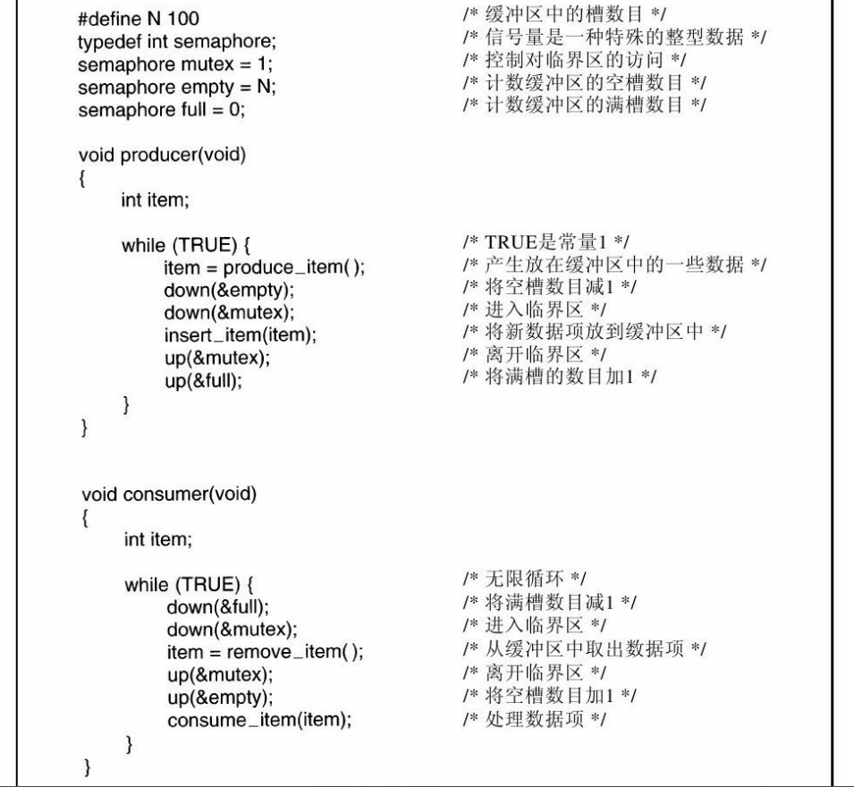
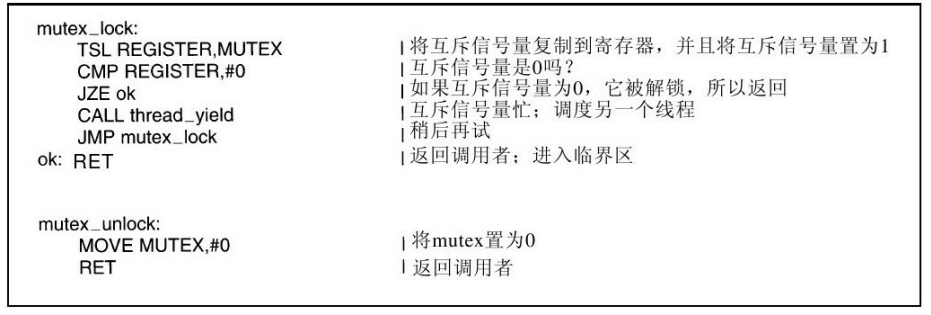

web服务加锁场景

```shell 
1. 接口锁（比如支付）
2. 用户锁（比较重，并发有影响）
3. 多个接口有相同核心逻辑，对核心逻辑加锁。
```

生产者消费者场景



死锁场景

~~~
感觉一共就是两种，要么是自己等自己，要么就是互相等

1.while循环去获取锁
2.经典死锁场景生产者消费者模型，先消耗mutex，再去消耗其他信号量，这里的mutex也被称为二元信号量(因为数量为一)，可以理解为加锁用的信号量
3.A等B，B等A，比如A和B各自都需要单独的两个资源，但他们各自拥有一个则死锁
4.持有锁的期间被中断等切出，但中断处理函数涉及对锁的访问也会死锁
5.fork进程，子进程会继承父进程的锁状态，子进程再去获取锁也会死锁。
~~~


不同进程间的加锁方式

~~~
1.比如生产者消费者模型， 使用信号量来实现
2.互斥锁或者互斥锁+条件变量也是可以实现的， 但是需要将这些变量的内存放置在不同进程都能访问到的地方，比如使用共享内存的时候，就可以采用这些原本应该在线程中才使用的加锁方式。
~~~

信号量和互斥量(互斥锁)的理解

~~~
二元信号量和互斥锁的效果一样。
互斥锁是去看谁先去把一个整型设置为1
二元信号量表示的是资源只有一份，看谁先去拿到它
我的理解：互斥锁的目的就只有互斥，而信号量还能表示资源数量等，对于通过二元信号量来实现互斥的效果只是信号量功能的一个子集

1.信号量是不同进程间通信的一种方式，用于表示资源的数量，可以实现加锁互斥的效果，比如生产者消费者模型，也可用于多进程共享内存时加锁。
2.互斥锁是为了互斥去访问共享资源，就只有两种状态，要么加锁要么解锁，用一个整型来表示，一般是在多线程环境使用，但如果互斥锁能被不同进程访问到(比如放到共享内存中)，那么也是可以用于多进程加锁的
~~~


为什么有了互斥锁还需要条件变量？

~~~
以普通的val++，和 线程池  这两个场景举例

互斥锁只负责加锁解锁，却不能控制何时加锁何时解锁，若需要判断某一条件是否成立，则需要循环判断(每次循环都去加锁，判断是否满足条件，满足则执行具体处理逻辑，但不管是否满足都会释放锁，一直在不停的加锁解锁，浪费cpu资源)。

而条件变量抓住其"条件"二字, 就是根据某条件来实现等待-唤醒的逻辑，配合互斥锁实现对资源的互斥访问。

如果只是简单的对临界区(共享区域)，进行简单操作，比如对变量val执行++，则只需要互斥锁就可以，但如果涉及到对条件的判断，没有条件变量就需要循环去判断，所以在有条件变化的场景条件变量能带来很大的便利。

互斥锁可以没有条件变量，但不能只用条件变量而没有互斥锁， 条件变量相当于一个对加锁解锁时机的优化
~~~

为什么条件变量需要配合互斥锁？

条件变量主要是使用一种通知机制来让各个线程来处理临界资源，但是为了保证线程安全，需要各个线程互斥的访问临界资源(比如线程池)。

~~~
1.比如线程池的场景下，各线程从任务队列中增加或消费任务， 如果任务队列为空， 线程则等待，有任务之后又唤醒线程。可以看到这个任务队列是需要互斥访问的，所以需要互斥锁。

2.不加互斥锁，可能出现信号量丢失,如下图，但像线程池这种有许多任务的，等下一次唤醒就好了。也就是说，thread2的这两个操作，理应是在获取到锁才能进行的，但如果没锁就会出现这种情况，或者说加的不是同一把锁也可能出现这种情况。
~~~

| 执行序列 | Thread1                            | Thread2                       |
| -------- | ---------------------------------- | ----------------------------- |
| 1        | 1:pthread_mutex_lock(&mutex);      |                               |
| 2        | 2:while(false == ready) {          |                               |
| 3        |                                    | 1: ready = true;              |
| 4        |                                    | 2:pthread_cond_signal(&cond); |
| 5        | 3:pthread_cond_wait(&cond,&mutex); |                               |
| 6        | 4: }                               |                               |


虚假唤醒问题

~~~
多个等待者被唤醒，其实就是只有其中一个成功获取到了锁并且消费了数据然后释放锁，其他等待者也被唤醒拿到锁(但此时任务队列的数据已经被消费了)，所以需要while来判断条件是否符合要求(队列是否为空)
~~~


信号量和(条件变量+互斥锁）区别:

（1）最大的区别应该是使用条件变量可以一次唤醒所有等待者，但信号量不行。

（2）信号量有一个表示状态的值，而条件变量是没有的，没有地方记录唤醒（发送信号）过多少次，也没有地方记录唤醒线程（wait返回）过多少次。从实现上来说一个信号量可以是用mutex + counter + condition variable实现的。因为信号量有一个状态，如果想精准的同步，那么信号量可能会有特殊的地方。信号量可以解决条件变量中存在的唤醒丢失问题。

（3）在Posix.1基本原理一文声称，有了互斥锁和条件变量还提供信号量的原因是：“本标准提供信号量的主要目的是提供一种进程间同步的方式，这些进程可能共享也可能不共享内存区。互斥锁和条件变量是作为线程间的同步机制说明的，这些线程总是共享(某个)内存区。”尽管信号量的意图在于进程间同步，互斥锁和条件变量的意图在于线程间同步，但是信号量也可用于线程间，互斥锁和条件变量也可用于进程间(借助共享内存)。信号量最有用的场景是用以指明可用资源的数量。

### pthread_mutex_lock,pthread_mutex_trylock,pthread_spin_lock区别：

对于mutex_lock也就是互斥锁来说，当条件不满足时会调度另一个线程，但线程的切换涉及上下文的切换，尽管我们直观的感受认为只是更换了寄存器的内容，但实际上操作系统对这些内容更换过程涉及了很多软件层面的其他操作，所以线程的切换开销是比较大的。**可以理解为敲门进房间，没人开我就走了，晚点有人来通知我的时候我再来。** 
而mutex_trylock相当于互斥锁的一中变种，当获取锁失败它会返回错误代码，如果当前是一个while循环尝试获取锁，获取失败时，它会继续执行下一次while循环，**可以理解为敲门进房间，没人开我就在房间的周围玩，玩一会又继续敲。**但由于mutex_trylock的实现是应用层层面的，依然可能因为某些原因发生线程切换，但相对mutex_lock更好一点，而对于pthread_spin_lock(它的底层代码是一个LOOP循环),则一定不会发生线程切换，**可以理解为敲门进房间，没人开我就一直敲**
适用于锁粒度小的情况。


设想有这样一种情况：有十个线程同时对一个变量a执行+1操作一百次，那么理想的执行结果是最终a的值变成1000，但往往无法达到1000，因为对a执行+1的操作分了三步(1.从内存中取到寄存器；2.将寄存器的值+1；3.再放回内存),但在多线程环境下会出现差错导致实际加不到1000。那么如何才能这个问题保证这三个步骤原子性的执行呢？
## 一：单CPU中，使用锁或者禁止多线程调度
(在单核CPU的并发是伪并发，如果不存在阻塞的设计部分就没必要使用多线程)。
在单核CPU中, 能够在一个指令中完成的操作都可以看作为原子操作, 因为中断只发生在指令间.
我们好好分析一下为什么使用锁或者禁止多线程调度就能实现i++的原子性执行(一般大家所说的原子性或原子操作指的是一条指令的执行的原子性，也可能是一组指令执行的原子性，要么都不间断的执行，要么都不执行，对于单条指令的执行一定是一整条指令执行完毕才有可能去处理中断，单条指令执行过程中一定不会被线程调度机制打断，但因为指令间可能会有中断需要处理，所以这时候我们为了保证这组指令的原子操作，我们需要暂时的屏蔽全部中断，由于这些操作都只需要几条指令，所以屏蔽中断也不会带来什么副作用)：
**1.单线程情况**：当只有一个线程的时候，就能顺利执行完i++的三个步骤，因为不存在线程的切换。
**2.不加锁情况**：当单核环境下使用多线程，并且不加锁，则可能出现下图的情况。

解释一下是为何，因为我们在c或者其他语言上写的一条i++代码，被翻译成汇编语言则包含了三条指令(1.从内存中取到寄存器；2.将寄存器的值+1；3.再放回内存)，有朋友会有疑惑为何不能直接操作内存，而是要通过寄存器，比如X86指令集，也就是我们现在比较常用的，可以通过一条汇编指令（xaddl，它也是锁了总线的，防止其他CPU干扰）完成原子的一个数据位的读取，修改、写入三个动作，但gcc没有做这个优化，而是将一行i++的代码汇编翻译成三条指令，但你仔细想一下，**就算优化为xaddl(即可一条指令实现i++)，同样也需要加锁(锁总线)，因为对于多线程的问题来说，最主要的是加锁问题，防止其他cpu进行干扰，就算你是原子操作，不锁在总线，别的CPU同样会造成影响**，我们继续回来gcc默认的将i++编译为3条汇编指令，当执行了第一个**读操作**时(还差两个操作才算执行完i++的完整流程)，此时发生中断，或者时间片到了，发生线程切换(在这种多线程操作一个变量i的情况下，因为我们的线程的目的就是对i进行++，所以线程发生切换执行的也是同一块代码。)，此时线程切换为第二个线程才执行i++的操作，这样一来本来执行了两次i++操作，但最终只加了一次的值（但其实我们可以在这3条指令执行的过程中暂时屏蔽全部中断，这样我们就可以让这3条指令达到原子操作的效果）。如下表。
所以必须要加锁，就算切换了线程2，线程2也没办法对这个i变量进行访问。**具体怎么加锁往后看。**

| 线程1          | 线程2           |
| -------------- | --------------- |
| 读操作，i = 10 |                 |
|                | 读操作， i = 10 |
|                | 修改i = i + 1   |
| 修改 i = i + 1 |                 |
| 写操作 i = 11  |                 |
|                | 写操作 i = 11   |


## 二：多核中
2.多核CPU，需要借助一些硬件特性来锁住总线， 防止在一个i++操作(包括：读取，修改，写入三个过程)过程中，其他CPU来造成干扰，具体是如何做到的防止的呢，其实加锁过程我们所面临的问题本质就是对一个内存中的变量(一般指的是lock锁变量)进行**修改为1(加锁)**的过程中，可能会有多个cpu同时对这个变量进行操作而导致最终的结果不准确，但我们可以使用TLS或者XCHG(这两个都是汇编指令)，来实现保证只有一个cpu对这个内存中的变量(一般指的是lock锁变量)**修改为1(加锁)**成功。因为使用TLS或者XCHG的时候，它们也都**只是一条汇编指令**。
好好理一理别昏了我们继续看
我们需要清楚一点的是，在单CPU环境中，就算发生中断(导致线程切换)，也是在一条汇编指令结束后才会去处理这个中断，**即单条指令一定是原子性的发生的并且中断是发生在指令之间的**，而不会影响单个指令的原子执行，同时TLS和XCHG会**锁住总线**,其他CPU就暂时不能使用总线了，这样一来我们可以认为当锁住总线后就是一个**单核的环境**，并且我们通过TLS或XCHG**一条指令原子性的设置**成功了这个lock锁变量。这样一来我们就成功实现加锁(实际上就是为了将这个lock锁变量设置为1，但**如果不锁住总线，其他CPU也来获取这个锁，就有可能出现上面表格中画出的情况，**交叉**在一起**导致大家都认为自己获得了锁的错误局面****)，当TLS这条指令执行完毕解除对总线的锁，其他CPU(线程)再次访问到这个锁变量时，发现是1，**则等待或者切换其他线程。**


| 线程1  | 线程2  |
| ------ | ------ |
| 读操作 |        |
| 修改   |        |
| 写操作 |        |
|        | 读操作 |
### 总结：
#### 其实说了这么多，我们实质上的目的就是为了实现只让一个线程(pthread1)设置lock变量为1，在这个线程(pthread1)设置后，当其他线程能够访问到lock变量的时候它一定是1,。这样就可以保证i++的原子性，也就是下边这种情况。如果你看过mutex互斥锁的实现就可以发现它的内部就是用到了TLS，接着内部调用了pthread_yield（让出线程，会发生线程切换，上下文切换消耗较大，所以也是原子锁的一个缺点）借助互斥锁可以让更多的操作变成原子操作(达到原子执行的目的)。




上边说的**锁总线**的意思：在X86体系中，CPU提供了HLOCK pin引线，允许CPU在执行某一个指令(仅仅是一个指令，比如TLS,XCHG)时拉低HLOCK pin引线的点位，直到这个指令执行完毕才放开，从而锁住总线，这样一来，在同一总线的CPU就在暂时无法通过总线访问内存了，这样就能保证多核处理器的原子性(但也正因为锁了总线，别的CPU无法使用总线对性能会造成一定的影响。

补充：一条指令就能算是原子操作，对于单核来说，可以将一条或一组指令封装成一个原子操作(要么都不间断的执行，要么都不执行)，为了避免在执行原子操作(这里指一组指令)时发生线程调度的情况，我们必须暂时屏蔽全部中断，来保证原子操作的执行，但对于多核来说，则每个信号量都应由一个锁变量进行保护，通过TLS或XCHG指令来确保同一时刻只有一个CPU在对信号量进行操作。
从锁的粒度上来讲：互斥锁(lock>trylock)>读写锁>自旋锁>原子操作。
但原子操作是有前提的，比如我们上边提到的xaddl，需要指令系统有相对应的指令才能实现。而对于互斥锁或其他锁，我们都知道这些锁都涉及了几行代码，指令系统中并没有相对应的对于多个变量进行操作的指令。所以对于这些锁来说就无法做成原子操作。
**多线程和多进程中**，我们都可以使用原子操作，在当前这种场景下，对于多进程，由于每个进程都有独立的一份代码，所以我们需要使用mmap实现映射的功能，把 i 这个变量映射到多个进程，即共享这个变量地址，然后使用原子操作来对它执行**加**操作。
CAS(Compare And Swap）是原子操作的一种，用到了CMPXCHG来实现的，对于C++的单例模式的设计，就可以用这种原子操作CAS来实现线程安全。
~~~c
if(a == null)
a = new 对象
其实就是
if(a == b)
a = c

用汇编来解释就是
对于上边的xaddl
//lock; xaddl %i 1   //跟XCHG,TLS都是差不多的操作，都需要锁总线
lock; cmpxchg %a %b %c;
如果成功返回0到a中，
如果失败返回a原来的值
~~~


自旋锁有三种实现

1:单CPU。不可抢占内核中， 自旋锁为空操作；

2：单cpu， 可抢占式内核中， 自旋锁实现为"禁止内核抢占"，并不实现自旋

3：在多CPU 中， 可抢占内核， 自旋锁实现为“禁止内核抢占”+ 自旋

被自旋锁保护的临界区代码执行时，它不能因为任何原因放弃处理器

所以现代处理器在处理自旋锁时都会**设定自旋上限事件以防死锁**

