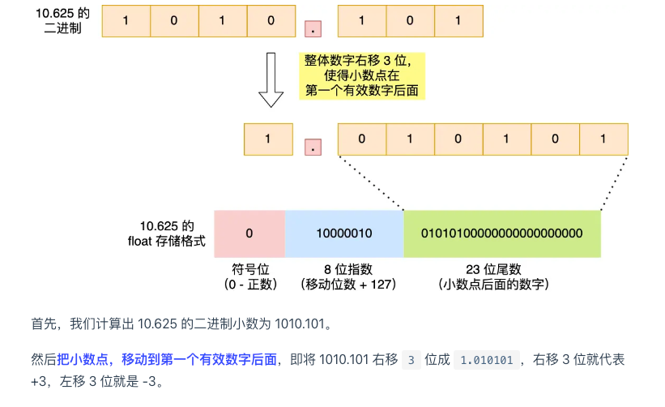

计算机怎么存小数

~~~shell
前置知识: 十进制转二进制: 整数部分除2取余逆序数处， 小数部分乘2取整正序输出
						10.625(10进制) == 1010.101(2进制)
1. 并不是所有的小数部分都能用二进制表示， 比如0.625就可以， 但0.1是一个无限循环的二进制，只能用「近似值」来表示，所以就会造成精度缺失。
2. 以float为例，32位中，第一位是符号位，接着的8位是指数位，最后的23位是尾数位。
其中指数位计算中的移动位数说的是比如1010.101对于计算机必须用科学技术法也就是1.010101 * 2^3, 那么移动位数就是3(如果是右移就是-3)
3. 0.1 + 0.2 != 0.3 只能是0.3的近似值，因为0.1和0.2在计算机存储的时候存的也是近似值
~~~

加减乘除效率分析

~~~shell
加法：是最简单和最快速的运算,CPU中有专门的加法器件用于执行加法操作。
减法：可以通过将减法转换为加法来实现，效率也不错
乘法：比加法和减法复杂，耗费的时间较多，特别是对于大整数或浮点数的乘法运算。
计算机硬件会使用乘法器件来执行乘法操作，这个过程比加法要复杂，耗时相对较长。
除法：是四则运算中最复杂和耗时最长的运算，计算机硬件中通常没有直接的除法器，实际上除法操作会通过多次的减法和移位来实现，因此除法操作通常比较耗时。

# 计算机并不是不能用减法，只是为了简化硬件设计和电路的复杂性，才用加法器来做减法运算
# 假设有减法器计算 1 - 2
  0000 0001  (1)
- 0000 0010  (2)
------------
  1111 1111  # -1的补码形式(计算机的计算结果都是补码形式, 正数的补码和原码一样)
# 使用加法器计算减法
  0000 0001  (1)
+ 1111 1110  (-2的补码)
------------
  1111 1111  # 跟减法器一样的结果
# 补码形式计算减法 2 + (-1)
  0000 0010  (2)
+ 1111 1111  (-1的补码)
------------
 10000 0001	 # 第八位是符号位(不管第九位了)，为0则说明是正数
 
拓展:
补码的好处:简化运算(只需要加法器，简化运算逻辑和硬件设计)、统一表示形式(加减运算都用补码的形式, 不用额外考虑负号位)
~~~

