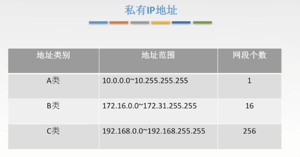

**私有ip地址**

A类只有第一个字节为网络号，B两个，C三个

**子网划分和子网掩码**（子网掩码与IP地址逐位想与就能得到子网网络地址）

路由表项主要为：1.目的网络地址，2.目的网络子网掩码，3.下一跳地址
路由器转发算法为：1.判断是否有直接匹配目的地址的项(如有直接转发)，2.与子网掩码想与，判断是否有跟目的地址在同一个子网的表项(有则转发)，3.如果前两者都没有，则转发到默认路由0.0.0.0重复上述操作。

~~~shell
例1：比如IP地址为141.14.72.24, 子网掩码是255.255.192.0,则网络地址为141.14.64.0(ip与子网掩码相与)
例2：某主机的ip地址为180.80.77.55,子网掩码为255.255.252.0, 若该主机向其所在子网发送广播分组，则目的地址为180.80.79.255 # 计算方法是先把ip与子网掩码想与得到子网地址，然后把主机号部分全部置为1
~~~

**无分类编址CIDR**（消除了传统ABC类以及划分子网的概念，融合了子网地址和子网掩码，方便子网划分）

超网：将多个子网聚合成一个较大的子网，叫做构成超网或路由聚合，方法为对所有网络地址取交集，

~~~shell
比如某路由表有转发接口相同的4条路由表项，目的网络地址分别为35.230.32.0/21、35.234.40.0/21、35.230.48.0/21、35.230.56.0/21， 将这4条路由聚合后的目的网络地址为35.230.32.0/19 # 原理取这些ip的共同前缀作为聚合网络地址。
#对于路由表项个数，如果是划分子网，表项是从少变多， 而构成超网则是从多变少。
~~~

最长前缀匹配：使用CIDR时，查找路由表可能得到几个匹配结果(跟网络掩码按位相与)，应选择具有最长网络前缀的路由，因为前缀越长，地址快越小，路由越具体。

~~~shell
比如目的地址是132.19.237.5, 路由表的信息有132.0.0.0/8, 132.0.0.0/11, 132.19.232.0/22, 0.0.0.0/0 那么就会匹配132.0.0.0/11。# 原理是用目的地址跟这几个ip的子网掩码进行与运算，选择具有最长网络前缀的路由，每个ip后的那个数字就是网络前缀的长度，比如是11，那么子网掩码也就是11个1，后边全是0
~~~

## 生词

DNS (domain name system)域名系统

URL（uniform resource local)统一资源定位系统

## 网络

- 计算机网络作用：资源共享。

- 计算机网络组成：许多独立自主工作的计算机。

- 计算机网络实现方式：使用通信线路互相连接。

  补充说明：

  - 因特网（Internet）就是全世界最大的国际计算机网络
  - “互联网”通常是只代表一般网络互联的意思，比如把一个LAN与WAN连接起来，或者连接两个LAN就组成互联网，而“因特网”是指特定的世界范围的互联网。

## 网络的分类

- 局域网（Local Area Network---LAN)
- 广域网(Wide Area Network---WAN)
- 城域网（Metroplolitan Area Network---MAN）
- 个域网（Personal Area Network---PAN）

~~~
WAN：企业网络，数据共享
MAN：城市政府、医疗数据共享、远程医疗服务
LAN：办公室、家庭、学校网络
PAN: 蓝牙技术,智能家居
~~~

## 按照管理方式分类

- 对等网（Peer to Peer）

通常是由很少几台计算机组成的工作组。对等网采用分散管理的方式，网络中的每台计算机既作为客户机又可作为服务器来工作，每个用户都管理自己机器上的资源。

- 客户机/服务器网（Client/Server）

网络的管理工作集中在运行特殊网络操作系统服务器软件的计算机上进行，这台计算机被称为服务器，它可以验证用户名和密码的信息，处理客户机的请求，而网络中其余的计算机则不需要进行管理，而是将请求通过转发器发给服务器。

## 按照传输方式分类

- 广播网络（Broadcasting Network）

网络中的计算机或设备**通过一条共享的通信介质进行数据传播**，**所有节点都会收到任何节点发出的数据信息**。这种传输方式主要**应用于局域网**中。**广播网络中有三种传输类型：单播、组播、和广播。**

- 点对点网络（Point to Point Network）

网络中的计算机或设备通过**单独的链路**进行数据传输，并且**两个节点间都可能会有多条单独的链路**。这种传播方式主要**应用于广域网中。**

## OSI（开放式系统互联通信）七层网络模型

OSI（ Open System Interconnection Reference Model)

OSI网络模型是一个开放式系统互联的参考模型。通过这个参考模型，用户可以非常直观地了解网络通信的基本过程和原理。

应用层:  老板

表示层: 老板的助理

会话层:  给助理跑腿

传输层: 传达信息的人

网络层: 邮局来拿资料的人

数据链路层: 打包资料的人

物理层: 具体运输到客户

- 应用层

OSI参考模型中最靠近**用户**的一层，是为计算机用户提供应用接口，也为用户直接提供各种网络服务。我们常见应用层的网络服务协议有:HTTP,HTTPS,FTP,POP3,SMTP等

实际公司A的老板就说我们所述的用户，而他要发送的商业报价单，就说应用层提供的一种网络服务，当然，老板也可以选择其他服务，比如说，发一份商业合同，发一份询价单，等等。

- 表示层

表示层提供各种用于应用层数据的编码和转换功能，确保一个系统的应用层发送的数据能被另一个系统的应用层识别。如果必要， 该层可提供一种标准表达形式，用于将计算机内部的多种数据格式转化成通信中采用的标准表达形式。数据压缩和加密也是表示层可提供的转换功能之一。

由于公司A和公司B是不同国家的公司，他们之间的商定统一用英语作为交流的语言，所以此时表示层（公司的文秘）。就是将应用层的传递信息转翻译成英语。同时为了防止别的公司看到，公司A的人也会对这份报价单做一些加密的处理，这就是表示层的作用，将应用层 的数据转换翻译等。

- 会话层

会话层就是负责**建立、管理、和终止表示层实体之间的通信会话**。该层的通信由不同设备中的应用程序之间的服务请求和响应组成。

会话层的同事拿到表示层的同事转换资料后，（会话层的同事类似公司的外联部），会话层的同事那里可能会掌握本公司与其他很多公司的联系方式，这里公司就是实际传递过程中的实体。他们要管理本公司与外界很多公司的联系会话，**当接收到表示层的数据后，会话层将会建立并记录本次会话，它首先要找到公司B的地址信息，然后将整份资料放进信封，并写上地址和联系方式。准备将资料寄出，等到确定公司B接收到此份报价单后，此次会话就算结束了**，外联部的同事就会终止此次会话。

- 传输层

传输层建立了主机端到端的链接，**传输层的作用是为上层协议提供端到端的可靠和透明的数据传输服务，包括处理差错控制和流量控制等问题**。**该层向高层屏蔽了下层数据通信的细节，使高层用户看到的只是在两个传输实体间的一条主机到主机的、可由用户控制和设定的、可靠的数据通路**。我们通常说的**,TCP  UDP就是在这一层**，端口号既是这里的“端”。

传输层就相当于公司中的负责快递邮件收发的人，公司自己的投递员，他们负责将上一层的要寄出的资料投递到快递公司或邮局。

- 网络层

本层通过IP寻址来建立两个节点之间的连接**，为源端的运输层送来的分组，选择合适 的路由和交换节点，正确无误地按照地址传送给目的端的运输层**。就 IP从  层。这一层就是我们经常说的IP协议层。IP协议就是Internet得基础。

空运好像直接就飞到北京了，首先要到顺丰得深圳集散中心，从深圳集散中心再送到武汉集散中心，从武汉集散中心再寄到北京顺义集散中心，这每个集散中心，就相当于网络中的一个IP节点。

- 数据链路层

将比特组合成字节，再将字节组合成帧，使用链路层地址（以太网使用MAC地址）来访问截至，并进行差错检测。数据链路层又分为2个子层：逻辑链路控制子层（LLC）和媒体访问控制子层（MAC）。

MAC子层处理CSMA/CD算法、数据出错校验、成帧等；LLC子层定义了一些字段使上次协议能共享数据链路层。在实际使用中，LLC子层并非必需得。

规则，检验路口。

- 物理层

实际最终信号得传输是通过物理层实现的，通过物理介质传输比特流。规定了电平、速度和电缆针脚。常用设备（各种物理设备）集线器。中继器、调制解调器、网线、双绞线、同轴电缆。这些都是物理层的传输介质。

快递寄送过程中的交通工具，就相当于我们的物理层，例如汽车，火车，飞机，船。

